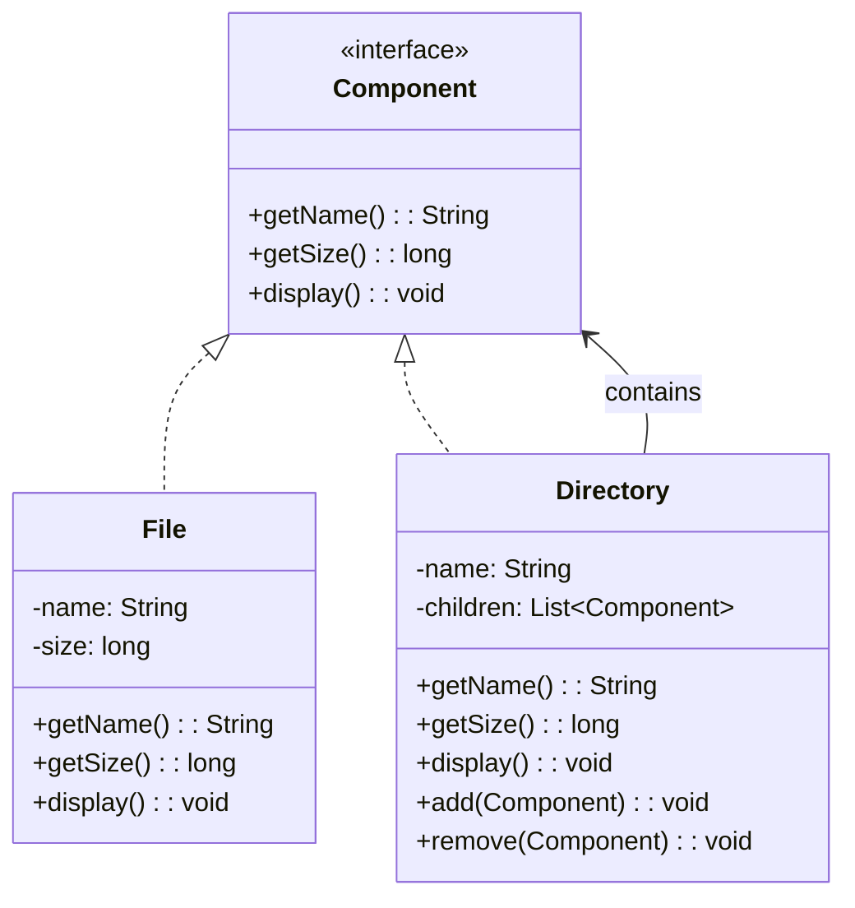
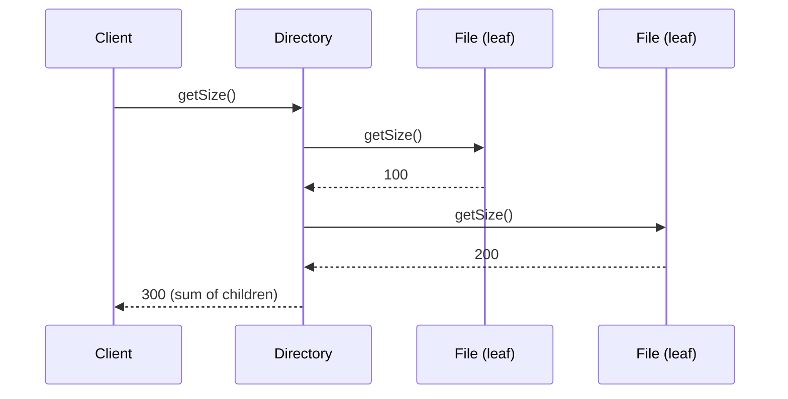
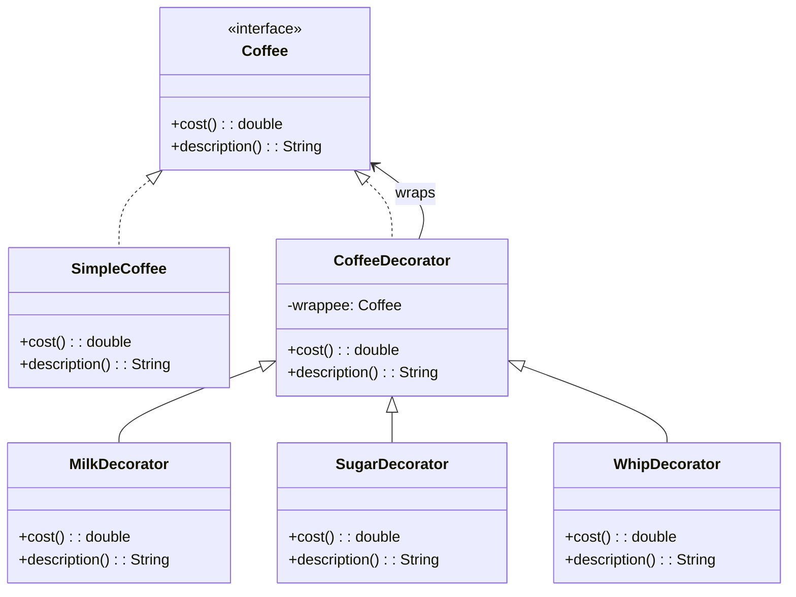
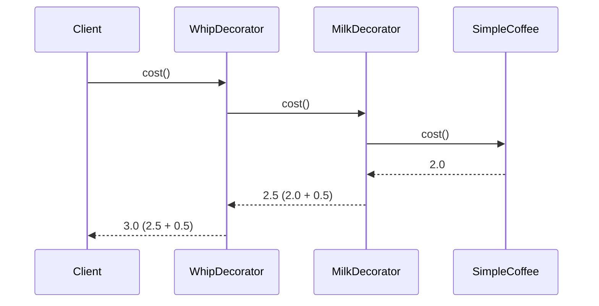
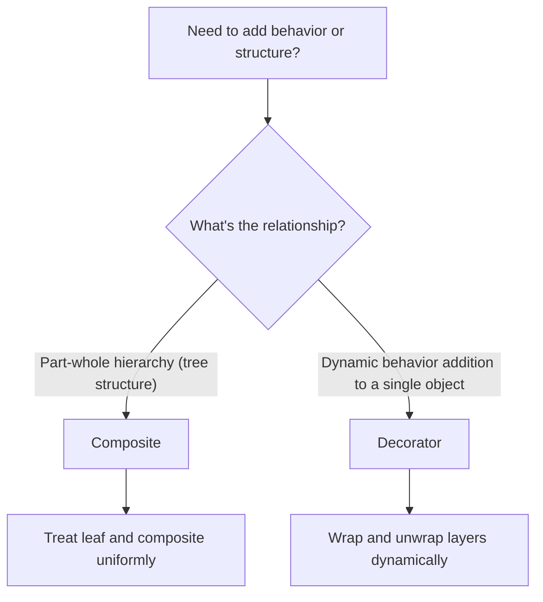

# Structural: Composite & Decorator

> [!summary] Goal
> Compose objects into tree structures (Composite) and attach new responsibilities to objects dynamically (Decorator).

## Table of Contents

1. [Composite](#composite)
2. [Decorator](#decorator)
3. [Comparison and Decision Guide](#comparison-and-decision-guide)
4. [Pitfalls](#pitfalls)

---

## Composite

### Problem

You need to represent **part-whole hierarchies** where individual objects and groups of objects should be treated **uniformly**. A file system: a file is a leaf, a directory contains files and subdirectories — both support the same operations (getName, getSize, delete).

> [!info] Composite
> A structural GoF pattern that lets you compose objects into tree structures to represent part-whole hierarchies. Composite lets clients treat individual objects (Leaf) and compositions of objects (Composite) uniformly through a common Component interface. The key insight: the Composite itself implements the same interface as the Leaf, so clients never need to check whether they are dealing with a single item or a group.

### Solution





```java
// Component — common interface for both leaves and composites
public interface FileSystemComponent {
    String getName();
    long getSize();        // File: its own size. Directory: sum of children's sizes
    void display(String indent);
}

> [!info] Leaf and Composite
> In the Composite pattern, a **Leaf** is a fundamental building block with no children — it implements the Component interface directly (e.g., a \`File\` that returns its own size). A **Composite** is a container that holds child Components (which can be Leaves or other Composites) and delegates operations to them, aggregating results (e.g., a \`Directory\` that sums children's sizes). This recursive structure is what makes the pattern powerful — a tree of arbitrary depth.

// Leaf — individual object with no children
public class File implements FileSystemComponent {
    private final String name;
    private final long size;

    public File(String name, long size) {
        this.name = name;
        this.size = size;
    }

    @Override public String getName() { return name; }
    @Override public long getSize() { return size; }

    @Override
    public void display(String indent) {
        System.out.println(indent + "📄 " + name + " (" + size + " bytes)");
    }
}

// Composite — group of components, may contain other composites
public class Directory implements FileSystemComponent {
    private final String name;
    private final List<FileSystemComponent> children = new ArrayList<>();

    public Directory(String name) { this.name = name; }

    public void add(FileSystemComponent component) { children.add(component); }
    public void remove(FileSystemComponent component) { children.remove(component); }

    @Override public String getName() { return name; }

    @Override
    public long getSize() {
        return children.stream().mapToLong(FileSystemComponent::getSize).sum();
    }

    @Override
    public void display(String indent) {
        System.out.println(indent + "📁 " + name + "/");
        children.forEach(child -> child.display(indent + "  "));
    }
}

// Usage — treat files and directories uniformly
FileSystemComponent file1 = new File("readme.txt", 100);
FileSystemComponent file2 = new File("photo.jpg", 5000);

Directory docs = new Directory("documents");
docs.add(file1);

Directory root = new Directory("root");
root.add(docs);
root.add(file2);

root.display("");       // Displays full tree
System.out.println("Total: " + root.getSize() + " bytes");  // 5100
```

### Where it's used

| Example | Description |
|---------|-------------|
| `java.awt.Container` | GUI components (JPanel contains JButton, JTextField) |
| `JSF` UI components | UIPanel creates tree of UI children |
| XML DOM | `Node` interface — `Element` (composite) and `TextNode` (leaf) |
| File systems | Directories (composite) and Files (leaf) |
| Organization charts | Departments (composite) and Employees (leaf) |

---

## Decorator

### Problem

You need to add behavior to an object **dynamically** without affecting other objects of the same class. Inheritance would create a combinatoric explosion of subclasses (Coffee + Milk, Coffee + Sugar, Coffee + Milk + Sugar, ...).

> [!info] Decorator
> A structural GoF pattern that attaches additional responsibilities to an object dynamically. Decorators provide a flexible alternative to subclassing for extending functionality. The pattern wraps an object (the wrappee) inside another object (the decorator) that implements the same interface, adding its own behavior before or after delegating to the wrapped object. Because both implement the same interface, the client does not know whether it is talking to the original object or a decorated one.

### Solution





```java
// Component
public interface Coffee {
    double cost();
    String description();
}

// Concrete component
public class SimpleCoffee implements Coffee {
    @Override public double cost() { return 2.0; }
    @Override public String description() { return "Simple coffee"; }
}

// Base decorator — wraps a Coffee

> [!info] Wrappee
> The object being wrapped by a decorator. In the Decorator pattern, each decorator holds a reference to a wrappee (also called the wrapped or inner object) that implements the same interface. The decorator delegates the core operation to the wrappee and adds its own behavior before, after, or around that delegation. The chain can be arbitrarily long: \`WhipDecorator\` wraps \`SugarDecorator\` wraps \`MilkDecorator\` wraps \`SimpleCoffee\` — each intermediate wrappee is itself a decorator.

public abstract class CoffeeDecorator implements Coffee {
    protected final Coffee wrappee;

    public CoffeeDecorator(Coffee wrappee) {
        this.wrappee = wrappee;
    }

    @Override
    public double cost() { return wrappee.cost(); }

    @Override
    public String description() { return wrappee.description(); }
}

// Concrete decorators
public class MilkDecorator extends CoffeeDecorator {
    public MilkDecorator(Coffee wrappee) { super(wrappee); }

    @Override
    public double cost() { return wrappee.cost() + 0.5; }

    @Override
    public String description() { return wrappee.description() + " + milk"; }
}

public class SugarDecorator extends CoffeeDecorator {
    public SugarDecorator(Coffee wrappee) { super(wrappee); }

    @Override
    public double cost() { return wrappee.cost() + 0.2; }

    @Override
    public String description() { return wrappee.description() + " + sugar"; }
}

public class WhipDecorator extends CoffeeDecorator {
    public WhipDecorator(Coffee wrappee) { super(wrappee); }

    @Override
    public double cost() { return wrappee.cost() + 0.5; }

    @Override
    public String description() { return wrappee.description() + " + whip"; }
}

// Usage — compose decorators at runtime
Coffee myCoffee = new SimpleCoffee();
myCoffee = new MilkDecorator(myCoffee);
myCoffee = new SugarDecorator(myCoffee);
myCoffee = new WhipDecorator(myCoffee);

System.out.println(myCoffee.description());   // "Simple coffee + milk + sugar + whip"
System.out.println(myCoffee.cost());          // 3.2
```

### Where it's used

| Example | Description |
|---------|-------------|
| `BufferedReader(FileReader)` | Adds buffering to file reader |
| `FilterInputStream.read()` | Base decorator for input streams |
| `Collections.synchronizedList()` | Adds thread-safety to any List |
| `HttpServletRequestWrapper` | Servlet API decorator |
| `javax.servlet.Filter` | Request/response filtering chain |

---

## Comparison and Decision Guide



| Aspect | Composite | Decorator |
|--------|:---------:|:---------:|
| **Intent** | Part-whole hierarchies | Dynamic behavior addition |
| **Structure** | Tree — leaf and composite treated uniformly | Chain — layers wrapped around an object |
| **Identity** | Many objects in a tree | Same object, enhanced |
| **Transparency** | Clients treat leaf/composite the same | Clients see the same interface |
| **Common operation** | `getSize()` (sum over children) | `cost()` (delegate + add) |
| **Analogy** | File system (files + directories) | Coffee with toppings |

> [!info] Open/Closed Principle (OCP)
> Software entities should be open for extension but closed for modification. Both Composite and Decorator support OCP. Composite lets you add new Leaf and Composite types without modifying existing tree code — each new type just implements the Component interface. Decorator lets you add new behavior by writing a new Decorator class; the existing wrappee and other decorators remain unchanged. In both cases, extension happens through new classes, not modification of existing ones.

### Both patterns share the same structure but have different intents

```java
// Same class diagram shape — different purposes
// Composite: tree traversal
Directory root = new Directory("root");
root.add(new File("a.txt", 100));    // Leaf and composite are interchangeable

// Decorator: layered wrapping
Coffee c = new WhipDecorator(         // Layers added dynamically
    new SugarDecorator(
        new MilkDecorator(
            new SimpleCoffee())));
```

---

## Pitfalls

### Composite overly uniform interface

The `Component` interface should support all operations that both leaf and composite need. If leaf operations (like `add()`) don't make sense for leaf nodes, throw `UnsupportedOperationException` (design tradeoff), or split into separate interfaces (safe design, less uniform).

### Decorator identity breaks equality

Two decorator chains with the same composition produce different objects. `equals()` and `hashCode()` are tricky with decorators — comparing the wrapped chain requires unwrapping.

### Too many decorator layers

A decorator chain with 10+ layers is hard to debug and test. Each layer adds indirection. If the chain grows too long, consider whether a more configurable object would be better.

### Decorator vs strategy confusion

Both patterns wrap behavior. Decorator adds behavior **transparently** (the client doesn't know it's decorated). Strategy **replaces** behavior (the client configures which strategy to use).

---

> [!question]- Interview Questions
>
> **Q: What problem does Composite solve?**
> A: Composite allows clients to treat individual objects and compositions of objects uniformly. In a file system, you call `getSize()` on both a `File` (returns its own size) and a `Directory` (returns the sum of children's sizes) — the client doesn't need to know which is which.
>
> **Q: How does Decorator differ from inheritance?**
> A: Inheritance adds behavior at compile time to an entire class. Decorator adds behavior at runtime to a single object. With inheritance, a class `CoffeeWithMilkAndSugar` is a fixed combination. With Decorator, you compose `new SugarDecorator(new MilkDecorator(new SimpleCoffee()))` — any combination, including at runtime based on user input.
>
> **Q: Give a real-world example of the Decorator pattern in the Java standard library.**
> A: `BufferedReader(Reader)` decorates any `Reader` with buffering. The chain can be further extended: `new LineNumberReader(new BufferedReader(new FileReader("file.txt")))`. Each decorator adds one responsibility (buffering, line counting) without affecting the underlying reader.
>
> **Q: What is the relationship between Composite and Decorator?**
> A: They have the same class diagram structure (both use a component interface, a concrete component, and an abstract decorator/composite that holds a reference to the component). The difference is intent: Composite assembles objects into a tree structure; Decorator adds behavior to a single object. Composite's "parents" are containers; Decorator's "wrappers" are enhancers.
>
> **Q: How does the `display()` method work recursively in Composite?**
> A: The `Directory.display()` calls `display()` on each child. If a child is a `File`, it displays its own name. If a child is another `Directory`, it displays its name and recursively calls `display()` on its children. The recursion naturally traverses the entire tree without the client needing to distinguish leaf from composite.

---

## Cross-Links

- [[DesignPatterns/02_Core/C04_Adapter_and_Bridge]] for other structural patterns
- [[DesignPatterns/02_Core/C06_Facade_Proxy_Flyweight]] for Proxy (similar structure, different intent)
- [[DesignPatterns/02_Core/C07_Strategy_and_Template_Method]] for Strategy vs Decorator comparison
- [[Java/02_Core/03_IO_NIO_and_Serialization]] for Decorator in Java I/O streams
- [[SystemDesign/01_Foundations/03_Data_Modeling_Basics]] for tree structures in data modeling
