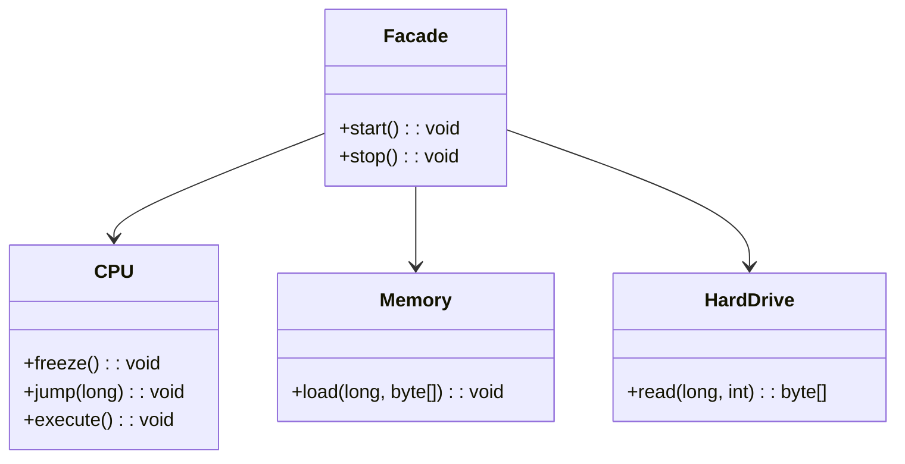
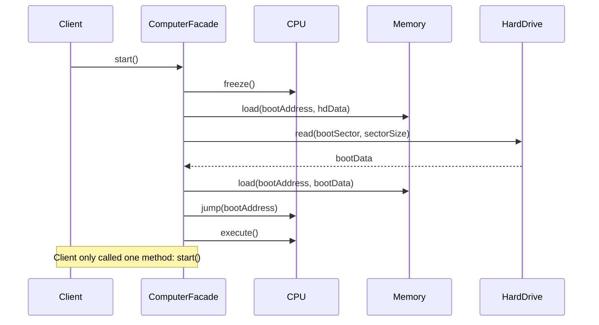
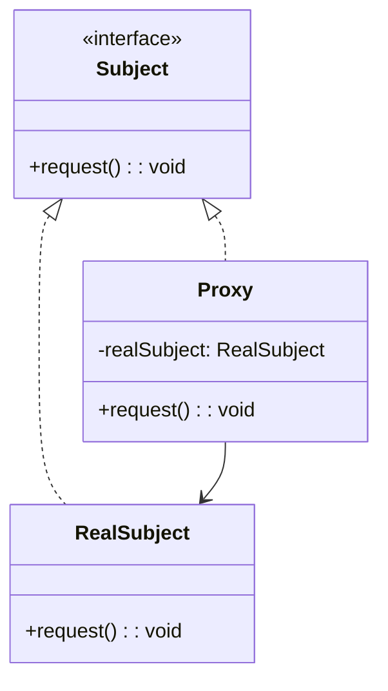
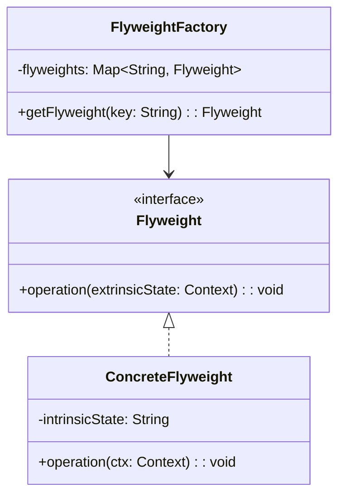
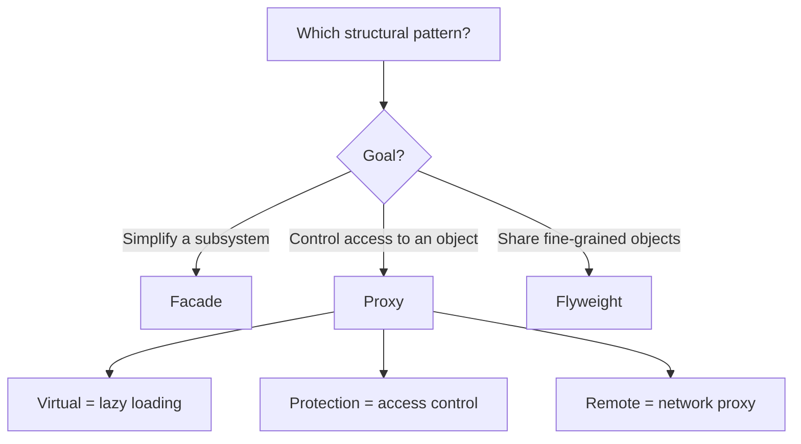

# Structural: Facade, Proxy, Flyweight

> [!summary] Goal
> Simplify complex subsystems (Facade), control access to objects (Proxy), and share fine-grained objects efficiently (Flyweight).

## Table of Contents

1. [Facade](#facade)
2. [Proxy](#proxy)
3. [Flyweight](#flyweight)
4. [Comparison and Decision Guide](#comparison-and-decision-guide)
5. [Pitfalls](#pitfalls)

---

## Facade

> [!info] Facade
> A structural GoF pattern that provides a unified, simplified interface to a complex subsystem. Instead of the client interacting with many individual classes (CPU, Memory, HardDrive), the Facade exposes a few high-level methods (\`start()\`, \`stop()\`) that internally orchestrate the subsystem. The Facade does not hide the subsystem — advanced clients can still access it directly.

### Problem

A complex subsystem with many classes makes client code hard to use and maintain. The client must understand the subsystem's internal dependencies and call order.

### Solution





```java
// Complex subsystem
public class CPU {
    public void freeze() { System.out.println("CPU: freeze"); }
    public void jump(long address) { System.out.println("CPU: jump to " + address); }
    public void execute() { System.out.println("CPU: execute"); }
}

public class Memory {
    public void load(long address, byte[] data) {
        System.out.println("Memory: load at " + address);
    }
}

public class HardDrive {
    public byte[] read(long lba, int size) {
        System.out.println("HD: read sector " + lba);
        return new byte[size];
    }
}

// Facade — simplifies the subsystem for the client
public class ComputerFacade {
    private final CPU cpu = new CPU();
    private final Memory memory = new Memory();
    private final HardDrive hardDrive = new HardDrive();

    public void start() {
        long BOOT_ADDRESS = 0x0000;
        int SECTOR_SIZE = 512;

        cpu.freeze();
        byte[] bootData = hardDrive.read(BOOT_ADDRESS, SECTOR_SIZE);
        memory.load(BOOT_ADDRESS, bootData);
        cpu.jump(BOOT_ADDRESS);
        cpu.execute();
    }
}

// Client — only depends on the Facade
ComputerFacade computer = new ComputerFacade();
computer.start();   // Simple, no subsystem knowledge needed
```

### Where it's used

| Example | Description |
|---------|-------------|
| SLF4J | Facade over Log4j, Logback, java.util.logging |
| `javax.faces.context.FacesContext` | Facade over JSF internals |
| Spring `JdbcTemplate` | Facade over JDBC connection/statement/resultset |
| `java.net.URL` | Facade over protocol handler, host lookup, socket |

---

## Proxy

> [!info] Proxy
> A structural GoF pattern that provides a surrogate or placeholder for another object to control access to it. The Proxy implements the same interface as the RealSubject, so the client cannot tell the difference. Proxies come in several flavors: Virtual (lazy loading), Protection (access control), Remote (local stand-in for a remote object), and Logging.

### Problem

You need to control access to an object — lazy loading, access control, logging, or remote communication — without changing the object's interface.

### Solution



> [!info] Virtual Proxy
> A type of Proxy that delays the creation and initialization of an expensive object until it is actually needed. The virtual proxy holds the constructor parameters (e.g., a filename) but does not create the real object until a method is first called. This is a form of lazy initialization that avoids paying the cost of object creation when the object may never be used.

### Virtual Proxy (lazy loading)

\`\`\`java
public interface Image {
    void display();
}

// Expensive to create — loads from disk or network
public class HighResImage implements Image {
    private final String filename;

    public HighResImage(String filename) {
        this.filename = filename;
        loadFromDisk();                    // Expensive operation
    }

    private void loadFromDisk() {
        System.out.println("Loading " + filename + " from disk...");
        try { Thread.sleep(2000); } catch (InterruptedException e) { }
    }

    @Override
    public void display() {
        System.out.println("Displaying " + filename);
    }
}

// Proxy — delays loading until display() is actually called
public class ImageProxy implements Image {
    private final String filename;
    private HighResImage realImage;       // Not loaded yet

    public ImageProxy(String filename) { this.filename = filename; }

    @Override
    public void display() {
        if (realImage == null) {
            realImage = new HighResImage(filename);   // Lazy initialization
        }
        realImage.display();
    }
}

// Client — doesn't know it's using a proxy
List<Image> images = List.of(
    new ImageProxy("photo1.jpg"),    // Not loaded yet
    new ImageProxy("photo2.jpg")     // Not loaded yet
);
// Later, when image is actually shown:
images.get(0).display();             // Loads only this one
```

### Protection Proxy (access control)

```java
public interface BankAccount {
    void withdraw(double amount);
    double getBalance();
}

public class RealBankAccount implements BankAccount {
    private double balance;

    public RealBankAccount(double balance) { this.balance = balance; }

    @Override public void withdraw(double amount) {
        if (amount <= balance) {
            balance -= amount;
            System.out.println("Withdrew: " + amount);
        } else {
            throw new RuntimeException("Insufficient funds");
        }
    }

    @Override public double getBalance() { return balance; }
}

public class BankAccountProxy implements BankAccount {
    private final RealBankAccount account;
    private final String userRole;

    public BankAccountProxy(RealBankAccount account, String userRole) {
        this.account = account;
        this.userRole = userRole;
    }

    @Override
    public void withdraw(double amount) {
        if (!"ADMIN".equals(userRole)) {
            throw new SecurityException("Access denied: only admins can withdraw");
        }
        account.withdraw(amount);
    }

    @Override
    public double getBalance() {
        return account.getBalance();   // Everyone can check balance
    }
}
```

### Where it's used

| Type | Example |
|------|---------|
| **Virtual** | Hibernate lazy-loading proxies (load from DB only when accessed) |
| **Protection** | Spring method security (`@PreAuthorize`) |
| **Remote** | Java RMI stub (local proxy for remote object) |
| **Logging** | Spring AOP proxies add logging around method calls |
| **Caching** | Spring `@Cacheable` — proxy caches method results |

---

## Flyweight

> [!info] Flyweight
> A structural GoF pattern that minimizes memory usage by sharing as much data as possible with other similar objects. It separates object state into intrinsic (shared, immutable) and extrinsic (context-dependent, passed by the client). Instead of creating N objects with identical intrinsic state, Flyweight stores one canonical instance and reuses it across many contexts.

### Problem

An application creates a **large number of similar objects**, consuming too much memory. Many objects share common intrinsic state that can be separated from the varying extrinsic state.

> [!info] Intrinsic and Extrinsic State
> **Intrinsic state** is the part of an object's state that is independent of the context in which it is used — it can be shared across many objects (e.g., a character's symbol and font family). Intrinsic state must be immutable. **Extrinsic state** is the part that depends on the specific usage context and must be supplied by the client each time (e.g., a character's font size and bold setting). Flyweight separates these two to enable efficient sharing.

### Solution



```java
// Flyweight — shared intrinsic state
public class Character {
    private final char symbol;        // Intrinsic — shared across all uses
    private final String fontFamily;  // Intrinsic

    public Character(char symbol, String fontFamily) {
        this.symbol = symbol;
        this.fontFamily = fontFamily;
    }

    public void display(int size, boolean bold) {   // Extrinsic — varies per use
        System.out.println(symbol + " (" + fontFamily + ", " + size + ", bold=" + bold + ")");
    }
}

// Factory — caches and reuses flyweights
public class CharacterFactory {
    private final Map<String, Character> cache = new HashMap<>();

    public Character getCharacter(char symbol, String fontFamily) {
        String key = symbol + "-" + fontFamily;
        return cache.computeIfAbsent(key, k -> new Character(symbol, fontFamily));
    }

    public int cacheSize() { return cache.size(); }
}

// Usage
CharacterFactory factory = new CharacterFactory();

// A document with 10,000 'a's in Arial — but only ONE Character object
for (int i = 0; i < 10000; i++) {
    Character c = factory.getCharacter('a', "Arial");
    c.display(12, i % 2 == 0);    // Extrinsic state: size and bold vary
}

System.out.println("Cache size: " + factory.cacheSize());   // 1 (not 10000)
```

### Where it's used

| Example | Description |
|---------|-------------|
| `Integer.valueOf()` | Caches -128 to 127 — flyweight for small integers |
| `String.intern()` | Reuses string instances from a pool |
| Thread pools | Reuse threads instead of creating new ones |
| Connection pools | Reuse database connections |
| Text rendering | Each glyph is a flyweight; position is extrinsic |

---

## Comparison and Decision Guide



| Aspect | Facade | Proxy | Flyweight |
|--------|:------:|:-----:|:---------:|
| **Purpose** | Simplify subsystem | Control access | Share objects |
| **Target** | Entire subsystem | Single object | Many similar objects |
| **Interface** | New, simplified | Same as real subject | Same (with extrinsic state) |
| **Creation** | Wraps subsystem | Wraps real subject | Factory creates/shared |
| **When to use** | Complex API | Costly/lazy/remote access | Memory optimization |

---

## Pitfalls

### Facade becoming a God object

If the Facade exposes too many methods (all subsystem methods), it becomes a "God Facade" that defeats the purpose. Keep the Facade focused on common use cases. Let advanced clients access the subsystem directly.

### Proxy adding noticeable latency

Every proxy layer adds indirection. A remote proxy over a slow network connection is expected. But a logging proxy on every method call in a tight loop can slow the system by 10-100×. Choose proxy types carefully for performance-critical paths.

### Flyweight object identity

Flyweights are shared by definition. If a client modifies a flyweight's intrinsic state, all other clients see the change. Always keep intrinsic state **immutable**. Extrinsic state must be passed separately by the client.

### Integer cache == surprises

```java
Integer a = 100, b = 100;
System.out.println(a == b);    // true (cached, same flyweight)

Integer c = 200, d = 200;
System.out.println(c == d);    // false (not cached, different objects)

// Always use .equals() for Integer comparison
```

---

> [!question]- Interview Questions
>
> **Q: What is the difference between Facade and Adapter?**
> A: Adapter converts one interface to another (makes existing code work). Facade provides a simplified interface to a complex subsystem (makes the system easier to use). Adapter preserves the level of abstraction; Facade reduces it.
>
> **Q: Give an example of a virtual proxy in Java.**
> A: ImageProxy delays loading a high-resolution image until display() is called. The proxy holds the filename but not the image data. When display() is called, it loads the image and delegates. This is used in document editors where images are loaded on-demand, not when the document opens.
>
> **Q: How does Flyweight reduce memory usage?**
> A: By separating intrinsic state (shared, immutable) from extrinsic state (passed by the client). Instead of 10,000 Character objects (each with symbol, font, size, bold), Flyweight stores 1 Character object for 'a' in Arial — clients pass size and bold as parameters. Memory goes from O(N) to O(unique combinations).
>
> **Q: What is the difference between Proxy and Decorator?**
> A: Proxy controls access to an object (lazy loading, security, remote access). Decorator adds behavior to an object dynamically. They share the same structure (wrapper), but Proxy manages the object's lifecycle/access, while Decorator adds responsibilities.
>
> **Q: Can a Facade violate the Single Responsibility Principle?**
> A: Yes, if the Facade handles too many unrelated operations. A Facade should simplify one specific use case, not become a dumping ground for every subsystem operation. Limit the Facade to a cohesive set of operations that are commonly used together.

---

## Cross-Links

- [[DesignPatterns/02_Core/C04_Adapter_and_Bridge]] for Adapter vs Facade comparison
- [[DesignPatterns/02_Core/C05_Composite_and_Decorator]] for Decorator vs Proxy comparison
- [[DesignPatterns/02_Core/C01_Singleton_and_Prototype]] for flyweight factory (similar to singleton pool)
- [[SpringBoot/03_Advanced/02_AOP_Proxies_and_Internals]] for Spring AOP proxy internals
- [[Java/02_Core/01_Concurrency_Threads_and_Executors]] for thread pool (flyweight pattern)
