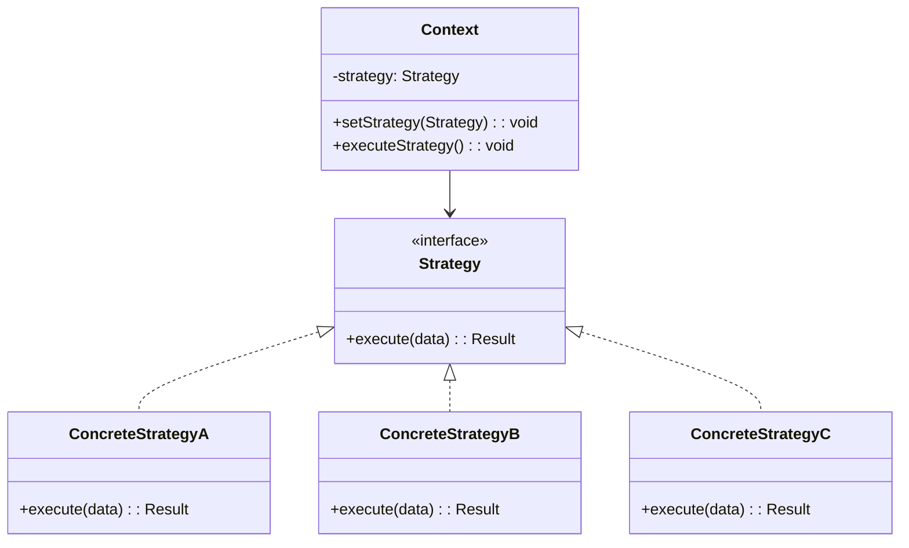
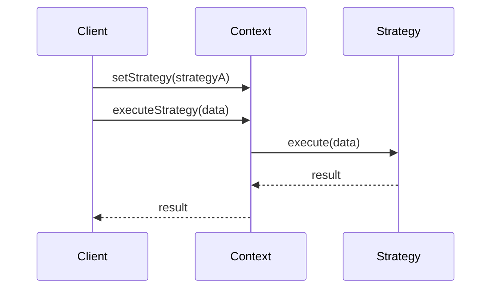
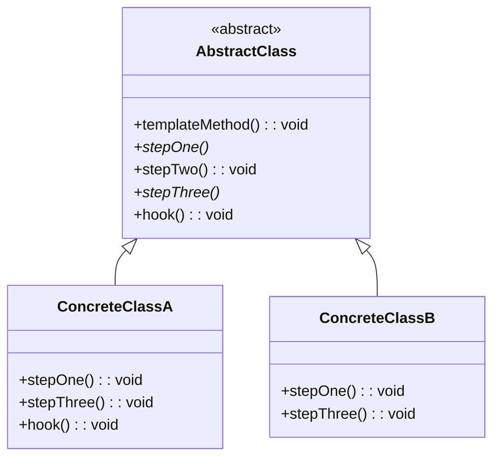
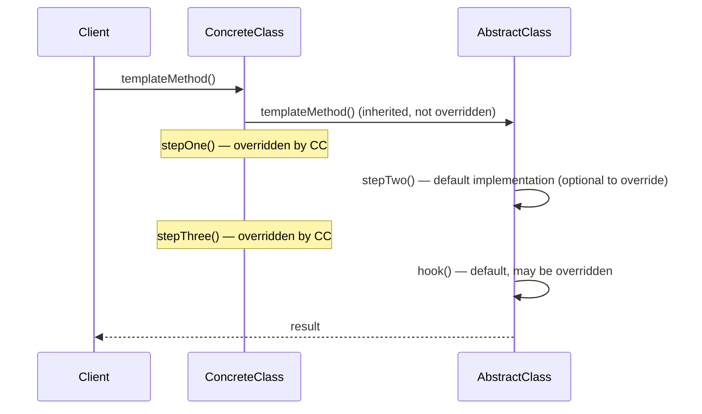
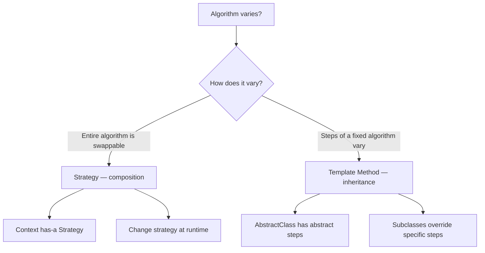

# Behavioral: Strategy & Template Method

> [!summary] Goal
> Define a family of interchangeable algorithms (Strategy) and define the skeleton of an algorithm with steps that subclasses can override (Template Method).

## Table of Contents

1. [Strategy](#strategy)
2. [Template Method](#template-method)
3. [Comparison and Decision Guide](#comparison-and-decision-guide)
4. [Pitfalls](#pitfalls)

---

## Strategy

> [!info] Strategy
> A behavioral GoF pattern that defines a family of interchangeable algorithms, encapsulates each one, and makes them interchangeable. Strategy lets the algorithm vary independently from the clients that use it. The Context delegates the work to a Strategy object, and the client can swap strategies at runtime without changing the Context.

### Problem

A class has many conditional branches for different behaviors (e.g., payment methods, compression algorithms, sorting criteria). As new behaviors are added, the class grows with more `if/else` or `switch` statements, violating OCP.

### Solution





```java
// Strategy interface
public interface PaymentStrategy {
    void pay(BigDecimal amount);
}

// Concrete strategies
public class CreditCardPayment implements PaymentStrategy {
    private final String cardNumber;

    public CreditCardPayment(String cardNumber) { this.cardNumber = cardNumber; }

    @Override
    public void pay(BigDecimal amount) {
        System.out.println("Paid $" + amount + " with credit card " + cardNumber);
    }
}

public class PayPalPayment implements PaymentStrategy {
    private final String email;

    public PayPalPayment(String email) { this.email = email; }

    @Override
    public void pay(BigDecimal amount) {
        System.out.println("Paid $" + amount + " via PayPal account " + email);
    }
}

public class CryptoPayment implements PaymentStrategy {
    private final String walletAddress;

    public CryptoPayment(String walletAddress) { this.walletAddress = walletAddress; }

    @Override
    public void pay(BigDecimal amount) {
        System.out.println("Paid $" + amount + " in crypto to " + walletAddress);
    }
}

// Context — uses a strategy
public class ShoppingCart {
    private final List<Item> items = new ArrayList<>();
    private PaymentStrategy paymentStrategy;

    public void setPaymentStrategy(PaymentStrategy strategy) {
        this.paymentStrategy = strategy;
    }

    public BigDecimal getTotal() {
        return items.stream().map(Item::price).reduce(BigDecimal.ZERO, BigDecimal::add);
    }

    public void checkout() {
        BigDecimal amount = getTotal();
        paymentStrategy.pay(amount);    // Delegates to the strategy
    }
}

// Usage — strategy is selected at runtime
ShoppingCart cart = new ShoppingCart();
cart.addItem(new Item("Book", BigDecimal.valueOf(20)));

// User selects payment method at checkout
cart.setPaymentStrategy(new PayPalPayment("user@example.com"));
cart.checkout();    // "Paid $20 via PayPal account user@example.com"
```

### Strategy vs if/else

```java
// ❌ Without Strategy — every new payment type modifies this class
public class PaymentProcessor {
    public void process(String type, BigDecimal amount) {
        if ("credit".equals(type)) { /* ... */ }
        else if ("paypal".equals(type)) { /* ... */ }
        else if ("crypto".equals(type)) { /* ... */ }   // Adding this line modifies the class
        else throw new IllegalArgumentException();
    }
}

// ✅ With Strategy — new payment type = new class, no modifications
// PaymentStrategy is injected. Adding CryptoPayment doesn't change ShoppingCart.
```

### Where it's used

| Example | Description |
|---------|-------------|
| `Comparator<T>` | Sorting strategy for collections |
| `LayoutManager` | Component layout strategy in Swing |
| `ResourceLoader` | Resource loading strategy in Spring |
| `AuthenticationProvider` | Authentication strategy in Spring Security |
| `RejectedExecutionHandler` | Saturation policy strategy in thread pools |

---

## Template Method

> [!info] Template Method
> A behavioral GoF pattern that defines the skeleton of an algorithm in a method, deferring some steps to subclasses. Subclasses can redefine certain steps without changing the algorithm's structure. The template method itself is usually marked \`final\` to prevent subclasses from overriding the overall algorithm structure.

### Problem

An algorithm has a fixed structure, but specific steps vary. You want to avoid duplicating the invariant structure while allowing subclasses to customize the variant steps.

### Solution





```java
// Abstract class with template method
public abstract class DataProcessor {

    // Template method — defines the skeleton algorithm
    // Marked 'final' to prevent subclasses from changing the algorithm structure
    public final void process() {
        loadData();
        if (isValid()) {                  // Hook — subclasses can override
            processData();
        }
        saveResults();
        postProcess();                     // Hook — default is no-op
    }

    // Steps that subclasses MUST implement
    protected abstract void loadData();
    protected abstract void processData();
    protected abstract void saveResults();

    // Hook — subclasses CAN override (but don't have to)
    protected boolean isValid() { return true; }

    // Hook — default no-op
    protected void postProcess() { }
}

// Concrete implementation
public class CsvDataProcessor extends DataProcessor {
    @Override
    protected void loadData() {
        System.out.println("Loading CSV file...");
    }

    @Override
    protected boolean isValid() {
        System.out.println("Validating CSV headers...");
        return true;
    }

    @Override
    protected void processData() {
        System.out.println("Processing CSV rows...");
    }

    @Override
    protected void saveResults() {
        System.out.println("Saving processed data to DB...");
    }

    @Override
    protected void postProcess() {
        System.out.println("Archiving CSV file...");
    }
}

// Another concrete implementation
public class JsonDataProcessor extends DataProcessor {
    @Override
    protected void loadData() { System.out.println("Loading JSON..."); }

    @Override
    protected void processData() { System.out.println("Parsing JSON..."); }

    @Override
    protected void saveResults() { System.out.println("Saving to DB..."); }

    // Does NOT override isValid() — uses default (returns true)
    // Does NOT override postProcess() — no post-processing needed
}

// Usage
DataProcessor processor = new CsvDataProcessor();
processor.process();
// Output:
// Loading CSV file...
// Validating CSV headers...
// Processing CSV rows...
// Saving processed data to DB...
// Archiving CSV file...
```

### Template Method vs Hook Methods

| Step type | Override requirement | Purpose |
|-----------|:-------------------:|---------|
| **Abstract method** | ✅ Required | The subclass must provide this step |
| **Concrete method** | ❌ Optional (override with care) | Step with a default implementation |
| **Hook** | ❌ Optional | Step that does nothing by default (override for extra behavior) |

> [!info] Hook Method
> A method in the Template Method pattern that has a default (usually empty) implementation and is intended to be overridden by subclasses when they need to add behavior at a specific point in the algorithm. Hooks are optional — the algorithm works correctly without them. Common hooks include validation checks (\`isValid()\`), cleanup (\`postProcess()\`), and logging.

### Where it's used

| Example | Description |
|---------|-------------|
| `InputStream.read()` | Reads single byte, stream subclasses override |
| `AbstractList.indexOf()` | Template method using `listIterator()` |
| `HttpServlet.doGet()` / `doPost()` | Template method `service()` calls `doGet()`/`doPost()` |
| Spring `JdbcTemplate` | Template for JDBC operations (connection, statement, resultset) |
| JUnit `TestCase` | `runTest()` calls `setUp()` → test method → `tearDown()` |

### NVI (Non-Virtual Interface)

NVI is a variant of Template Method: the **public interface is non-virtual** and calls a **private virtual** method. This lets the base class control pre/post conditions while subclasses provide the implementation. It's the "don't call us, we'll call you" pattern applied to access control.

```java
// NVI — public non-virtual, private virtual
public abstract class DataSource {
    // Public API — non-virtual (final), controls the flow
    public final String loadData(String key) {
        validateKey(key);
        String data = doLoad(key);     // Virtual call to subclass
        validateData(data);
        logAccess(key);
        return data;
    }
    
    // Subclasses override this (private — can't be called directly)
    protected abstract String doLoad(String key);
    
    // Pre/post hooks — also virtual
    protected void validateKey(String key) { /* default implementation */ }
    protected void validateData(String data) { /* default implementation */ }
    protected void logAccess(String key) { /* default implementation */ }
}

public class FileDataSource extends DataSource {
    @Override
    protected String doLoad(String key) {
        return Files.readString(Path.of(key));
    }
}

// Client code — can only call loadData(), not doLoad()
DataSource ds = new FileDataSource();
String data = ds.loadData("config.txt");   // DoLoad + validation + logging
```

| Aspect | Template Method | NVI |
|--------|:---------------:|:---:|
| **Public methods** | Some may be overridable | Non-virtual (`final`) |
| **Virtual methods** | Public or protected | Private or protected |
| **Pre/post conditions** | Client must remember | Enforced by base class |
| **Control** | Subclass controls via override | Base class controls flow |
| **Use when** | Subclasses should customize steps | Base class MUST enforce invariants |

## Comparison and Decision Guide



| Aspect | Strategy | Template Method |
|--------|:--------:|:---------------:|
| **Relationship** | Composition (has-a) | Inheritance (is-a) |
| **Granularity** | Entire algorithm swapped | Individual steps overridden |
| **Runtime change** | ✅ Change strategy anytime | ❌ Fixed at compile time (subclass) |
| **Code reuse** | Strategy implementations share nothing | Base class provides shared steps |
| **OCP** | ✅ Add new strategy = new class | ✅ Add new subclass = new step set |
| **Number of classes** | N strategies = N classes | N variants = N subclasses |
| **Analogy** | Choose a payment method at checkout | Bake a cake — steps are fixed, ingredients vary |

---

## Pitfalls

### Strategy explosion

Every strategy is a new class. For simple variations (e.g., sorting by different fields), a lambda or method reference is simpler:

```java
// Instead of 5 strategy classes, use lambdas:
List<User> sorted = users.stream()
    .sorted(Comparator.comparing(User::name))   // strategy as lambda
    .toList();
```

### Template method with too many hooks

A base class with 15 hook methods is hard to understand and override correctly. Subclass authors don't know which hooks are safe to override. Keep hook methods well-documented and minimal (2-4 hooks at most).

### Strategy context passing data that strategies don't need

The context may pass parameters that only some strategies use. If `CryptoPayment` uses `walletAddress` but `CreditCardPayment` doesn't, either pass both (unused by some) or use a context object that strategies can query.

> [!info] Hollywood Principle
> A design principle summarized as "Don't call us, we'll call you." In the Template Method pattern, the base class controls the algorithm flow and calls the subclass's methods — the subclass does not decide when or how its methods are invoked. This inversion of control is characteristic of frameworks: the framework calls your code, not the other way around.

### Hollywood Principle violation

Template Method follows the Hollywood Principle: "Don't call us, we'll call you." The base class controls the algorithm flow; subclasses provide implementations. This is the right design for templates, but it can be confusing if developers expect to control the flow from the subclass.

---

> [!question]- Interview Questions
>
> **Q: What problem does the Strategy pattern solve?**
> A: It eliminates conditional logic (if/else, switch) for varying algorithm implementations. Instead of modifying a class to add a new variant, you add a new Strategy class that conforms to the strategy interface. This makes the system open for extension but closed for modification (OCP).
>
> **Q: What is the difference between Strategy and State patterns?**
> A: Both have similar class structures, but different intents. Strategy lets the client choose which algorithm to use (e.g., payment method). State lets an object change its behavior when its internal state changes (e.g., vending machine states). In State, the state transitions are managed by the states themselves; in Strategy, the client sets the strategy.
>
> **Q: What is a hook method in Template Method?**
> A: A hook is an optional step with a default (usually empty) implementation. Subclasses can override it to add behavior at specific points in the algorithm without modifying the algorithm's structure. Common hooks include validation checks, logging, or cleanup operations.
>
> **Q: When would you choose Template Method over Strategy?**
> A: When the algorithm has a fixed structure with varying steps, and the varying steps are tightly coupled to the algorithm. Template Method shares the algorithm skeleton via inheritance. Strategy shares an interface via composition. Use Template Method when most of the algorithm is the same; use Strategy when the entire algorithm is swapped.
>
> **Q: How does Template Method adhere to OCP?**
> A: The template method is defined in the base class and is usually final (closed for modification). The steps it calls are abstract or hooks (open for extension). A new variant creates a new subclass implementing the abstract steps — no existing code is modified.

---

## Cross-Links

- [[DesignPatterns/02_Core/C10_State_Iterator_Visitor_Memento_Interpreter]] for State vs Strategy comparison
- [[DesignPatterns/02_Core/C02_Factory_Method_and_Abstract_Factory]] for Factory Method (similar to Template Method but for creation)
- [[DesignPatterns/01_Foundations/F02_SOLID_Principles]] for OCP — both Strategy and Template Method support it
- [[Java/01_Foundations/04_Streams_Lambdas_and_Functional_Java]] for functional strategies with lambdas
- [[SpringBoot/03_Advanced/02_AOP_Proxies_and_Internals]] for Template Method in Spring's `JdbcTemplate`
