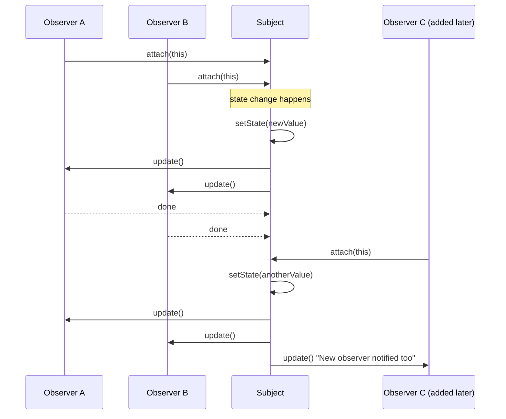
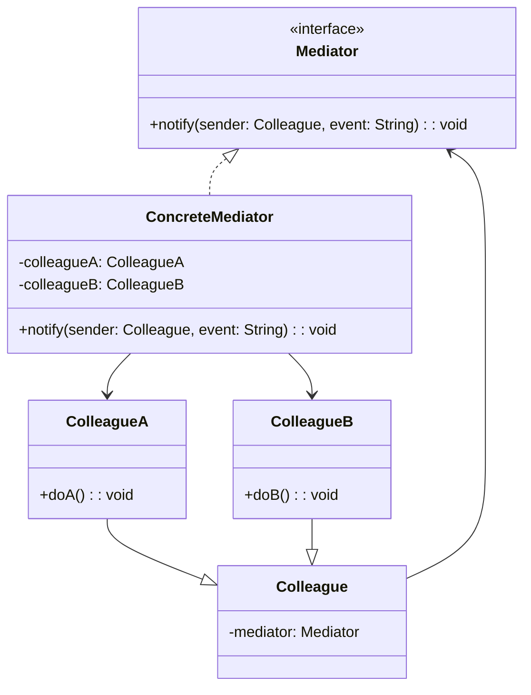
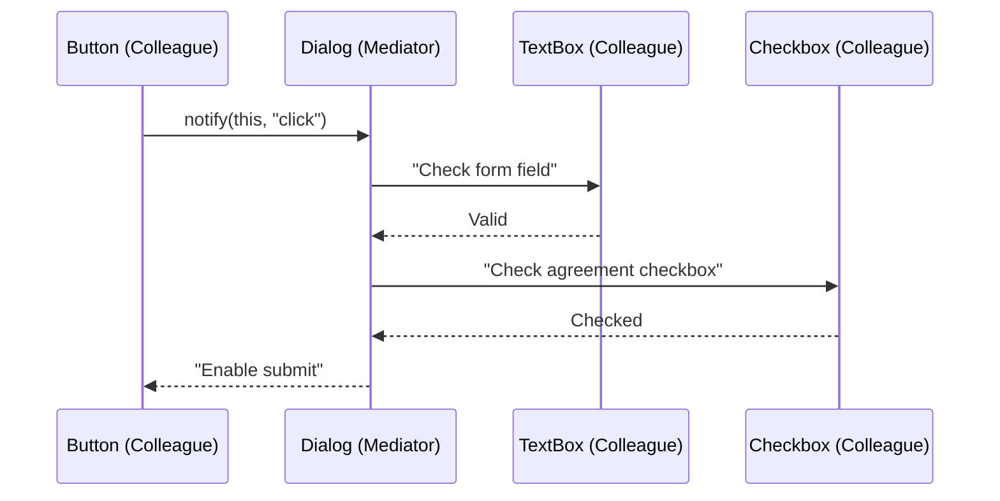
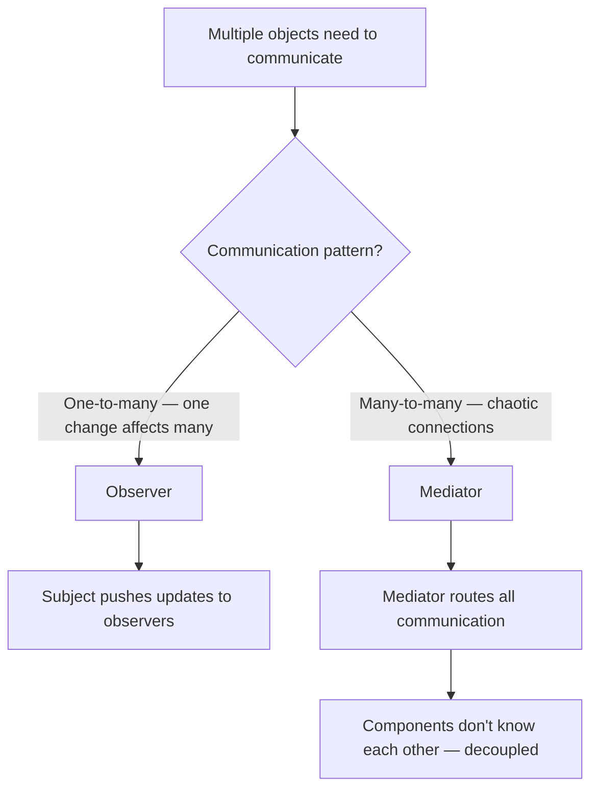

# Behavioral: Observer & Mediator

> [!summary] Goal
> Establish one-to-many dependency between objects so that when one changes state, all dependents are notified (Observer). Reduce chaotic communication between many objects by introducing a mediator (Mediator).

## Table of Contents

1. [Observer](#observer)
2. [Observer Variants](#observer-variants)
3. [Mediator](#mediator)
4. [Comparison and Decision Guide](#comparison-and-decision-guide)
5. [Pitfalls](#pitfalls)

---

## Observer

> [!info] Observer
> A behavioral GoF pattern that defines a one-to-many dependency between objects so that when one object (the Subject) changes state, all its dependents (Observers) are notified and updated automatically. The Subject maintains a list of observers and provides methods to attach and detach them at runtime.

### Problem

A change to one object (the subject) requires updating many other objects (observers) — and the set of observers should change dynamically.

> [!info] Subject
> The object being observed in the Observer pattern. The Subject maintains a list of registered Observers, provides methods to attach and detach them, and sends notifications when its state changes. The Subject does not need to know the concrete types of its Observers — it depends only on the Observer interface, enabling loose coupling.

### Solution

\`\`\`mermaid
classDiagram
    class Subject {
        -observers: List~Observer~
        +attach(Observer): void
        +detach(Observer): void
        +notifyObservers(): void
    }
    class ConcreteSubject {
        -state: int
        +getState(): int
        +setState(int): void
    }
    class Observer {
        <<interface>>
        +update(subject: Subject): void
    }
    class ConcreteObserverA {
        +update(subject: Subject): void
    }
    class ConcreteObserverB {
        +update(subject: Subject): void
    }
    Subject o-- Observer
    ConcreteSubject --|> Subject
    Observer <|.. ConcreteObserverA
    Observer <|.. ConcreteObserverB
```



```java
// Observer interface
public interface Observer {
    void update(float temperature, float humidity, float pressure);
}

// Subject
public class WeatherStation {
    private final List<Observer> observers = new ArrayList<>();
    private float temperature;
    private float humidity;
    private float pressure;

    public void attach(Observer observer) { observers.add(observer); }
    public void detach(Observer observer) { observers.remove(observer); }

    private void notifyObservers() {
        for (Observer observer : observers) {
            observer.update(temperature, humidity, pressure);
        }
    }

    public void setMeasurements(float temp, float humidity, float pressure) {
        this.temperature = temp;
        this.humidity = humidity;
        this.pressure = pressure;
        notifyObservers();                  // Push notification
    }
}

// Concrete observers
public class PhoneDisplay implements Observer {
    @Override
    public void update(float temp, float humidity, float pressure) {
        System.out.println("Phone: Temperature = " + temp + "°C");
    }
}

public class WindowDisplay implements Observer {
    @Override
    public void update(float temp, float humidity, float pressure) {
        System.out.println("Window: " + temp + "°C, " + humidity + "% humidity");
    }

    @Override public String toString() { return "WindowDisplay"; }
}

// Usage
WeatherStation station = new WeatherStation();
PhoneDisplay phone = new PhoneDisplay();
WindowDisplay window = new WindowDisplay();

station.attach(phone);
station.attach(window);

station.setMeasurements(25.0f, 65.0f, 1013.0f);
// Both displays update

station.detach(window);   // WindowDisplay no longer receives updates
station.setMeasurements(26.0f, 60.0f, 1012.0f);
// Only PhoneDisplay updates
```

---

## Observer Variants

> [!info] Push vs Pull Model
> In the Observer pattern, **Push model** means the Subject sends all relevant data to the Observer as method arguments — the Observer receives everything it needs in the notification (e.g., \`update(temperature, humidity, pressure)\`). **Pull model** means the Subject sends only a minimal notification (e.g., \`update()\`), and the Observer must query the Subject for the specific data it needs. Push is simpler for Observers but rigid; Pull is flexible but couples Observers to the Subject interface.

### Push vs Pull

\`\`\`mermaid
flowchart TD
    A["Notification model?"] --> B{Who has the data?}
    B -->|"Subject pushes data to observers"| C["Push model — subject sends all relevant data"]
    B -->|"Observers pull data from subject"| D["Pull model — subject sends minimal notification"]
    C --> E["Pros: observers are simple (data already provided)"]
    C --> E["Cons: subject must know what data observers need"]
    D --> F["Pros: observers can choose what they need"]
    D --> F["Cons: observers need a reference to the subject"]
```

```java
// Push model (shown above) — subject sends specific data
void update(float temperature, float humidity, float pressure);

// Pull model — subject notifies, observer queries
interface PullObserver {
    void update();                      // Just "something changed"
}

class PullPhoneDisplay implements PullObserver {
    private WeatherStation station;

    @Override
    public void update() {
        float temp = station.getTemperature();   // Observer pulls what it needs
        System.out.println("Phone: " + temp + "°C");
    }
}
```

> [!info] Event Bus
> A modern variant of the Observer pattern (also called Pub-Sub) where publishers and subscribers are fully decoupled through a central event channel. Unlike classic Observer where the Subject holds direct references to Observers, in Event Bus neither side knows about the other — events are published to a bus and delivered to all matching subscribers. This enables loose coupling and is widely used in distributed systems and UI frameworks.

### Event bus / Pub-Sub

\`\`\`java
// A generic event bus decouples publishers from subscribers
public class EventBus {
    private final Map<Class<?>, List<Consumer<?>>> subscribers = new HashMap<>();

    public <T> void subscribe(Class<T> eventType, Consumer<T> handler) {
        subscribers.computeIfAbsent(eventType, k -> new ArrayList<>()).add(handler);
    }

    @SuppressWarnings("unchecked")
    public <T> void publish(T event) {
        List<Consumer<?>> handlers = subscribers.get(event.getClass());
        if (handlers != null) {
            handlers.forEach(h -> ((Consumer<T>) h).accept(event));
        }
    }
}

// Usage
EventBus bus = new EventBus();
bus.subscribe(OrderPlacedEvent.class, e -> emailService.sendConfirmation(e));
bus.subscribe(OrderPlacedEvent.class, e -> inventoryService.reserve(e));
bus.subscribe(UserRegisteredEvent.class, e -> crmService.createContact(e));

bus.publish(new OrderPlacedEvent("order-123"));   // Both handlers fire
```

### Where it's used

| Example | Description |
|---------|-------------|
| `java.util.Observer` / `Observable` | Legacy Java observer API |
| `PropertyChangeListener` | Bean property change listener |
| `@EventListener` (Spring) | Spring application event listener |
| `MutationObserver` (JS) | DOM change notification |
| `Flow.Publisher` / `Flow.Subscriber` | Java 9 reactive streams |

---

## Mediator

> [!info] Mediator
> A behavioral GoF pattern that reduces chaotic communication between multiple objects by introducing a mediator object that centralizes all interactions. Instead of objects referring to each other directly, they communicate only through the Mediator. This reduces coupling and makes the interaction logic easier to maintain and evolve.

### Problem

A system has many objects that communicate in complex ways, creating chaotic interconnections. Changing one object requires understanding all its communication partners.

### Solution





```java
// Mediator interface
public interface DialogMediator {
    void notify(Component sender, String event);
}

// Concrete mediator
public class SignupDialog implements DialogMediator {
    private TextBox usernameField;
    private TextBox passwordField;
    private Checkbox agreeCheckbox;
    private Button submitButton;

    public SignupDialog() {
        usernameField = new TextBox(this);
        passwordField = new TextBox(this);
        agreeCheckbox = new Checkbox(this);
        submitButton = new Button(this);
    }

    @Override
    public void notify(Component sender, String event) {
        if (sender == usernameField && "input".equals(event)) {
            checkFormValidity();
        } else if (sender == agreeCheckbox && "check".equals(event)) {
            checkFormValidity();
        } else if (sender == submitButton && "click".equals(event)) {
            if (isFormValid()) {
                submitForm();
            }
        }
    }

    private void checkFormValidity() {
        boolean valid = !usernameField.getText().isEmpty()
            && !passwordField.getText().isEmpty()
            && agreeCheckbox.isChecked();
        submitButton.setEnabled(valid);
    }

    private boolean isFormValid() { /* ... */ return true; }
    private void submitForm() { System.out.println("Form submitted!"); }
}

// Base colleague
public abstract class Component {
    protected DialogMediator mediator;

    public Component(DialogMediator mediator) { this.mediator = mediator; }
}

// Concrete colleagues
public class Button extends Component {
    public Button(DialogMediator mediator) { super(mediator); }
    public void click() { mediator.notify(this, "click"); }
    public void setEnabled(boolean enabled) { System.out.println("Button enabled: " + enabled); }
}

public class TextBox extends Component {
    private String text = "";
    public TextBox(DialogMediator mediator) { super(mediator); }
    public void setText(String text) { this.text = text; mediator.notify(this, "input"); }
    public String getText() { return text; }
}

public class Checkbox extends Component {
    private boolean checked = false;
    public Checkbox(DialogMediator mediator) { super(mediator); }
    public void setChecked(boolean checked) { this.checked = checked; mediator.notify(this, "check"); }
    public boolean isChecked() { return checked; }
}

// Usage — components communicate ONLY through the mediator
SignupDialog dialog = new SignupDialog();
// Components are wired by the mediator, no direct connections
```

### Where it's used

| Example | Description |
|---------|-------------|
| `java.util.Timer` | Schedules tasks (mediates between task and execution thread) |
| `java.util.concurrent.Executor` | Mediates between task submission and execution |
| `MessageDispatcher` (Spring) | Dispatches messages to handlers |
| Air traffic control | Planes communicate via tower (mediator), not directly |
| GUI frameworks | Dialog boxes mediate between form controls |

---

## Comparison and Decision Guide



| Aspect | Observer | Mediator |
|--------|:--------:|:--------:|
| **Direction** | One-to-many | Many-to-many |
| **Coupling** | Subject → Observer | Colleague → Mediator ← Colleague |
| **Communication** | Broadcast (subject to all observers) | Point-to-point via mediator |
| **Adding new participant** | Add Observer (implements interface) | Add Colleague (registered in mediator) |
| **Complexity** | Low (simple notification) | Medium (mediator knows all) |
| **When to use** | UI event handling, data binding | Complex UI dialogs, chat rooms |
| **Analogy** | Newsletter subscription | Air traffic control |

---

## Pitfalls

### Observer memory leaks

Observers that forget to unsubscribe keep a reference to the subject (or vice versa), preventing garbage collection. In Java, this is a common memory leak:

```java
// ❌ Memory leak — observer is never detached
class MyActivity {
    void onStart() {
        WeatherStation station = new WeatherStation();
        station.attach(new PhoneDisplay());   // PhoneDisplay has implicit reference to activity
        // When activity is destroyed, station still holds PhoneDisplay → can't GC the activity
    }
}

// ✅ Fix: detach observers in cleanup
// Or use WeakReferences, or lifecycle-aware subscription
```

### Mediator becoming a God object

The mediator knows about all colleagues and their interactions. As the system grows, the mediator can become a God class that's hard to maintain. Split large mediators into smaller, focused ones.

### Observer notification ordering

Observers are usually notified in insertion order, but this is not guaranteed in all implementations. If notification order matters, document it, or use a priority queue. Don't rely on insertion order for correctness.

### Event bus explosion

A global event bus with thousands of event types becomes unmanageable. Events are hard to trace, and debugging becomes "follow the event chain." Scope event buses to modules, not the entire application.

---

> [!question]- Interview Questions
>
> **Q: What is the difference between Observer and Pub-Sub?**
> A: In Observer, the subject holds references to observers and notifies them directly (tightly coupled). In Pub-Sub, publishers and subscribers don't know each other — a message broker (event bus) mediates between them. Pub-Sub is a more decoupled version of Observer suitable for distributed systems.
>
> **Q: What is the push vs pull model in Observer?**
> A: Push: subject sends all relevant data to observers (`update(temperature, humidity, pressure)`). Pull: subject sends minimal notification (`update()`) and observers query the subject for relevant data (`station.getTemperature()`). Push is simpler for observers; pull gives observers more control.
>
> **Q: What problem does Mediator solve?**
> A: It reduces chaotic many-to-many communication to controlled one-to-many communication. Instead of each colleague knowing about every other colleague, all colleagues know only the mediator. This reduces coupling and makes interaction logic centralized and easier to maintain.
>
> **Q: When would you use Mediator over Observer?**
> A: Use Mediator when you have complex, multi-directional communication between many objects (e.g., a UI dialog where a checkbox enables a button, filling a text field validates a form). Use Observer for simple one-to-many notifications (e.g., one weather station updating many displays).
>
> **Q: How does Mediator violate DIP?**
> A: Mediator can violate DIP if concrete colleagues depend on a concrete mediator rather than an abstract mediator interface. To fix: introduce a `Mediator` interface that the concrete mediator implements. Colleagues should only depend on the `Mediator` interface.

---

## Cross-Links

- [[DesignPatterns/02_Core/C09_Command_and_Chain_of_Responsibility]] for related communication patterns
- [[DesignPatterns/02_Core/C10_State_Iterator_Visitor_Memento_Interpreter]] for state-based communication
- [[DesignPatterns/02_Core/C06_Facade_Proxy_Flyweight]] for Facade (similar to Mediator but for subsystems)
- [[Angular/02_Core/03_RxJS_in_Angular]] for reactive programming (Observer pattern at scale)
- [[SpringBoot/03_Advanced/02_AOP_Proxies_and_Internals]] for Spring's event listener (Observer pattern)
