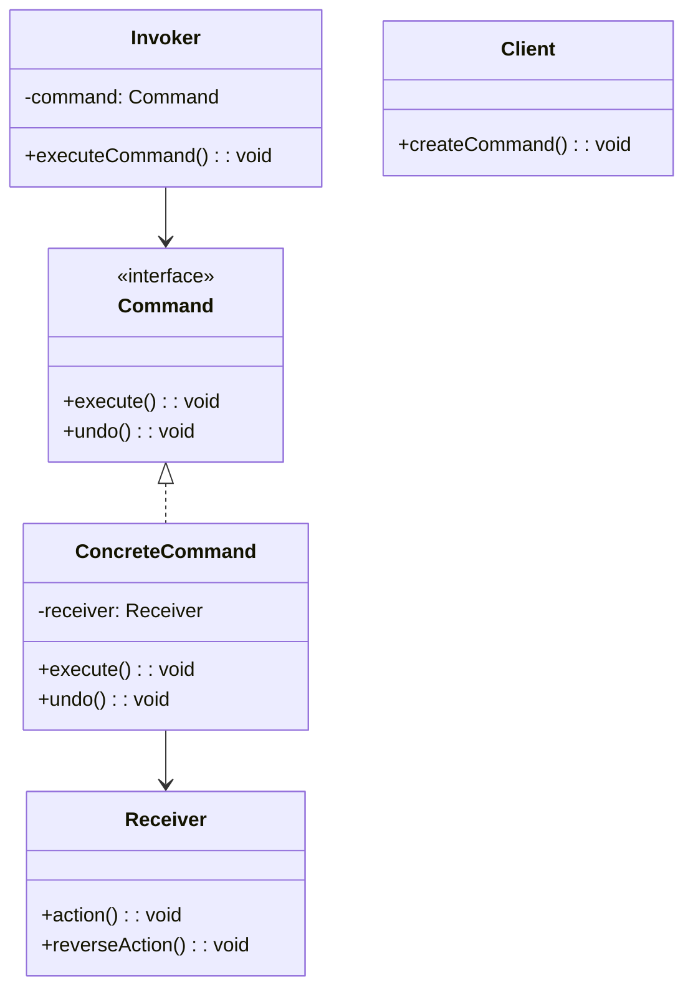
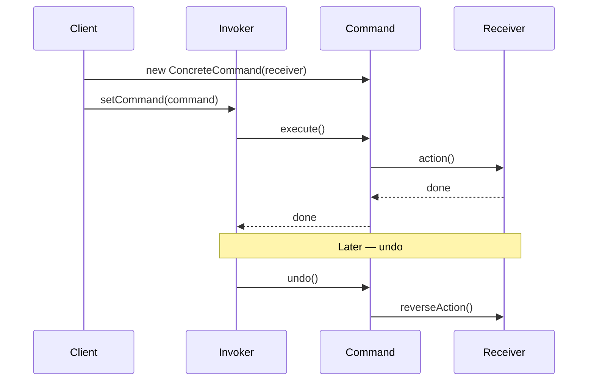
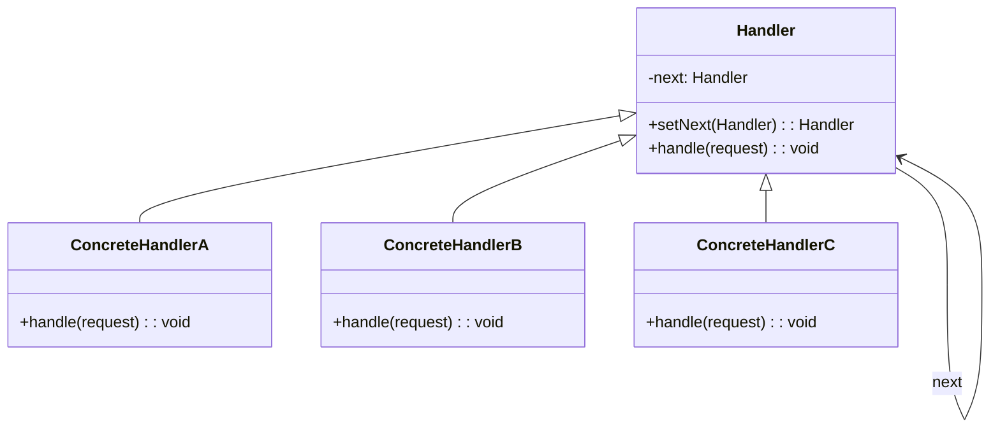
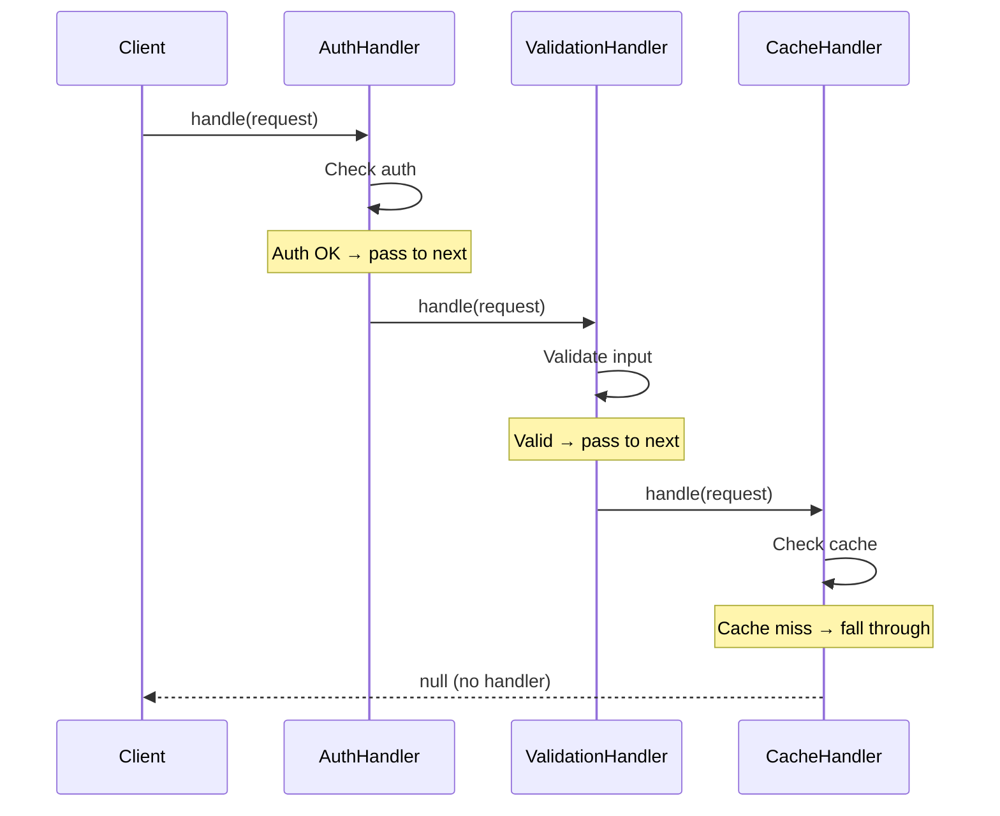
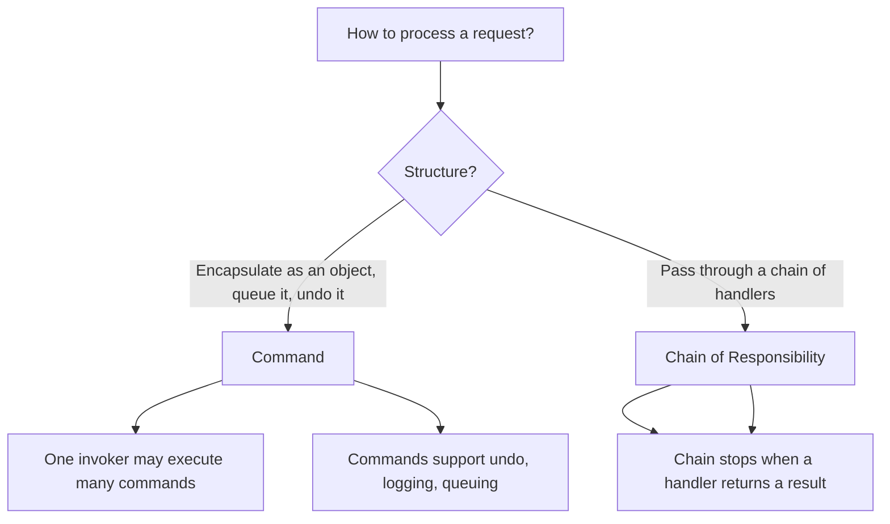

# Behavioral: Command & Chain of Responsibility

> [!summary] Goal
> Encapsulate a request as an object (Command) for queuing, logging, undo/redo. Pass a request along a chain of handlers (Chain of Responsibility) until one handles it.

## Table of Contents

1. [Command](#command)
2. [Command Variants](#command-variants)
3. [Chain of Responsibility](#chain-of-responsibility)
4. [Comparison and Decision Guide](#comparison-and-decision-guide)
5. [Pitfalls](#pitfalls)

---

## Command

> [!info] Command
> A behavioral GoF pattern that encapsulates a request as an object, thereby allowing clients to parameterize objects with operations, queue or log requests, and support undoable operations. The Command pattern decouples the object that invokes the operation (Invoker) from the object that knows how to perform it (Receiver).

### Problem

You need to parameterize objects with operations, queue operations, log them, or support undo/redo. Direct method calls don't support these — they execute immediately and can't be stored or reversed.

### Solution





```java
// Command interface
public interface Command {
    void execute();
    void undo();
}

// Receiver
public class Light {
    public void turnOn() { System.out.println("Light is ON"); }
    public void turnOff() { System.out.println("Light is OFF"); }
}

// Concrete commands
public class LightOnCommand implements Command {
    private final Light light;

    public LightOnCommand(Light light) { this.light = light; }

    @Override
    public void execute() { light.turnOn(); }

    @Override
    public void undo() { light.turnOff(); }
}

public class LightOffCommand implements Command {
    private final Light light;

    public LightOffCommand(Light light) { this.light = light; }

    @Override
    public void execute() { light.turnOff(); }

    @Override
    public void undo() { light.turnOn(); }
}

> [!info] Invoker and Receiver
> In the Command pattern, the **Invoker** is the object that triggers the execution of a command (e.g., a remote control button). It holds a reference to a Command object and calls \`execute()\` on it. The **Receiver** is the object that performs the actual work (e.g., a \`Light\`). The Invoker does not know the Receiver — only the concrete Command knows both. This decoupling allows you to change the Command at runtime without modifying the Invoker.

// Invoker — remote control with undo history
public class RemoteControl {
    private Command lastCommand;

    public void setCommand(Command command) {
        lastCommand = command;
    }

    public void pressButton() {
        if (lastCommand != null) {
            lastCommand.execute();
        }
    }

    public void pressUndo() {
        if (lastCommand != null) {
            lastCommand.undo();
        }
    }
}

// Usage
Light livingRoom = new Light();
RemoteControl remote = new RemoteControl();

remote.setCommand(new LightOnCommand(livingRoom));
remote.pressButton();    // "Light is ON"
remote.pressUndo();      // "Light is OFF"

remote.setCommand(new LightOffCommand(livingRoom));
remote.pressButton();    // "Light is OFF"
```

---

## Command Variants

> [!info] Macro Command
> A composite command that executes a sequence of sub-commands in order. Macro Command implements the same Command interface, so it can be used anywhere a regular command is used. It supports undo by reversing the execution order and calling \`undo()\` on each sub-command. This is a practical application of the Composite pattern applied to Commands.

### Macro command (composite)

\`\`\`java
// Command that executes multiple commands in sequence
public class MacroCommand implements Command {
    private final List<Command> commands = new ArrayList<>();

    public void addCommand(Command command) { commands.add(command); }

    @Override
    public void execute() {
        commands.forEach(Command::execute);
    }

    @Override
    public void undo() {
        Collections.reverse(commands);        // Undo in reverse order
        commands.forEach(Command::undo);
        Collections.reverse(commands);
    }
}

// Usage
MacroCommand party = new MacroCommand();
party.addCommand(new LightOnCommand(livingRoom));
party.addCommand(new StereoOnCommand(stereo));
party.addCommand(new TVOnCommand(tv));

party.execute();    // Turns on everything
party.undo();       // Turns off everything in reverse order
```

### Command history with undo/redo

```java
public class CommandHistory {
    private final Stack<Command> undoStack = new Stack<>();
    private final Stack<Command> redoStack = new Stack<>();

    public void execute(Command command) {
        command.execute();
        undoStack.push(command);
        redoStack.clear();        // New execution invalidates redo history
    }

    public void undo() {
        if (!undoStack.isEmpty()) {
            Command command = undoStack.pop();
            command.undo();
            redoStack.push(command);
        }
    }

    public void redo() {
        if (!redoStack.isEmpty()) {
            Command command = redoStack.pop();
            command.execute();
            undoStack.push(command);
        }
    }
}
```

### Where it's used

| Example | Description |
|---------|-------------|
| `Runnable` / `Thread` | Encapsulates work to execute asynchronously |
| Swing `Action` | Encapsulates UI actions (undo/redo support) |
| Spring `@RequestMapping` | Maps HTTP requests to handler methods |
| `java.util.TimerTask` | Encapsulates work to execute at a scheduled time |
| Transaction logs | Write-ahead log (WAL) stores commands for replay |

---

## Chain of Responsibility

> [!info] Chain of Responsibility
> A behavioral GoF pattern that passes a request along a chain of handlers. Each handler decides either to process the request or to pass it to the next handler in the chain. The sender does not know which handler will ultimately process the request — it only knows the entry point of the chain.

### Problem

A request should be handled by multiple potential handlers, but the handler should be determined at runtime. The sender shouldn't be coupled to a specific handler.

### Solution





```java
// Handler interface — returns an Object or null (continue chain)
@FunctionalInterface
public interface Handler {
    Object handle(Request request);

    // Static method to compose handlers (fluent chain)
    static Handler chain(Handler... handlers) {
        return request -> {
            for (Handler handler : handlers) {
                Object result = handler.handle(request);
                if (result != null) return result;  // First non-null result wins
            }
            return null;    // No handler processed the request
        };
    }
}

// Concrete handlers
public class AuthHandler implements Handler {
    @Override
    public Object handle(Request request) {
        if (request.token() == null || request.token().isBlank()) {
            return new ErrorResponse(401, "Missing auth token");
        }
        if (!"valid-token".equals(request.token())) {
            return new ErrorResponse(401, "Invalid token");
        }
        return null;    // Pass to next handler
    }
}

public class ValidationHandler implements Handler {
    @Override
    public Object handle(Request request) {
        if (request.body() == null || request.body().isBlank()) {
            return new ErrorResponse(400, "Request body required");
        }
        return null;    // Pass to next
    }
}

public class CacheHandler implements Handler {
    private final Map<String, Object> cache = new HashMap<>();

    public CacheHandler() {
        cache.put("/api/users/1", new UserResponse(1, "Alice"));
    }

    @Override
    public Object handle(Request request) {
        return cache.get(request.path());   // Returns cached response or null (miss)
    }
}

public class BusinessLogicHandler implements Handler {
    @Override
    public Object handle(Request request) {
        System.out.println("Processing: " + request.path());
        return new UserResponse(42, "Bob");
    }
}

// Usage — compose the chain
Handler pipeline = Handler.chain(
    new AuthHandler(),
    new ValidationHandler(),
    new CacheHandler(),
    new BusinessLogicHandler()       // Last handler always returns something
);

Request req = new Request("/api/users/1", "valid-token", "");
Object response = pipeline.handle(req);
System.out.println(response);

Request badReq = new Request("/api/users/1", "", "");
Object error = pipeline.handle(badReq);   // AuthHandler returns error, chain stops
System.out.println(error);               // ErrorResponse[status=401]
```

> [!info] Middleware
> A modern architectural variant of the Chain of Responsibility pattern, commonly used in web frameworks. Middleware components are arranged in a pipeline where each component processes the request and/or response and decides whether to pass control to the next component. Express.js, Spring Security filter chains, and servlet filters all use this pattern. Each middleware concerns itself with one cross-cutting concern (logging, authentication, caching).

### Middleware pattern (modern chain)

\`\`\`java
// Chain of Responsibility is the basis for middleware pipelines
// Express.js, Spring Security filter chain, servlet filters

// Functional middleware — common in web frameworks
public interface Middleware {
    void handle(Request request, Response response, Runnable next);
}

public class LoggingMiddleware implements Middleware {
    @Override
    public void handle(Request request, Response response, Runnable next) {
        System.out.println("Request: " + request.path());
        long start = System.nanoTime();
        next.run();                              // Call next in chain
        long elapsed = (System.nanoTime() - start) / 1_000_000;
        System.out.println("Response in " + elapsed + "ms");
    }
}
```

### Where it's used

| Example | Description |
|---------|-------------|
| Servlet `Filter` chain | Each filter processes request/response, passes to next |
| Spring Security filter chain | Authentication → authorization → CSRF → ... |
| Java `Logger` | Log messages propagate up from FINEST → SEVERE |
| Express.js / Koa middleware | Request processing pipeline |
| `java.util.zip` | Compression filter chain |
| AOP interceptors | Method call interceptors in Spring AOP |

---

## Comparison and Decision Guide



| Aspect | Command | Chain of Responsibility |
|--------|:-------:|:----------------------:|
| **Purpose** | Encapsulate request as object | Pass request through handlers |
| **Control** | Invoker executes the command | Handlers decide to handle or pass |
| **Number of handlers** | One command → one receiver | One request → multiple potential handlers |
| **State** | Can store state (for undo) | Stateless (per request) |
| **Late binding** | Command chosen at invocation time | Handler chain built at configuration time |
| **Analogy** | TV remote button | Customer support tier 1 → tier 2 → tier 3 |

---

## Pitfalls

### Command class explosion

Every action requires a new Command class. For applications with hundreds of actions (text editor: cut, copy, paste, bold, italic, underline, ...), the number of Command classes grows linearly. Mitigate by using lambda-based commands in Java 8+:

```java
// Functional commands — fewer classes
Command saveCmd = () -> document.save();
Command printCmd = () -> document.print();
```

### Chain of Responsibility with no terminal handler

If the chain ends without a handler processing the request, the request is silently dropped. Always ensure the last handler in the chain is a "catch-all" that returns a default response or throws a meaningful error.

### Chain of Handler mutating shared state

If handlers modify a shared request/response object, and one handler accidentally corrupts it, all downstream handlers are affected. Ensure handlers are idempotent and don't interfere with each other's state.

### Undo complexity with side effects

If `execute()` has side effects that can't be easily reversed (sending an email, charging a credit card), the `undo()` method is problematic. Not all operations are undoable — for those, either don't support undo or use a compensating action (like the Saga pattern).

---

> [!question]- Interview Questions
>
> **Q: What are the benefits of the Command pattern?**
> A: (1) Decouples the invoker from the receiver. (2) Commands can be queued, logged, serialized. (3) Supports undo/redo via command history. (4) Macro commands compose multiple operations. (5) Easily add new commands without changing existing code.
>
> **Q: How does Chain of Responsibility work?**
> A: A request enters the chain and passes through a sequence of handlers. Each handler can either process the request (and stop the chain) or pass it to the next handler. The sender doesn't know which handler will ultimately process the request — it only knows the entry point of the chain.
>
> **Q: What is the difference between Command and Strategy?**
> A: Command encapsulates a request as an object (can be queued, undone, logged). Strategy encapsulates an algorithm (swappable behavior). Command focuses on when and how an action is executed; Strategy focuses on which algorithm to use.
>
> **Q: Give a real-world example of Chain of Responsibility in Java.**
> A: Servlet filters implement Chain of Responsibility. A web request passes through a filter chain (auth filter → logging filter → compression filter → ...) before reaching the servlet. Each filter can modify the request/response and decide whether to pass to the next filter or stop the chain.
>
> **Q: How would you implement undo/redo with the Command pattern?**
> A: Maintain two stacks: an undo stack and a redo stack. When a command executes, push it to the undo stack and clear the redo stack. On undo: pop from undo stack, call `undo()`, push to redo stack. On redo: pop from redo stack, call `execute()`, push to undo stack.

---

## Cross-Links

- [[DesignPatterns/02_Core/C07_Strategy_and_Template_Method]] for Command vs Strategy comparison
- [[DesignPatterns/02_Core/C08_Observer_and_Mediator]] for Mediator (alternative communication pattern)
- [[DesignPatterns/02_Core/C10_State_Iterator_Visitor_Memento_Interpreter]] for Memento (supports Command undo)
- [[DesignPatterns/02_Core/C05_Composite_and_Decorator]] for Macro Command (composite pattern)
- [[SpringBoot/01_Foundations/02_DI_and_Bean_Lifecycle]] for Spring's handler chain pattern
