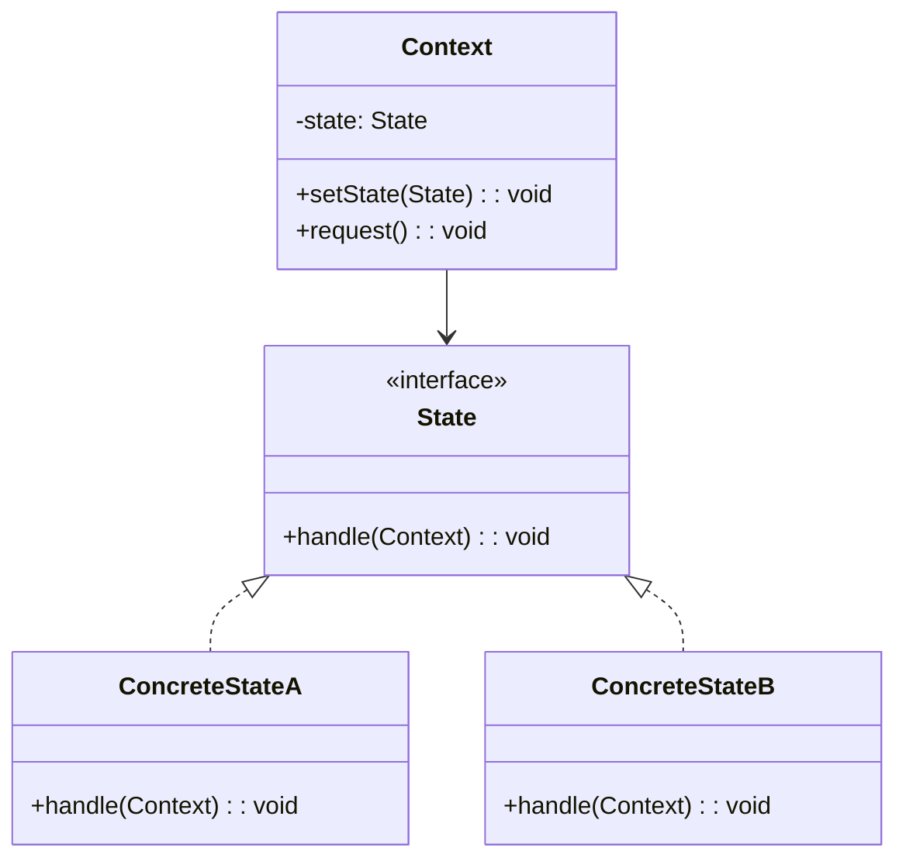
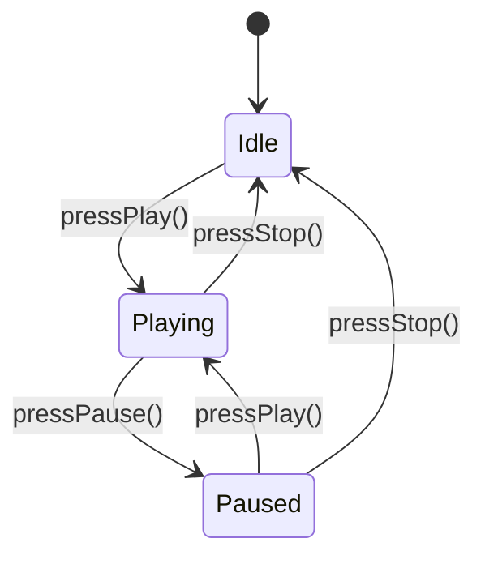
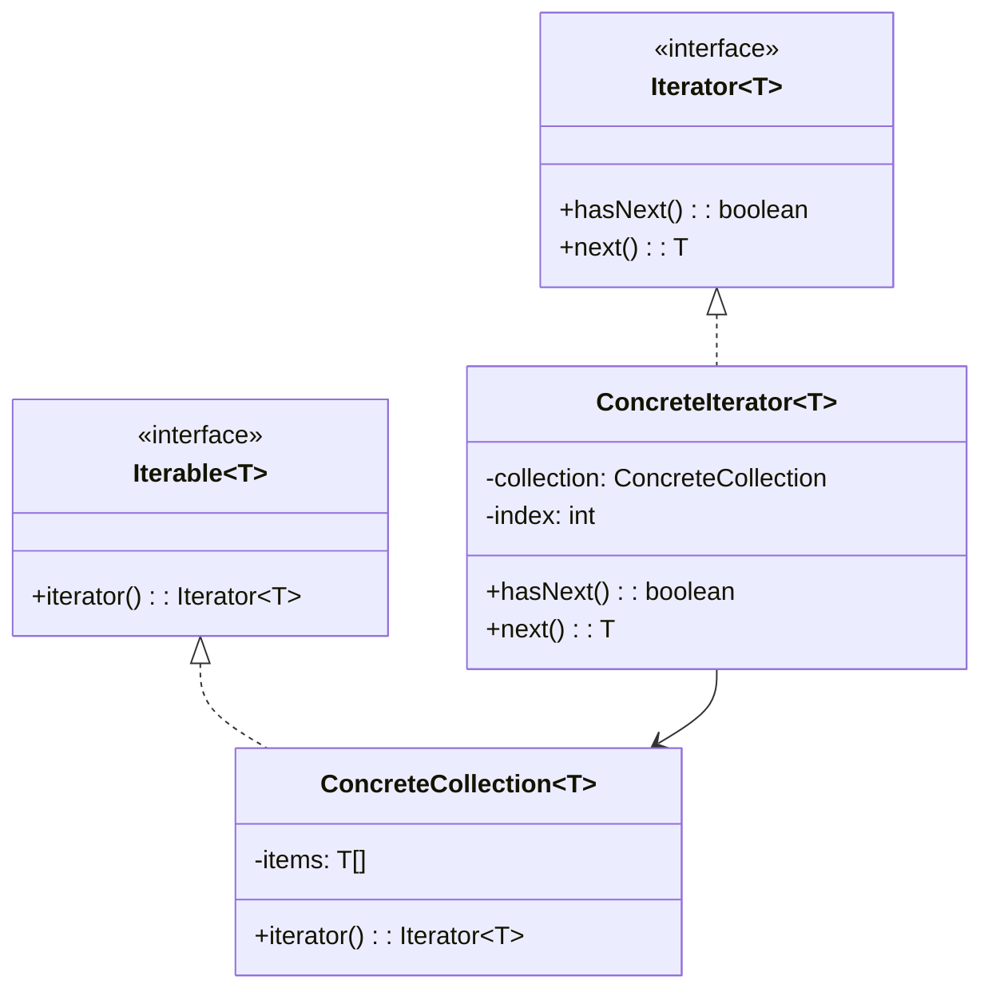
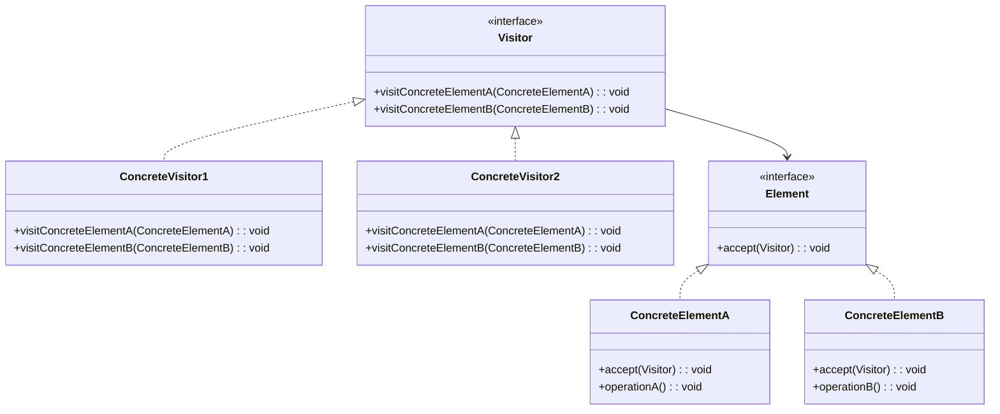
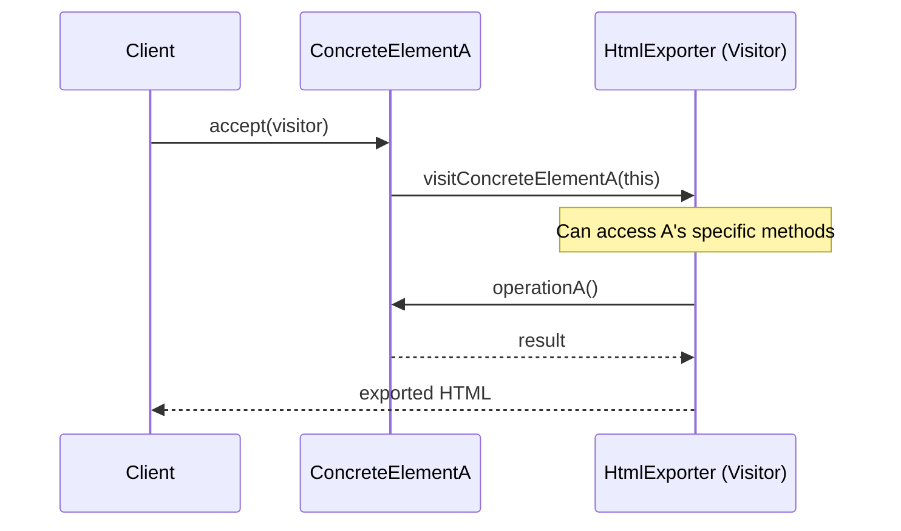
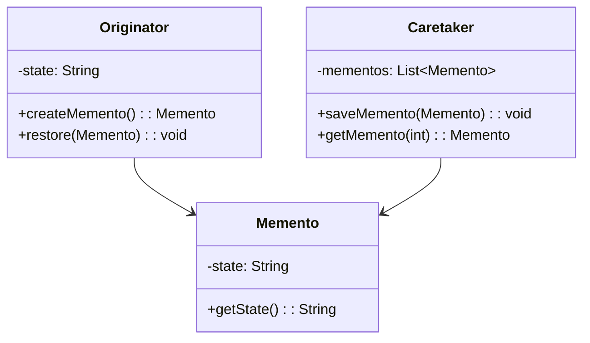
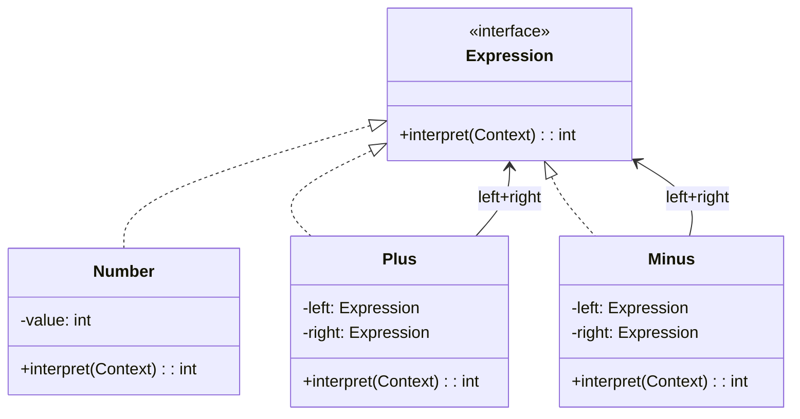
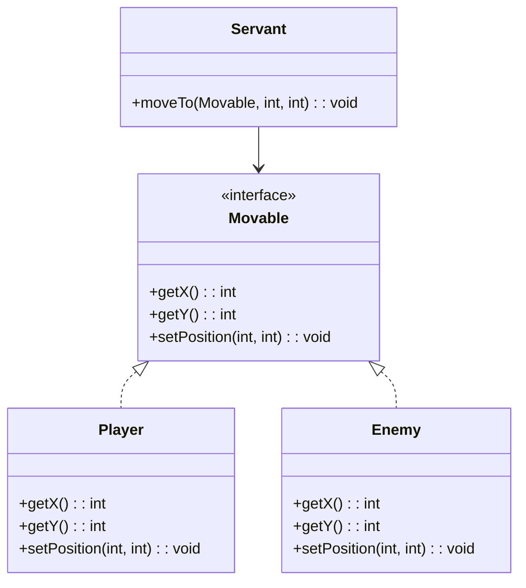

# Behavioral: State, Iterator, Visitor, Memento, Interpreter

> [!summary] Goal
> Complete the GoF catalog with the remaining five behavioral patterns: state machines (State), collection traversal (Iterator), double dispatch (Visitor), object snapshots (Memento), and grammar evaluation (Interpreter).

## Table of Contents

1. [State](#state)
2. [Iterator](#iterator)
3. [Visitor](#visitor)
4. [Memento](#memento)
5. [Interpreter](#interpreter)

---

## State

> [!info] State
> A behavioral GoF pattern that allows an object to alter its behavior when its internal state changes. The object will appear to change its class. Each state is encapsulated in its own class, and the Context delegates state-specific behavior to the current state object. State transitions can be managed by the state objects themselves.

### Problem

An object changes its behavior when its internal state changes. You want to avoid large conditional statements (\`if (state == X)\`) scattered throughout the code.

### Solution





```java
// State interface
public interface MediaPlayerState {
    void pressPlay(MediaPlayer player);
    void pressPause(MediaPlayer player);
    void pressStop(MediaPlayer player);
}

// Concrete states
public class IdleState implements MediaPlayerState {
    @Override
    public void pressPlay(MediaPlayer player) {
        System.out.println("Starting playback");
        player.setState(new PlayingState());
    }

    @Override
    public void pressPause(MediaPlayer player) {
        System.out.println("No media to pause");
    }

    @Override
    public void pressStop(MediaPlayer player) {
        System.out.println("Already stopped");
    }
}

public class PlayingState implements MediaPlayerState {
    @Override
    public void pressPlay(MediaPlayer player) {
        System.out.println("Already playing");
    }

    @Override
    public void pressPause(MediaPlayer player) {
        System.out.println("Paused");
        player.setState(new PausedState());
    }

    @Override
    public void pressStop(MediaPlayer player) {
        System.out.println("Stopped");
        player.setState(new IdleState());
    }
}

public class PausedState implements MediaPlayerState {
    @Override
    public void pressPlay(MediaPlayer player) {
        System.out.println("Resuming");
        player.setState(new PlayingState());
    }

    @Override
    public void pressPause(MediaPlayer player) {
        System.out.println("Already paused");
    }

    @Override
    public void pressStop(MediaPlayer player) {
        System.out.println("Stopped from pause");
        player.setState(new IdleState());
    }
}

// Context — delegates to the current state
public class MediaPlayer {
    private MediaPlayerState state = new IdleState();

    public void setState(MediaPlayerState state) { this.state = state; }

    public void pressPlay()  { state.pressPlay(this); }
    public void pressPause() { state.pressPause(this); }
    public void pressStop()  { state.pressStop(this); }
}

// Usage
MediaPlayer player = new MediaPlayer();
player.pressPlay();     // Starting playback
player.pressPause();    // Paused
player.pressPlay();     // Resuming
player.pressStop();     // Stopped
```

### Where it's used

| Example | Description |
|---------|-------------|
| `JPA` entity lifecycle | Managed, detached, removed states |
| Spring Web Flow | Page flow states |
| TCP connection | Established, listening, closed states |
| Game characters | Idle, walking, running, jumping, attacking |

---

## Iterator

> [!info] Iterator
> A behavioral GoF pattern that provides a way to access the elements of an aggregate object sequentially without exposing its underlying representation. The Iterator object encapsulates the traversal logic, allowing different traversal strategies (forward, backward, depth-first) without changing the collection's internal structure.

### Problem

You need to traverse a collection without exposing its internal structure. The collection may be implemented as an array, tree, list, or custom structure — the traversal should be uniform.

### Solution



```java
// Iterator interface
public interface Iterator<T> {
    boolean hasNext();
    T next();
}

// Concrete iterator
public class ArrayIterator<T> implements Iterator<T> {
    private final T[] items;
    private int index = 0;

    public ArrayIterator(T[] items) { this.items = items; }

    @Override
    public boolean hasNext() { return index < items.length; }

    @Override
    public T next() {
        if (!hasNext()) throw new NoSuchElementException();
        return items[index++];
    }
}

// Iterable — use Java's built-in Iterable
public class SongPlaylist implements Iterable<String> {
    private final String[] songs;

    public SongPlaylist(String... songs) { this.songs = songs; }

    @Override
    public java.util.Iterator<String> iterator() {
        return new java.util.Iterator<String>() {
            private int index = 0;

            @Override
            public boolean hasNext() { return index < songs.length; }

            @Override
            public String next() { return songs[index++]; }
        };
    }
}

// Usage — for-each works with Iterable
SongPlaylist playlist = new SongPlaylist("Song A", "Song B", "Song C");
for (String song : playlist) {           // Uses the iterator
    System.out.println(song);
}

// Custom iterator: tree traversal
public class TreeNode<T> {
    public T value;
    public TreeNode<T> left;
    public TreeNode<T> right;
}

public class InOrderIterator<T> implements Iterator<T> {
    private final Stack<TreeNode<T>> stack = new Stack<>();

    public InOrderIterator(TreeNode<T> root) {
        pushLeft(root);
    }

    private void pushLeft(TreeNode<T> node) {
        while (node != null) {
            stack.push(node);
            node = node.left;
        }
    }

    @Override
    public boolean hasNext() { return !stack.isEmpty(); }

    @Override
    public T next() {
        TreeNode<T> node = stack.pop();
        pushLeft(node.right);
        return node.value;
    }
}
```

### Where it's used

| Example | Description |
|---------|-------------|
| `java.util.Iterator` | Standard collection traversal |
| `for-each` loop | Syntactic sugar for iterators |
| `Stream.iterator()` | Stream traversal |
| Database cursors | Iterate over query results |

---

## Visitor

> [!info] Visitor
> A behavioral GoF pattern that lets you define a new operation on a set of objects without changing the objects themselves. The key mechanism is **double dispatch**: the element accepts a visitor by calling \`accept(visitor)\`, and the visitor then dispatches to the correct \`visit()\` method based on both the element's and the visitor's types. This avoids instanceof checks and keeps operations separate from object structure.

### Problem

You need to perform an operation on all elements of a complex object structure (like a Composite tree). Adding a new operation requires modifying every element class — unless you use Visitor.

### Solution





```java
// Visitor interface — one visit method per element type
public interface DocumentVisitor {
    String visit(Paragraph paragraph);
    String visit(Image image);
    String visit(Table table);
}

// Element interface
public interface DocumentElement {
    String accept(DocumentVisitor visitor);
}

// Concrete elements
public class Paragraph implements DocumentElement {
    public final String text;
    public Paragraph(String text) { this.text = text; }

    @Override
    public String accept(DocumentVisitor visitor) { return visitor.visit(this); }
}

public class Image implements DocumentElement {
    public final String src;
    public final String alt;
    public Image(String src, String alt) { this.src = src; this.alt = alt; }

    @Override
    public String accept(DocumentVisitor visitor) { return visitor.visit(this); }
}

// Concrete visitor 1 — HTML export
public class HtmlExporter implements DocumentVisitor {
    @Override
    public String visit(Paragraph p) {
        return "<p>" + p.text + "</p>";
    }

    @Override
    public String visit(Image img) {
        return "";
    }

    @Override
    public String visit(Table table) { return "<table>...</table>"; }
}

// Concrete visitor 2 — Markdown export
public class MarkdownExporter implements DocumentVisitor {
    @Override
    public String visit(Paragraph p) { return p.text + "\n\n"; }

    @Override
    public String visit(Image img) {
        return "";
    }

    @Override
    public String visit(Table table) { return "| ... |"; }
}

// Usage — new export format = add a visitor, no element changes
List<DocumentElement> document = List.of(
    new Paragraph("Hello world"),
    new Image("photo.jpg", "A photo")
);

HtmlExporter html = new HtmlExporter();
for (DocumentElement el : document) {
    System.out.print(el.accept(html));
}
// Output: <p>Hello world</p>
```

### Where it's used

| Example | Description |
|---------|-------------|
| `javax.lang.model.element.ElementVisitor` | Visits Java source code elements |
| Spring `BeanDefinitionVisitor` | Visits bean definitions for configuration |
| AST processing | Compiler visitors for different output formats |
| Document export | HTML/PDF/Markdown from the same document model |

---

## Memento

> [!info] Memento
> A behavioral GoF pattern that captures and externalizes an object's internal state so the object can be restored to this state later, without violating encapsulation. The Originator creates a Memento containing a snapshot of its state. The Caretaker stores Mementos but cannot inspect their contents. Only the Originator can access the Memento's internal data.

### Problem

You need to capture and restore an object's internal state without violating encapsulation (exposing its private fields).

### Solution



```java
// Originator — the object whose state we save
public class TextEditor {
    private StringBuilder content = new StringBuilder();

    public void write(String text) { content.append(text); }

    public String getContent() { return content.toString(); }

    // Creates a snapshot of current state
    public Memento save() {
        return new Memento(content.toString());
    }

    // Restores from a snapshot
    public void restore(Memento memento) {
        this.content = new StringBuilder(memento.getState());
    }

    // Memento — nested class for encapsulation
    // Neither Caretaker nor anyone else can access the internal state directly
    public static class Memento {
        private final String state;

        private Memento(String state) { this.state = state; }

        // Package-private — only TextEditor can call this
        String getState() { return state; }
    }
}

// Caretaker — manages snapshots
public class History {
    private final List<TextEditor.Memento> snapshots = new ArrayList<>();

    public void push(TextEditor.Memento memento) {
        snapshots.add(memento);
    }

    public TextEditor.Memento pop() {
        if (snapshots.isEmpty()) throw new IllegalStateException("No history");
        return snapshots.remove(snapshots.size() - 1);
    }
}

// Usage
TextEditor editor = new TextEditor();
History history = new History();

editor.write("Hello ");
history.push(editor.save());     // Save state 1

editor.write("World!");
history.push(editor.save());     // Save state 2

editor.write(" This is extra.");
System.out.println(editor.getContent());   // "Hello World! This is extra."

editor.restore(history.pop());            // Undo to state 2
System.out.println(editor.getContent());   // "Hello World!"

editor.restore(history.pop());            // Undo to state 1
System.out.println(editor.getContent());   // "Hello "
```

### Where it's used

| Example | Description |
|---------|-------------|
| Java serialization | Captures object state for persistence |
| Undo/redo in editors | Text editor, image editor history |
| Game checkpoints | Save and restore game state |
| `javax.swing.undo.UndoManager` | Swing's built-in undo support |

---

## Interpreter

> [!info] Interpreter
> A behavioral GoF pattern that defines a representation for a language's grammar along with an interpreter that uses the representation to evaluate sentences in the language. It represents each grammar rule as a class, and expressions are composed into an abstract syntax tree (AST). Terminal expressions represent grammar rules with no sub-expressions; non-terminal expressions compose other expressions.

### Problem

You need to evaluate **expressions** in a language or grammar (e.g., arithmetic expressions, boolean queries, configuration scripts).

### Solution



```java
// Expression interface
interface Expression {
    int interpret();
}

// Terminal expression
record NumberExpression(int value) implements Expression {
    @Override
    public int interpret() { return value; }
}

// Non-terminal expressions
record AddExpression(Expression left, Expression right) implements Expression {
    @Override
    public int interpret() { return left.interpret() + right.interpret(); }
}

record SubtractExpression(Expression left, Expression right) implements Expression {
    @Override
    public int interpret() { return left.interpret() - right.interpret(); }
}

record MultiplyExpression(Expression left, Expression right) implements Expression {
    @Override
    public int interpret() { return left.interpret() * right.interpret(); }
}

// Simple parser — builds AST from a token stream
public class ArithmeticParser {
    private int pos = 0;
    private final List<String> tokens;

    public ArithmeticParser(String expression) {
        this.tokens = Arrays.asList(expression.split(" "));
    }

    public Expression parse() {
        Expression left = parseTerm();
        while (pos < tokens.size()) {
            String op = tokens.get(pos);
            if ("+".equals(op)) { pos++; left = new AddExpression(left, parseTerm()); }
            else if ("-".equals(op)) { pos++; left = new SubtractExpression(left, parseTerm()); }
            else break;
        }
        return left;
    }

    private Expression parseTerm() {
        Expression left = parseFactor();
        while (pos < tokens.size() && "*".equals(tokens.get(pos))) {
            pos++;
            left = new MultiplyExpression(left, parseFactor());
        }
        return left;
    }

    private Expression parseFactor() {
        String token = tokens.get(pos++);
        return new NumberExpression(Integer.parseInt(token));
    }
}

// Usage
ArithmeticParser parser = new ArithmeticParser("3 + 4 * 2 - 1");
Expression ast = parser.parse();
System.out.println(ast.interpret());   // 10 (3 + 8 - 1)
```

### Where it's used

| Example | Description |
|---------|-------------|
| Java compiler | Parses Java syntax into AST |
| Spring Expression Language (SpEL) | Evaluates expressions at runtime |
| Regular expressions | Pattern matching language |
| SQL parsers | Parse SQL queries into execution plans |
| Template engines | Parse template syntax |

---

## Servant (Bonus Pattern)

> [!info] Servant
> A **Servant** provides a common behavior to a group of unrelated classes without requiring them to share a common base. Unlike a Visitor (which operates on a fixed element hierarchy), a Servant operates on classes that implement a common **interface** (the "Serviced" interface). The Servant pattern decouples the behavior from the classes that need it.



```java
// Serviced interface — classes that need the behavior implement this
public interface Movable {
    int getX();
    int getY();
    void setPosition(int x, int y);
}

// Unrelated classes that implement Movable
public class Player implements Movable {
    private int x, y;
    @Override public int getX() { return x; }
    @Override public int getY() { return y; }
    @Override public void setPosition(int x, int y) { this.x = x; this.y = y; }
}

public class Enemy implements Movable {
    private int x, y;
    @Override public int getX() { return x; }
    @Override public int getY() { return y; }
    @Override public void setPosition(int x, int y) { this.x = x; this.y = y; }
}

// Servant — provides common movement behavior
public class MoveServant {
    public void moveTo(Movable target, int targetX, int targetY) {
        int dx = targetX - target.getX();
        int dy = targetY - target.getY();
        System.out.println("Moving by (" + dx + ", " + dy + ")");
        target.setPosition(targetX, targetY);
    }
    
    public double distance(Movable a, Movable b) {
        return Math.hypot(a.getX() - b.getX(), a.getY() - b.getY());
    }
}
```

**When to use**: When multiple unrelated classes need the same behavior but can't share a common base class (because they already extend different classes). Servant is simpler than Visitor (no double dispatch) but requires the classes to implement a common interface.

**Visitor vs Servant**: Visitor adds operations to a fixed class hierarchy without modifying it (double dispatch). Servant requires the classes to implement a common interface but doesn't need the hierarchy to be stable.

---

## Pitfalls

### State explosion in finite state machines

A FSM with 10 states and 5 events can have 50 transitions. Not all combinations are valid. Document invalid transitions explicitly and throw meaningful errors. Consider State pattern only when states have different behavior for the same events.

### Iterator concurrent modification

Most iterators fail-fast when the underlying collection is modified during iteration. Use `CopyOnWriteArrayList` or a snapshot iterator for concurrent access, or collect modifications in a list and apply them after iteration.

### Visitor adding new element types

Adding a new element type (e.g., a new DocumentElement) requires adding a `visit()` method to the Visitor interface and every concrete visitor — this is the Visitor pattern's fundamental tradeoff. Use Visitor when the element hierarchy is stable and operations change frequently.

### Memento memory consumption

Every snapshot stores the full state. For a text editor, saving a snapshot after every keystroke consumes memory rapidly. Use deltas (store only the change), implement memento pooling, or limit history depth.

### Interpreter performance

Recursive-descent parsing (as shown in the arithmetic example) re-evaluates sub-expressions on every traversal. For production parsers, cache results or compile the AST to bytecode. The Interpreter pattern is typically too slow for high-throughput parsing — use parser generators (ANTLR, JavaCC) instead.

---

> [!question]- Interview Questions
>
> **Q: How does the State pattern differ from Strategy?**
> A: Both have the same class structure but different intents. In State, the context object transitions between states automatically — the state objects themselves decide which state comes next. In Strategy, the client chooses which strategy to use and the strategy doesn't control the transition.
>
> **Q: What is double dispatch in the Visitor pattern?**
> A: Double dispatch means the method called depends on both the type of the visitor and the type of the element. `element.accept(visitor)` dispatches to the correct `visit()` method based on the element's type (first dispatch), and the visitor then calls element-specific methods (second dispatch). This avoids `instanceof` checks.
>
> **Q: What is the relationship between Memento and Command?**
> A: Command's undo/redo often uses Memento internally. When a Command executes, it saves a Memento of the receiver's state. On undo, it restores from the Memento. The Command History (undo stack) contains Command objects, and each Command has its own Memento.
>
> **Q: What is the difference between fail-fast and fail-safe iterators?**
> A: Fail-fast iterators (default in `java.util`) throw `ConcurrentModificationException` if the collection is modified during iteration. Fail-safe iterators (used in `java.util.concurrent`) work on a snapshot and don't throw — they may not reflect the latest changes.
>
> **Q: When should you use the Interpreter pattern vs a parser generator?**
> A: Use Interpreter for simple, small grammars (arithmetic expressions, boolean queries, configuration DSLs). Use parser generators (ANTLR, JavaCC) for complex grammars (programming languages, SQL, complex templates). Interpreter is hand-coded and readable; parser generators are more powerful but require a build step.

---

## Quick Reference

| Pattern | Intent | Key participants | When to use |
|---------|--------|-----------------|-------------|
| **State** | Object changes behavior when state changes | Context, State, ConcreteStates | State machines, workflow engines |
| **Iterator** | Traverse a collection without exposing structure | Iterator, ConcreteIterator, Aggregate | Any collection traversal |
| **Visitor** | Add operations to object without modifying them | Visitor, Element, ConcreteElement | Complex hierarchies, many operations |
| **Memento** | Capture and restore object state | Originator, Memento, Caretaker | Undo/redo, checkpoints |
| **Interpreter** | Evaluate expressions in a language | Expression, TerminalExpression, NonTerminalExpression | Custom DSLs, arithmetic parsing |

---

## Cross-Links

- [[DesignPatterns/02_Core/C07_Strategy_and_Template_Method]] for State vs Strategy comparison
- [[DesignPatterns/02_Core/C05_Composite_and_Decorator]] for Visitor over composite structures
- [[DesignPatterns/02_Core/C09_Command_and_Chain_of_Responsibility]] for Command + Memento undo
- [[DesignPatterns/01_Foundations/F03_UML_for_Design_Patterns]] for sequence diagram notation
- [[Rust/01_Foundations/04_Iterators_Collections_and_Slices]] for iterator pattern in Rust
