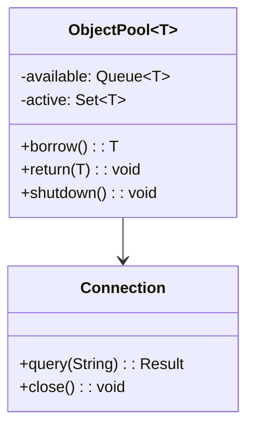
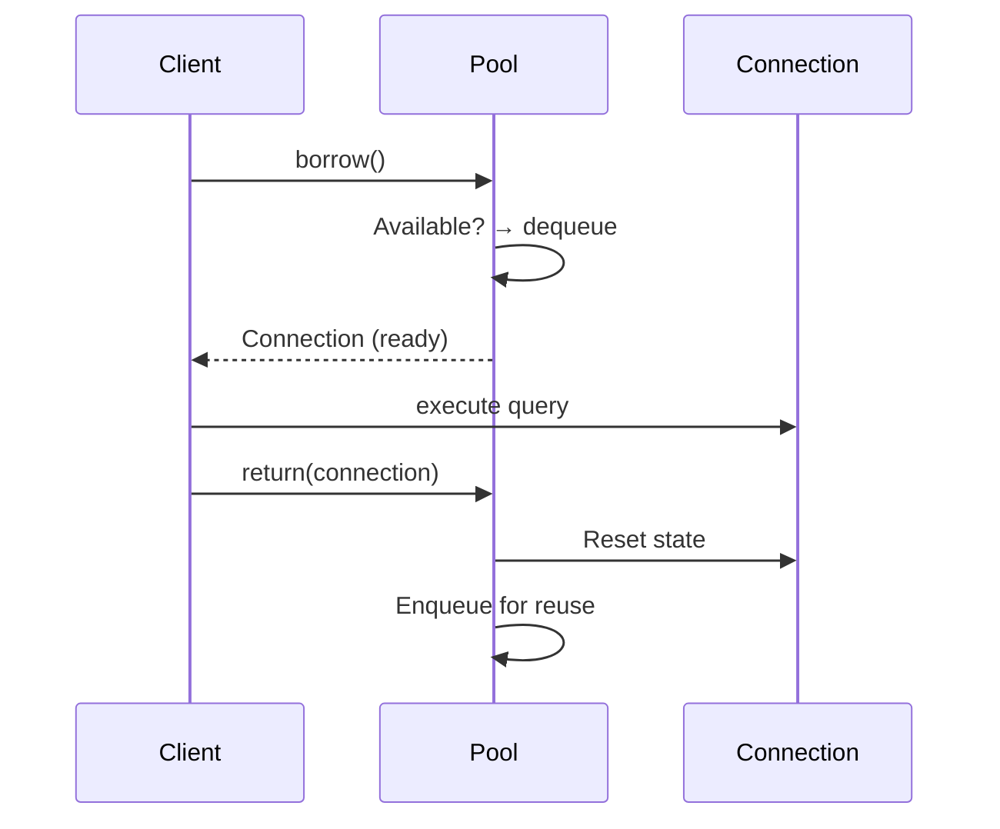
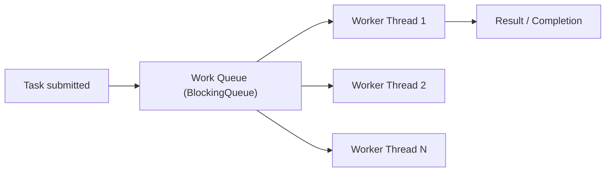
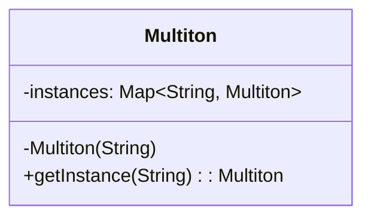
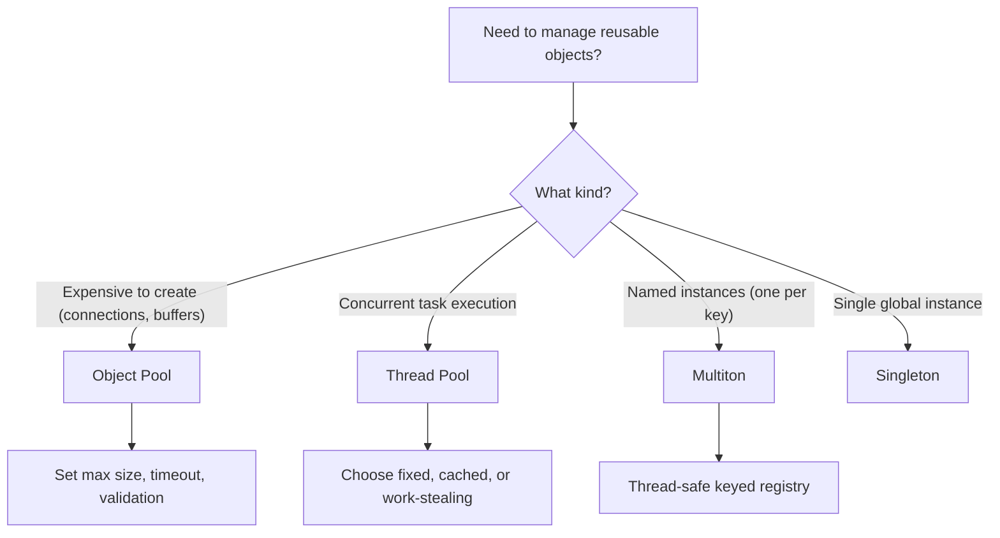

# Creational: Object Pool, Thread Pool, and Multiton

> [!summary] Goal
> Manage reusable objects efficiently with Object Pool (expensive objects), Thread Pool (concurrent work), and Multiton (named instances). Understand when pooling helps vs hurts performance.

## Table of Contents

1. [Object Pool](#object-pool)
2. [Thread Pool](#thread-pool)
3. [Multiton](#multiton)
4. [Comparison and Decision Guide](#comparison-and-decision-guide)
5. [Pitfalls](#pitfalls)

---

## Object Pool

### Problem

Creating objects is expensive (database connections, socket connections, threads). Creating and destroying them repeatedly impacts performance. You need to **reuse** objects rather than create new ones.

### Solution





```java
public interface Poolable {
    void reset();       // Called when returned to pool
    boolean isValid();  // Check if object is still usable
}

public class ObjectPool<T extends Poolable> {
    private final Queue<T> available = new LinkedList<>();
    private final Set<T> active = new HashSet<>();
    private final Supplier<T> factory;
    private final int maxSize;
    private final long maxWaitMs;

    public ObjectPool(Supplier<T> factory, int maxSize, long maxWaitMs) {
        this.factory = factory;
        this.maxSize = maxSize;
        this.maxWaitMs = maxWaitMs;
    }

    public synchronized T borrow() throws TimeoutException {
        // Reuse available object
        if (!available.isEmpty()) {
            T obj = available.poll();
            active.add(obj);
            return obj;
        }
        // Create new if under limit
        if (active.size() < maxSize) {
            T obj = factory.get();
            active.add(obj);
            return obj;
        }
        // Wait for an object to be returned
        long deadline = System.currentTimeMillis() + maxWaitMs;
        while (available.isEmpty()) {
            long wait = deadline - System.currentTimeMillis();
            if (wait <= 0) throw new TimeoutException("Pool exhausted");
            try { wait(wait); } catch (InterruptedException e) { Thread.currentThread().interrupt(); }
        }
        T obj = available.poll();
        active.add(obj);
        return obj;
    }

    public synchronized void returnObject(T obj) {
        if (!active.remove(obj)) throw new IllegalArgumentException("Not from this pool");
        if (obj.isValid()) {
            obj.reset();
            available.offer(obj);
        }
        notify();  // Wake up waiting borrower
    }

    public synchronized void shutdown() {
        for (T obj : available) { /* close obj */ }
        for (T obj : active) { /* close obj */ }
        available.clear();
        active.clear();
    }
}

// Usage
ObjectPool<Connection> pool = new ObjectPool<>(
    () -> DriverManager.getConnection("jdbc:..."),  // Factory
    10,     // Max 10 connections
    5000    // Wait 5 seconds
);

Connection conn = pool.borrow();
try {
    conn.query("SELECT ...");
} finally {
    pool.returnObject(conn);  // Always return!
}
```

### Where it's used

| Example | Description |
|---------|-------------|
| **JDBC connection pools** | HikariCP, Tomcat CP, DBCP2 |
| **Thread pools** | `ThreadPoolExecutor`, ForkJoinPool |
| **Object pools** | Apache Commons Pool2 |
| **Byte buffer pools** | Netty `ByteBuf` pool |

---

## Thread Pool

The Thread Pool pattern is a specialization of Object Pool for threads, but conceptually different — tasks are executed, not borrowed/returned:



```java
import java.util.concurrent.*;

public class ThreadPool {
    private final BlockingQueue<Runnable> taskQueue = new LinkedBlockingQueue<>();
    private final Thread[] workers;
    private volatile boolean running = true;

    public ThreadPool(int numThreads) {
        workers = new Thread[numThreads];
        for (int i = 0; i < numThreads; i++) {
            workers[i] = new Thread(() -> {
                while (running) {
                    try {
                        Runnable task = taskQueue.poll(1, TimeUnit.SECONDS);
                        if (task != null) task.run();
                    } catch (InterruptedException e) { Thread.currentThread().interrupt(); }
                }
            });
            workers[i].start();
        }
    }

    public void execute(Runnable task) {
        if (!running) throw new RejectedExecutionException("Pool shut down");
        taskQueue.offer(task);
    }

    public void shutdown() {
        running = false;
        for (Thread w : workers) w.interrupt();
    }
}

// Or use the standard library:
ExecutorService pool = Executors.newFixedThreadPool(10);
pool.submit(() -> System.out.println("Task executed"));
pool.shutdown();
```

| Pool type | Use case | Queue |
|-----------|----------|-------|
| **Fixed thread pool** | Known number of long-lived tasks | Unbounded LinkedBlockingQueue |
| **Cached thread pool** | Many short-lived tasks | SynchronousQueue (handoff) |
| **Work-stealing pool** | Recursive/divide-and-conquer | Work-stealing deque (per-thread) |

---

## Multiton

> [!info] Multiton
> The Multiton is a Singleton that manages a **map of named instances** — one instance per key. Instead of one global instance, you get one per unique key (like `Logger.getLogger("name")`). This is essentially a registry pattern.



```java
public class Logger {
    private static final Map<String, Logger> instances = new ConcurrentHashMap<>();
    private final String name;

    private Logger(String name) {
        this.name = name;
    }

    public static Logger getInstance(String name) {
        return instances.computeIfAbsent(name, Logger::new);
    }

    public void log(String message) {
        System.out.println("[" + name + "] " + message);
    }
}

// Usage
Logger dbLogger = Logger.getInstance("database");
Logger webLogger = Logger.getInstance("web");

dbLogger.log("connected");  // [database] connected
webLogger.log("request");   // [web] request
```

### Multiton vs Singleton

| Aspect | Singleton | Multiton |
|--------|:---------:|:--------:|
| **Instances** | Exactly one | One per unique key |
| **Lookup** | Global access point | Key-based access |
| **Thread safety** | Per-instance | Per-key (ConcurrentHashMap) |
| **Use case** | Logging, config, cache | Named loggers, per-database pools |

---

## Comparison and Decision Guide



---

## Pitfalls

### Object pool starvation

If all objects are borrowed and the queue blocks, the system hangs. Always set a timeout and handle `TimeoutException`. Consider growing the pool dynamically up to a maximum.

### Resource leaks from unreturned objects

If a client borrows an object but doesn't return it (exception, forgot to close), it leaks. Use `try-finally` or try-with-resources wrappers. Monitor active vs available counts.

### Thread pool task dependency deadlock

If a task in the pool submits another task to the same pool and waits for its result, and the pool is full, the first task blocks forever (no thread available to run the subtask). Use separate pools for dependent tasks.

### Over-pooling

For objects that are cheap to create (lightweight POJOs, small data structures), pooling adds complexity without benefit. The cost of managing the pool exceeds the cost of creating objects. Profile before adding a pool.

---

> [!question]- Interview Questions
>
> **Q: What is the Object Pool pattern and when should you use it?**
> A: Object Pool reuses expensive-to-create objects (database connections, sockets, threads) rather than creating and destroying them each time. Use it when: (a) objects are expensive to create or destroy, (b) the number of objects is bounded, (c) objects can be reused (reset to a clean state). Don't use it for cheap objects — the pool overhead outweighs the benefit.
>
> **Q: What's the difference between a fixed thread pool and a cached thread pool?**
> A: A fixed thread pool has a constant number of threads — tasks that exceed this number wait in a queue. A cached thread pool creates new threads as needed and reuses idle ones (with a 60-second keep-alive). Fixed pools protect against thread explosion. Cached pools handle bursts efficiently but can create too many threads under sustained load.
>
> **Q: What is the Multiton pattern?**
> A: Multiton is a Singleton keyed by a name — one instance per unique key. `Logger.getLogger("name")` returns the same Logger for each unique name. It's implemented as a concurrent hash map with `computeIfAbsent`. Use Multiton for per-category loggers, per-database connection factories, or per-tenant service instances.

---

## Cross-Links

- [[DesignPatterns/02_Core/C01_Singleton_and_Prototype]] for Singleton comparison
- [[DesignPatterns/02_Core/C06_Facade_Proxy_Flyweight]] for Flyweight (similar object sharing, different intent)
- [[DesignPatterns/03_Advanced/A01_Functional_Design_Patterns]] for RAII and resource management
- [[DesignPatterns/03_Advanced/A02_Enterprise_Patterns]] for connection pooling (DAO)
