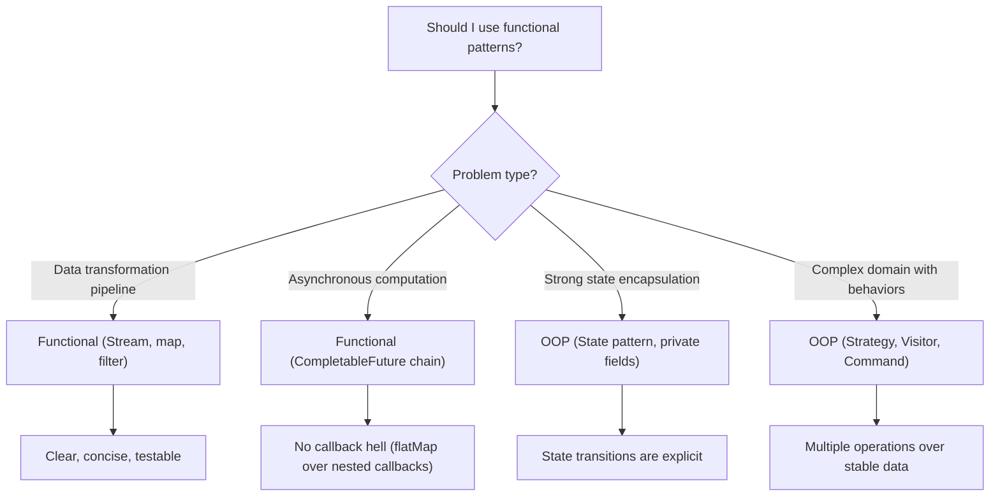

# Functional Design Patterns

> [!summary] Goal
> Apply functional programming concepts as design patterns: immutability, functors, monads, pipelines, currying, and the Null Object pattern. Understand when functional patterns beat OOP patterns.

## Table of Contents

1. [Functor](#functor)
2. [Monad](#monad)
3. [Pipeline and Composition](#pipeline-and-composition)
4. [Currying and Partial Application](#currying-and-partial-application)
5. [Immutability](#immutability)
6. [Null Object](#null-object)
7. [When Functional Beats OOP](#when-functional-beats-oop)
8. [Pitfalls](#pitfalls)

---

## Functor

> [!info] Functor
> A container or context that implements a \`map()\` operation, which applies a function to the wrapped value(s) and returns a new container of the same type. Functors preserve the structure of the container — \`Optional.map()\` stays Optional, \`Stream.map()\` stays Stream. Functors must satisfy two laws: identity (\`map(x -> x) == identity\`) and composition (\`map(f).map(g) == map(f.andThen(g))\`).

\`\`\`mermaid
classDiagram
    class Functor~T~ {
        <<interface>>
        +map~U~(fn: T->U): Functor~U~
    }
    class Optional~T~ {
        -value: T
        +map~U~(fn): Optional~U~
        +orElse(default): T
    }
    class List~T~ {
        +map~U~(fn): List~U~
    }
    class CompletableFuture~T~ {
        +thenApply~U~(fn): CompletableFuture~U~
    }
    Functor <|.. Optional
    Functor <|.. List
    Functor <|.. CompletableFuture
```

```java
// Functor: map applies a function inside a context

// Optional as Functor
Optional<String> name = Optional.of("Alice");
Optional<Integer> length = name.map(String::length);   // Optional[5]

// Stream as Functor
List<String> names = List.of("Alice", "Bob", "Charlie");
List<Integer> lengths = names.stream()
    .map(String::length)
    .toList();                                          // [5, 3, 7]

// CompletableFuture as Functor
CompletableFuture<String> future = CompletableFuture.supplyAsync(() -> "Hello");
CompletableFuture<Integer> lengthFuture = future.thenApply(String::length);

// Functor laws:
// 1. Identity:  functor.map(x -> x) == functor
// 2. Composition: functor.map(f).map(g) == functor.map(x -> g(f(x)))

Optional.of(5).map(x -> x).equals(Optional.of(5));   // true (identity law)
Optional.of(5).map(x -> x + 1).map(x -> x * 2)
    .equals(Optional.of(5).map(x -> (x + 1) * 2));    // true (composition law)
```

---

## Monad

> [!info] Monad
> A type of container that implements \`flatMap()\` (also called \`bind()\` or \`thenCompose()\`) — a function that applies a transformation that itself returns a monad, then flattens the nested result. Every Monad is also a Functor. Monads enable chaining of computations that have context (optionality, asynchrony, multiple values, errors) without nested conditionals or callbacks.

\`\`\`mermaid
sequenceDiagram
    participant C as Client
    participant M as Monad (value)
    participant F as flatMap function
    participant M2 as Monad (new value)
    
    C->>M: flatMap(fn)
    M->>F: apply fn to value
    F-->>M2: return new Monad (flattened)
    M2-->>C: result
```

```java
// Monad: flatMap chains operations that return monads

// Optional as Monad
public class UserService {
    public Optional<String> findEmail(Long userId) {
        return Optional.of("alice@example.com");
    }

    public Optional<String> findPhone(Long userId) {
        return Optional.empty();
    }
}

// Without flatMap — nested Optional checks
Optional<String> result = userService.findEmail(42L)
    .flatMap(email -> userService.findPhone(42L)      // Continues if email found
        .map(phone -> "Email: " + email + ", Phone: " + phone));

// CompletableFuture as Monad
CompletableFuture<User> userFuture = fetchUser(42L);
CompletableFuture<Order> orderFuture = userFuture.thenCompose(user ->
    fetchOrders(user.id()));                            // flatMap equivalent

// Monad laws:
// 1. Left identity:  Monad.of(x).flatMap(f) == f(x)
// 2. Right identity: monad.flatMap(x -> Monad.of(x)) == monad
// 3. Associativity:  monad.flatMap(f).flatMap(g) == monad.flatMap(x -> f(x).flatMap(g))
```

### Common monads in Java

| Monad | Java type | flatMap equivalent | Purpose |
|-------|-----------|-------------------|---------|
| **Maybe** | `Optional<T>` | `flatMap()` | A value that may be absent |
| **Either** | No built-in (use Vavr's `Either`) | — | A value or an error |
| **IO** | `CompletableFuture<T>` | `thenCompose()` | Async computation |
| **Stream** | `Stream<T>` | `flatMap()` | Multiple values, nested lists |
| **Try** | No built-in (use Vavr) | — | Computation that may throw |

### OrElse and fallbacks

```java
// Functional error handling chains
String result = userService.findEmail(42L)
    .filter(email -> email.endsWith("@example.com"))
    .map(String::toUpperCase)
    .orElse("DEFAULT@EXAMPLE.COM");

// Either pattern (using Java 8+ Optional + exceptions)
public Optional<String> fetchConfig(String key) {
    return Optional.ofNullable(System.getProperty(key))
        .or(() -> Optional.ofNullable(System.getenv(key)))
        .or(() -> readFromFile(key));
}
```

---

## Pipeline and Composition

> [!info] Pipeline
> A functional pattern that chains a sequence of operations together, where the output of each operation becomes the input of the next. Pipelines promote composability and separation of concerns — each stage is an independent, testable function. In Java, pipelines are implemented with \`Function.andThen()\`, \`Stream\` operations, or \`CompletableFuture.thenApply()\`.

\`\`\`mermaid
flowchart LR
    A["Input"] --> F1["transform"]
    F1 --> F2["filter"]
    F2 --> F3["aggregate"]
    F3 --> F4["format"]
    F4 --> B["Output"]
```

```java
// Function composition
import java.util.function.Function;

Function<String, String> removeSpaces = s -> s.replace(" ", "");
Function<String, String> toUpperCase = String::toUpperCase;
Function<String, String> truncate = s -> s.length() > 10 ? s.substring(0, 10) : s;

// Compose: g(f(x)) — apply f, then g
Function<String, String> pipeline = removeSpaces
    .andThen(toUpperCase)
    .andThen(truncate);

String result = pipeline.apply("hello world example");   // "HELLOWORLD"

// Stream pipeline
List<Order> orders = getOrders();
BigDecimal total = orders.stream()
    .filter(Order::isPaid)
    .map(Order::total)
    .reduce(BigDecimal.ZERO, BigDecimal::add);

// CompletableFuture pipeline
CompletableFuture.supplyAsync(() -> fetchUser(42))
    .thenApplyAsync(user -> enrichWithOrders(user))
    .thenAccept(this::sendResponse)
    .exceptionally(err -> {
        log.error("Pipeline failed", err);
        return null;
    });
```

---

## Currying and Partial Application

> [!info] Currying
> Transforming a function that takes multiple arguments into a chain of functions that each take a single argument. For example, \`f(a, b, c)\` becomes \`a -> b -> c -> body\`. Currying enables partial application — fixing some arguments to create more specialized functions. In Java, currying is expressed as nested lambdas and is most practical when used with method references and functional interfaces.

\`\`\`java
// Currying — transforming a multi-parameter function into a chain of single-parameter functions

// Without currying
public String format(String prefix, String value, String suffix) {
    return prefix + value + suffix;
}
format("<<", "Hello", ">>");    // "<<Hello>>"

// Curried version
public Function<String, Function<String, Function<String, String>>> curriedFormat =
    prefix -> value -> suffix -> prefix + value + suffix;

curriedFormat.apply("<<").apply("Hello").apply(">>");   // "<<Hello>>"

// Partial application — fix some parameters
Function<String, Function<String, String>> wrapWithParens =
    curriedFormat.apply("(");            // Fix prefix = "("

String result1 = wrapWithParens.apply("Hello").apply(")");   // "(Hello)"
String result2 = wrapWithParens.apply("World").apply(")");   // "(World)"

// Practical use: logger with fixed prefix
Function<String, Function<String, String>> logFormatter =
    level -> message -> "[" + level + "] " + message;

Function<String, String> infoLogger = logFormatter.apply("INFO");
Function<String, String> errorLogger = logFormatter.apply("ERROR");

infoLogger.apply("User logged in");    // "[INFO] User logged in"
errorLogger.apply("DB connection failed");  // "[ERROR] DB connection failed"
```

---

## Immutability

Immutability means an object's state cannot change after construction. This is a foundational functional pattern.

```java
// Immutable object
public final class User {
    private final String name;
    private final List<String> roles;
    private final LocalDateTime createdAt;

    public User(String name, List<String> roles, LocalDateTime createdAt) {
        this.name = name;
        this.roles = List.copyOf(roles);           // Defensive copy
        this.createdAt = createdAt;
    }

    public String name() { return name; }
    public List<String> roles() { return roles; }   // Already unmodifiable
    public LocalDateTime createdAt() { return createdAt; }

    // "Modification" returns a new object
    public User withRole(String role) {
        List<String> newRoles = new ArrayList<>(this.roles);
        newRoles.add(role);
        return new User(this.name, newRoles, this.createdAt);
    }
}
```

### Benefits

| Benefit | Explanation |
|---------|-------------|
| **Thread safety** | No synchronization needed — shared objects can't change |
| **Caching** | Immutable objects can be freely cached (hashCode is stable) |
| **Reasoning** | An object's state is fully known at construction time |
| **No defensive copies** | Can safely expose internals without copying |

---

## Null Object

The Null Object pattern replaces \`null\` checks with a no-op implementation.

> [!info] Null Object
> A behavioral pattern that replaces null references with a special object that implements the expected interface using no-op methods. Instead of checking \`if (logger != null)\` at every use site, a \`NullLogger\` that silently does nothing is injected. This eliminates conditional checks, reduces code complexity, and guarantees the client always has a valid collaborator.

\`\`\`java
// Instead of null checks everywhere:
public interface Logger {
    void info(String message);
    void error(String message);
}

// Real implementation
public class FileLogger implements Logger {
    @Override public void info(String msg) { writeToFile("INFO: " + msg); }
    @Override public void error(String msg) { writeToFile("ERROR: " + msg); }
    private void writeToFile(String msg) { /* ... */ }
}

// Null Object — does nothing, but avoids null checks
public class NullLogger implements Logger {
    @Override public void info(String message) { /* no-op */ }
    @Override public void error(String message) { /* no-op */ }
}

// Client — no null checks needed
public class Service {
    private final Logger logger;

    public Service(Logger logger) {
        this.logger = logger != null ? logger : new NullLogger();
        // Or: this.logger = Objects.requireNonNullElse(logger, new NullLogger());
    }

    public void doWork() {
        logger.info("Starting work");        // Safe — no null check
        // ...
        logger.error("Something failed");    // Safe
    }
}

// Null vs Optional
public Optional<Logger> findLogger(String name) {     // May not find a logger
    // ...
}

// Client with Optional — still needs to handle absence
Logger logger = findLogger("audit").orElse(new NullLogger());
```

---

## RAII / Scope Guard

> [!info] RAII (Resource Acquisition Is Initialization)
> RAII ties resource lifetime to object lifetime: acquire in constructor, release in destructor. In languages without destructors (Java, Python), use the **Scope Guard** / **Execute Around** idiom — a wrapper that acquires a resource on creation and releases it on close, typically via try-with-resources.

```java
// Java: Scope Guard using AutoCloseable + try-with-resources
public class TransactionGuard implements AutoCloseable {
    private final Database db;
    private final Transaction tx;
    
    public TransactionGuard(Database db) {
        this.db = db;
        this.tx = db.beginTransaction();    // Acquire
        System.out.println("Transaction started");
    }
    
    public void commit() { tx.commit(); }
    
    @Override
    public void close() {
        if (!tx.isCommitted()) {
            tx.rollback();                   // Release on abnormal exit
            System.out.println("Transaction rolled back");
        } else {
            System.out.println("Transaction closed cleanly");
        }
    }
}

// Usage — guaranteed cleanup
try (TransactionGuard guard = new TransactionGuard(db)) {
    db.insert("users", data);
    db.update("accounts", amount);
    guard.commit();                         // Explicit commit
}   // close() runs automatically — rolls back if commit wasn't called
```

| Language | RAII Mechanism | Example |
|----------|---------------|---------|
| **C++** | Destructors | `std::lock_guard`, `std::unique_ptr` |
| **Java** | `AutoCloseable` + `try-with-resources` | `Stream`, `Connection`, `Matcher` |
| **Python** | Context managers | `with open(file) as f:` |

---

## Type Erasure

> [!info] Type Erasure
> Type erasure hides the concrete type behind a generic interface. In Java, **generics** use type erasure — generic type information is removed at compile time (`List<Integer>` becomes `List` at runtime). In C++, `std::function` and `std::any` use type erasure via a small vtable. The pattern: store a pointer to a type-erased "model" that wraps the concrete type, and dispatch through a virtual "concept" interface.

```java
// Java generics type erasure:
// At compile time:   List<String>
// At runtime:        List (erased)
// Bridge methods are generated for polymorphic return types

// Manual type erasure pattern (like std::function in C++):
public interface Function<T, R> {
    R apply(T arg);
}

// The caller doesn't know the concrete implementation
Function<String, Integer> lengthFn = String::length;
int len = lengthFn.apply("hello");  // Interface only, no concrete type visible
```

| Aspect | Java Generics | C++ Templates | C++ Type Erasure |
|--------|:-------------:|:--------------:|:----------------:|
| **Code generation** | One copy (erased) | Per type (bloat) | One copy + vtable |
| **Runtime overhead** | None | None | Virtual dispatch |
| **Type safety** | Compile-time only | Compile-time + link | Runtime + compile |
| **Reified at runtime** | ❌ | ✅ | ❌ (but safe) |

---

## PIMPL (Pointer to Implementation)

> [!info] PIMPL (Pointer to Implementation)
> PIMPL hides implementation details behind a pointer, providing a **compilation firewall** — changes to the implementation don't force recompilation of clients. The public class exposes only an opaque pointer. This is essential for library ABI stability in C++, and maps to Java's interface/implementation separation.

```java
// Java uses interfaces and factory methods as a PIMPL-like pattern:
// Header (public API):
public interface UserService {
    User findById(long id);
    void save(User user);
}

// Implementation (hidden from clients):
class UserServiceImpl implements UserService {
    @Override public User findById(long id) { /* JDBC/JPA code */ }
    @Override public void save(User user) { /* JDBC/JPA code */ }
}

// Factory — clients get only the interface
public class Services {
    public static UserService createUserService() {
        return new UserServiceImpl();  // Concrete type hidden
    }
}
```

---



| Situation | Functional approach | OOP approach |
|-----------|-------------------|--------------|
| Data transformation | `Stream.map().filter().reduce()` | Loop with if/else |
| Optional value | `Optional.flatMap().orElse()` | `if (x != null) { x.method() }` |
| Async computation | `future.thenCompose().thenAccept()` | Nested callbacks |
| Logging | `Function.andThen(pipeline)` | Composition over inheritance |
| No-op fallback | Null Object pattern | `if (x != null) check` |

---

## Pitfalls

### Monad comprehension in Java

Java doesn't have `do` notation or `for` comprehensions. Deep `flatMap` chains are hard to read:

```java
// ❌ Hard to read
Optional.of(x)
    .flatMap(this::doSomething)
    .flatMap(this::doSomethingElse)
    .flatMap(this::andAnother)
    .orElse(defaultValue);

// ✅ Extract into named steps
Optional<Result> step1 = doSomething(x);
if (step1.isEmpty()) return defaultValue;
Optional<Result> step2 = doSomethingElse(step1.get());
// ...
```

### Performance of immutability

Creating a new object for every "modification" (e.g., `new StringBuilder()` vs `String.concat()`) can be expensive in tight loops. Use mutable structures in hot paths, convert to immutable at the boundary.

### Null Object losing error information

Null Object silently swallows operations. If a NullLogger is used because of a misconfigured logging system, important error messages are lost. Use Null Object only for expected absences, not configuration failures.

### Over-currying in Java

Java's syntax for currying is verbose (`a -> b -> c -> ...`). For Java code, prefer method overloading, varargs, or builder patterns. Currying is more practical in languages with native function types (Scala, Haskell, TypeScript).

---

> [!question]- Interview Questions
>
> **Q: What is the difference between a Functor and a Monad?**
> A: A Functor implements `map()` — applying a function to the contained value(s) within the same container. A Monad implements `flatMap()` — applying a function that returns a container, then flattening the result. Every Monad is a Functor, but not every Functor is a Monad.
>
> **Q: What are the three Monad laws?**
> A: (1) Left identity: `Monad.of(x).flatMap(f) == f(x)`. (2) Right identity: `monad.flatMap(x -> Monad.of(x)) == monad`. (3) Associativity: `monad.flatMap(f).flatMap(g) == monad.flatMap(x -> f(x).flatMap(g))`. These ensure that monadic composition is predictable and refactorable.
>
> **Q: What is the Null Object pattern and when would you use it?**
> A: Null Object replaces `null` with a no-op implementation of the interface. Instead of checking `if (logger != null)` everywhere, use a `NullLogger` that does nothing. Best for: optional dependencies, listeners, callbacks. Not for: cases where null means "critical configuration missing" — you want an error then.
>
> **Q: How does immutability improve thread safety?**
> A: If an object cannot change after construction, all threads that access it see the same state — no synchronization needed. There are no race conditions, no lost updates, no visibility issues. Immutable objects can be freely shared across threads without any locking.
>
> **Q: What is the pipeline pattern?**
> A: Pipeline chains multiple operations together, passing the output of each operation as the input to the next. In Java, this is implemented with `Function.andThen()`, `Stream` operations, or `CompletableFuture.thenApply()`. Each stage is independent, testable, and composable.

---

## Cross-Links

- [[DesignPatterns/02_Core/C07_Strategy_and_Template_Method]] for functional strategies with lambdas
- [[DesignPatterns/02_Core/C01_Singleton_and_Prototype]] for immutable singletons
- [[Java/01_Foundations/04_Streams_Lambdas_and_Functional_Java]] for Java functional APIs
- [[Java/03_Advanced/01_CompletableFuture_and_Structured_Concurrency]] for async pipelines
- [[Rust/02_Core/06_Closures_and_Fn_Traits]] for functional patterns in Rust
