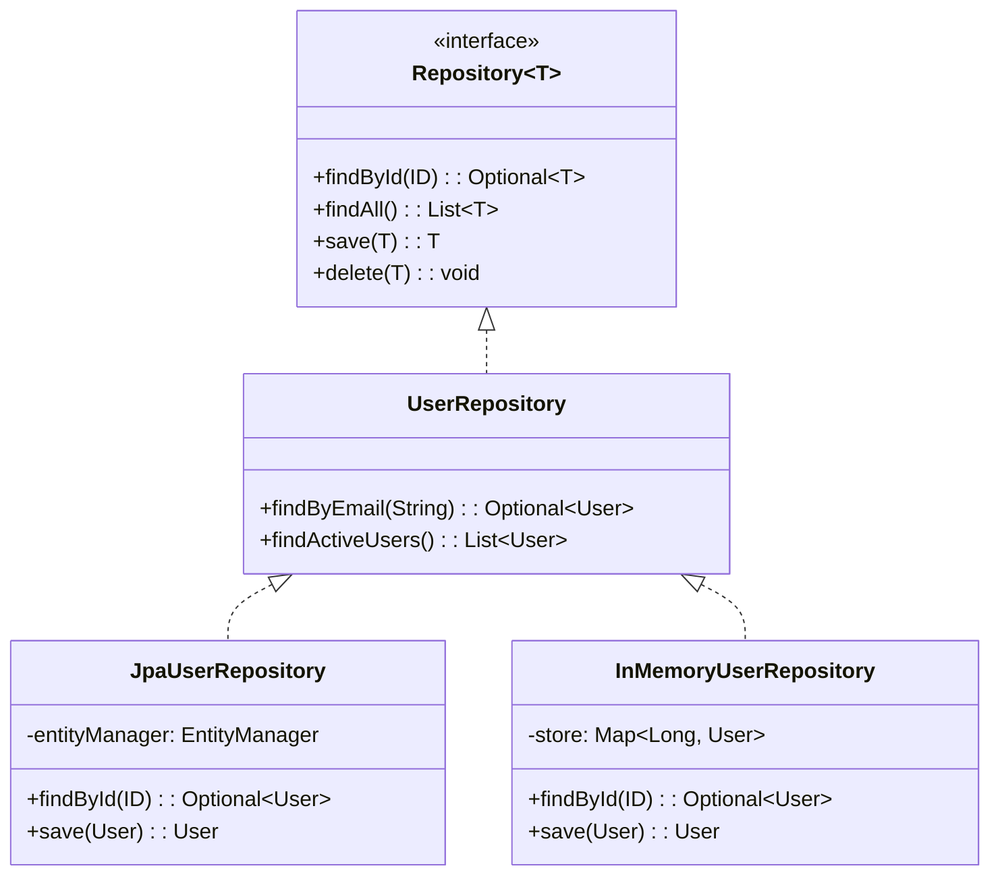
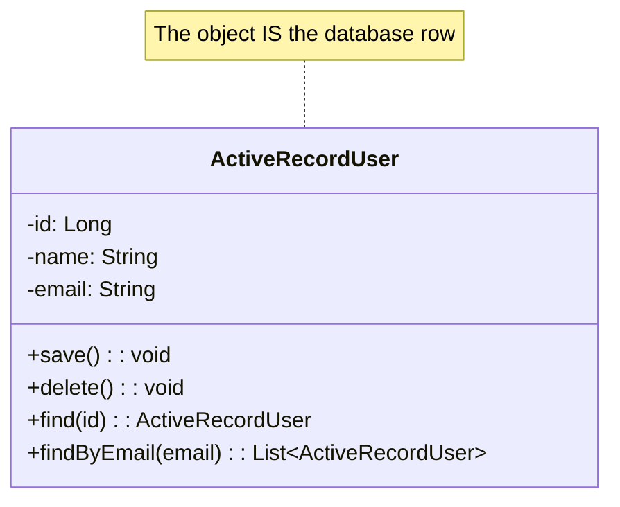
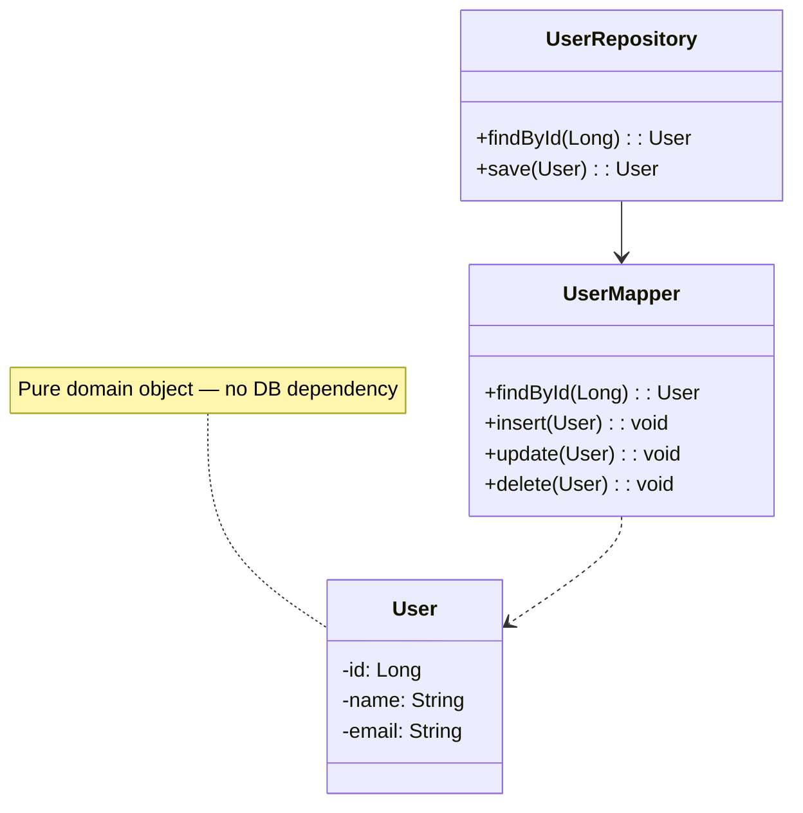
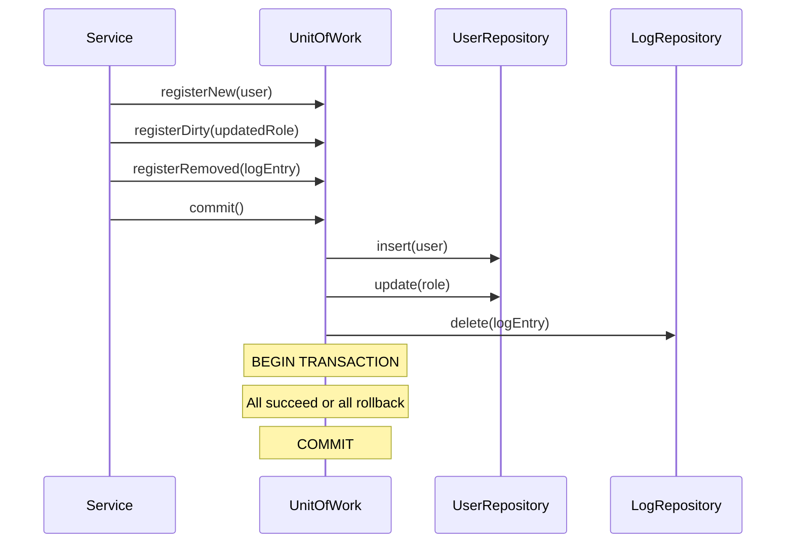
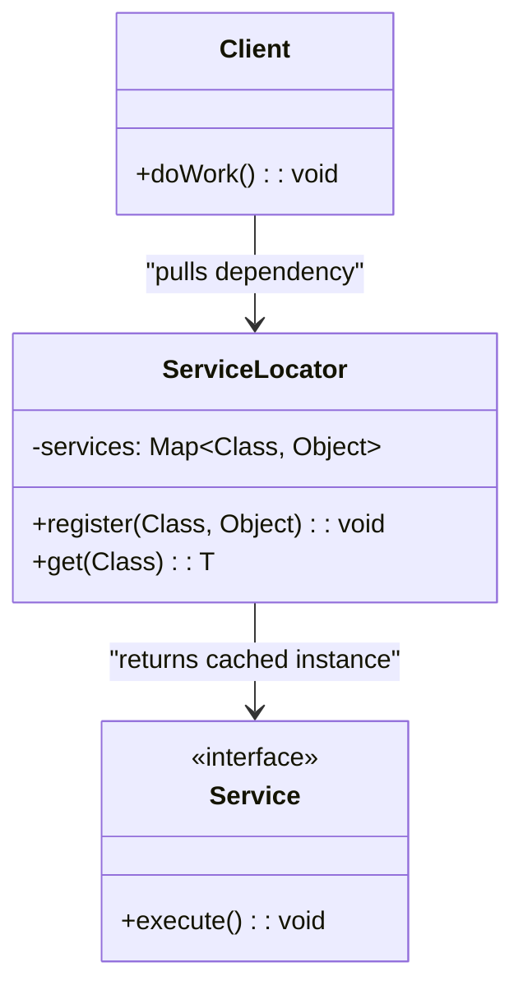
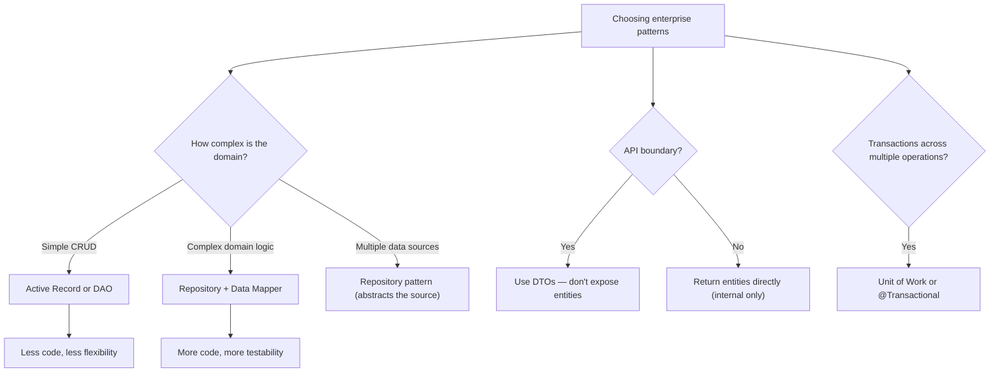

# Enterprise Patterns

> [!summary] Goal
> Apply enterprise-level patterns for database access, data transfer, and service layering: Repository, Data Mapper, Active Record, DAO, DTO, and Unit of Work.

## Table of Contents

1. [Repository](#repository)
2. [Data Mapper vs Active Record](#data-mapper-vs-active-record)
3. [Unit of Work](#unit-of-work)
4. [DAO and DTO](#dao-and-dto)
5. [Service Layer](#service-layer)
6. [Comparison and Decision Guide](#comparison-and-decision-guide)
7. [Pitfalls](#pitfalls)

---

## Repository

> [!info] Repository
> A domain-driven design pattern that mediates between the domain and data mapping layers, acting like an in-memory collection of domain objects. The Repository provides a collection-like interface (add, remove, find) for accessing domain objects, abstracting away the underlying data store (database, API, file system). Client code depends on the Repository interface, not on persistence details.

### Problem

Business logic should not depend on the details of data access (SQL, JPA, REST calls). You need a collection-like abstraction for domain objects.

### Solution



```java
// Repository interface — domain-specific
public interface UserRepository {
    Optional<User> findById(Long id);
    Optional<User> findByEmail(String email);
    List<User> findAll();
    User save(User user);
    void delete(User user);
}

// JPA implementation
public class JpaUserRepository implements UserRepository {
    @PersistenceContext
    private EntityManager em;

    @Override
    public Optional<User> findById(Long id) {
        return Optional.ofNullable(em.find(User.class, id));
    }

    @Override
    public Optional<User> findByEmail(String email) {
        return em.createQuery("SELECT u FROM User u WHERE u.email = :email", User.class)
            .setParameter("email", email)
            .getResultStream()
            .findFirst();
    }

    @Override
    public List<User> findAll() {
        return em.createQuery("SELECT u FROM User u", User.class).getResultList();
    }

    @Override
    public User save(User user) {
        if (user.getId() == null) {
            em.persist(user);
            return user;
        } else {
            return em.merge(user);
        }
    }

    @Override
    public void delete(User user) {
        em.remove(em.contains(user) ? user : em.merge(user));
    }
}

// In-memory implementation — useful for tests
public class InMemoryUserRepository implements UserRepository {
    private final Map<Long, User> store = new HashMap<>();
    private long nextId = 1;

    @Override
    public Optional<User> findById(Long id) {
        return Optional.ofNullable(store.get(id));
    }

    @Override
    public Optional<User> findByEmail(String email) {
        return store.values().stream()
            .filter(u -> u.email().equals(email))
            .findFirst();
    }

    @Override
    public List<User> findAll() { return List.copyOf(store.values()); }

    @Override
    public User save(User user) {
        Long id = user.getId() != null ? user.getId() : nextId++;
        User saved = new User(id, user.name(), user.email());
        store.put(id, saved);
        return saved;
    }

    @Override
    public void delete(User user) { store.remove(user.id()); }
}
```

### Where it's used

| Example | Description |
|---------|-------------|
| Spring Data JPA `JpaRepository<T, ID>` | Auto-implemented repository |
| `UserRepository extends JpaRepository` | CRUD + custom queries |
| `InMemoryUserRepository` | Unit tests without database |

---

## Data Mapper vs Active Record

> [!info] Data Mapper and Active Record
> **Active Record** is a pattern where domain objects handle their own persistence — each object has \`save()\`, \`delete()\`, and \`find()\` methods built in. The object IS the database row. **Data Mapper** is a pattern where a separate class (the Mapper) moves data between domain objects and the database, keeping the domain objects pure (no persistence logic). Active Record is simpler for CRUD apps; Data Mapper provides better separation of concerns for complex domains.

### Active Record

The object **itself** handles database operations. Each object has \`save()\`, \`delete()\`, \`find()\` methods.



```java
// Active Record — object has DB operations built in
public class User {
    private Long id;
    private String name;
    private String email;

    public void save() {
        if (id == null) {
            // INSERT INTO users ...
        } else {
            // UPDATE users SET ...
        }
    }

    public static User findById(Long id) {
        // SELECT * FROM users WHERE id = ?
    }

    public void delete() {
        // DELETE FROM users WHERE id = ?
    }
}
```

### Data Mapper

A separate class (the **Mapper**) moves data between objects and the database. The domain objects are **pure** — they have no database logic.



```java
// Data Mapper — a separate class handles persistence
public class UserMapper {
    private final JdbcTemplate jdbc;

    public UserMapper(DataSource dataSource) {
        this.jdbc = new JdbcTemplate(dataSource);
    }

    public User findById(Long id) {
        return jdbc.queryForObject(
            "SELECT id, name, email FROM users WHERE id = ?",
            (rs, rowNum) -> new User(
                rs.getLong("id"),
                rs.getString("name"),
                rs.getString("email")
            ),
            id
        );
    }

    public void insert(User user) {
        jdbc.update("INSERT INTO users (name, email) VALUES (?, ?)",
            user.getName(), user.getEmail());
    }

    public void update(User user) {
        jdbc.update("UPDATE users SET name = ?, email = ? WHERE id = ?",
            user.getName(), user.getEmail(), user.getId());
    }

    public void delete(User user) {
        jdbc.update("DELETE FROM users WHERE id = ?", user.getId());
    }
}
```

### Comparison

| Aspect | Active Record | Data Mapper |
|--------|:-------------:|:-----------:|
| **Domain object** | Has DB methods | Pure — no DB logic |
| **Testability** | Hard (needs DB) | Easy (mock mapper) |
| **Complexity** | Low (one class) | Medium (mappers + domain) |
| **When to use** | Simple CRUD, Rails/Django | Complex domain logic |
| **ORM example** | None in Java (Ruby on Rails) | Hibernate, JPA |
| **Database coupling** | Tight | Loose |

---

## Unit of Work

> [!info] Unit of Work
> A pattern that maintains a list of objects affected by a business transaction and coordinates the writing out of changes and the resolution of concurrency problems. It tracks which objects are new, dirty (modified), or removed, and flushes all changes to the database atomically in a single transaction. In JPA, the \`EntityManager\` is a built-in Unit of Work implementation.

### Problem

Multiple database operations (insert user, assign role, send email) must succeed or fail together. Also, tracking changes across many objects to batch operations efficiently.

### Solution



```java
// Unit of Work — tracks changes and commits them atomically
public class UnitOfWork {
    private final Set<Object> newObjects = new HashSet<>();
    private final Set<Object> dirtyObjects = new HashSet<>();
    private final Set<Object> removedObjects = new HashSet<>();

    @PersistenceContext
    private EntityManager entityManager;

    public void registerNew(Object entity) {
        if (!dirtyObjects.contains(entity) && !removedObjects.contains(entity)) {
            newObjects.add(entity);
        }
    }

    public void registerDirty(Object entity) {
        if (!removedObjects.contains(entity)) {
            dirtyObjects.add(entity);
        }
    }

    public void registerRemoved(Object entity) {
        newObjects.remove(entity);
        dirtyObjects.remove(entity);
        removedObjects.add(entity);
    }

    public void commit() {
        // Hibernate JPA — EntityManager manages the Unit of Work
        for (Object entity : newObjects) entityManager.persist(entity);
        for (Object entity : dirtyObjects) entityManager.merge(entity);
        for (Object entity : removedObjects) entityManager.remove(
            entityManager.contains(entity) ? entity : entityManager.merge(entity));
        entityManager.flush();
        entityManager.getTransaction().commit();
        clear();
    }

    private void clear() {
        newObjects.clear();
        dirtyObjects.clear();
        removedObjects.clear();
    }
}
```

### Where it's used

| Example | Description |
|---------|-------------|
| Hibernate `Session` | Manages persistent objects and tracks changes |
| Spring `@Transactional` | Declarative transaction management |
| `EntityManager` (JPA) | JPA unit of work |

---

## DAO and DTO

### DAO (Data Access Object)

```java
// DAO — low-level data access, one per entity
public class UserDao {
    private final JdbcTemplate jdbc;

    public UserDao(DataSource dataSource) {
        this.jdbc = new JdbcTemplate(dataSource);
    }

    // CRUD operations — direct SQL or simple ORM
    public User findById(Long id) { /* ... */ }
    public List<User> findAll() { /* ... */ }
    public void insert(User user) { /* ... */ }
    public void update(User user) { /* ... */ }
    public void delete(Long id) { /* ... */ }
}

// DAO vs Repository:
// DAO: persistence-focused, database-oriented naming
// Repository: domain-focused, collection-oriented naming
```

> [!info] Data Transfer Object (DTO)
> A pattern that carries data between processes or layers, typically to reduce the number of remote calls and to decouple internal domain objects from external API contracts. A DTO is a simple data container with no business logic, designed for serialization. DTOs should be used at API boundaries to prevent exposing internal entities, lazy-loading proxies, and sensitive fields.

### DTO (Data Transfer Object)

\`\`\`java
// Entity — JPA-managed, lazy-loaded
@Entity
public class User {
    @Id private Long id;
    private String name;
    private String email;
    @OneToMany private List<Order> orders;    // Lazy-loaded — risky to expose
    private String passwordHash;                // Should never be exposed
}

// DTO — what the API returns (not the entity)
public class UserResponse {
    private final Long id;
    private final String name;
    private final String email;
    private final int orderCount;

    public UserResponse(User user) {
        this.id = user.getId();
        this.name = user.getName();
        this.email = user.getEmail();
        this.orderCount = user.getOrders() != null ? user.getOrders().size() : 0;
        // passwordHash is NOT mapped — never exposed
    }
}
```

| Aspect | DTO | Entity |
|--------|:---:|:------:|
| **Purpose** | Data transfer over network | Database persistence |
| **Serialization-friendly** | ✅ Designed for it | ❌ Lazy loading, proxies |
| **Business logic** | None — just data | Annotations, constraints |
| **When to map** | API boundary (Controller → DTO) | Internal service layer |

---

## Service Locator

> [!info] Service Locator
> Service Locator is a registry that provides a central point for obtaining services/dependencies. Unlike Dependency Injection (which pushes dependencies into clients), Service Locator lets clients **pull** dependencies from a registry. It's simpler to understand but makes dependencies harder to test (hidden dependencies).



```java
public class ServiceLocator {
    private static final Map<Class<?>, Object> services = new ConcurrentHashMap<>();
    private static final Map<Class<?>, Supplier<?>> factories = new HashMap<>();
    
    public static <T> void register(Class<T> type, T instance) {
        services.put(type, instance);
    }
    
    public static <T> void registerFactory(Class<T> type, Supplier<T> factory) {
        factories.put(type, factory);
    }
    
    @SuppressWarnings("unchecked")
    public static <T> T get(Class<T> type) {
        T instance = (T) services.get(type);
        if (instance == null) {
            Supplier<?> factory = factories.get(type);
            if (factory != null) {
                instance = (T) factory.get();
                services.put(type, instance);    // Cache lazy instance
            }
        }
        if (instance == null) {
            throw new IllegalStateException("No service registered for " + type.getName());
        }
        return instance;
    }
}

// Usage — client pulls dependency
public class OrderController {
    public void createOrder(OrderRequest request) {
        OrderService service = ServiceLocator.get(OrderService.class);
        service.create(request);
    }
}
```

### Service Locator vs Dependency Injection

| Aspect | Service Locator | Dependency Injection |
|--------|:---------------:|:-------------------:|
| **Who controls lookup** | Client (pull) | Container (push) |
| **Dependency visibility** | Hidden (in get() call) | Explicit (constructor params) |
| **Testability** | Harder (global state) | Easier (mock injection) |
| **Framework required** | No (manual registration) | Yes (DI container) |
| **When to use** | Legacy systems, simple apps | Modern enterprise (Spring, Guice) |

---

## Specification

> [!info] Specification
> A **Specification** encapsulates a business rule into a reusable, composable object. Specifications can be combined with AND, OR, NOT — enabling complex business logic without if/else chains. Common uses: validation, query filtering, business rule engines.

```java
// Specification interface
public interface Specification<T> {
    boolean isSatisfiedBy(T candidate);
    
    // Combinator methods (default implementations)
    default Specification<T> and(Specification<T> other) {
        return candidate -> this.isSatisfiedBy(candidate) && other.isSatisfiedBy(candidate);
    }
    
    default Specification<T> or(Specification<T> other) {
        return candidate -> this.isSatisfiedBy(candidate) || other.isSatisfiedBy(candidate);
    }
    
    default Specification<T> not() {
        return candidate -> !this.isSatisfiedBy(candidate);
    }
}

// Concrete specifications
public class AgeSpecification implements Specification<User> {
    private final int minAge;
    public AgeSpecification(int minAge) { this.minAge = minAge; }
    @Override public boolean isSatisfiedBy(User user) {
        return user.age() >= minAge;
    }
}

public class ActiveUserSpecification implements Specification<User> {
    @Override public boolean isSatisfiedBy(User user) {
        return user.isActive();
    }
}

// Usage — composed business rules
Specification<User> eligibleForDiscount = new AgeSpecification(18)
    .and(new ActiveUserSpecification())
    .and(user -> !user.isBlocked());      // Inline specification

User user = new User(25, true, false);
if (eligibleForDiscount.isSatisfiedBy(user)) {
    System.out.println("User is eligible for discount");
}
```

| Use case | How Specification helps |
|----------|------------------------|
| **Validation** | Reusable rules (`isValid()` → composite specs) |
| **Querying** | Pass spec to repository for database filtering |
| **Business rules** | Decouple rule logic from domain objects |
| **Configuration** | Dynamically compose rules without code changes |

---

> [!info] Service Layer
> A pattern that defines an application's boundary and its set of available operations from the perspective of the client. It encapsulates the business logic, coordinates responses, and manages transactions. The Service Layer is the entry point for use cases — it orchestrates domain objects, repositories, and external services to fulfill a business operation. Controllers should be thin; Services should contain the domain logic.

\`\`\`mermaid
classDiagram
    class Controller {
        +postUser(CreateUserRequest): UserResponse
    }
    class UserService {
        +registerUser(name, email): User
    }
    class UserRepository {
        +findByEmail(String): User
        +save(User): User
    }
    class EmailService {
        +sendWelcome(User): void
    }
    Controller --> UserService
    UserService --> UserRepository
    UserService --> EmailService
```

```java
// Service Layer — business logic, transaction boundary
@Service
@Transactional
public class UserService {
    private final UserRepository userRepository;
    private final EmailService emailService;

    public UserService(UserRepository userRepository, EmailService emailService) {
        this.userRepository = userRepository;
        this.emailService = emailService;
    }

    public UserResponse registerUser(String name, String email) {
        // Business logic
        if (userRepository.findByEmail(email).isPresent()) {
            throw new DuplicateEmailException(email);
        }
        User user = new User(name, email);
        user = userRepository.save(user);
        emailService.sendWelcome(user);
        return UserResponse.from(user);
    }
}
```

---

## Comparison and Decision Guide



---

## Pitfalls

### Exposing entities directly in API responses

Entity classes have lazy-loaded fields, serialization proxies, and sometimes bidirectional relationships. Sending them directly to the client can cause `LazyInitializationException`, circular serialization, or data leaks (e.g., exposing `passwordHash`). Always map to DTOs at the API boundary.

### Repository returning entities for writing

If every `save()` call on the repository triggers a database write, you lose batching. Use Unit of Work (JPA `EntityManager`) where changes accumulate and are flushed atomically.

### Active Record at scale

Active Record mixes business logic with persistence. As the application grows, classes become large and hard to test. Active Record works well for small projects; for larger systems, Data Mapper (Hibernate/JPA) provides a cleaner separation.

### DAO vs Repository confusion

DAO is a lower-level pattern (specific to a persistence mechanism). Repository is a higher-level pattern (abstracts the data source, may use DAO internally). A Repository can use multiple DAOs to fetch data from different sources.

---

> [!question]- Interview Questions
>
> **Q: What is the difference between Repository and DAO?**
> A: Repository is a domain-focused pattern that treats the data source as a collection (add, remove, find). DAO is a persistence-focused pattern that deals directly with the database (insert, update, delete). A Repository may use a DAO internally. Repositories are more abstract; DAOs are more concrete.
>
> **Q: What is the difference between Active Record and Data Mapper?**
> A: In Active Record, domain objects have built-in database operations (`user.save()`, `user.delete()`). In Data Mapper, domain objects are pure (no database logic) — a separate Mapper class handles persistence. Active Record is simpler; Data Mapper provides better separation of concerns.
>
> **Q: What is a DTO and when should you use one?**
> A: A Data Transfer Object carries data between layers, typically the API boundary. Use DTOs instead of exposing entities directly to prevent serialization issues (lazy loading), security leaks (password fields), and tight coupling between API and persistence.
>
> **Q: How does a Unit of Work pattern work?**
> A: It tracks all changes (new, dirty, deleted objects) during a business operation and commits them atomically at the end. In JPA, the `EntityManager` implements Unit of Work: objects are automatically tracked, and `flush()` writes all changes in one transaction.
>
> **Q: What belongs in a Service Layer vs a Controller?**
> A: Controllers handle HTTP concerns: request parsing, response formatting, status codes. Service Layer handles business logic: validation, authorization checks, orchestration of multiple repositories, transaction boundaries. Controllers should be thin; Services should contain the domain logic.

---

## Cross-Links

- [[DesignPatterns/02_Core/C06_Facade_Proxy_Flyweight]] for Service Layer as Facade
- [[DesignPatterns/02_Core/C01_Singleton_and_Prototype]] for repository as singleton
- [[SpringBoot/02_Core/01_Spring_Data_JPA_Essentials]] for Spring Data JPA repository
- [[SpringBoot/02_Core/02_Transactions_and_Propagation]] for @Transactional (Unit of Work)
- [[SystemDesign/02_Core/07_Architecture_Patterns]] for hexagonal architecture (ports and adapters)
