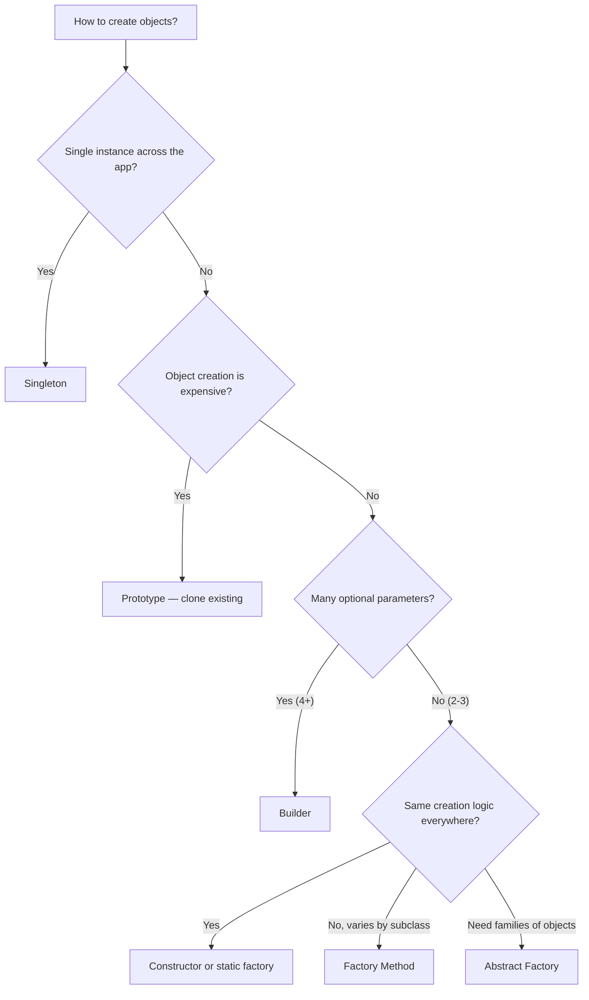
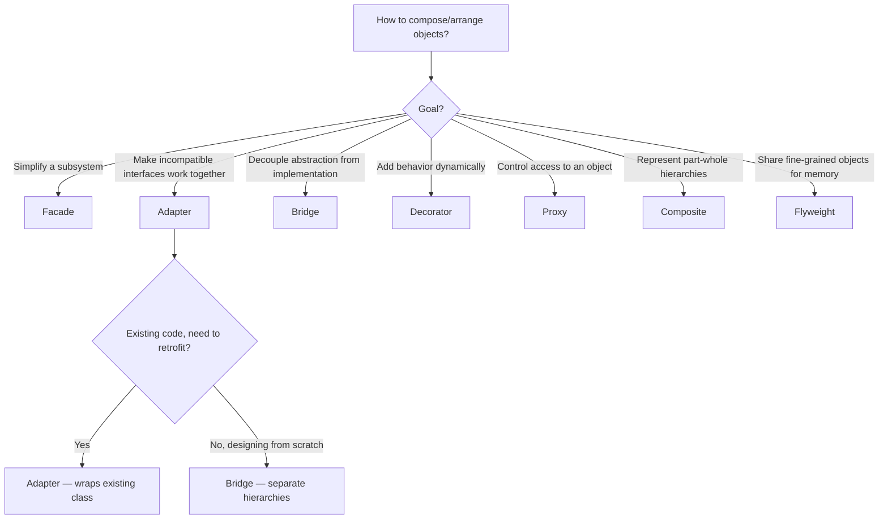
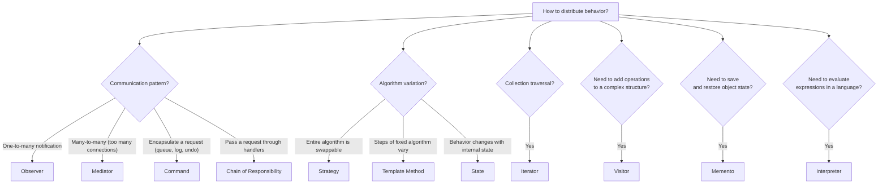
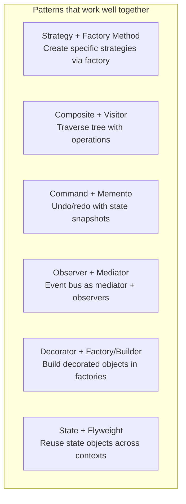

# Design Pattern Selection Guide

> [!summary] Goal
> Choose the right design pattern for your problem. Includes mega-flowcharts by category, pattern relationships, common refactoring paths, and a one-page cheat sheet.

## Table of Contents

1. [Creational Decision Tree](#creational-decision-tree)
2. [Structural Decision Tree](#structural-decision-tree)
3. [Behavioral Decision Tree](#behavioral-decision-tree)
4. [Pattern Relationships](#pattern-relationships)
5. [Pattern Refactoring Guide](#pattern-refactoring-guide)
6. [GoF Quick Reference](#gof-quick-reference)

---

## Creational Decision Tree

| Problem | Pattern |
|---------|---------|
| Need exactly one instance | Singleton |
| Creating an object is expensive; clone instead | Prototype |
| Object has 4+ optional parameters; telescoping constructors | Builder |
| Subclass decides which concrete class to create | Factory Method |
| Need to create families of related objects | Abstract Factory |

---

## Structural Decision Tree

| Problem | Pattern |
|---------|---------|
| Subsystem is too complex | Facade |
| Incompatible interfaces | Adapter |
| Abstraction and implementation both vary | Bridge |
| Need to compose objects into tree structures | Composite |
| Need to add/remove behavior at runtime | Decorator |
| Need to share many fine-grained objects | Flyweight |
| Need to control/lazy-load access to an object | Proxy |

---

## Behavioral Decision Tree

| Problem | Pattern |
|---------|---------|
| Object changes behavior when state changes | State |
| Need to traverse a collection uniformly | Iterator |
| Algorithms should be interchangeable | Strategy |
| Algorithm skeleton with varying steps | Template Method |
| One change should update many objects | Observer |
| Complex many-to-many communication | Mediator |
| Encapsulate request for queue/undo/log | Command |
| Request passes through handlers (middleware) | Chain of Responsibility |
| Add operations to a stable object hierarchy | Visitor |
| Save and restore object state | Memento |
| Evaluate expressions in a language/grammar | Interpreter |

---

## Pattern Relationships

| Combination | Why they work together |
|-------------|----------------------|
| **Strategy + Factory Method** | Factory Method creates the right Strategy based on context/configuration |
| **Composite + Visitor** | Visitor performs operations on all nodes of a Composite tree without modifying node classes |
| **Command + Memento** | Commands in the history stack use Memento to capture state for undo |
| **Observer + Mediator** | A Mediator can act as an event bus, with components observing specific events |
| **Decorator + Factory/Builder** | A Factory or Builder constructs objects with the required decorator layers |
| **State + Flyweight** | State objects can be shared (flyweight) since they have no instance-specific state |

### Patterns that solve similar problems

| Similar patterns | How to choose |
|-----------------|---------------|
| **Strategy vs State** | Strategy: client chooses algorithm. State: object changes behavior automatically |
| **Strategy vs Command** | Strategy: different ways to do the same thing. Command: encapsulate action for queuing/undo |
| **Proxy vs Decorator** | Proxy: controls access. Decorator: adds behavior |
| **Adapter vs Bridge** | Adapter: makes existing code work. Bridge: designed for decoupling |
| **Observer vs Mediator** | Observer: one-to-many broadcast. Mediator: many-to-many orchestration |
| **Factory Method vs Abstract Factory** | FM: one product per factory. AF: product families |

---

## Pattern Refactoring Guide

When you see a code smell, here's which pattern to refactor to:

| Smell | Pattern | Why |
|-------|---------|-----|
| **Long method** with many steps | Template Method | Extract varying steps into overridable methods |
| **Large conditional (switch/if)** | Strategy or State | Each branch becomes a strategy class or state |
| **Many classes with only small differences** | Factory Method | Let subclasses create the right variant |
| **God class doing everything** | Facade or Adapter | Delegate subsystem details to dedicated classes |
| **Object creation scattered everywhere** | Factory Method | Centralize creation decisions |
| **Conditionals based on type** | Visitor or Strategy | Polymorphism replaces type checking |
| **Constructor with many parameters** | Builder | Build step by step with named parameters |
| **Complex UI/event handling** | Mediator | Centralize event routing logic |

---

## GoF Quick Reference

### Creational Patterns — Object Creation

| Pattern | Intent | When to use | Key participants |
|---------|--------|-------------|-----------------|
| **Singleton** | Ensure a class has only one instance | Logging, config, connection pools, cached factory | Singleton, getInstance() |
| **Prototype** | Create objects by cloning existing ones | Expensive creation, many similar objects | Prototype, ConcretePrototype, Registry |
| **Builder** | Construct complex objects step by step | 4+ optional parameters, immutable objects | Builder, Director, Product |
| **Factory Method** | Subclass decides which class to instantiate | One product type, many variants | Creator, ConcreteCreator, Product |
| **Abstract Factory** | Create families of related objects | Product families (UI widgets, DB drivers) | AbstractFactory, ConcreteFactory, Product |

### Structural Patterns — Object Composition

| Pattern | Intent | When to use | Key participants |
|---------|--------|-------------|-----------------|
| **Adapter** | Convert one interface to another | Legacy/third-party code needs a different interface | Target, Adapter, Adaptee |
| **Bridge** | Decouple abstraction from implementation | Abstraction and implementation both vary | Abstraction, Implementor, ConcreteImplementor |
| **Composite** | Treat individuals and compositions uniformly | Tree structures (file systems, UI trees) | Component, Leaf, Composite |
| **Decorator** | Add behavior to objects dynamically | Add responsibilities without subclassing (I/O streams) | Component, ConcreteComponent, Decorator |
| **Facade** | Provide a simplified interface to a subsystem | Complex subsystem, want a simple entry point | Facade, Subsystem classes |
| **Flyweight** | Share fine-grained objects for memory efficiency | Large numbers of similar objects (text rendering, caches) | Flyweight, FlyweightFactory |
| **Proxy** | Control access to another object | Lazy loading, access control, remote communication | Subject, Proxy, RealSubject |

### Behavioral Patterns — Object Communication

| Pattern | Intent | When to use | Key participants |
|---------|--------|-------------|-----------------|
| **Strategy** | Interchangeable algorithms | Payment methods, sorting, compression | Context, Strategy, ConcreteStrategy |
| **Template Method** | Skeleton algorithm with overridable steps | Frameworks, data processing pipelines | AbstractClass, ConcreteClass |
| **Observer** | One-to-many dependency notification | Event handling, UI updates, pub-sub systems | Subject, Observer, ConcreteObserver |
| **Mediator** | Centralize complex multi-object communication | UI dialogs, chat systems, air traffic control | Mediator, ConcreteMediator, Colleague |
| **Command** | Encapsulate a request as an object | Undo/redo, queuing, logging, macro operations | Command, ConcreteCommand, Invoker, Receiver |
| **Chain of Responsibility** | Pass request through handler chain | Middleware, filters, logging levels, validation | Handler, ConcreteHandler |
| **State** | Object changes behavior when state changes | Workflow engines, vending machines, game states | Context, State, ConcreteState |
| **Iterator** | Traverse a collection without exposing structure | Any collection traversal | Iterator, ConcreteIterator, Aggregate |
| **Visitor** | Add operations to a stable object hierarchy | Document export, AST processing, compiler passes | Visitor, ConcreteVisitor, Element |
| **Memento** | Save and restore object state | Undo/redo, checkpoints, transaction rollback | Originator, Memento, Caretaker |
| **Interpreter** | Evaluate expressions in a language | Arithmetic expressions, configuration DSLs, query languages | Expression, TerminalExpression, NonTerminalExpression |

---

## Pitfalls

### Pattern chaining without need

A method wrapped in 7 design patterns (Factory → Proxy → Decorator → Strategy → ...) is impossible to debug. Layers of indirection should serve a purpose, not be a display of pattern knowledge. If unwrapping a call stack to find the actual logic takes 30 seconds, there are too many patterns.

### Choosing a pattern before understanding the problem

Picking a pattern first and then searching for a problem that fits leads to over-engineering. Always start with the problem statement ("I need to ..."), identify the design constraint, and then look up which pattern addresses it.

### Mixing incompatible patterns

Some patterns clash. Visitor + Iterator over a composite tree is common, but State + Strategy in the same class creates confusion (which part is automatic vs configured?). Know which patterns are complementary (Composite + Visitor) vs redundant (Strategy + State).

---

> [!question]- Interview Questions
>
> **Q: How do you decide between Strategy and State?**
> A: Strategy is for when the client chooses the algorithm (e.g., payment method selected by the user). State is for when the object changes behavior automatically (e.g., a vending machine that transitions from Idle to Dispensing when a product is selected). If the "strategy" changes based on internal conditions, it's State.
>
> **Q: Which patterns work well with Composite?**
> A: Visitor (perform operations on all nodes without modifying node classes), Iterator (traverse the tree), Command (macro command over multiple leaves), and Decorator (add behavior to individual nodes). Composite + Visitor is the most common combination.
>
> **Q: What is a pattern signature and how do you recognize one?**
> A: A pattern signature is the core structure you see in class diagrams: Strategy = interface + multiple implementations + context with "has-a" strategy reference. Observer = subject + observer interface + attach/notify. Once you learn the signature, you'll see patterns in unfamiliar code without needing the pattern name.
>
> **Q: When should you ignore the GoF pattern catalog?**
> A: When the language provides a simpler solution. Lambdas replace Strategy/Observer/Command. DI containers replace Singleton/Factory. Streams replace Iterator. Patterns are solutions for languages without certain features — if the feature exists, use it.
>
> **Q: How many patterns should a typical service class use?**
> A: 2-4 at most. A typical Spring Boot service uses: Dependency Injection (constructor), Singleton (bean scope), Repository/DAO (data access), and optionally one more (Service Layer as Facade, or Strategy for an algorithm). More than 4 patterns in one class suggests over-engineering.

---

## Cross-Links

- [[DesignPatterns/01_Foundations/F02_SOLID_Principles]] for the principles patterns are built on
- [[DesignPatterns/02_Core/C07_Strategy_and_Template_Method]] for Strategy vs Template Method
- [[DesignPatterns/02_Core/C10_State_Iterator_Visitor_Memento_Interpreter]] for State vs Strategy
- [[DesignPatterns/02_Core/C01_Singleton_and_Prototype]] for creational patterns
- [[DesignPatterns/03_Advanced/A01_Functional_Design_Patterns]] for functional alternatives
