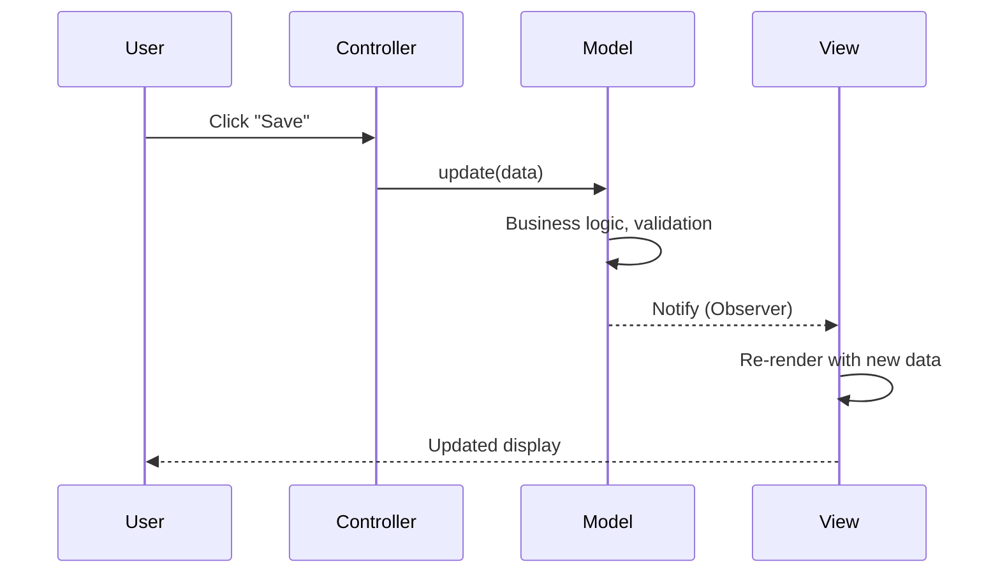
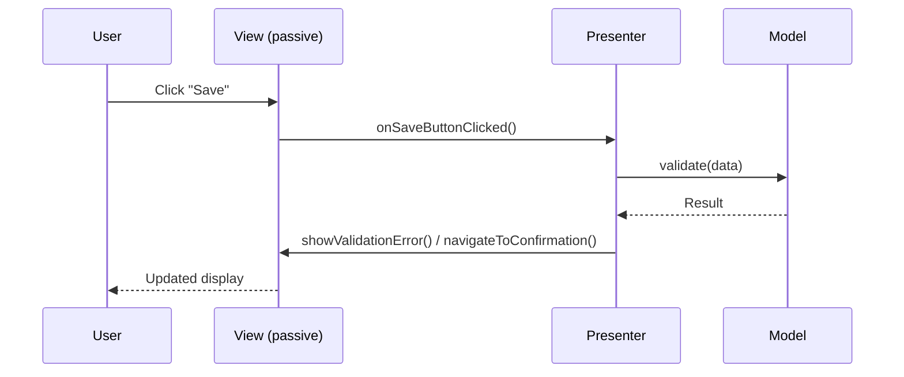
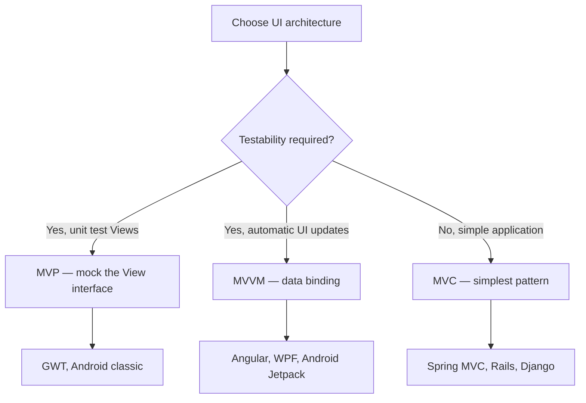

# Architectural Patterns: MVC, MVVM, and MVP

> [!summary] Goal
> Understand the three major architectural patterns for building user interfaces: MVC (Model-View-Controller), MVP (Model-View-Presenter), and MVVM (Model-View-ViewModel). Know when to use each, how they differ, and their tradeoffs.

## Table of Contents

1. [Architectural Pattern Overview](#architectural-pattern-overview)
2. [MVC — Model-View-Controller](#mvc-model-view-controller)
3. [MVP — Model-View-Presenter](#mvp-model-view-presenter)
4. [MVVM — Model-View-ViewModel](#mvvm-model-view-viewmodel)
5. [Comparison and Decision Guide](#comparison-and-decision-guide)
6. [Pitfalls](#pitfalls)

---

## Architectural Pattern Overview

> [!info] Architectural patterns
> MVC, MVP, and MVVM separate **data** (Model) from **presentation** (View) from **logic** (Controller/Presenter/ViewModel). They all solve the same problem — avoiding tight coupling between UI and business logic — but differ in how the View communicates with the logic layer and how testable each is.

```mermaid
flowchart LR
    M["Model<br/>Business data + logic"] <--> C["Controller /<br/>Presenter /<br/>ViewModel"]
    C <--> V["View<br/>UI rendering"]
    note for M "Model is independent<br/>of UI concerns"
    note for V "View delegates to<br/>Controller/Presenter/VM"
```


---

## MVC — Model-View-Controller

> [!info] MVC
> The **Controller** receives user input (clicks, keystrokes), updates the **Model**, and the **View** observes the Model and re-renders when it changes. The View and Model communicate via Observer pattern. This is the classic Smalltalk MVC and the foundation of Spring MVC, Rails, Django, and most web frameworks.



```java
// Model — pure business data + logic
public class UserModel {
    private String name;
    private String email;
    private final List<View> views = new ArrayList<>();
    
    public void attach(View v) { views.add(v); }
    
    public void setName(String name) { 
        this.name = name;
        notifyViews();
    }
    
    private void notifyViews() {
        for (View v : views) v.update(this);
    }
}

// View — observes Model, renders display
public class UserView implements View {
    @Override
    public void update(Model model) {
        UserModel m = (UserModel) model;
        System.out.println("Display: " + m.getName() + ", " + m.getEmail());
    }
}

// Controller — handles user input
public class UserController {
    private final UserModel model;
    
    public UserController(UserModel model) {
        this.model = model;
    }
    
    public void updateName(String newName) {
        model.setName(newName);    // Triggers view update automatically
    }
}

// Usage
UserModel model = new UserModel();
View view = new UserView();
model.attach(view);
UserController controller = new UserController(model);
controller.updateName("Alice");   // Output: "Display: Alice, null"
```

### MVC in web frameworks (Spring MVC)

```java
// Spring MVC — Controller, Model, View separation
@Controller
public class UserController {
    
    @GetMapping("/users/{id}")
    public String showUser(@PathVariable Long id, Model model) {
        User user = userService.findById(id);
        model.addAttribute("user", user);   // Model data
        return "user/view";                  // View name (Thymeleaf template)
    }
}

// The Model is a Map (not domain objects)
// The View is a template (Thymeleaf, JSP, FreeMarker)
// The Controller handles HTTP, calls services, prepares model
```

---

## MVP — Model-View-Presenter

> [!info] MVP
> In MVP, the **Presenter** mediates between View and Model. Unlike MVC (where View observes Model), in MVP the View **delegates ALL events** to the Presenter. The Presenter updates the Model, receives the result, and pushes data to the View. The View is **passive** — it only has getters/setters. This makes MVP extremely testable (the View can be mocked).



```java
// View interface — can be mocked for testing
public interface UserView {
    String getName();
    String getEmail();
    void showError(String field, String message);
    void navigateToConfirmation();
}

// Presenter — contains all presentation logic
public class UserPresenter {
    private final UserView view;
    private final UserService service;
    
    public UserPresenter(UserView view, UserService service) {
        this.view = view;
        this.service = service;
    }
    
    public void onSave() {
        String name = view.getName();
        String email = view.getEmail();
        
        if (name == null || name.isEmpty()) {
            view.showError("name", "Name is required");
            return;
        }
        service.save(new User(name, email));
        view.navigateToConfirmation();
    }
}

// Concrete View (Android Activity / Swing Panel)
public class UserActivity implements UserView {
    private UserPresenter presenter;
    private EditText nameInput, emailInput;
    
    @Override
    public String getName() { return nameInput.getText().toString(); }
    @Override
    public String getEmail() { return emailInput.getText().toString(); }
    
    public void onCreate() {
        presenter = new UserPresenter(this, new UserService());
        findViewById(R.id.saveButton).setOnClickListener(v -> presenter.onSave());
    }
}
```

---

## MVVM — Model-View-ViewModel

> [!info] MVVM
> In MVVM, the **ViewModel** is a value holder that the View **data-binds** to. The ViewModel exposes `ObservableField`s or reactive properties (LiveData, RxJava). When the ViewModel changes, the View automatically updates via data binding. The ViewModel doesn't know about the View at all — it exposes state, not events. This is the foundation of Angular, WPF, and Android Jetpack.

```mermaid
flowchart LR
    M["Model<br/>Business logic"] --> VM["ViewModel<br/>Observable state"]
    VM <-->|"Data binding"| V["View<br/>Template / XML"]
    note for VM "Contains no reference to View"
    note for V "Declarative: {{ user.name }}"
```

```java
// ViewModel — exposes observable state
public class UserViewModel {
    private final MutableLiveData<String> name = new MutableLiveData<>("");
    private final MutableLiveData<String> error = new MutableLiveData<>(null);
    private final UserService service;
    
    public UserViewModel(UserService service) {
        this.service = service;
    }
    
    public LiveData<String> getName() { return name; }
    public LiveData<String> getError() { return error; }
    
    public void setName(String value) { name.setValue(value); }
    
    public void save() {
        if (name.getValue() == null || name.getValue().isEmpty()) {
            error.setValue("Name is required");
            return;
        }
        service.save(new User(name.getValue()));
        error.setValue(null);
    }
}

// View — binds to ViewModel properties (Android)
// <layout>
//   <data>
//     <variable name="vm" type="UserViewModel" />
//   </data>
//   <EditText android:text="@={vm.name}" />
//   <Button android:onClick="@{() -> vm.save()}" />
// </layout>

// Angular example:
// <input [(ngModel)]="user.name" />
// <button (click)="save()">Save</button>
```

---

## Comparison and Decision Guide



| Aspect | MVC | MVP | MVVM |
|--------|:---:|:---:|:----:|
| **Testability** | Medium (View must be test-aware) | High (mock View interface) | High (test ViewModel directly) |
| **View responsibilities** | Observes Model, re-renders | Minimal — delegates everything | Data binding (automatic) |
| **Logic location** | Controller | Presenter | ViewModel |
| **Complexity** | Low | Medium | High (binding framework) |
| **Learning curve** | Gentle | Moderate | Steep (binding syntax) |
| **Best for** | Simple UIs, server-side web | Complex UIs with unit tests | Rich data-binding UIs |
| **Framework examples** | Spring MVC, Rails, Django | GWT, Android MVP | Angular, WPF, Vue.js |

---

## Pitfalls

### Massively-view-controller (MVC gone wrong)

The most common MVC anti-pattern — Controllers with hundreds of lines, Models with getters/setters only, and Views with business logic. MVC doesn't mean "everything that doesn't fit elsewhere goes in the Controller." Keep Controllers thin (input handling only) and put business logic in Services (not the Model or Controller).

### Passive View vs Supervising Controller in MVP

MVP has two variants: **Passive View** (Presenter computes everything, View is pure interface) and **Supervising Controller** (View handles simple formatting, Presenter handles complex logic). Passive View is more testable but more verbose. Choose based on the complexity of your View formatting.

### MVVM with too much logic in the ViewModel

If your ViewModel has hundreds of lines, domain objects, and import statements for backend services, you've recreated Smart UI anti-pattern. The ViewModel should orchestrate — call a domain service for business logic, transform for presentation, and expose the result as observable state.

---

> [!question]- Interview Questions
>
> **Q: What's the main difference between MVC and MVP?**
> A: In MVC, the View observes the Model directly (Observer pattern). When the Model changes, the View re-renders automatically. In MVP, the View delegates ALL events to the Presenter, and the Presenter pushes data to the View. The View is passive — it only has getters/setters. MVP makes the View mockable and thus easier to unit test than MVC.
>
> **Q: What is data binding in MVVM?**
> A: Data binding connects View properties to ViewModel properties declaratively. When the ViewModel changes (LiveData, RxJava, observable), the View updates automatically. When the user interacts with the View, the ViewModel updates automatically. This reduces boilerplate (no manual setText/getText calls) but requires a binding framework.
>
> **Q: Which architectural pattern should you choose for a new Angular application?**
> A: Angular uses MVVM — the Component is the ViewModel, the template is the View, and Services provide the Model. Angular's template syntax (`{{ }}`, `[(ngModel)]`, pipes, directives) is the data-binding layer. Choose MVC for server-side frameworks (Spring MVC), MVP for complex testable UIs (GWT), and MVVM for rich client-side applications (Angular, WPF).

---

## Cross-Links

- [[DesignPatterns/03_Advanced/A02_Enterprise_Patterns]] for Service Layer (often used with MVC)
- [[DesignPatterns/02_Core/C08_Observer_and_Mediator]] for Observer pattern (MVC's View-Model communication)
- [[DesignPatterns/02_Core/C09_Command_and_Chain_of_Responsibility]] for handling user commands
- [[DesignPatterns/02_Core/C03_Builder]] for building complex ViewModels
- [[DesignPatterns/01_Foundations/F02_SOLID_Principles]] for SRP (keeping layers separate)
