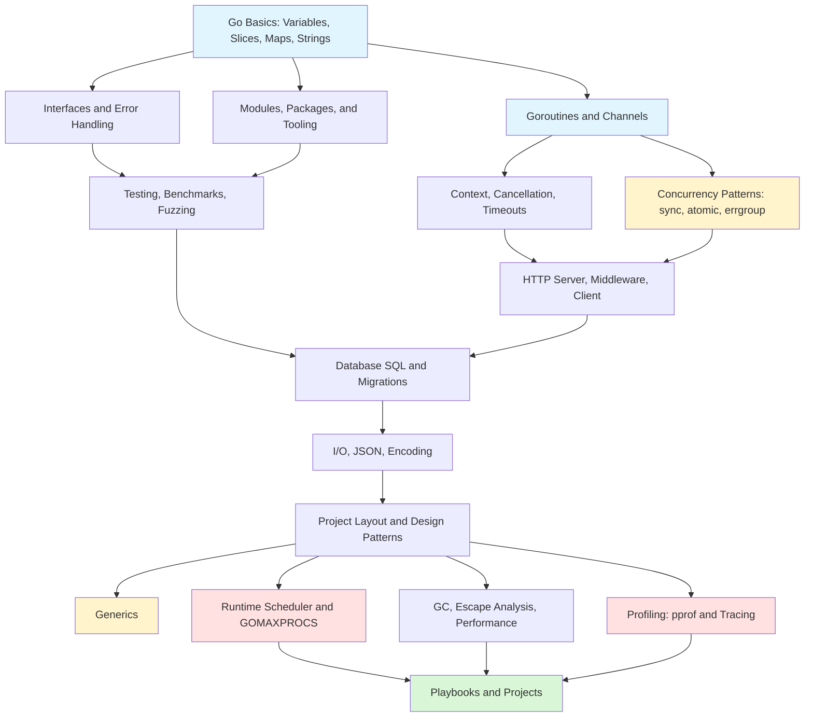

# Go

> [!summary] Scope
> Go programming from beginner to pro: syntax, types, slices, maps, strings, goroutines and channels, interfaces, error handling, defer/panic/recover, context, concurrency patterns, HTTP servers and clients, database/SQL, JSON/IO, testing and fuzzing, modules and tooling, project layout, generics, scheduler internals, GC and escape analysis, profiling, and production deployment.

## Learning Path

## Topic Map

### Foundations (6 files)

#### [[Go/01_Foundations/01_Go_Basics]]
- Variables and declarations (`var` vs `:=`), scope, zero values table
- Constants and `iota` patterns (flags, enums, bitmask)
- Slices: make, append, copy, slicing expression, backing array, capacity growth, nil vs empty
- Maps: make, delete, comma-ok, nil map behavior, iteration order, concurrent access
- Strings: immutability, strings.Builder, rune vs byte, utf8 package
- Control flow: all `for` variants, `if` with short statement, `switch` with no break
- Type assertions and type switches
- Pointers: when to use and when not to

#### [[Go/01_Foundations/02_Goroutines_and_Channels]]
- Goroutine creation, channel types (buffered/unbuffered), channel ownership (sender closes)
- `select` statement: multi-channel wait, non-blocking, timeout
- `sync.WaitGroup` for goroutine coordination
- `time.Ticker`/`time.Timer` for periodic and one-shot events
- `for range` over channels (receive until close)
- Patterns: fan-out, done channel
- Pitfalls: goroutine leak, closed channel panic, nil channel block

#### [[Go/01_Foundations/03_Interfaces_and_Error_Handling]]
- Interface definition, implicit satisfaction, empty interface (`any`)
- Struct embedding: promoted fields and methods, embedding interfaces, composition vs inheritance
- `defer` semantics: LIFO stack order, argument evaluation, common patterns (Close, Unlock)
- `panic`/`recover`: when to use (impossible states, top-level recovery)
- Common stdlib interfaces: `fmt.Stringer`, `error`, `io.Reader`/`Writer`, `sort.Interface`, `http.Handler`
- Error handling: sentinel errors, typed errors, `errors.Is`/`errors.As`, `errors.Join`, `%w` wrapping chains
- Pitfalls: interface nil vs nil pointer, defer in loops, recover only in deferred functions

#### [[Go/01_Foundations/04_Modules_Packages_and_Tooling]]
- Module basics: `go mod init`, `go mod tidy`, `go.sum`, versioning, `replace`/`exclude`
- Go workspace mode: `go work init`, `go work use`, local development without `replace`
- Packages and visibility: `internal/` package rule, naming conventions
- Build tags: `//go:build` syntax, file naming convention (`_linux.go`, `_amd64.go`)
- `//go:embed`: embedding static files, `embed.FS`
- `//go:generate`: code generation
- Module proxy: `GOPROXY`, `GONOSUMCHECK`, `GOPRIVATE`
- Tooling reference: go build, test, fmt, vet, mod, work, clean, tool, doc

#### [[Go/01_Foundations/05_Testing_Benchmarks_and_Profiling]]
- Table-driven tests: test struct, loop, `t.Run` subtests
- Test helpers: `t.Helper()`, `t.Cleanup()`, `t.TempDir()`
- `httptest`: NewServer, NewRequest, NewRecorder
- Fuzzing: `f.Fuzz`, seed corpus, minimize, `-fuzztime`
- Coverage: `-coverprofile`, `go tool cover -html`
- Race detection: `-race` in tests and builds
- Benchmarks: `-bench`, `-benchmem`, `-benchtime`, `b.ResetTimer`
- TestMain for setup/teardown, integration test flags

#### [[Go/01_Foundations/06_Project_Layout_and_Design_Patterns]]
- Standard Go project layout: `cmd/`, `internal/`, `pkg/`, `migrations/`, `testdata/`
- Package design principles: no stutter, single responsibility, internal over exported
- Functional options pattern with variadic `Option` functions
- Dependency injection: manual constructor injection, Google Wire
- Repository pattern, service layer separation

### Core (8 files)

#### [[Go/02_Core/01_Context_Cancellation_and_Timeouts]]
- `Background()`, `TODO()`, `WithCancel`, `WithTimeout`, `WithDeadline`, `WithValue`
- Context derivation tree: parent → child → grandchild, cancellation propagation
- HTTP handler context: `r.Context()`, client: `NewRequestWithContext`
- Database queries: `QueryContext`, `ExecContext`, `BeginTx(ctx, opts)`
- Context in goroutines: `select { case <-ctx.Done(): ... }`
- `context.AfterFunc` (Go 1.21), `context.Cause`
- Pitfalls: storing context in structs, not calling cancel, ctx.Done vs ctx.Err

#### [[Go/02_Core/02_Concurrency_Patterns_WorkerPools_FanInOut]]
- `sync.Mutex` (exclusive) vs `sync.RWMutex` (read-optimized) with code examples
- `sync.WaitGroup` for goroutine coordination
- `sync.Once` for lazy init, `sync.Pool` for object reuse, `sync.Cond` for event signaling
- `atomic.Int64`, `atomic.Value`, `atomic.CompareAndSwap`
- `errgroup` with error propagation and context cancellation
- `errgroup.SetLimit` (Go 1.20+), `singleflight`, `semaphore.Weighted`
- Pipeline variants: or-done, tee, bridge
- Worker pool with bounded queue, fan-out/fan-in
- Rate limiting with `time.Ticker` and channel-based semaphore

#### [[Go/02_Core/03_Data_Races_Sync_Map_and_Typed_Atomics]]
- Data race detection (`-race`), `GORACE` options
- Typed atomic API (Go 1.19+): `atomic.Int64`, `atomic.Pointer[T]`, `atomic.Bool`
- `sync.Map` internals: read/dirty map, miss promotion, benchmarks vs Mutex+map
- `singleflight` for call deduplication (cache stampede prevention)
- `semaphore.Weighted` for resource limits with context cancellation
- `atomic.Value` vs `atomic.Pointer[T]`

#### [[Go/02_Core/04_NetHTTP_Server_Middleware_and_Clients]]
- Server configuration: ReadTimeout, WriteTimeout, IdleTimeout, MaxHeaderBytes
- Routing: Go 1.22+ pattern matching (`GET /api/users/{id}`), chi router
- Middleware: `func(http.Handler) http.Handler` pattern, chaining, logging/recovery/requestID
- HTTP client: Transport tuning (MaxIdleConns, IdleConnTimeout), context, timeouts
- TLS configuration, autocert for Let's Encrypt
- Graceful shutdown with `Shutdown(ctx)` and OS signals
- `httptest` for handler and integration testing

#### [[Go/02_Core/05_Stdlib_IO_Encoding_and_JSON]]
- `io.Reader`/`io.Writer` interfaces, `io.Copy`, `io.LimitReader`, `io.MultiReader`, `io.Pipe`
- File I/O: `os.ReadFile`/`WriteFile`, `bufio.Scanner`, `os.Create`, `os.CreateTemp`
- JSON: `Marshal`/`Unmarshal`, `NewEncoder`/`NewDecoder`, struct tags, `omitempty`, `-`
- Custom JSON serialization with `MarshalJSON`/`UnmarshalJSON`, `json.RawMessage`
- CSV reader/writer for tabular data

#### [[Go/02_Core/06_Database_SQL_and_Migrations]]
- Connection pool: `sql.Open`, `db.Ping`, pool configuration (max open, idle, lifetime)
- Queries: `QueryRow` (single), `Query` (multiple), `Exec` (write) with context
- Prepared statements for performance and SQL injection prevention
- Transactions: `BeginTx`, `Commit`, `Rollback`, isolation levels
- Context cancellation in database calls (`DeadlineExceeded`)
- Migrations with golang-migrate, embedding SQL with `//go:embed`

#### [[Go/02_Core/07_Standard_Library_Reference]]
- `flag` package: String, Int, Bool, Duration, `flag.NewFlagSet` for subcommands
- `sort`: Ints, Strings, Slice, SliceStable, Search, Reverse
- `log/slog` (Go 1.21+): JSONHandler, levels, groups, contexts
- `net/url`: URL parsing, query parameters, URL building
- `maps` and `slices` (Go 1.21+): Clone, Equal, Sort, Compact, Delete, Contains
- `cmp` (Go 1.21+): Compare, Less, Or
- `io/fs`: ReadFile, ReadDir, WalkDir, Sub
- `os/exec`: Command, Output, StdinPipe, CommandContext
- `path/filepath`: Join, Dir, Base, Ext, WalkDir, Glob

### Advanced (5 files) (5 files)

#### [[Go/03_Advanced/01_Runtime_Scheduler_and_GOMAXPROCS]]
- M:P:G scheduling model (Machine → Processor → Goroutine)
- Work stealing between processor local run queues
- Network poller: goroutines blocked on I/O don't block OS threads
- Sysmon: preemption, GC triggering, P management
- GOMAXPROCS tuning for CPU-bound vs containerized workloads
- `automaxprocs` for container-aware CPU detection

#### [[Go/03_Advanced/02_GC_Escape_Analysis_and_Performance]]
- Go's concurrent mark-sweep GC: phases, STW durations
- Escape analysis: what triggers heap allocation (returning pointer, interface conversion, large/sized arrays)
- Checking escape with `-gcflags=-m`
- GC tuning: GOGC (heap growth target), GOMEMLIMIT (soft memory limit)
- `sync.Pool` for reducing allocation pressure
- Performance optimization workflow: profile → identify → fix → re-profile

#### [[Go/03_Advanced/03_Generics_in_Go_Practical]]
- Generic functions and types with type parameters
- Constraints: `any`, `comparable`, `~int` type approximation
- When to use generics vs interfaces vs code generation
- Performance considerations and best practices

#### [[Go/03_Advanced/04_Profiling_pprof_and_Tracing]]
- Profile types: CPU, heap, allocs, goroutine, mutex, block, threadcreate
- `net/http/pprof` for live profiling, `runtime/pprof` for non-HTTP apps
- `go tool pprof` interactive and web UI, flame graph generation
- `go tool trace` for execution tracing (goroutine scheduling, GC, I/O)
- Profile comparison for regression analysis

#### [[Go/03_Advanced/05_Reflection_and_Unsafe]]
- `reflect.TypeOf`, `reflect.ValueOf`, `Kind`, reading/writing struct fields
- Struct tags with reflection (validation, configuration)
- `reflect.DeepEqual` and its pitfalls (recursive types, unexported fields)
- `unsafe.Sizeof`, `Alignof`, `Pointer` — when to use (rarely) and when not to
- Reflection vs generics vs interfaces decision flowchart

### Playbooks (4 files)

#### [[Go/04_Playbooks/01_Debug_Goroutine_Leaks_and_Deadlocks]]
- SIGQUIT and pprof goroutine profile for leak detection
- `uber-go/goleak` for test-based leak detection
- Common leak patterns: unreceived send, blocked on unbuffered channel, missing ctx.Done

#### [[Go/04_Playbooks/02_Debug_High_CPU_and_GC_Pressure]]
- `pprof` CPU profiling workflow, GC trace with `GODEBUG=gctrace=1`
- `-gcflags=-m` escape analysis, allocation hotspot detection

#### [[Go/04_Playbooks/03_Debug_HTTP_Timeouts_and_Connection_Leaks]]
- `httptrace.ClientTrace` for connection lifecycle debugging
- `http.Transport` defaults and connection pool monitoring
- Common causes: missing timeout, not closing resp.Body

#### [[Go/04_Playbooks/04_Production_Readiness_Checklist]]
- Graceful shutdown, health endpoints (liveness/readiness)
- Structured logging with `slog`, metrics with Prometheus/expvar
- Configuration from environment, bounded concurrency, timeouts

### Projects (3 files)

#### [[Go/05_Projects/01_REST_API_net_http_Postgres]]
- Build a CRUD REST API with `chi` router, PostgreSQL, migrations, structured logging

#### [[Go/05_Projects/02_Concurrent_Worker_Service]]
- Worker pool with `errgroup`, bounded queue, retry with backoff, metrics

#### [[Go/05_Projects/03_CLI_Tool_with_Subcommands]]
- CLI tool with `cobra`, config file parsing, structured output (JSON/table/text)

---

## Recommended Paths

| Path | Files | Target |
|------|-------|--------|
| **Quick Start** | F01, F02, F03, F04 | Learn Go in a week |
| **Backend Engineer** | F01-F06, C01-C06 | Build production services |
| **Performance** | A01, A02, A04, P02 | Profile and optimize Go code |
| **Systems/CLI** | C02, C04, A01, PR03 | Build CLI tools and systems |

## Cross-Links

- [[CICD/Docker/00_MOC/00_Docker_MOC]] for containerization
- [[CICD/GitHubActions/00_MOC/00_GitHubActions_MOC]] for CI/CD
- [[Java/01_Foundations/01_Java_Basics_and_Idioms]] for language comparison

---

## References

- [Go Documentation](https://go.dev/doc/)
- [Go by Example](https://gobyexample.com/)
- [Effective Go](https://go.dev/doc/effective_go)
- [Go Blog](https://go.dev/blog/)
- [Go Standard Library](https://pkg.go.dev/std)
- [Go Playground](https://go.dev/play/)
