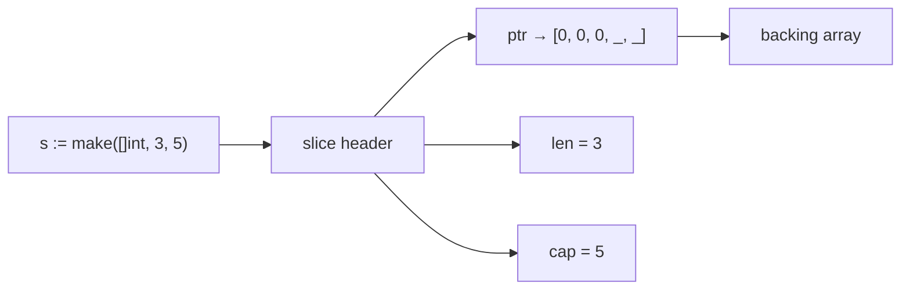
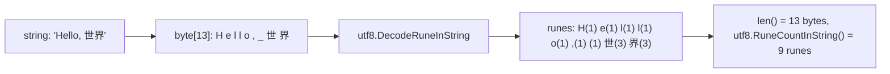
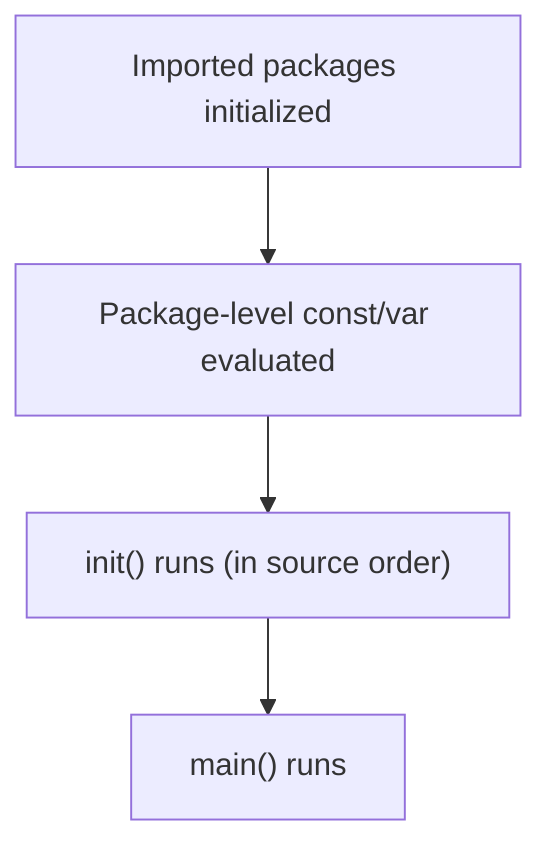

# Go Basics

> [!summary] Goal
> Write idiomatic Go from day one: understand variables, constants, slices, maps, strings, control flow, and the type system — all with the Go philosophy of simplicity and clarity.

## Table of Contents

1. [Go Philosophy](#go-philosophy)
2. [Variables and Declarations](#variables-and-declarations)
3. [Constants and iota](#constants-and-iota)
4. [Zero Values](#zero-values)
5. [Slices — The Most Important Data Structure](#slices-the-most-important-data-structure)
6. [Maps](#maps)
7. [Strings, Runes, and Bytes](#strings-runes-and-bytes)
8. [Control Flow](#control-flow)
9. [Type Assertions and Type Switches](#type-assertions-and-type-switches)
10. [Pointers](#pointers)
11. [Functions Deep Dive](#functions-deep-dive)
12. [Structs](#structs)
13. [Type Conversion](#type-conversion)
14. [Blank Identifier `_`](#blank-identifier)
15. [`init()` Function](#init-function)
16. [`new()` vs `make()`](#new-vs-make)
17. [Operators Reference](#operators-reference)
18. [Scope and Shadowing](#scope-and-shadowing)
19. [Pitfalls](#pitfalls)

---

## Go Philosophy

Go is designed for clarity, simplicity, and practical engineering:

- **Explicit over implicit**: no hidden control flow, no `this` magic
- **Composition over inheritance**: embedding over subclassing
- **Concurrency is a tool, not a framework**: goroutines + channels, not thread pools
- **Zero values**: every type has a defined zero value — no null/undefined
- **Errors are values**: no exceptions, explicit error handling

---

## Variables and Declarations

```go
// Full declaration
var name string = "Alice"

// Type inference (zero value)
var age int               // age = 0

// Short declaration (inside functions)
count := 10               // type inferred as int
msg := "hello"            // type inferred as string

// Multiple variables
var x, y int = 1, 2
width, height := 100, 200

// Block declaration
var (
    appName  = "my-service"
    version  = "1.0.0"
    debug    = true
)
```

### `var` vs `:=`

| Aspect | `var` | `:=` |
|--------|-------|------|
| Package level | ✅ | ❌ (function scope only) |
| Zero value | ✅ `var x int` → 0 | ❌ must initialize |
| Type explicit | ✅ `var x int` | `x := int(42)` only |
| Redeclaration | ❌ | ✅ only if one variable is new (`a, b := 1, 2` then `a, c := 3, 4`) |

---

## Constants and `iota`

```go
const Pi = 3.14159

// Typed constant
const Port int = 8080

// Untyped constant — can be used with any compatible type
const MaxSize = 1024

// iota — auto-incrementing constants
type FilePermission int

const (
    Read  FilePermission = 1 << iota  // 1
    Write                              // 2
    Execute                            // 4
)

// Common iota pattern: enum-like
type OrderStatus int

const (
    StatusPending  OrderStatus = iota // 0
    StatusConfirmed                   // 1
    StatusShipped                     // 2
    StatusDelivered                   // 3
    StatusCancelled                   // 4
)
```

**Why `iota` matters**: ensures sequential integer constants without manual numbering, and makes it easy to insert new constants in the middle without renumbering everything.

---

## Zero Values

In Go, every type has a defined zero value — no `null`, no `undefined`:

| Type | Zero value |
|------|-----------|
| `int`, `int32`, `int64` | `0` |
| `float64` | `0.0` |
| `bool` | `false` |
| `string` | `""` (empty string) |
| `pointer`, `slice`, `map`, `channel`, `interface`, `func` | `nil` |
| `struct` | All fields set to their zero values |
| `array` | All elements set to zero |

```go
type Config struct {
    Port    int
    Host    string
    Debug   bool
}
var cfg Config        // cfg.Port = 0, cfg.Host = "", cfg.Debug = false
```

---

## Slices — The Most Important Data Structure

A slice is a dynamically-sized, flexible view into an array. It's Go's most-used data structure.

### Slice header



```go
// Declaration
var s []int                      // nil slice (len=0, cap=0)
s2 := []int{1, 2, 3}             // literal
s3 := make([]int, 5)             // len=5, cap=5
s4 := make([]int, 3, 5)          // len=3, cap=5 (pre-allocate)

// Append
s := []int{1, 2}
s = append(s, 3)                 // [1, 2, 3]
s = append(s, 4, 5, 6)           // [1, 2, 3, 4, 5, 6]

// Append one slice to another
s = append(s, []int{7, 8}...)    // ... unpacks the slice

// Slice expressions
arr := [5]int{0, 1, 2, 3, 4}
a := arr[1:3]                    // [1, 2]   (len=2, cap=4)
b := arr[:2]                     // [0, 1]   (len=2, cap=5)
c := arr[3:]                     // [3, 4]   (len=2, cap=2)

// Copy
src := []int{1, 2, 3}
dst := make([]int, len(src))
n := copy(dst, src)              // n = 3

// Nil vs empty
var s1 []int                     // nil, len=0
s2 := []int{}                    // non-nil, len=0
// Both behave the same for append, range, len, cap
// But json.Marshal(nil) → null, json.Marshal(empty) → []
```

### Capacity growth

```go
s := make([]int, 0, 3)
fmt.Println(cap(s))              // 3
s = append(s, 1, 2, 3)          // cap still 3
s = append(s, 4)                 // cap doubles to 6!
```

| Initial cap | Growth | New cap |
|-------------|--------|---------|
| 0-256 | Double | 2× |
| >256 | ~25% | ≈1.25× |

---

## Maps

```go
// Declaration
var m map[string]int             // nil map (cannot write to it!)
m = make(map[string]int)         // initialize
m2 := map[string]int{            // literal
    "alice": 30,
    "bob":   25,
}

// Read, write, delete
m["key"] = 42                    // insert or update
v := m["key"]                    // 42
v, ok := m["key"]                // v=42, ok=true
v, ok := m["missing"]            // v=0 (zero value), ok=false
delete(m, "key")                 // delete key

// Iteration
for k, v := range m {
    fmt.Printf("%s → %d\n", k, v)
}
```

> [!warning] Map iteration order is **not deterministic** in Go. Each iteration may produce a different order. If you need ordered iteration, collect keys and sort them.

### Nil map behavior

```go
var m map[string]int             // nil map
_ = m["key"]                     // ✅ OK — returns zero value
m["key"] = 42                    // ❌ PANIC — assignment to nil map entry
delete(m, "key")                 // ✅ OK — no-op on nil map
```

**Fix**: Always initialize maps with `make()` or literal syntax.

### Concurrent access

Maps are **not safe for concurrent use**. Concurrent read+write panics:

```go
// BAD — concurrent access
go func() { m["a"] = 1 }()
go func() { _ = m["a"] }()       // fatal error: concurrent map read and map write

// FIX — use sync.RWMutex
var mu sync.RWMutex
mu.Lock()
m["a"] = 1
mu.Unlock()

// Or use sync.Map (for specific patterns)
```

---

## Strings, Runes, and Bytes

```go
// Strings are immutable byte sequences (UTF-8 encoded)
s := "Hello, 世界"
fmt.Println(len(s))              // 13 — bytes, not characters!

// Runes — a single Unicode code point
for i, r := range s {
    fmt.Printf("%d: %c (U+%04X)\n", i, r, r)   // 0: H (U+0048), 7: 世 (U+4E16)
}

// String building (efficient)
var sb strings.Builder
sb.WriteString("Hello")
sb.WriteString(", ")
sb.WriteString("World")
result := sb.String()            // "Hello, World" — single allocation

// String splitting and joining
parts := strings.Split("a,b,c", ",")       // ["a", "b", "c"]
joined := strings.Join(parts, "-")         // "a-b-c"

// Reading strings as bytes
s := "hello"
b := []byte(s)                   // [104, 101, 108, 108, 111]
s2 := string(b)                  // "hello"

// Rune count (character count, not byte count)
import "unicode/utf8"
fmt.Println(utf8.RuneCountInString("Hello, 世界"))  // 9
```



---

## Control Flow

### `for` — Go's only loop keyword (but 3 forms)

```go
// 1. C-style
for i := 0; i < 10; i++ {
    fmt.Println(i)
}

// 2. Range
nums := []int{10, 20, 30}
for index, value := range nums {
    fmt.Println(index, value)
}

// Range with only index
for i := range nums {
    fmt.Println(nums[i])
}

// Range over map
for key, val := range map[string]int{"a": 1} { ... }

// Range over string (yields rune indices and runes)
for i, r := range "hello" { ... }

// 3. While (no semicolons)
sum := 0
for sum < 100 {
    sum += 10
}

// 4. Infinite
for {
    // until break or return
}
```

### `if` with short statement

```go
if v := compute(); v > 10 {
    fmt.Println("big:", v)
} else {
    fmt.Println("small:", v)    // v is accessible here too
}
// v is NOT accessible after the if block
```

### `switch`

```go
// Expression switch
switch status {
case "pending":
    fmt.Println("waiting")
case "done":
    fmt.Println("complete")
default:
    fmt.Println("unknown")
}

// No-break fallthrough (must use `fallthrough` explicitly)
// Init statement
switch n := runtime.NumGoroutine(); {
case n < 10:
    fmt.Println("low")
case n < 100:
    fmt.Println("medium")
default:
    fmt.Println("high")
}
```

---

## Type Assertions and Type Switches

### Type assertions

```go
var i interface{} = "hello"

s := i.(string)                  // ✅ s = "hello"
n := i.(int)                     // ❌ PANIC

s, ok := i.(string)              // ✅ s = "hello", ok = true
n, ok := i.(int)                 // ✅ n = 0, ok = false
```

### Type switches

```go
func describe(v interface{}) string {
    switch x := v.(type) {
    case string:
        return "string: " + x
    case int:
        return fmt.Sprintf("int: %d", x)
    case []int:
        return fmt.Sprintf("[]int with len %d", len(x))
    case nil:
        return "nil"
    default:
        return fmt.Sprintf("unknown type: %T", x)   // %T prints type
    }
}
```

```mermaid
flowchart TD
    A["interface value"] --> B{type switch}
    B -->|string| C["x is string"]
    B -->|int| D["x is int"]
    B -->|[]int| E["x is []int"]
    B -->|nil| F["x is nil"]
    B -->|default| G["%T prints type"]
```

---

## Pointers

```go
x := 42
p := &x                           // p is *int (pointer to x)
fmt.Println(*p)                   // 42 — dereference
*p = 21                           // modifies x
fmt.Println(x)                    // 21

// Zero value of a pointer is nil
var p *int
fmt.Println(p)                    // <nil>
if p != nil {
    fmt.Println(*p)
}
```

| Use pointers | Don't use pointers |
|-------------|-------------------|
| Mutate a value in a function | Pass small values (< 64 bytes) |
| Share a large struct (> 64 bytes) | Pass interfaces (they're already reference types) |
| Represent optional fields | Slice, map, channel (already reference types) |
| Implement `UnmarshalJSON` | Simple values that can be copied |

---

## Pitfalls

### Loop variable capture (pre-Go 1.22)

```go
// BAD — all goroutines see the last value of v
for _, v := range items {
    go func() {
        fmt.Println(v)     // all print the SAME value (last element)
    }()
}

// FIX (pre-1.22)
for _, v := range items {
    v := v                 // create a new variable for each iteration
    go func() {
        fmt.Println(v)
    }()
}

// FIX (Go 1.22+) — loop variables have per-iteration scope
```

### `nil` vs empty slice in JSON

```go
var s []int                   // nil — json.Marshal → "null"
s2 := []int{}                 // empty — json.Marshal → "[]"
```

### Map iteration order

```go
for k, v := range myMap {
    // Order is RANDOM each iteration
}
```

**Fix**: If you need ordered map iteration, collect keys, sort, then iterate:

```go
keys := make([]string, 0, len(myMap))
for k := range myMap {
    keys = append(keys, k)
}
sort.Strings(keys)
for _, k := range keys {
    fmt.Println(k, myMap[k])
}
```

---

## Functions Deep Dive

### Multiple return values

```go
func divide(a, b int) (int, error) {
    if b == 0 {
        return 0, errors.New("division by zero")
    }
    return a / b, nil
}

result, err := divide(10, 2)   // result=5, err=nil
```

### Named return values (naked returns)

```go
func getCoords() (x, y int) {
    x = 100        // x and y are declared and initialized to zero
    y = 200
    return         // naked return — returns x, y
}
```

Use sparingly — naked returns can harm readability in longer functions.

### Variadic functions

```go
func sum(nums ...int) int {
    total := 0
    for _, n := range nums {
        total += n
    }
    return total
}

sum(1, 2)           // 3
sum(1, 2, 3, 4)     // 10

// Slice unpacking
nums := []int{1, 2, 3}
sum(nums...)        // 6
```

### Function types and first-class functions

```go
// Function type
type operator func(int, int) int

var add operator = func(a, b int) int { return a + b }
var mul operator = func(a, b int) int { return a * b }

func compute(a, b int, op operator) int {
    return op(a, b)
}

compute(2, 3, add)      // 5
compute(2, 3, mul)      // 6

// Anonymous function
func main() {
    fn := func(name string) string {
        return "Hello, " + name
    }
    fmt.Println(fn("Alice"))
}
```

---

## Structs

### Definition and fields

```go
type User struct {
    ID        string
    Email     string
    Name      string    `json:"name"`
    Age       int       `json:"age,omitempty"`
    createdAt time.Time // unexported — not JSON serialized
}
```

### Methods (value vs pointer receiver)

```go
// Value receiver — operates on a COPY
func (u User) Greeting() string {
    return "Hello, " + u.Name
}

// Pointer receiver — can mutate
func (u *User) MakeAdmin() {
    u.Age = 0 // just an example
}

// When to use pointer receiver:
// 1) Mutate the struct
// 2) Avoid copying large structs
// 3) Consistency — if one method has pointer, all should

u := User{Name: "Alice"}
fmt.Println(u.Greeting())    // "Hello, Alice"
u.MakeAdmin()
```

### Anonymous structs

```go
point := struct {
    X, Y int
}{X: 10, Y: 20}

// Anonymous structs are useful for test data and one-off responses:
tests := []struct {
    input string
    want  int
}{
    {"hello", 5},
    {"world", 5},
}
```

---

## Type Conversion

Go has **no implicit type conversion** — everything must be explicit:

```go
var i int = 42
var f float64 = float64(i)    // explicit conversion

var s string = string(rune)    // rune → string
var b []byte = []byte("hello") // string → bytes
s2 := string(b)                // bytes → string

// strconv package for parsing
n, err := strconv.Atoi("42")        // string → int
s := strconv.Itoa(42)                // int → string
f, err := strconv.ParseFloat("3.14", 64)
n, err := strconv.ParseInt("ff", 16, 64)
s := strconv.FormatInt(255, 16)      // "ff"
```

---

## Blank Identifier `_`

The blank identifier is a write-only placeholder, used when you must receive a value but don't need it:

```go
// 1. Ignore a return value
data, _ := json.Marshal(obj)     // ignore error (not recommended in production)

// 2. Side-effect import
import _ "github.com/lib/pq"     // runs init() without using the package

// 3. Range loops
for _, v := range items {
    fmt.Println(v)
}
for k, _ := range items {
    fmt.Println(k)
}

// 4. Interface check (compile-time)
var _ Interface = (*Type)(nil)    // assert Type implements Interface
```

---

## `init()` Function

`init()` runs automatically at package initialization, before `main()`:

```go
var db *sql.DB

func init() {
    var err error
    db, err = sql.Open("postgres", os.Getenv("DATABASE_URL"))
    if err != nil {
        log.Fatalf("opening db: %v", err)
    }
}
```

### Initialization order



### Multiple `init()` per file

```go
var registry = map[string]Func{}

func init() {
    register("handler", handlerFunc)
}

func init() {
    register("debug", debugFunc)
}
```

---

## `new()` vs `make()`

| Function | Returns | Works with | Behavior |
|----------|---------|------------|----------|
| `new(T)` | `*T` (pointer to zero value) | Any type | Allocates, returns pointer to zero value |
| `make(T, args)` | T (initialized, non-zero) | Slice, map, channel only | Creates and initializes the internal data structure |

```go
// new — allocates zero value, returns pointer
p := new(int)             // *int → 0
s := new([]int)           // *[]int → nil slice (len=0, cap=0)

// make — initializes the data structure
m := make(map[string]int)   // map ready to use
ch := make(chan int, 10)    // buffered channel ready to send/receive
sl := make([]int, 5, 10)    // slice with len=5, cap=10
```

---

## Operators Reference

```go
// Arithmetic: + - * / % ++ --
sum := 10 + 5
quotient := 10 / 3          // 3 (integer division)
remainder := 10 % 3         // 1
x := 10
x++                         // OK — statement (not expression)
// y := x++                 // ERROR — can't use increment as expression

// Comparison: == != < <= > >
// Comparable types: bool, numeric, string, pointer, channel, struct (all fields comparable), array

// Logical: && || !
if s != "" && s[0] == 'A' { /* short-circuit — s[0] won't be evaluated if s is "" */ }

// Bitwise: & | ^ &^ << >>
flags := Read | Write              // 001 | 010 = 011
mask := ^Write                     // bitwise NOT
cleared := flags &^ Write          // bit clear (AND NOT)
shifted := 1 << 4                  // 16

// Address: & *
p := &x                            // address of x
v := *p                            // dereference

// Channel: <-
ch <- value                        // send
v := <-ch                          // receive
```

---

## Scope and Shadowing

```go
package main

var x = 100          // package level — visible to all functions

func main() {
    fmt.Println(x)   // 100

    x := 50          // SHADOWS package-level x in this block!
    fmt.Println(x)   // 50

    if true {
        y := 200
        fmt.Println(x)   // 50 (from outer block)
    }
    // fmt.Println(y)    // ERROR — y not in scope

    // := shadowing pitfall
    var err error
    value, err := compute()   // OK — err already declared, value is new
    // value, err := compute2()  // ERROR — no new variables on left
}
```

### Exported vs unexported

```go
// Exported (starts with capital) — visible outside the package
type User struct {
    ID   string    // Exported — can be set by other packages
    name string    // Unexported — only visible within the package
}

// Naming conventions
// - Exported: User, GetUser, ReadTimeout
// - Unexported: user, getUser, readTimeout
// - Acronyms: HTTP, URL, ID (not Http, Url, Id)
```

---

> [!question]- Interview Questions
>
> **Q: What is the difference between a slice and an array?**
> A: Arrays have fixed size and are value types (copy on assignment). Slices are dynamically-sized views into arrays with pointer, length, and capacity.
>
> **Q: How does slice capacity grow?**
> A: When `append` exceeds capacity, Go doubles the capacity (for small slices) or grows by ~25%. A new backing array is allocated and elements are copied.
>
> **Q: What is a rune in Go?**
> A: A `rune` is an alias for `int32` representing a Unicode code point. `len("世界")` returns 6 (bytes), but `utf8.RuneCountInString("世界")` returns 2 (runes).
>
> **Q: What is the difference between `var s []int` and `s := []int{}`?**
> A: The first creates a nil slice (json.Marshal → `null`). The second creates an empty slice (`[]`). Both have len=0 and cap=0, and `append` works the same.

---

## Cross-Links

- [[Go/01_Foundations/03_Interfaces_and_Error_Handling]] for interface types
- [[Go/02_Core/05_Stdlib_IO_Encoding_and_JSON]] for JSON encoding
- [[Go/01_Foundations/06_Project_Layout_and_Design_Patterns]] for project structure

---

## References

- [Go Spec: Variables](https://go.dev/ref/spec#Variables)
- [Go Blog: Slice Tricks](https://go.dev/wiki/SliceTricks)
- [Go Blog: Strings, bytes, runes and characters](https://go.dev/blog/strings)
- [Go Blog: Maps](https://go.dev/blog/maps)
- [Go Blog: Loopvar](https://go.dev/blog/loopvar-preview)
