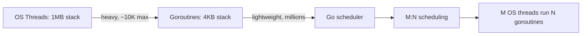
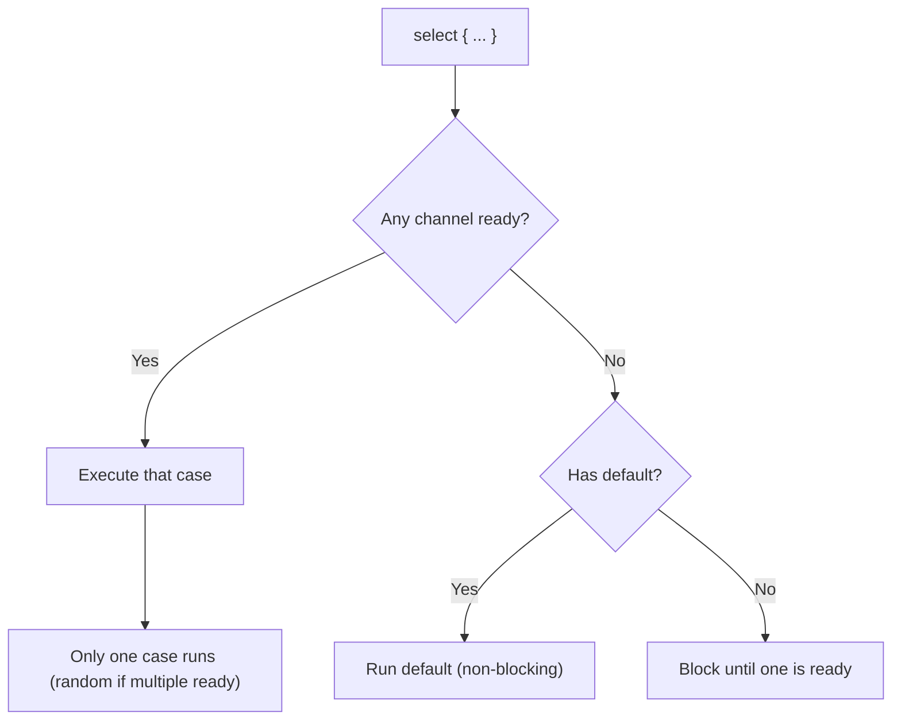
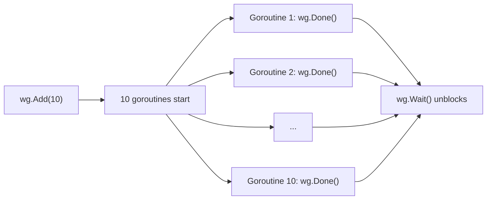

# Goroutines and Channels

> [!summary] Goal
> Start goroutines safely, communicate via channels, coordinate with `sync.WaitGroup`, handle timeouts with tickers, and avoid goroutine leaks.

## Table of Contents

1. [Why Goroutines Matter](#why-goroutines-matter)
2. [Goroutines](#goroutines)
3. [Channels](#channels)
4. [`select` Statement](#select-statement)
5. [`sync.WaitGroup`](#sync-waitgroup)
6. [`time.Ticker` and `time.Timer`](#time-ticker-and-time-timer)
7. [`for range` Over Channels](#for-range-over-channels)
8. [Common Patterns](#common-patterns)
9. [Pitfalls](#pitfalls)

---

## Why Goroutines Matter

Goroutines are lightweight threads managed by the Go runtime. They start with ~4KB stacks (vs ~1MB for OS threads) and can run millions in a single process.



> [!tip] Definition
> **Goroutine**: a lightweight thread of execution managed by the Go runtime, not the OS. Created with the `go` keyword. Multiplexed onto OS threads by the Go scheduler.

---

## Goroutines

```go
// Start a goroutine
go doWork()

// With anonymous function
go func() {
    fmt.Println("hello from goroutine")
}()

// With parameters (evaluated immediately)
msg := "hello"
go func(m string) {
    fmt.Println(m)
}(msg)         // msg is PASSED (captured), not mutated later

// No way to wait for completion (use channels or sync.WaitGroup)
// No way to get a return value (use channels)
```

---

## Channels

Channels are Go's way of communicating between goroutines. They are typed conduits.

```go
// Unbuffered channel — sender blocks until receiver is ready
ch := make(chan int)
go func() { ch <- 42 }()          // send (blocks until received)
v := <-ch                         // receive (blocks until sent)

// Buffered channel — sender blocks only when buffer is full
ch := make(chan string, 3)
ch <- "a"                         // non-blocking (buffer has space)
ch <- "b"                         // non-blocking
ch <- "c"                         // non-blocking
// ch <- "d"                      // BLOCKS (buffer full)
fmt.Println(<-ch)                 // "a"

// Closing a channel
close(ch)                         // signals no more values
v, ok := <-ch                     // ok = false when channel is closed
```

| Channel | Buffer | Behavior |
|---------|--------|----------|
| Unbuffered | `make(chan T)` | Send blocks until receive. Receive blocks until send. **Synchronization primitive** |
| Buffered | `make(chan T, N)` | Send blocks only when full. Receive blocks only when empty |

### Channel ownership

```go
// The sender should close the channel — never the receiver
// Closing a channel is a signal that no more values will be sent

ch := make(chan int)

// Producer (sender)
go func() {
    for i := 0; i < 10; i++ {
        ch <- i
    }
    close(ch)          // ✅ producer closes
}()

// Consumer (receiver)
for v := range ch {    // receives until close
    fmt.Println(v)
}
```

---

## `select` Statement

`select` waits on multiple channel operations simultaneously:

```go
select {
case v := <-ch1:
    fmt.Println("received from ch1:", v)
case v := <-ch2:
    fmt.Println("received from ch2:", v)
case ch3 <- value:
    fmt.Println("sent to ch3")
case <-time.After(1 * time.Second):
    fmt.Println("timeout — no channels ready")
default:
    fmt.Println("no channel ready — non-blocking")
}
```



### Patterns

```go
// Non-blocking receive
select {
case v := <-ch:
    fmt.Println(v)
default:
    fmt.Println("nothing ready")
}

// Timeout
select {
case v := <-ch:
    fmt.Println(v)
case <-time.After(2 * time.Second):
    fmt.Println("timeout!")
}
```

---

## `sync.WaitGroup`

Wait for a collection of goroutines to finish:

```go
var wg sync.WaitGroup

for i := 0; i < 10; i++ {
    wg.Add(1)                    // increment counter BEFORE goroutine
    go func(id int) {
        defer wg.Done()          // decrement counter when done
        fmt.Println("worker", id)
    }(i)
}

wg.Wait()                        // blocks until counter reaches 0
fmt.Println("all workers done")
```



> [!warning] Call `wg.Add()` **before** launching the goroutine, not inside it. Otherwise there's a race where `wg.Wait()` might execute before all `Add` calls.

---

## `time.Ticker` and `time.Timer`

```go
// Ticker — fires repeatedly
ticker := time.NewTicker(1 * time.Second)
go func() {
    for t := range ticker.C {
        fmt.Println("Tick at", t)
    }
}()
time.Sleep(5 * time.Second)
ticker.Stop()                    // prevent leak

// Timer — fires once
timer := time.NewTimer(2 * time.Second)
<-timer.C                        // blocks for 2 seconds

// Alternative: time.After (creates a timer, use for select)
select {
case v := <-ch:
    fmt.Println(v)
case <-time.After(500 * time.Millisecond):
    fmt.Println("timeout")
}
```

---

## `for range` Over Channels

Receive values until the channel is closed:

```go
ch := make(chan int)

// Producer
go func() {
    for i := 0; i < 5; i++ {
        ch <- i
    }
    close(ch)
}()

// Consumer — receives until close
for v := range ch {
    fmt.Println(v)   // 0, 1, 2, 3, 4
}
```

---

## Common Patterns

### Fan-out (distribute work)

```go
jobs := make(chan int, 100)
results := make(chan int, 100)

// Start 3 workers
var wg sync.WaitGroup
for w := 0; w < 3; w++ {
    wg.Add(1)
    go func() {
        defer wg.Done()
        for j := range jobs {
            results <- j * 2      // process job
        }
    }()
}

// Send jobs
for j := 0; j < 10; j++ {
    jobs <- j
}
close(jobs)                       // signal no more jobs

// Wait for all workers
go func() {
    wg.Wait()
    close(results)                 // close results when all workers done
}()

// Read results
for r := range results {
    fmt.Println(r)
}
```

### Done channel pattern

```go
done := make(chan struct{})       // empty struct — zero memory

go func() {
    // do work
    close(done)                   // signal completion
}()

<-done                            // wait for completion
```

---

## Pitfalls

### Goroutine leak — sending to unbuffered channel without receiver

```go
ch := make(chan int)
go func() {
    ch <- 42        // blocks forever — nobody reads from ch
}()
// ch is never read — goroutine leaks
```

**Fix**: Ensure a corresponding receive exists, or use a buffered channel.

### Closing a closed channel

```go
close(ch)
close(ch)           // PANIC: close of closed channel
```

**Fix**: Only the sender closes. Use `sync.Once` if multiple goroutines might close.

### Sending on a nil channel blocks forever

```go
var ch chan int     // nil channel
ch <- 42            // blocks FOREVER
```

**Fix**: Always initialize channels with `make()`.

### Not stopping a ticker

```go
ticker := time.NewTicker(1 * time.Second)
// ... forgot to call ticker.Stop()
// ticker leaks until the function returns
```

**Fix**: Always `defer ticker.Stop()` after creating a ticker.

---

> [!question]- Interview Questions
>
> **Q: What is the difference between buffered and unbuffered channels?**
> A: Unbuffered channels synchronize — send blocks until receive. Buffered channels decouple — send blocks only when the buffer is full.
>
> **Q: How does `select` work?**
> A: `select` waits until one of its cases is ready. If multiple are ready, one is chosen randomly. A `default` case makes it non-blocking.
>
> **Q: How do you wait for multiple goroutines to finish?**
> A: Use `sync.WaitGroup`. Call `Add` before launching, `Done` in each goroutine (deferred), and `Wait` to block until all complete.

---

## Cross-Links

- [[Go/02_Core/02_Concurrency_Patterns_WorkerPools_FanInOut]] for advanced patterns
- [[Go/02_Core/03_Data_Races_Sync_and_Atomics]] for synchronization primitives
- [[Go/04_Playbooks/01_Debug_Goroutine_Leaks_and_Deadlocks]] for debugging

---

## References

- [Go Blog: Goroutines](https://go.dev/blog/gosched)
- [Go Blog: Share Memory By Communicating](https://go.dev/blog/codelab-share)
- [Go by Example: Goroutines](https://gobyexample.com/goroutines)
- [Go by Example: Channels](https://gobyexample.com/channels)
- [Go by Example: Select](https://gobyexample.com/select)
