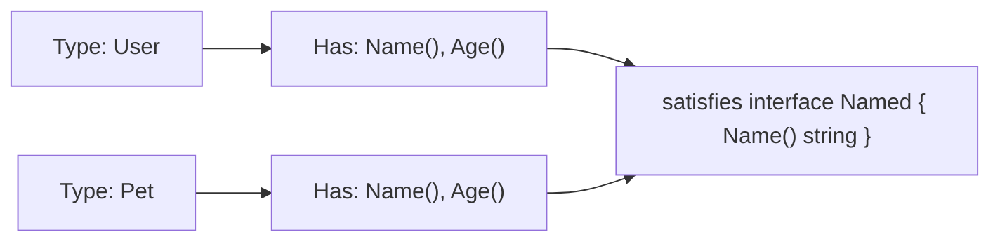
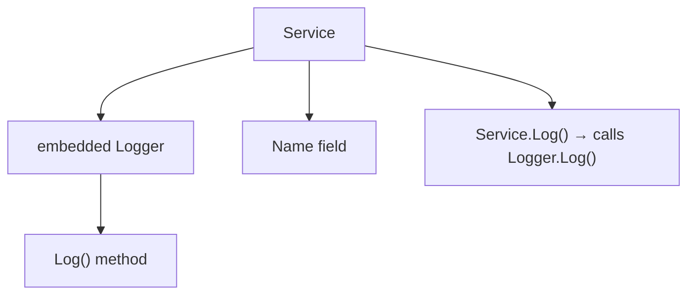
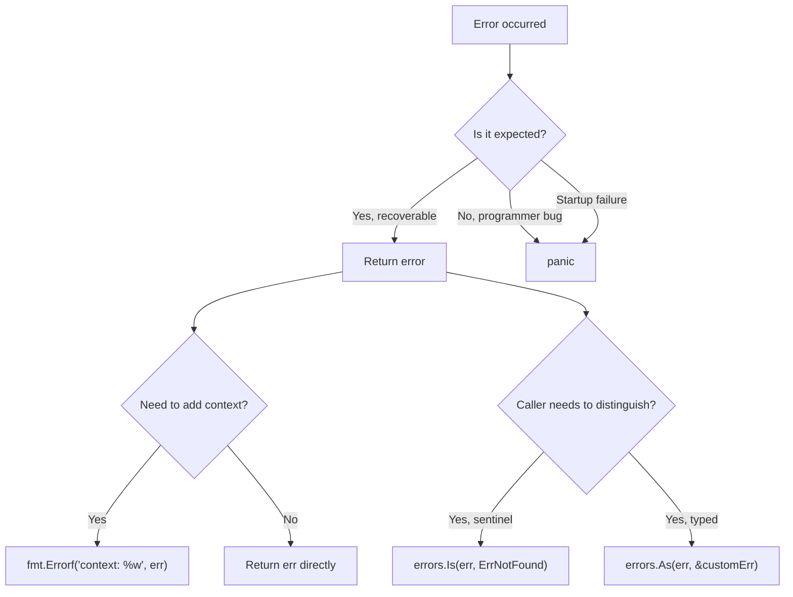

# Interfaces and Error Handling

> [!summary] Goal
> Design composable interfaces, handle errors explicitly, understand `defer` mechanics, and use `panic`/`recover` only when appropriate.

## Table of Contents

1. [Why Interfaces Work Differently in Go](#why-interfaces-work-differently-in-go)
2. [Interface Definition and Satisfaction](#interface-definition-and-satisfaction)
3. [Struct Embedding](#struct-embedding)
4. [Common Standard Library Interfaces](#common-standard-library-interfaces)
5. [`defer` Mechanics](#defer-mechanics)
6. [`panic` and `recover`](#panic-and-recover)
7. [Error Handling Patterns](#error-handling-patterns)
8. [Custom Error Types](#custom-error-types)
9. [Pitfalls](#pitfalls)

---

## Why Interfaces Work Differently in Go

Go interfaces are **implicitly satisfied** — a type doesn't declare `implements`, it just needs to have the right methods. This enables ad-hoc polymorphism without coupling.



---

## Interface Definition and Satisfaction

```go
// Define an interface
type Stringer interface {
    String() string
}

// Define a type — no explicit "implements"
type User struct {
    Name string
}

// Implement the interface by having the method
func (u User) String() string {
    return "User: " + u.Name
}

// Any function accepting the interface
func printString(s Stringer) {
    fmt.Println(s.String())
}

// Usage
u := User{Name: "Alice"}
printString(u)                     // ✅ works — User satisfies Stringer implicitly
```

### Interface as contract

```go
// Consumer-side interface definition — define what YOU need
type Store interface {
    Get(id string) (Item, error)
    Save(item Item) error
}

// Your function depends on the interface, not the concrete type
func ProcessItems(s Store, ids []string) error {
    for _, id := range ids {
        item, err := s.Get(id)
        if err != nil {
            return err
        }
        // process item...
    }
    return nil
}
```

### The empty interface

```go
// any (or interface{}) — accepts any type
func PrintAny(v any) {
    fmt.Printf("value: %v, type: %T\n", v, v)
}

PrintAny(42)                 // value: 42, type: int
PrintAny("hello")            // value: hello, type: string
PrintAny(struct{ X int }{42}) // value: {42}, type: struct { X int }
```

---

## Struct Embedding

Go uses **composition** over inheritance. Embedding promotes fields and methods:

```go
type Logger struct{}

func (l Logger) Log(msg string) {
    fmt.Println("LOG:", msg)
}

type Service struct {
    Logger                         // embedded — Log method promoted
    Name string
}

s := Service{Name: "api"}
s.Log("starting up")              // ✅ promoted from Logger
s.Logger.Log("explicit")          // also works
```



### Embedding interfaces

```go
type Reader interface {
    Read(p []byte) (n int, err error)
}

type Writer interface {
    Write(p []byte) (n int, err error)
}

// Embedding two interfaces into one
type ReadWriter interface {
    Reader
    Writer
}
```

### Method promotion

```go
type Base struct {
    Value int
}

func (b Base) Describe() string {
    return fmt.Sprintf("value: %d", b.Value)
}

type Derived struct {
    Base                          // Describe promoted
    Extra string
}

d := Derived{Base: Base{Value: 42}, Extra: "hello"}
fmt.Println(d.Describe())        // value: 42 — promoted method
```

---

## Common Standard Library Interfaces

```go
// fmt.Stringer — string representation
type Stringer interface { String() string }

// error — the error interface
type error interface { Error() string }

// io.Reader — read bytes
type Reader interface { Read(p []byte) (n int, err error) }

// io.Writer — write bytes
type Writer interface { Write(p []byte) (n int, err error) }

// sort.Interface — sort collections
type Interface interface {
    Len() int
    Less(i, j int) bool
    Swap(i, j int)
}

// http.Handler — HTTP handlers
type Handler interface { ServeHTTP(w http.ResponseWriter, r *http.Request) }
```

### Implementing `sort.Interface`

```go
type User struct { Name string; Age int }

type ByAge []User

func (a ByAge) Len() int           { return len(a) }
func (a ByAge) Less(i, j int) bool { return a[i].Age < a[j].Age }
func (a ByAge) Swap(i, j int)      { a[i], a[j] = a[j], a[i] }

users := []User{{"Alice", 30}, {"Bob", 25}}
sort.Sort(ByAge(users))            // sorted by Age
```

---

## `defer` Mechanics

`defer` schedules a function call to run when the surrounding function returns. Deferred calls are pushed onto a stack and executed in **LIFO order** (last-in-first-out).

```go
func readFile(path string) error {
    f, err := os.Open(path)
    if err != nil {
        return err
    }
    defer f.Close()                // runs when readFile returns
    // ... process file ...
    return nil
}
```

### Defer stack ordering

```go
func example() {
    defer fmt.Println("first")     // 3. runs last
    defer fmt.Println("second")    // 2. runs second
    defer fmt.Println("third")     // 1. runs first
}
// Output: third, second, first
```

### Argument evaluation

```go
func evalDemo() {
    x := 10
    defer fmt.Println(x)           // prints 10 (NOT 20) — x is evaluated NOW
    x = 20
}
// Output: 10
```

### Defer in loops — resource leak

```go
// BAD — files not closed until function returns
for _, file := range files {
    f, _ := os.Open(file)
    defer f.Close()                // accumulates! runs ALL at function exit
    // process...
}

// GOOD — close inside loop
for _, file := range files {
    f, _ := os.Open(file)
    f.Close()
}
```

---

## `panic` and `recover`

Panic stops the ordinary flow of control, unwinds the stack, and runs deferred functions. `recover` regains control of a panicking goroutine.

```go
// Panic — used for programmer errors, not normal error handling
func must(err error) {
    if err != nil {
        panic(err)
    }
}

// Recover — only useful inside deferred functions
func safeCall() (err error) {
    defer func() {
        if r := recover(); r != nil {
            err = fmt.Errorf("panicked: %v", r)
        }
    }()
    dangerousFunction()
    return nil
}
```

### When to use panic

| Use panic | Don't use panic |
|-----------|-----------------|
| Programmer error (nil dereference, array bounds) | Expected errors (file not found, validation) |
| `main()` startup failure (can't bind port) | User-facing error handling |
| `init()` failure | Network, I/O, database errors |

---

## Error Handling Patterns

### Basic error handling

```go
f, err := os.Open(filename)
if err != nil {
    return fmt.Errorf("opening %s: %w", filename, err)   // %w wraps
}
defer f.Close()
```

### Sentinel errors

```go
var ErrNotFound = errors.New("item not found")

func GetItem(id string) (Item, error) {
    if id == "" {
        return Item{}, ErrNotFound
    }
    // ...
}

// Check with errors.Is
if errors.Is(err, ErrNotFound) {
    fmt.Println("item not found — return 404")
}
```

### Typed errors

```go
type ValidationError struct {
    Field string
    Value any
    Err   error
}

func (e *ValidationError) Error() string {
    return fmt.Sprintf("validation: %s has invalid value %v: %v",
        e.Field, e.Value, e.Err)
}

func (e *ValidationError) Unwrap() error {
    return e.Err
}

// Check with errors.As
var valErr *ValidationError
if errors.As(err, &valErr) {
    fmt.Printf("field %s failed: %v\n", valErr.Field, valErr.Err)
}
```

### Multiple error wrapping (Go 1.20+)

```go
func validate(input Input) error {
    var errs error
    if input.Name == "" {
        errs = errors.Join(errs, errors.New("name is required"))
    }
    if input.Age < 0 {
        errs = errors.Join(errs, errors.New("age must be positive"))
    }
    return errs
}
```

### Error handling strategy



---

## Pitfalls

### Interface containing nil pointer

```go
var p *int = nil
var i interface{} = p
fmt.Println(i == nil)            // false!
// interface is nil only when BOTH type AND value are nil
```

**Fix**: Never assign a typed nil to an interface. Return a typed `nil` from the function.

### `defer recover()` in wrong goroutine

```go
go func() {
    defer func() {
        recover()                // recovers panics in THIS goroutine
    }()
    // ...
}()
```

`recover()` only works in the **same goroutine** where the panic occurred.

### Not checking errors

```go
f, _ := os.Open(filename)        // silently ignores error
f.Read(...)                      // may panic if f is nil
```

**Fix**: Always check errors. Go has no exceptions — check every error.

---

> [!question]- Interview Questions
>
> **Q: How does interface satisfaction work in Go?**
> A: Implicitly — if a type has all the methods an interface requires, it satisfies the interface. No `implements` keyword needed.
>
> **Q: How does `defer` work?**
> A: Deferred calls are pushed onto a stack and executed in LIFO order when the function returns. Arguments are evaluated at the time of `defer`, not when the deferred function runs.
>
> **Q: What is the difference between sentinel errors and typed errors?**
> A: Sentinel errors are predefined values (`var ErrNotFound = errors.New(...)`). Typed errors are custom types implementing the `error` interface, often with additional context. Use `errors.Is` for sentinel and `errors.As` for typed errors.
>
> **Q: When would you use `panic` instead of returning an error?**
> A: For programmer errors (nil dereference, index out of bounds) and unrecoverable `main()` failures. Expected errors should always be returned.

---

## Cross-Links

- [[Go/01_Foundations/01_Go_Basics]] for type assertions
- [[Go/02_Core/05_Stdlib_IO_Encoding_and_JSON]] for io.Reader/Writer implementations
- [[Go/03_Advanced/05_Reflection_and_Unsafe]] for interface reflection

---

## References

- [Go Blog: Interface](https://go.dev/blog/interfaces)
- [Go Blog: Error handling and Go](https://go.dev/blog/error-handling-and-go)
- [Go Blog: Defer, Panic, and Recover](https://go.dev/blog/defer-panic-and-recover)
- [Go By Example: Embedding](https://gobyexample.com/embedding)
