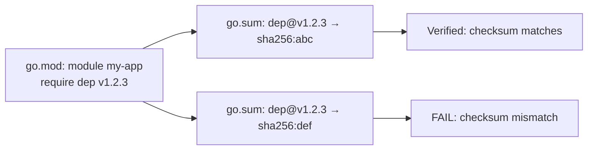
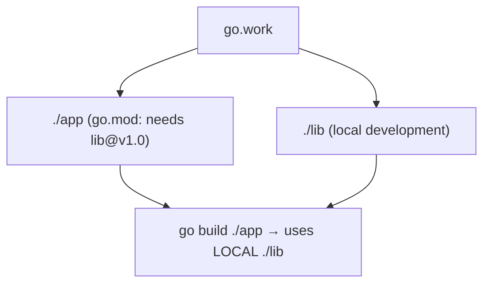
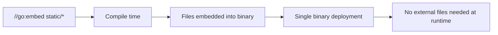

# Modules, Packages, and Tooling

> [!summary] Goal
> Manage dependencies, structure packages, use Go's build toolchain, and leverage directives like `//go:embed`, `//go:generate`, and build tags.

## Table of Contents

1. [Why Modules Matter](#why-modules-matter)
2. [Module Basics](#module-basics)
3. [Dependency Management](#dependency-management)
4. [Go Workspace Mode (`go work`)](#go-workspace-mode)
5. [Packages and Visibility](#packages-and-visibility)
6. [Build Tags](#build-tags)
7. [`//go:embed`](#goembed)
8. [`//go:generate`](#gogenerate)
9. [Go Tooling Reference](#go-tooling-reference)
10. [Pitfalls](#pitfalls)

---

## Why Modules Matter

Go modules define the root of a project and its dependency requirements (version, hash, source). Without modules, external packages can't be versioned.



---

## Module Basics

```bash
# Initialize a module
go mod init github.com/user/my-app

# Add dependencies (runs when you import)
go mod tidy                    # add missing, remove unused

# Download dependencies
go mod download                # download all deps to module cache

# Vendor dependencies
go mod vendor                  # copy deps to vendor/ directory

# Verify dependencies
go mod verify                  # verify checksums against go.sum
```

```go
// go.mod
module github.com/user/my-app

go 1.22

require (
    github.com/gorilla/mux v1.8.1
    go.uber.org/zap v1.27.0
)

// replace — use local version during development
replace github.com/gorilla/mux => ../local/mux
```

### Versioning in `go.mod`

```go
require (
    // Semantic versioning
    github.com/foo/bar v1.2.3

    // Pre-release
    github.com/foo/bar v1.2.3-beta.1

    // Pseudo-version (for unreleased commits)
    github.com/foo/bar v0.0.0-20240501123456-abc123def456

    // +incompatible for pre-Go-modules libraries
    gopkg.in/check.v1 v1.0.0-20201130134442-10cb98267c6c
)
```

---

## Dependency Management

```bash
# Add a specific version
go get github.com/gorilla/mux@v1.8.1

# Update to latest
go get -u github.com/gorilla/mux

# Update all dependencies
go get -u ./...

# Remove unused dependencies
go mod tidy

# Check for updates
go list -u -m all
```

### Module proxy

```bash
# Default: proxy.golang.org — Google's module mirror
# Set your own proxy:
export GOPROXY=https://proxy.example.com,https://proxy.golang.org,direct

# Disable proxy (direct from VCS)
export GOPROXY=direct

# Private modules — don't go through proxy
export GONOSUMCHECK=github.com/myorg/*
export GONOSUMDB=github.com/myorg/*
export GOPRIVATE=github.com/myorg/*
```

---

## Go Workspace Mode (`go work`)

`go work` lets you work on multiple modules simultaneously — useful for local development across repos:

```bash
# Initialize a workspace
go work init ./app ./lib

# Add a module to the workspace
go work use ./another-module

# Replace go.mod replace directives in workspace
go work edit -replace github.com/foo/bar=../bar

# go.work file
go 1.22

use (
    ./app
    ./lib
)

replace github.com/foo/bar => ./local/bar
```



---

## Packages and Visibility

```go
// myapp/
// ├── cmd/server/main.go       // package main — entry point
// ├── internal/
// │   └── db/
// │       └── db.go            // package db — only visible to myapp
// ├── pkg/
// │   └── api/
// │       └── handler.go       // package api — public, importable
// └── go.mod
```

| Convention | Import path | Visibility |
|-----------|-------------|------------|
| `cmd/` | `cmd/server` | `package main` — binary entry points |
| `internal/` | `internal/db` | Private to the module's root (enforced by compiler) |
| `pkg/` | `pkg/api` | Public, importable by external projects |
| `api/` | `api/proto` | API definitions (protobuf, OpenAPI) |

### The `internal` package rule

```go
// myapp/internal/db/db.go
package db

// myapp/cmd/server/main.go
import "myapp/internal/db"   // ✅ OK — same module

// external-project/main.go
import "myapp/internal/db"   // ❌ ERROR — compiler enforces internal restriction
```

---

## Build Tags

Build tags conditionally include or exclude files from compilation:

```go
//go:build linux

package osutil

func GetDefaultPath() string {
    return "/etc/config"
}
```

```go
//go:build !linux

package osutil

func GetDefaultPath() string {
    return "./config"
}
```

### File naming convention

```go
# Go automatically selects based on OS and architecture:
foo_linux.go          // linux only
foo_darwin.go         // macOS only
foo_windows.go        // windows only
foo_amd64.go          // amd64 architecture only
foo_linux_amd64.go    // linux + amd64
foo_test.go           // test file
```

### Custom build tags

```go
//go:build integration

package db_test

func TestPostgresConnection(t *testing.T) {
    // only runs with: go test --tags=integration
}
```

```bash
go test --tags=integration ./...
go build --tags="debug profile" ./cmd/server
```

---

## `//go:embed`

Embed static files into the binary at compile time:

```go
import (
    "embed"
    "net/http"
)

//go:embed static/*
var staticFiles embed.FS

//go:embed config.yaml
var configYAML []byte

//go:embed templates/*.html
var templateFS embed.FS

// Serve embedded files
func main() {
    http.Handle("/static/", http.FileServer(http.FS(staticFiles)))
    log.Fatal(http.ListenAndServe(":8080", nil))
}
```



---

## `//go:generate`

Run commands at code generation time:

```go
//go:generate protoc -I=. --go_out=. ./api/v1/*.proto
//go:generate stringer -type=Status
//go:generate mockgen -source=store.go -destination=mock_store.go -package=mock

type Status int

const (
    Active Status = iota
    Inactive
    Deleted
)
```

```bash
go generate ./...     // runs all //go:generate directives
```

---

## Go Tooling Reference

| Command | Purpose |
|---------|---------|
| `go build ./...` | Compile everything |
| `go run ./cmd/server` | Compile and run |
| `go test ./...` | Run all tests |
| `go test -cover ./...` | Run with coverage |
| `go test -race ./...` | Run with race detector |
| `go fmt ./...` | Format all code |
| `go vet ./...` | Static analysis |
| `go mod tidy` | Clean up dependencies |
| `go mod verify` | Verify checksums |
| `go work sync` | Sync workspace dependencies |
| `go clean -cache` | Clear build cache |
| `go env GOPATH` | Print environment variable |
| `go doc fmt.Println` | Show documentation |
| `go tool pprof` | Profiling tool |
| `go tool trace` | Execution tracer |

---

## Pitfalls

### Not running `go mod tidy`

Adding an import without running `go mod tidy` leaves `go.sum` incomplete — CI may fail with hash mismatch.

**Fix**: Always run `go mod tidy` before committing. Add it to CI: `go mod tidy && git diff --exit-code go.*`.

### `replace` in `go.mod` committed to production

A `replace` directive that points to a local path won't work in CI or production builds.

**Fix**: Use `go.work` for local development. Remove `replace` from `go.mod` before committing, or use versioned dependencies.

### `internal` package restriction on reorg

Moving an `internal` package outside the module tree breaks all imports.

**Fix**: Keep `internal` packages within the module. Use `pkg/` for genuinely reusable code.

---

> [!question]- Interview Questions
>
> **Q: What is the difference between `go mod tidy` and `go mod download`?**
> A: `go mod tidy` adds missing dependencies and removes unused ones, updating both `go.mod` and `go.sum`. `go mod download` downloads all dependencies to the local module cache without modifying `go.mod`.
>
> **Q: What is `go.work` used for?**
> A: `go work` creates a workspace that lets you develop multiple modules locally without `replace` directives in `go.mod`. Useful for microservice repos or library development.
>
> **Q: How does the `internal` package rule work?**
> A: Packages in `internal/` can only be imported by code within the module that contains the `internal/` directory. The Go compiler enforces this.

---

## Cross-Links

- [[Go/01_Foundations/06_Project_Layout_and_Design_Patterns]] for project structure
- [[Go/03_Advanced/04_Profiling_pprof_and_Tracing]] for `go tool pprof`

---

## References

- [Go Modules Reference](https://go.dev/ref/mod)
- [Go Workspace](https://go.dev/doc/tutorial/workspaces)
- [Go: Embed](https://pkg.go.dev/embed)
- [Go: Generate](https://go.dev/blog/generate)
- [Go: Build Constraints](https://pkg.go.dev/cmd/go#hdr-Build_constraints)
