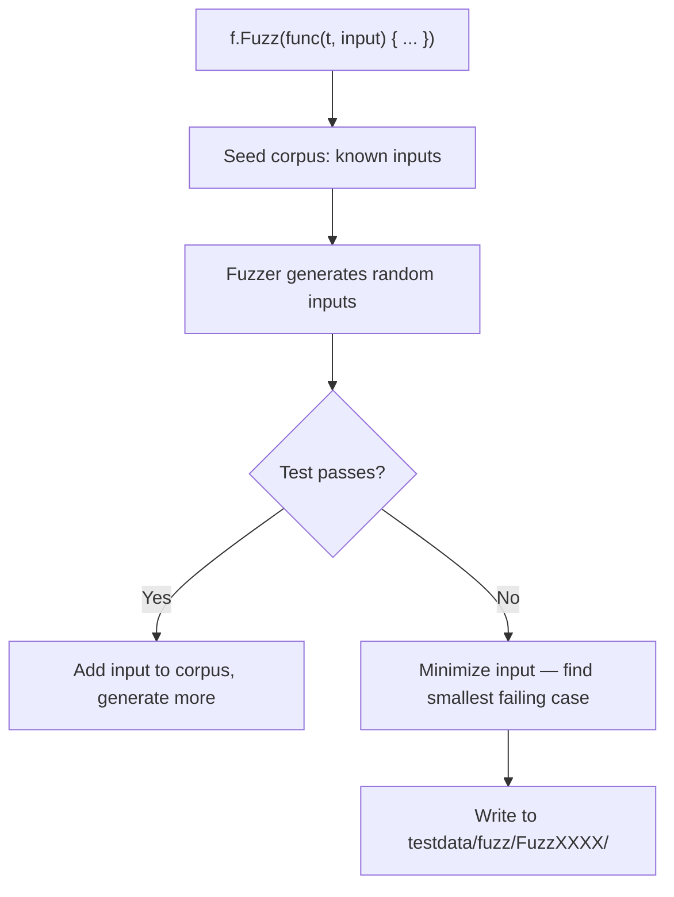

# Testing, Benchmarks, and Profiling

> [!summary] Goal
> Write robust Go tests with table-driven patterns, subtests, helpers, and fuzzing. Benchmark performance. Profile CPU, memory, and goroutines.

## Table of Contents

1. [Why Go Testing Is Different](#why-go-testing-is-different)
2. [Unit Tests](#unit-tests)
3. [Table-Driven Tests](#table-driven-tests)
4. [Subtests](#subtests)
5. [Test Helpers](#test-helpers)
6. [`httptest` for HTTP Testing](#httptest-for-http-testing)
7. [Fuzzing](#fuzzing)
8. [Benchmarks](#benchmarks)
9. [Coverage](#coverage)
10. [Race Detection](#race-detection)
11. [Test Main](#test-main)
12. [Pitfalls](#pitfalls)

---

## Why Go Testing Is Different

Go has built-in testing, benchmarking, and fuzzing — no external test framework needed. Tests are just functions with a specific signature.

```go
// File: math_test.go — co-located with math.go
package math

import "testing"

func TestAdd(t *testing.T) {
    result := Add(2, 3)
    if result != 5 {
        t.Errorf("Add(2, 3) = %d; want 5", result)
    }
}
```

---

## Unit Tests

```go
// Run with: go test ./...
// Run verbose: go test -v ./...
// Run specific: go test -run TestAdd ./...

func TestAdd(t *testing.T) {
    got := Add(2, 3)
    want := 5
    if got != want {
        t.Errorf("Add() = %d, want %d", got, want)
    }
}

func TestDivide(t *testing.T) {
    _, err := Divide(10, 0)
    if err == nil {
        t.Error("expected error for division by zero")
    }
}
```

---

## Table-Driven Tests

The idiomatic Go way to test multiple cases:

```go
func TestAdd(t *testing.T) {
    tests := []struct {
        name string
        a, b int
        want int
    }{
        {name: "positive",     a: 2, b: 3, want: 5},
        {name: "negative",     a: -1, b: 1, want: 0},
        {name: "zero",         a: 0, b: 0, want: 0},
        {name: "large",        a: 1_000_000, b: 2_000_000, want: 3_000_000},
    }

    for _, tt := range tests {
        t.Run(tt.name, func(t *testing.T) {
            got := Add(tt.a, tt.b)
            if got != tt.want {
                t.Errorf("Add(%d, %d) = %d; want %d", tt.a, tt.b, got, tt.want)
            }
        })
    }
}
```

---

## Subtests

```go
func TestUserValidation(t *testing.T) {
    t.Run("email", func(t *testing.T) {
        if !IsValidEmail("user@example.com") {
            t.Error("valid email rejected")
        }
        if IsValidEmail("invalid") {
            t.Error("invalid email accepted")
        }
    })

    t.Run("age", func(t *testing.T) {
        if !IsValidAge(25) {
            t.Error("valid age rejected")
        }
        if IsValidAge(-1) {
            t.Error("negative age accepted")
        }
    })
}

// Run specific subtest:
// go test -run TestUserValidation/email
// go test -run TestUserValidation/age
```

### Parallel subtests

```go
func TestParallel(t *testing.T) {
    tests := []struct {
        input string
        want  string
    }{
        {"hello", "HELLO"},
        {"world", "WORLD"},
    }

    for _, tt := range tests {
        tt := tt    // capture (pre-1.22)
        t.Run(tt.input, func(t *testing.T) {
            t.Parallel()    // run this subtest in parallel
            got := Upper(tt.input)
            if got != tt.want {
                t.Errorf("Upper(%q) = %q; want %q", tt.input, got, tt.want)
            }
        })
    }
}
```

---

## Test Helpers

```go
func TestWithDatabase(t *testing.T) {
    db := setupTestDB(t)       // helper
    defer db.Close()

    // use db...
}

func setupTestDB(t *testing.T) *sql.DB {
    t.Helper()                 // marks this as a helper — failure line points to CALLER
    db, err := sql.Open("postgres", "postgres://localhost:5432/test?sslmode=disable")
    if err != nil {
        t.Fatalf("failed to connect: %v", err)
    }
    t.Cleanup(func() {
        db.Close()
    })
    return db
}
```

```bash
# Running
go test -v -run TestWithDatabase ./...
```

---

## `httptest` for HTTP Testing

```go
func TestHandler(t *testing.T) {
    // Create a request
    req := httptest.NewRequest("GET", "/api/users", nil)
    w := httptest.NewRecorder()

    // Call the handler
    handler(w, req)

    // Assert response
    resp := w.Result()
    body, _ := io.ReadAll(resp.Body)

    if resp.StatusCode != http.StatusOK {
        t.Errorf("status = %d; want %d", resp.StatusCode, http.StatusOK)
    }
    if !strings.Contains(string(body), "users") {
        t.Errorf("body missing 'users': %s", body)
    }
}

// Test with a test server
func TestWithServer(t *testing.T) {
    srv := httptest.NewServer(http.HandlerFunc(func(w http.ResponseWriter, r *http.Request) {
        fmt.Fprintln(w, "Hello, client")
    }))
    defer srv.Close()

    resp, err := http.Get(srv.URL)
    if err != nil {
        t.Fatal(err)
    }
    defer resp.Body.Close()
    body, _ := io.ReadAll(resp.Body)
    t.Logf("Response: %s", body)
}
```

---

## Fuzzing

Fuzzing generates random inputs to find edge cases and crashes:

```go
func FuzzReverse(f *testing.F) {
    // Seed corpus — known inputs
    f.Add("hello")
    f.Add("world")
    f.Add("12345")

    // Fuzz target
    f.Fuzz(func(t *testing.T, s string) {
        reversed := Reverse(s)
        doubleReversed := Reverse(reversed)
        if s != doubleReversed {
            t.Errorf("Reverse(Reverse(%q)) = %q; want %q", s, doubleReversed, s)
        }
    })
}
```

```bash
# Run fuzzing
go test -fuzz=FuzzReverse ./...
go test -fuzz=FuzzReverse -fuzztime=30s ./...

# Run with a specific seed corpus
go test -fuzz=FuzzReverse -fuzz.corpus=./testdata/fuzz ./...
```



---

## Benchmarks

```go
func BenchmarkAdd(b *testing.B) {
    a, c := 1, 2
    for i := 0; i < b.N; i++ {
        Add(a, c)
    }
}

func BenchmarkStringConcat(b *testing.B) {
    parts := []string{"a", "b", "c", "d", "e"}
    for i := 0; i < b.N; i++ {
        result := ""
        for _, p := range parts {
            result += p
        }
    }
}

func BenchmarkStringBuilder(b *testing.B) {
    parts := []string{"a", "b", "c", "d", "e"}
    for i := 0; i < b.N; i++ {
        var sb strings.Builder
        for _, p := range parts {
            sb.WriteString(p)
        }
        _ = sb.String()
    }
}
```

```bash
# Run benchmarks
go test -bench=. ./...
go test -bench=BenchmarkString -benchmem ./...
# BenchmarkStringConcat-8   1000000   1234 ns/op   16 B/op   8 allocs/op
# BenchmarkStringBuilder-8  3000000    432 ns/op    8 B/op   1 allocs/op
```

---

## Coverage

```bash
# Run with coverage
go test -cover ./...
# ok  myapp/math   0.002s  coverage: 85.6% of statements

# Generate coverage profile and view
go test -coverprofile=coverage.out ./...
go tool cover -html=coverage.out -o coverage.html
```

---

## Race Detection

```bash
# Run with race detector
go test -race ./...
# Slower (2-20x), but catches data races

go build -race ./cmd/server    # build with race detection
```

---

## Test Main

```go
// TestMain — runs once per package for setup/teardown
func TestMain(m *testing.M) {
    // Setup
    db, _ := sql.Open("postgres", "postgres://localhost:5432/test")
    defer db.Close()

    // Run tests
    code := m.Run()

    // Teardown (deferred runs after m.Run)
    os.Exit(code)
}

// Flag for integration tests
var runIntegration = flag.Bool("integration", false, "run integration tests")

func TestMain(m *testing.M) {
    flag.Parse()
    os.Exit(m.Run())
}

// go test -v -integration ./...
func TestIntegration(t *testing.T) {
    if !*runIntegration {
        t.Skip("integration tests disabled; use -integration flag")
    }
    // ...
}
```

---

## Pitfalls

### Test not running

Tests must be in `*_test.go` files with `func TestXxx(t *testing.T)` signature.

**Fix**: Check `go test -v -run TestXxx ./...` to see if it runs.

### Not resetting the timer in benchmarks

```go
func BenchmarkExpensive(b *testing.B) {
    setupCostlyService()        // this should NOT be in the timed loop
    b.ResetTimer()              // reset the timer AFTER setup
    for i := 0; i < b.N; i++ {
        doWork()
    }
}
```

### Mutual exclusion in parallel subtests

Running `t.Parallel()` inside subtests means they run concurrently. Shared state needs synchronization.

**Fix**: Use `t.Run` sequentially for tests that share state. Use `Parallel` only for independent tests.

---

> [!question]- Interview Questions
>
> **Q: What is a table-driven test in Go?**
> A: A test structured as a slice of structs (inputs + expected output). Each case is run in a loop, often with `t.Run` for named subtests. This is the idiomatic Go testing pattern.
>
> **Q: How does `t.Helper()` work?**
> A: It marks the calling function as a test helper. When the helper reports a failure, the line number referenced is the caller's line, not the helper's line.
>
> **Q: How does Go fuzzing work?**
> A: Fuzz functions receive random inputs via `f.Fuzz`. The fuzzer generates inputs, runs the function, and on failure minimizes the input to the simplest reproducing case.

---

## Cross-Links

- [[Go/04_Playbooks/02_Debug_High_CPU_and_GC_Pressure]] for profiling
- [[Go/03_Advanced/04_Profiling_pprof_and_Tracing]] for pprof profiling
- [[Go/02_Core/04_NetHTTP_Server_Middleware_and_Clients]] for httptest

---

## References

- [Go Testing](https://pkg.go.dev/testing)
- [Go Blog: Fuzzing](https://go.dev/blog/fuzz)
- [Go Blog: Cover](https://go.dev/blog/cover)
- [Go Blog: Benchmarking](https://go.dev/blog/benchmarking)
- [httptest](https://pkg.go.dev/net/http/httptest)
