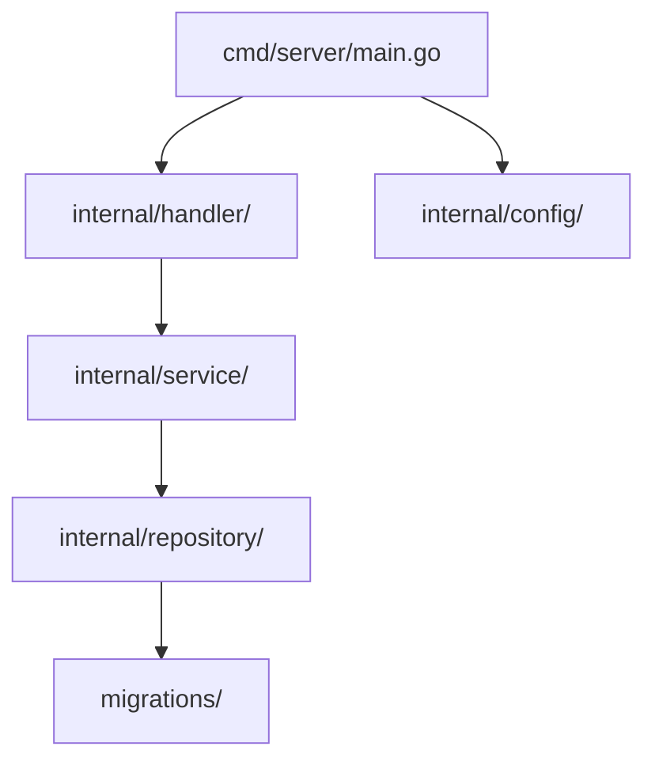
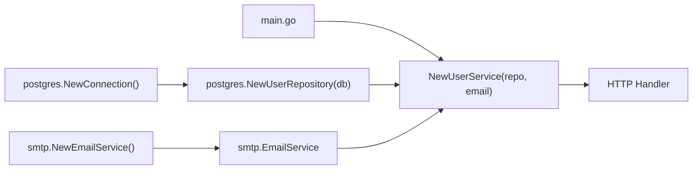

# Project Layout and Design Patterns

> [!summary] Goal
> Structure Go projects for maintainability and clarity: standard directory layout, package design, options pattern, dependency injection, and common architectural patterns.

## Table of Contents

1. [Why Project Layout Matters](#why-project-layout-matters)
2. [Standard Project Layout](#standard-project-layout)
3. [Package Design Principles](#package-design-principles)
4. [Options Pattern (Functional Options)](#options-pattern)
5. [Dependency Injection](#dependency-injection)
6. [Common Architectural Patterns](#common-architectural-patterns)
7. [Pitfalls](#pitfalls)

---

## Why Project Layout Matters

Go doesn't enforce a project structure, but conventions have emerged from the community and standard tooling. A consistent layout makes any Go project navigable.

---

## Standard Project Layout

```
myapp/
├── cmd/                    # Main entry points
│   ├── server/
│   │   └── main.go         # package main — starts the server
│   └── cli/
│       └── main.go         # package main — CLI tool
├── internal/               # Private application code
│   ├── handler/            # HTTP handlers
│   ├── service/            # Business logic
│   ├── repository/         # Data access
│   ├── middleware/          # HTTP middleware
│   └── config/             # Configuration
├── pkg/                    # Public, importable by other projects
│   └── api/
│       └── types.go        # Shared API types
├── migrations/             # Database migrations
├── configs/                # Configuration files
├── deploy/                 # Docker, K8s manifests
├── scripts/                # Build and CI scripts
├── testdata/               # Test fixtures
├── go.mod
├── go.sum
└── Makefile
```



### What goes where

| Directory | Purpose | Importable by |
|-----------|---------|---------------|
| `cmd/` | Main entry points, one `main()` per subdirectory | This module only |
| `internal/` | Private application code | This module only (compiler-enforced) |
| `pkg/` | Library code meant for external use | Any project |
| `migrations/` | SQL migration files | Referenced by migration tools |
| `testdata/` | Test fixture files (Go tooling recognizes this) | Test packages |

---

## Package Design Principles

### 1. No stutter

```go
// BAD — stutter
user.GetUser()
config.SetConfig()

// GOOD — natural
user.Get()
config.Set()
```

### 2. Single responsibility

```go
// BAD — one package does everything
package utils
func ReadConfig()     // config
func SendEmail()      // email
func HashPassword()   // crypto

// GOOD — separate packages
package config
func Read() Config

package notify
type Email struct {}
func (e Email) Send() error

package auth
func HashPassword(pw string) (string, error)
```

### 3. Internal over exported

Start with `internal/`. Export to `pkg/` only when you have a concrete consumer.

### 4. Package documentation

```go
// Package handler provides HTTP handlers for the API.
// It validates requests, calls services, and returns responses.
package handler
```

---

## Options Pattern (Functional Options)

The functional options pattern provides clean, extensible configuration:

```go
type Server struct {
    host    string
    port    int
    timeout time.Duration
    logger  *slog.Logger
}

type Option func(*Server)

func WithHost(host string) Option {
    return func(s *Server) {
        s.host = host
    }
}

func WithPort(port int) Option {
    return func(s *Server) {
        s.port = port
    }
}

func WithTimeout(timeout time.Duration) Option {
    return func(s *Server) {
        s.timeout = timeout
    }
}

func NewServer(opts ...Option) *Server {
    s := &Server{
        host:    "localhost",
        port:    8080,
        timeout: 30 * time.Second,
    }
    for _, opt := range opts {
        opt(s)
    }
    return s
}

// Usage
srv := NewServer(
    WithPort(9090),
    WithTimeout(60*time.Second),
)
```

---

## Dependency Injection

### Manual dependency injection (constructor injection)

```go
// Define interfaces
type UserRepository interface {
    FindByID(id string) (*User, error)
    Save(user *User) error
}

type EmailService interface {
    SendWelcome(email string) error
}

// Service depends on interfaces
type UserService struct {
    repo  UserRepository
    email EmailService
}

func NewUserService(repo UserRepository, email EmailService) *UserService {
    return &UserService{repo: repo, email: email}
}

// Main wire-up
func main() {
    db := postgres.NewConnection(config.DatabaseURL)
    repo := postgres.NewUserRepository(db)
    email := smtp.NewEmailService(config.SMTPHost)
    svc := NewUserService(repo, email)

    // Use svc in HTTP handlers
}
```



### Wire (compile-time DI)

```go
// wire.go
//go:build wireinject
// +build wireinject

func InitializeServer() (*Server, error) {
    wire.Build(
        postgres.NewConnection,
        postgres.NewUserRepository,
        smtp.NewEmailService,
        NewUserService,
        NewServer,
    )
    return nil, nil
}
```

```bash
go install github.com/google/wire/cmd/wire@latest
wire ./...
```

---

## Common Architectural Patterns

### Repository pattern

```go
// internal/repository/user.go
type UserRepository interface {
    FindByID(ctx context.Context, id string) (*User, error)
    FindByEmail(ctx context.Context, email string) (*User, error)
    Create(ctx context.Context, user *User) error
    Update(ctx context.Context, user *User) error
    Delete(ctx context.Context, id string) error
}

type userRepository struct {
    db *sql.DB
}

func NewUserRepository(db *sql.DB) UserRepository {
    return &userRepository{db: db}
}

func (r *userRepository) FindByID(ctx context.Context, id string) (*User, error) {
    row := r.db.QueryRowContext(ctx, "SELECT id, email, name FROM users WHERE id = $1", id)
    var u User
    if err := row.Scan(&u.ID, &u.Email, &u.Name); err != nil {
        return nil, err
    }
    return &u, nil
}
```

### Service layer

```go
// internal/service/user.go
type UserService struct {
    repo  UserRepository
    email EmailService
}

func (s *UserService) Register(ctx context.Context, email, name string) (*User, error) {
    existing, _ := s.repo.FindByEmail(ctx, email)
    if existing != nil {
        return nil, fmt.Errorf("email already registered: %s", email)
    }

    user := &User{
        ID:    uuid.New().String(),
        Email: email,
        Name:  name,
    }
    if err := s.repo.Create(ctx, user); err != nil {
        return nil, fmt.Errorf("creating user: %w", err)
    }
    if err := s.email.SendWelcome(email); err != nil {
        return nil, fmt.Errorf("sending welcome: %w", err)
    }
    return user, nil
}
```

---

## Pitfalls

### Cyclic imports

`package a → package b → package a` — Go doesn't allow circular imports.

**Fix**: Move shared types to a third package, or merge the packages.

### `internal` vs `cmd` confusion

`cmd/` contains only `package main` with thin `main()` functions. Business logic should never be in `cmd/`.

**Fix**: Keep `cmd/` files minimal — just config, dependency injection, and server startup.

### Overusing `pkg/`

Exporting too much from `pkg/` creates coupling with external consumers. Most code should start in `internal/`.

**Fix**: Only move code to `pkg/` when you have a proven external consumer.

---

> [!question]- Interview Questions
>
> **Q: What is the purpose of the `internal` directory?**
> A: The Go compiler enforces that `internal/` packages can only be imported by code within the same module root. It's the standard way to keep code private within a project.
>
> **Q: What is the functional options pattern?**
> A: A pattern for clean, extensible configuration using variadic `Option` functions. Each option is a function that modifies the struct. New options can be added without breaking callers.
>
> **Q: How does dependency injection work in Go?**
> A: Typically via constructor injection: interfaces are passed as arguments to constructors (`NewXxx(a, b, c)`). Manual DI in `main.go` wires everything together. Wire can automate this at compile time.

---

## Cross-Links

- [[Go/01_Foundations/04_Modules_Packages_and_Tooling]] for module and package rules
- [[Go/05_Projects/01_REST_API_net_http_Postgres]] for a complete project example
- [[Go/02_Core/01_Context_Cancellation_and_Timeouts]] for context in services

---

## References

- [Go Project Layout](https://github.com/golang-standards/project-layout)
- [Go Blog: Package Names](https://go.dev/blog/package-names)
- [Go Blog: Dependency Injection with Wire](https://go.dev/blog/wire)
- [Options Pattern](https://dave.cheney.net/2014/10/17/functional-options-for-friendly-apis)
