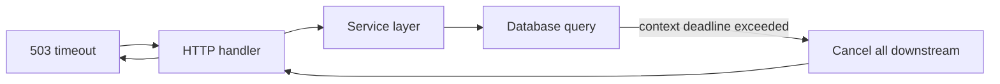
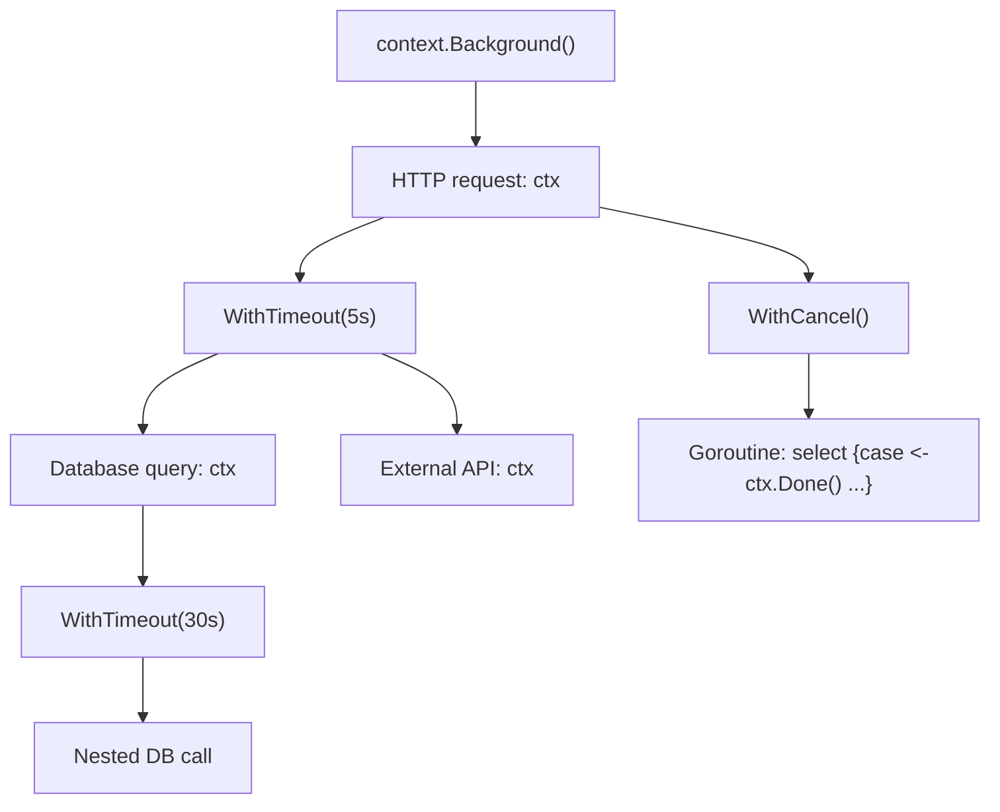

# Context, Cancellation, and Timeouts

> [!summary] Goal
> Use `context.Context` to carry deadlines, cancellation signals, and request-scoped values across API boundaries and goroutines.

## Table of Contents

1. [Why Context Matters](#why-context-matters)
2. [Context Types](#context-types)
3. [Context Derivation Tree](#context-derivation-tree)
4. [Context in HTTP Handlers](#context-in-http-handlers)
5. [Context in Database Calls](#context-in-database-calls)
6. [Context Values](#context-values)
7. [Context in Goroutines](#context-in-goroutines)
8. [Pitfalls](#pitfalls)

---

## Why Context Matters

Without context, there's no way to cancel an in-flight operation — a database query, an HTTP request, or a goroutine. Context propagates cancellation, deadlines, and values across API boundaries.



> [!tip] Definition
> **`context.Context`**: carries a deadline, cancellation signal, and request-scoped values across API boundaries and goroutines. The first argument to every blocking function should be `ctx`.

---

## Context Types

```go
// Background — root context, never cancelled, no deadline, no values
ctx := context.Background()

// TODO — when you haven't decided which context to use
ctx := context.TODO()

// WithCancel — creates a derivable context that can be cancelled
ctx, cancel := context.WithCancel(context.Background())
defer cancel()                // always call cancel to release resources

// WithTimeout — auto-cancels after duration
ctx, cancel := context.WithTimeout(context.Background(), 5*time.Second)
defer cancel()

// WithDeadline — auto-cancels at a specific time
deadline := time.Now().Add(5 * time.Second)
ctx, cancel := context.WithDeadline(context.Background(), deadline)
defer cancel()

// WithValue — carry request-scoped values
ctx := context.WithValue(context.Background(), "request_id", "abc123")
```

### When to use each

| Function | Use case |
|----------|----------|
| `Background()` | Root context in `main()`, tests, top-level handlers |
| `TODO()` | Placeholder — you know you need context but haven't wired it yet |
| `WithCancel()` | When you need manual cancellation (shutdown signal) |
| `WithTimeout()` | When an operation must complete within a duration |
| `WithDeadline()` | When an operation must complete by a specific time |
| `WithValue()` | For request-scoped metadata (request IDs, auth tokens) |

---

## Context Derivation Tree



```go
func HandleRequest(ctx context.Context) {
    // Derive a timeout for DB call
    dbCtx, cancel := context.WithTimeout(ctx, 5*time.Second)
    defer cancel()

    rows, err := db.QueryContext(dbCtx, "SELECT ...")
    if err != nil {
        // check if it was a timeout
        if errors.Is(err, context.DeadlineExceeded) {
            log.Error("db query timed out")
        }
        return
    }
    defer rows.Close()
}
```

---

## Context in HTTP Handlers

```go
func Handler(w http.ResponseWriter, r *http.Request) {
    ctx := r.Context()

    // Log request ID from context
    if reqID, ok := ctx.Value("request_id").(string); ok {
        log.Printf("request %s started", reqID)
    }

    // Pass context to service layer
    user, err := svc.GetUser(ctx, "user-123")
    if err != nil {
        // If client disconnected, don't write response
        if errors.Is(err, context.Canceled) {
            return
        }
        http.Error(w, err.Error(), http.StatusInternalServerError)
        return
    }
    json.NewEncoder(w).Encode(user)
}
```

### Context in HTTP client calls

```go
func callExternalAPI(ctx context.Context) (*Response, error) {
    req, _ := http.NewRequestWithContext(ctx, "GET", "https://api.example.com/data", nil)
    resp, err := http.DefaultClient.Do(req)
    if err != nil {
        // context.Canceled or context.DeadlineExceeded
        return nil, fmt.Errorf("api call: %w", err)
    }
    defer resp.Body.Close()
    // ...
}
```

---

## Context in Database Calls

```go
func (r *Repository) FindByID(ctx context.Context, id string) (*User, error) {
    // Pass context to every database call
    row := r.db.QueryRowContext(ctx, "SELECT id, email, name FROM users WHERE id = $1", id)

    var u User
    if err := row.Scan(&u.ID, &u.Email, &u.Name); err != nil {
        // If context was cancelled, err == context.Canceled
        return nil, fmt.Errorf("finding user %s: %w", id, err)
    }
    return &u, nil
}

func (r *Repository) Create(ctx context.Context, user *User) error {
    // BeginTx with context
    tx, err := r.db.BeginTx(ctx, nil)
    if err != nil {
        return err
    }
    defer tx.Rollback() // no-op if committed

    _, err = tx.ExecContext(ctx, "INSERT INTO users (id, email, name) VALUES ($1, $2, $3)",
        user.ID, user.Email, user.Name)
    if err != nil {
        return err
    }
    return tx.Commit()
}
```

---

## Context Values

```go
type contextKey string

const RequestIDKey contextKey = "request_id"
const UserIDKey contextKey = "user_id"

// Set values
ctx := context.WithValue(context.Background(), RequestIDKey, "abc-123")
ctx = context.WithValue(ctx, UserIDKey, "user-42")

// Get values
if rid, ok := ctx.Value(RequestIDKey).(string); ok {
    fmt.Println("request ID:", rid)
}
```

> [!warning] Context values should carry **request-scoped** metadata (request IDs, auth tokens), not optional function parameters. Use them sparingly — they bypass type safety.

---

## Context in Goroutines

```go
func worker(ctx context.Context) {
    for {
        select {
        case <-ctx.Done():
            fmt.Println("worker shutting down:", ctx.Err())
            return
        case job := <-jobs:
            process(job)
        }
    }
}

// Start worker with cancellation
ctx, cancel := context.WithCancel(context.Background())
go worker(ctx)

// Later — cancel all workers
cancel()
```

---

## Pitfalls

### Storing context in a struct

```go
type Service struct {
    ctx context.Context    // BAD — context should be passed, not stored
}
```

**Fix**: Pass context as the first argument to every function that needs it.

### Not calling cancel (context leak)

```go
ctx, cancel := context.WithTimeout(context.Background(), 5*time.Second)
// forgot defer cancel()
// resources held until timeout expires
```

**Fix**: Always `defer cancel()` immediately after creating a cancellable context.

### Checking `ctx.Done()` instead of `ctx.Err()`

```go
// BAD
select {
case <-ctx.Done():
    fmt.Println("cancelled")
}

// GOOD
select {
case <-ctx.Done():
    fmt.Println("cancelled:", ctx.Err())
}
```

---

> [!question]- Interview Questions
>
> **Q: What is the difference between `Background()` and `TODO()`?**
> A: Both return empty contexts. `Background()` is the root context. `TODO()` is a placeholder when you intend to replace it with a real context later.
>
> **Q: How does context propagate cancellation?**
> A: When a parent context is cancelled, all children derived from it (via `WithCancel`, `WithTimeout`, `WithDeadline`) are also cancelled. `ctx.Done()` returns a channel that's closed on cancellation.
>
> **Q: What does `ctx.Err()` return?**
> A: `nil` if the context is still alive. `Canceled` if cancelled via `cancel()`. `DeadlineExceeded` if the deadline passed.

---

## Cross-Links

- [[Go/01_Foundations/02_Goroutines_and_Channels]] for context in goroutines
- [[Go/02_Core/04_NetHTTP_Server_Middleware_and_Clients]] for HTTP context
- [[Go/02_Core/06_Database_SQL_and_Migrations]] for DB context

---

## References

- [Go Blog: Context](https://go.dev/blog/context)
- [context package](https://pkg.go.dev/context)
- [Go Concurrency Patterns: Context](https://go.dev/blog/pipelines)
