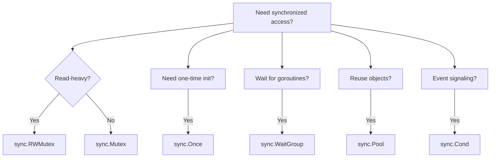
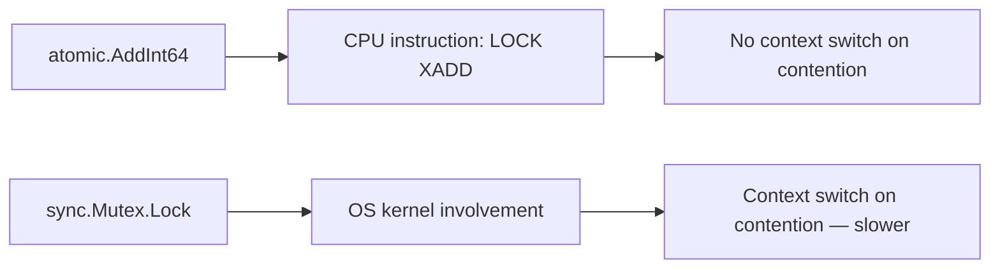
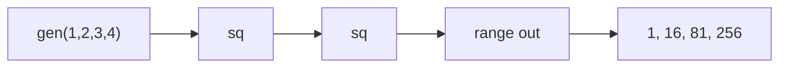

# Concurrency Patterns: sync, Atomics, and Advanced Patterns

> [!summary] Goal
> Synchronize goroutines with `sync.Mutex`, `sync.WaitGroup`, `sync.Once`, `sync.Pool`, and `sync.Cond`. Use `atomic` for lock-free counters. Orchestrate with `errgroup`, pipelines, and worker pools.

## Table of Contents

1. [Why Concurrency Control Matters](#why-concurrency-control-matters)
2. [sync.Mutex and sync.RWMutex](#sync-mutex-and-sync-rwmutex)
3. [sync.WaitGroup](#sync-waitgroup)
4. [sync.Once](#sync-once)
5. [sync.Pool](#sync-pool)
6. [sync.Cond](#sync-cond)
7. [atomic — Lock-Free Operations](#atomic-lock-free-operations)
8. [errgroup — Goroutines with Error Propagation](#errgroup-goroutines-with-error-propagation)
9. [Pipeline Pattern](#pipeline-pattern)
10. [Worker Pool](#worker-pool)
11. [Rate Limiting](#rate-limiting)
12. [Pitfalls](#pitfalls)

---

## Why Concurrency Control Matters

Goroutines are cheap, but shared state creates races, leaks, and deadlocks. The `sync` package provides primitives for coordination.



---

## `sync.Mutex` and `sync.RWMutex`

```go
type Counter struct {
    mu    sync.Mutex
    value int
}

func (c *Counter) Increment() {
    c.mu.Lock()
    c.value++
    c.mu.Unlock()
}

func (c *Counter) Value() int {
    c.mu.Lock()
    defer c.mu.Unlock()
    return c.value
}
```

### `sync.RWMutex` — read-optimized

```go
type Cache struct {
    mu    sync.RWMutex
    data  map[string]string
}

func (c *Cache) Get(key string) (string, bool) {
    c.mu.RLock()                    // multiple readers allowed
    defer c.mu.RUnlock()
    v, ok := c.data[key]
    return v, ok
}

func (c *Cache) Set(key, value string) {
    c.mu.Lock()                     // exclusive lock for writers
    defer c.mu.Unlock()
    c.data[key] = value
}
```

| Mutex type | Readers | Writers | Use when |
|------------|---------|---------|----------|
| `sync.Mutex` | Exclusive | Exclusive | Writes are frequent, or read+write mix |
| `sync.RWMutex` | Shared | Exclusive | Reads dominate writes |

---

## `sync.WaitGroup`

```go
func fetchAll(urls []string) []Result {
    var wg sync.WaitGroup
    results := make(chan Result, len(urls))

    for _, url := range urls {
        wg.Add(1)
        go func(u string) {
            defer wg.Done()
            results <- fetch(u)
        }(url)
    }

    go func() {
        wg.Wait()           // wait for all fetches
        close(results)       // close results channel
    }()

    var out []Result
    for r := range results {
        out = append(out, r)
    }
    return out
}
```

---

## `sync.Once`

```go
var (
    config   *Config
    configMu sync.Once
)

func GetConfig() *Config {
    configMu.Do(func() {
        config = loadConfig()       // runs exactly once
    })
    return config
}
```

**When to use**: Lazy initialization, singleton setup, one-time migration, register globals.

---

## `sync.Pool`

Pool reuses temporary objects to reduce GC pressure:

```go
var bufPool = sync.Pool{
    New: func() any {
        return new(bytes.Buffer)
    },
}

func processRequest(data []byte) string {
    buf := bufPool.Get().(*bytes.Buffer)
    defer bufPool.Put(buf)      // return to pool
    buf.Reset()

    buf.Write(data)
    // transform...
    return buf.String()
}
```

> [!warning] Items in `sync.Pool` can be silently removed at any time (GC). Don't use `sync.Pool` for persistent state — only for temporary, reusable objects.

---

## `sync.Cond`

Condition variables allow goroutines to wait for events:

```go
type Queue struct {
    items []int
    cond  *sync.Cond
}

func NewQueue() *Queue {
    return &Queue{
        cond: sync.NewCond(&sync.Mutex{}),
    }
}

func (q *Queue) Put(item int) {
    q.cond.L.Lock()
    defer q.cond.L.Unlock()
    q.items = append(q.items, item)
    q.cond.Signal()              // wake one waiting goroutine
}

func (q *Queue) Get() int {
    q.cond.L.Lock()
    defer q.cond.L.Unlock()
    for len(q.items) == 0 {
        q.cond.Wait()            // releases lock, waits for Signal
    }
    item := q.items[0]
    q.items = q.items[1:]
    return item
}
```

---

## `atomic` — Lock-Free Operations

```go
var counter atomic.Int64

// Thread-safe counter without mutex
counter.Add(1)
current := counter.Load()

// Swap and compare
counter.Store(100)
old := counter.Swap(200)
swapped := counter.CompareAndSwap(200, 300)

// atomic.Value for any type (lock-free read)
var config atomic.Value
config.Store(&ServerConfig{Port: 8080})
cfg := config.Load().(*ServerConfig)
```



---

## `errgroup` — Goroutines with Error Propagation

```golang.org/x/sync/errgroup```

```go
g, ctx := errgroup.WithContext(context.Background())

for _, url := range urls {
    url := url
    g.Go(func() error {
        resp, err := http.Get(url)
        if err != nil {
            return fmt.Errorf("fetching %s: %w", url, err)
        }
        defer resp.Body.Close()
        // process...
        return nil
    })
}

// Wait returns the FIRST error (cancels other goroutines)
if err := g.Wait(); err != nil {
    log.Printf("one of the fetches failed: %v", err)
}
```

---

## Pipeline Pattern

```go
// Stage 1: generate numbers
func gen(ctx context.Context, nums ...int) <-chan int {
    out := make(chan int)
    go func() {
        defer close(out)
        for _, n := range nums {
            select {
            case out <- n:
            case <-ctx.Done():
                return
            }
        }
    }()
    return out
}

// Stage 2: square numbers
func sq(ctx context.Context, in <-chan int) <-chan int {
    out := make(chan int)
    go func() {
        defer close(out)
        for n := range in {
            select {
            case out <- n * n:
            case <-ctx.Done():
                return
            }
        }
    }()
    return out
}

// Usage
ctx := context.Background()
// Set up pipeline
c := gen(ctx, 1, 2, 3, 4)
out := sq(ctx, sq(ctx, c))

for result := range out {
    fmt.Println(result)  // 1, 16, 81, 256
}
```



---

## Worker Pool

```go
func worker(ctx context.Context, id int, jobs <-chan Job, results chan<- Result) {
    for j := range jobs {
        select {
        case <-ctx.Done():
            return
        default:
            results <- process(j)
        }
    }
}

func main() {
    const numWorkers = 5
    jobs := make(chan Job, 100)
    results := make(chan Result, 100)

    ctx, cancel := context.WithCancel(context.Background())
    defer cancel()

    // Start workers
    var wg sync.WaitGroup
    for w := 0; w < numWorkers; w++ {
        wg.Add(1)
        go func(id int) {
            defer wg.Done()
            worker(ctx, id, jobs, results)
        }(w)
    }

    // Send jobs
    go func() {
        for _, j := range allJobs {
            jobs <- j
        }
        close(jobs)
        wg.Wait()
        close(results)
    }()

    // Collect results
    for r := range results {
        fmt.Println(r)
    }
}
```

---

## Rate Limiting

```go
// Rate limiter — 10 requests per second
limiter := time.NewTicker(100 * time.Millisecond)
defer limiter.Stop()

for _, req := range requests {
    <-limiter.C                    // wait for next slot
    go process(req)
}

// Burst-aware rate limiting with channel
type RateLimiter struct {
    tokens chan struct{}
}

func NewRateLimiter(rate int, burst int) *RateLimiter {
    rl := &RateLimiter{
        tokens: make(chan struct{}, burst),
    }
    for i := 0; i < burst; i++ {
        rl.tokens <- struct{}{}
    }
    go func() {
        ticker := time.NewTicker(time.Second / time.Duration(rate))
        defer ticker.Stop()
        for range ticker.C {
            select {
            case rl.tokens <- struct{}{}:
            default:
            }
        }
    }()
    return rl
}

func (rl *RateLimiter) Wait() {
    <-rl.tokens
}
```

---

---

## Advanced Patterns: `singleflight`, `semaphore.Weighted`, `errgroup.SetLimit`

> [!info] `x/sync` patterns
> The `golang.org/x/sync` package provides production-grade extensions beyond `sync`: `singleflight` (dedup concurrent calls), `semaphore.Weighted` (resource limits), and `errgroup.SetLimit` (bounded concurrency). These are not in the standard library but are developed by the Go team.

### `singleflight` — deduplicate concurrent calls

```go
// singleflight.Group coalesces concurrent calls for the same key.
// Only ONE execution runs; the rest wait for and return the SAME result.
// Perfect for: cache refreshes, DNS lookups, DB query deduplication.

import "golang.org/x/sync/singleflight"

var sf singleflight.Group

func fetchExpensiveData(key string) (string, error) {
    result, err, shared := sf.Do("key:"+key, func() (interface{}, error) {
        // This function runs ONCE per key, even if called 100 times concurrently.
        return loadFromDB(key)
    })
    if err != nil {
        return "", err
    }
    if shared {
        log.Printf("result was shared with %d concurrent callers", /* count */)
    }
    return result.(string), nil
}

// See [[Go/02_Core/03_Data_Races_Sync_Map_and_Typed_Atomics]] for full singleflight docs.
```

### `semaphore.Weighted` — weighted resource pools

```go
// semaphore.Weighted replaces channel-based semaphores with support for
// context cancellation, arbitrary weights, and non-blocking acquires.

import "golang.org/x/sync/semaphore"

var pool = semaphore.NewWeighted(10)  // Max 10 concurrent operations

func doWork(ctx context.Context) error {
    // Acquire 1 permit (blocks until available or ctx canceled)
    if err := pool.Acquire(ctx, 1); err != nil {
        return err
    }
    defer pool.Release(1)

    // At most 10 goroutines are here simultaneously
    return process()
}
```

### `errgroup.SetLimit` — bounded goroutines

```go
// Go 1.20: SetLimit caps the number of active goroutines.
// Automatically blocks g.Go() when the limit is reached.

import "golang.org/x/sync/errgroup"

g, ctx := errgroup.WithContext(ctx)
g.SetLimit(5)  // At most 5 goroutines run concurrently

for _, item := range items {
    item := item
    g.Go(func() error {
        select {
        case <-ctx.Done():
            return ctx.Err()
        default:
        }
        return process(ctx, item)
    })
}
if err := g.Wait(); err != nil {
    log.Printf("processing failed: %v", err)
}
```

## Pipeline Variants

### Or-done channel

```go
// orDone merges a done channel with a value channel.
// When done is closed, the returned channel is also closed immediately.

func orDone[T any](done <-chan struct{}, values <-chan T) <-chan T {
    out := make(chan T)
    go func() {
        defer close(out)
        for {
            select {
            case <-done:
                return
            case v, ok := <-values:
                if !ok {
                    return
                }
                select {
                case out <- v:
                case <-done:
                    return
                }
            }
        }
    }()
    return out
}
```

### Tee channel (split one source into two)

```go
func tee[T any](done <-chan struct{}, in <-chan T) (_, _ <-chan T) {
    out1 := make(chan T)
    out2 := make(chan T)
    go func() {
        defer close(out1)
        defer close(out2)
        for v := range orDone(done, in) {
            // Each value must be sent to BOTH channels
            var o1, o2 = out1, out2
            for i := 0; i < 2; i++ {
                select {
                case <-done:
                    return
                case o1 <- v:
                    o1 = nil  // This channel is done — send to the other
                case o2 <- v:
                    o2 = nil
                }
            }
        }
    }()
    return out1, out2
}
```

### Bridge channel (flatten channels of channels)

```go
func bridge[T any](done <-chan struct{}, chanStream <-chan <-chan T) <-chan T {
    out := make(chan T)
    go func() {
        defer close(out)
        for {
            var ch <-chan T
            select {
            case <-done:
                return
            case maybeCh, ok := <-chanStream:
                if !ok {
                    return
                }
                ch = maybeCh
            }
            for v := range orDone(done, ch) {
                select {
                case out <- v:
                case <-done:
                    return
                }
            }
        }
    }()
    return out
}
```

---

## Pitfalls

### Mutex not released (deadlock)

```go
mu.Lock()
mu.Lock()       // DEADLOCK — same goroutine locks twice
```

**Fix**: `sync.Mutex` is not reentrant. Don't call `Lock` twice in the same goroutine.

### Copying a mutex

```go
type Counter struct {
    mu    sync.Mutex
    value int
}

c1 := Counter{}
c2 := c1        // BAD — copies the mutex (mutex is not copyable)
```

**Fix**: Always pass mutexes by pointer.

### Not using `errgroup` for error handling

Without `errgroup`, a goroutine failure goes unnoticed — the error is silently lost.

**Fix**: Use `errgroup.WithContext` for goroutines that should fail together.

---

> [!question]- Interview Questions
>
> **Q: What is the difference between `sync.Mutex` and `sync.RWMutex`?**
> A: `Mutex` allows exclusive access (one either reads or writes). `RWMutex` allows multiple concurrent readers but exclusive writers. Use `RWMutex` when reads dominate writes.
>
> **Q: When would you use `sync.Once`?**
> A: Lazy initialization, singleton pattern, one-time setup that must run exactly once even with concurrent access.
>
> **Q: What is `errgroup` used for?**
> A: It manages goroutines that all work towards a common goal. If any goroutine returns an error, the group cancels the context and returns the first error.

---

## Cross-Links

- [[Go/01_Foundations/02_Goroutines_and_Channels]] for goroutine basics
- [[Go/04_Playbooks/01_Debug_Goroutine_Leaks_and_Deadlocks]] for debugging
- [[Go/04_Playbooks/03_Debug_HTTP_Timeouts_and_Connection_Leaks]] for HTTP concurrency issues

---

## References

- [sync package](https://pkg.go.dev/sync)
- [sync/atomic](https://pkg.go.dev/sync/atomic)
- [errgroup](https://pkg.go.dev/golang.org/x/sync/errgroup)
- [Go Concurrency Patterns: Pipelines](https://go.dev/blog/pipelines)
- [Go Concurrency Patterns: Timing out, moving on](https://go.dev/blog/concurrency-timeouts)
