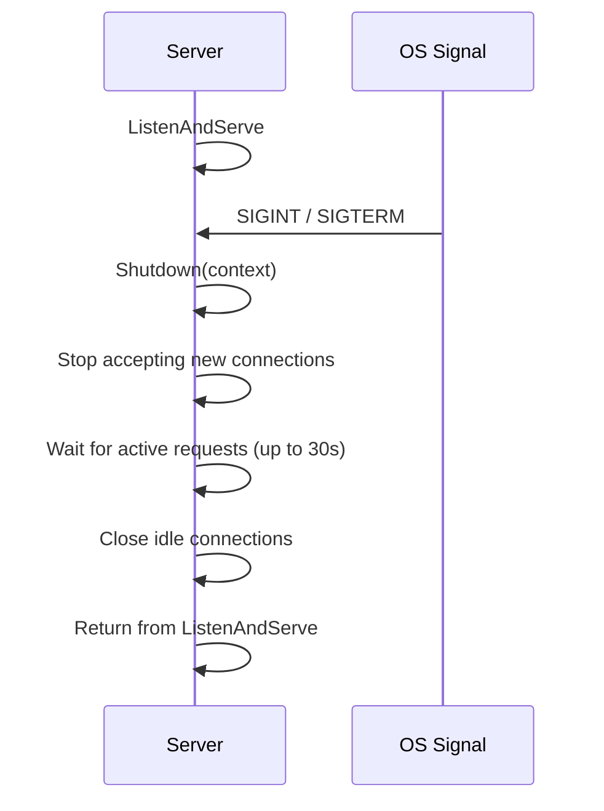

# net/http: Server, Middleware, and Clients

> [!summary] Goal
> Build production HTTP servers in Go: routing, middleware, configuration, client management, TLS, graceful shutdown, and testing with `httptest`.

## Table of Contents

1. [Why Go's HTTP Package Matters](#why-gos-http-package-matters)
2. [Server Configuration](#server-configuration)
3. [Routing](#routing)
4. [Middleware](#middleware)
5. [HTTP Client](#http-client)
6. [TLS and HTTPS](#tls-and-https)
7. [Graceful Shutdown](#graceful-shutdown)
8. [`httptest` for Testing](#httptest-for-testing)
9. [Pitfalls](#pitfalls)

---

## Why Go's HTTP Package Matters

Go's `net/http` is complete enough to build production services without third-party libraries — but understanding its defaults matters.


---

## Server Configuration

```go
srv := &http.Server{
    Addr:              ":8080",
    Handler:           mux,
    ReadTimeout:       10 * time.Second,     // max time to read request
    ReadHeaderTimeout: 5 * time.Second,      // max time to read headers
    WriteTimeout:      10 * time.Second,     // max time to write response
    IdleTimeout:       60 * time.Second,     // max time for keep-alive
    MaxHeaderBytes:    1 << 20,              // 1 MB
    ErrorLog:          log.Default(),
}

if err := srv.ListenAndServe(); err != http.ErrServerClosed {
    log.Fatalf("server error: %v", err)
}
```

| Timeout | Purpose | Missing it causes |
|---------|---------|-------------------|
| `ReadTimeout` | Total time to read request (headers + body) | Slowloris attack, hung connections |
| `ReadHeaderTimeout` | Time to read headers only | Header parsing hangs |
| `WriteTimeout` | Time to write response | Slow clients drain goroutines |
| `IdleTimeout` | Keep-alive idle time | Zombie connections |

---

## Routing

### Default ServeMux (Go 1.22+ pattern matching)

```go
mux := http.NewServeMux()

// Exact path
mux.HandleFunc("GET /api/users", listUsers)

// Path parameters
mux.HandleFunc("GET /api/users/{id}", getUser)
mux.HandleFunc("POST /api/users", createUser)

// Wildcard suffix
mux.HandleFunc("GET /api/users/{$}", listUsers)         // exact /api/users
mux.HandleFunc("GET /api/users/", listAll)                // prefix /api/users/

// Inside handler
func getUser(w http.ResponseWriter, r *http.Request) {
    id := r.PathValue("id")          // extracted from {id}
    // ...
}
```

### Third-party routers

```go
// chi router (recommended)
import "github.com/go-chi/chi/v5"

r := chi.NewRouter()
r.Use(middleware.Logger)
r.Use(middleware.Recoverer)
r.Use(middleware.Timeout(30 * time.Second))

r.Get("/api/users", listUsers)
r.Get("/api/users/{id}", getUser)
r.Post("/api/users", createUser)
r.Route("/api/users/{id}", func(r chi.Router) {
    r.Get("/posts", getUserPosts)
    r.Put("/profile", updateProfile)
})
```

---

## Middleware

Middleware wraps an `http.Handler` to add cross-cutting behavior:

```go
// Middleware signature: func(next http.Handler) http.Handler
func Logging(next http.Handler) http.Handler {
    return http.HandlerFunc(func(w http.ResponseWriter, r *http.Request) {
        start := time.Now()
        next.ServeHTTP(w, r)
        log.Printf("%s %s %s", r.Method, r.URL.Path, time.Since(start))
    })
}

func Recovery(next http.Handler) http.Handler {
    return http.HandlerFunc(func(w http.ResponseWriter, r *http.Request) {
        defer func() {
            if err := recover(); err != nil {
                log.Printf("panic: %v", err)
                http.Error(w, "Internal Server Error", http.StatusInternalServerError)
            }
        }()
        next.ServeHTTP(w, r)
    })
}

func RequestID(next http.Handler) http.Handler {
    return http.HandlerFunc(func(w http.ResponseWriter, r *http.Request) {
        id := r.Header.Get("X-Request-ID")
        if id == "" {
            id = uuid.New().String()
        }
        ctx := context.WithValue(r.Context(), "request_id", id)
        w.Header().Set("X-Request-ID", id)
        next.ServeHTTP(w, r.WithContext(ctx))
    })
}

// Usage
mux := http.NewServeMux()
mux.HandleFunc("GET /health", healthHandler)

wrapped := Recovery(Logging(RequestID(mux)))
```

---

## HTTP Client

```go
// Default client — no timeouts! Can hang indefinitely.
client := &http.Client{
    Timeout: 30 * time.Second,
    Transport: &http.Transport{
        MaxIdleConns:        100,              // max idle across all hosts
        MaxIdleConnsPerHost: 10,               // max idle per host
        IdleConnTimeout:     90 * time.Second, // close idle connections
        TLSHandshakeTimeout: 10 * time.Second,
        ResponseHeaderTimeout: 10 * time.Second,
        DisableCompression:  false,
    },
}

func callAPI(ctx context.Context) (*Response, error) {
    req, err := http.NewRequestWithContext(ctx, "GET", "https://api.example.com/data", nil)
    if err != nil {
        return nil, err
    }

    resp, err := client.Do(req)
    if err != nil {
        return nil, fmt.Errorf("api call: %w", err)
    }
    defer resp.Body.Close()

    if resp.StatusCode != http.StatusOK {
        return nil, fmt.Errorf("unexpected status: %d", resp.StatusCode)
    }

    var result Response
    if err := json.NewDecoder(resp.Body).Decode(&result); err != nil {
        return nil, err
    }
    return &result, nil
}
```

---

## TLS and HTTPS

```go
srv := &http.Server{
    Addr:    ":443",
    Handler: mux,
    TLSConfig: &tls.Config{
        MinVersion: tls.VersionTLS12,
        CurvePreferences: []tls.CurveID{
            tls.X25519, tls.CurveP256,
        },
    },
}

// With cert files
log.Fatal(srv.ListenAndServeTLS("server.crt", "server.key"))

// Automatic Let's Encrypt with autocert
import "golang.org/x/crypto/acme/autocert"

m := &autocert.Manager{
    Cache:      autocert.DirCache("certs"),
    Prompt:     autocert.AcceptTOS,
    HostPolicy: autocert.HostWhitelist("example.com"),
}
srv.TLSConfig.GetCertificate = m.GetCertificate
```

---

## Advanced TLS and mTLS

```go
import (
    "crypto/tls"
    "crypto/x509"
)

// Mutual TLS (mTLS) — both client and server authenticate:

// Server-side mTLS setup:
caCert, _ := os.ReadFile("ca.crt")
caPool := x509.NewCertPool()
caPool.AppendCertsFromPEM(caCert)

tlsConfig := &tls.Config{
    MinVersion: tls.VersionTLS12,
    ClientAuth: tls.RequireAndVerifyClientCert,  // Require client cert
    ClientCAs:  caPool,                           // Trust this CA for clients
    CurvePreferences: []tls.CurveID{tls.X25519, tls.CurveP256},
    CipherSuites: []uint16{
        tls.TLS_ECDHE_ECDSA_WITH_AES_256_GCM_SHA384,
        tls.TLS_ECDHE_RSA_WITH_AES_256_GCM_SHA384,
    },
}

srv := &http.Server{
    Addr:      ":443",
    Handler:   mux,
    TLSConfig: tlsConfig,
}

l, _ := net.Listen("tcp", ":443")
tlsListener := tls.NewListener(l, tlsConfig)
srv.Serve(tlsListener)

// Client with mTLS:
clientCert, _ := tls.LoadX509KeyPair("client.crt", "client.key")
client := &http.Client{
    Transport: &http.Transport{
        TLSClientConfig: &tls.Config{
            Certificates: []tls.Certificate{clientCert},
            RootCAs:      caPool,
        },
    },
}
```

### TLS config best practices

```text
Setting                         Recommended      Reason
──────────────────────────────────────────────────────────
MinVersion                      TLS 1.2          TLS 1.0/1.1 deprecated
CurvePreferences                X25519, P256     Fastest, most secure curves
CipherSuites (TLS 1.2)         GCM only          Avoid CBC (vulnerable to padding oracle)
PreferServerCipherSuites       true              Server picks strongest
SessionTicketsDisabled         false             Faster reconnects (default: false)
```

## Reverse Proxy

```go
import "net/http/httputil"

// Reverse proxy to a backend server.
// Use for: load balancing, canary deployments, API gateway patterns.

func proxyHandler() http.Handler {
    target, _ := url.Parse("http://localhost:9001")
    proxy := httputil.NewSingleHostReverseProxy(target)

    // Custom error handling:
    proxy.ErrorHandler = func(w http.ResponseWriter, r *http.Request, err error) {
        log.Printf("proxy error: %v", err)
        http.Error(w, "Bad Gateway", http.StatusBadGateway)
    }

    // Custom request modification:
    mod := &httputil.ReverseProxy{
        Director: func(req *http.Request) {
            req.URL.Scheme = target.Scheme
            req.URL.Host = target.Host
            req.URL.Path = target.Path + req.URL.Path
            req.Header.Set("X-Forwarded-Host", req.Host)
            req.Header.Set("X-Forwarded-Proto", "https")
        },
        ModifyResponse: func(resp *http.Response) error {
            resp.Header.Set("X-Proxied-By", "go-gateway")
            return nil
        },
    }
    return mod
}

// Use in a router:
mux.Handle("GET /api/*", proxyHandler())
```

## Hijacker — Raw Connection Access

```go
// http.Hijacker allows taking over the TCP connection from the HTTP server.
// This is how WebSocket upgrades work.

func wsUpgradeHandler(w http.ResponseWriter, r *http.Request) {
    hijacker, ok := w.(http.Hijacker)
    if !ok {
        http.Error(w, "hijacking not supported", http.StatusInternalServerError)
        return
    }

    conn, buf, err := hijacker.Hijack()
    if err != nil {
        http.Error(w, err.Error(), http.StatusInternalServerError)
        return
    }
    defer conn.Close()

    // Write HTTP 101 Switching Protocols manually:
    buf.WriteString("HTTP/1.1 101 Switching Protocols\r\n")
    buf.WriteString("Upgrade: websocket\r\n")
    buf.WriteString("Connection: Upgrade\r\n")
    buf.Flush()

    // Now conn is raw TCP — implement WebSocket protocol or SSH tunneling.
}

// Evaluate Hijacking:
//   - Must NOT call w.WriteHeader or w.Write after Hijack.
//   - The http.ResponseWriter is no longer usable.
//   - You own the connection — must close it.
```

## File Server

```go
// Static file serving with Go 1.22+ embed:

import "embed"

//go:embed static
var staticFiles embed.FS

func main() {
    mux := http.NewServeMux()

    // Serve embedded files at /static/:
    mux.Handle("GET /static/", http.FileServer(http.FS(staticFiles)))

    // Serve files from the filesystem (development):
    mux.Handle("GET /public/", http.StripPrefix("/public/",
        http.FileServer(http.Dir("./public"))))

    // Single file handler for index.html:
    content, _ := staticFiles.ReadFile("static/index.html")
    mux.HandleFunc("GET /", func(w http.ResponseWriter, r *http.Request) {
        w.Write(content)
    })

    http.ListenAndServe(":8080", mux)
}

// Custom file system for complete control:
type CustomFS struct{}

func (c *CustomFS) Open(name string) (http.File, error) {
    // Custom lookup logic (DB, S3, template rendering)
    return os.Open("public/" + name)  // Fallback to disk
}
```

---

## Graceful Shutdown

```go
func main() {
    srv := &http.Server{Addr: ":8080", Handler: mux}

    // Start server in goroutine
    go func() {
        log.Printf("server listening on %s", srv.Addr)
        if err := srv.ListenAndServe(); err != http.ErrServerClosed {
            log.Fatalf("server error: %v", err)
        }
    }()

    // Wait for shutdown signal
    quit := make(chan os.Signal, 1)
    signal.Notify(quit, syscall.SIGINT, syscall.SIGTERM)
    <-quit
    log.Println("shutting down...")

    // Give outstanding requests 30 seconds to complete
    ctx, cancel := context.WithTimeout(context.Background(), 30*time.Second)
    defer cancel()

    if err := srv.Shutdown(ctx); err != nil {
        log.Fatalf("forced shutdown: %v", err)
    }
    log.Println("server stopped")
}
```



---

## `httptest` for Testing

```go
func TestHandler(t *testing.T) {
    handler := http.HandlerFunc(func(w http.ResponseWriter, r *http.Request) {
        fmt.Fprintln(w, "Hello")
    })

    req := httptest.NewRequest("GET", "/", nil)
    w := httptest.NewRecorder()
    handler.ServeHTTP(w, req)

    assert.Equal(t, http.StatusOK, w.Code)
    assert.Contains(t, w.Body.String(), "Hello")
}

func TestWithServer(t *testing.T) {
    srv := httptest.NewServer(http.HandlerFunc(func(w http.ResponseWriter, r *http.Request) {
        fmt.Fprintln(w, "Hello")
    }))
    defer srv.Close()

    resp, err := http.Get(srv.URL)
    assert.NoError(t, err)
    defer resp.Body.Close()

    body, _ := io.ReadAll(resp.Body)
    assert.Contains(t, string(body), "Hello")
}

func TestJSONHandler(t *testing.T) {
    handler := userHandler()
    body := strings.NewReader(`{"name":"Alice"}`)
    req := httptest.NewRequest("POST", "/users", body)
    req.Header.Set("Content-Type", "application/json")
    w := httptest.NewRecorder()

    handler.ServeHTTP(w, req)

    var resp UserResponse
    json.NewDecoder(w.Body).Decode(&resp)
    assert.Equal(t, "Alice", resp.Name)
}
```

---

## Pitfalls

### Missing timeout on default client

```go
resp, err := http.Get("https://api.example.com")        // no timeout — could hang forever!
```

**Fix**: Always create a client with `Timeout` set. Never use `http.DefaultClient` without a timeout.

### Not closing response body

```go
resp, err := http.Get("https://api.example.com")
// forgot: defer resp.Body.Close()
// connection leaks — goroutine stays alive
```

**Fix**: Always `defer resp.Body.Close()` immediately after checking the error.

### Large request bodies without limit

```go
body, _ := io.ReadAll(r.Body)       // unlimited reads — memory exhaustion!
```

**Fix**: Use `http.MaxBytesReader` to limit request body size:

```go
r.Body = http.MaxBytesReader(w, r.Body, 10<<20)  // 10 MB limit
```

---

> [!question]- Interview Questions
>
> **Q: What are the critical `http.Server` timeouts and why set them?**
> A: ReadTimeout (slow request), WriteTimeout (slow client), IdleTimeout (keep-alive). Without them, a single slow client can consume a goroutine indefinitely.
>
> **Q: How does graceful shutdown work in Go?**
> A: `http.Server.Shutdown(ctx)` stops accepting new connections, waits for active requests up to the context deadline, then returns. Listen on `os.Signal` to trigger it.
>
> **Q: What is middleware in Go?**
> A: A function `func(http.Handler) http.Handler` that wraps a handler with cross-cutting logic (logging, auth, recovery). Middleware is composed by nesting handlers.

---

## Cross-Links

- [[Go/01_Foundations/05_Testing_Benchmarks_and_Profiling]] for httptest
- [[Go/02_Core/01_Context_Cancellation_and_Timeouts]] for HTTP context
- [[Go/04_Playbooks/03_Debug_HTTP_Timeouts_and_Connection_Leaks]] for HTTP debugging

---

## References

- [net/http](https://pkg.go.dev/net/http)
- [Server Configuration](https://pkg.go.dev/net/http#Server)
- [Go Blog: HTTP Tracing](https://go.dev/blog/http-tracing)
- [Go Blog: Graceful Shutdown](https://go.dev/blog/context-and-server-shutdown)
