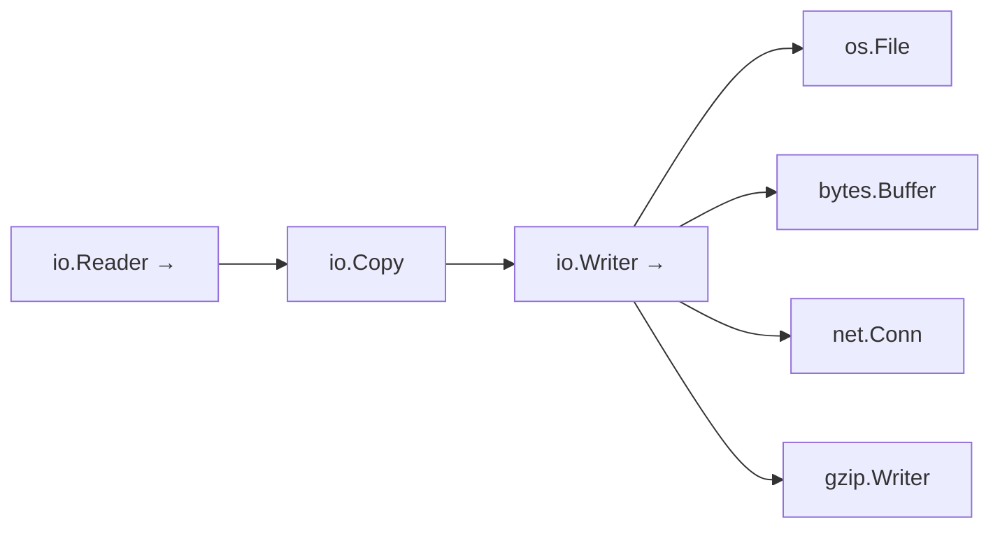

# Standard Library: I/O, Encoding, and JSON

> [!summary] Goal
> Read and write data in Go: use `io.Reader`/`io.Writer` for streaming, encode/decode JSON and CSV, and handle file I/O efficiently.

## Table of Contents

1. [Why I/O Interfaces Matter](#why-i-o-interfaces-matter)
2. [io.Reader and io.Writer](#io-reader-and-io-writer)
3. [File I/O](#file-i-o)
4. [JSON Encoding and Decoding](#json-encoding-and-decoding)
5. [Custom JSON Serialization](#custom-json-serialization)
6. [CSV](#csv)
7. [Pitfalls](#pitfalls)

---

## Why I/O Interfaces Matter

`io.Reader` and `io.Writer` are the foundation of all I/O in Go. Any function that accepts these interfaces works with files, network connections, strings, gzip streams, or any other byte source/sink.



---

## `io.Reader` and `io.Writer`

```go
// Core interfaces
type Reader interface {
    Read(p []byte) (n int, err error)
}

type Writer interface {
    Write(p []byte) (n int, err error)
}

// Read a file through a reader
f, _ := os.Open("input.txt")
defer f.Close()

data, _ := io.ReadAll(f)          // read all into memory

// Copy from reader to writer
io.Copy(os.Stdout, f)              // stream from file to stdout

// Limit reading
limited := io.LimitReader(f, 1024) // read at most 1KB

// Tee reader (read + write simultaneously)
var buf bytes.Buffer
tee := io.TeeReader(f, &buf)       // writes to buf as it reads from f
io.ReadAll(tee)                    // data also in buf

// Pipe (in-memory reader/writer pair)
pr, pw := io.Pipe()
go func() {
    json.NewEncoder(pw).Encode(data)
    pw.Close()
}()
decoder := json.NewDecoder(pr)
```

---

## File I/O

```go
// Read entire file (small files)
data, err := os.ReadFile("config.json")
os.WriteFile("output.txt", []byte("hello"), 0644)

// Streaming read
f, err := os.Open("large.log")
if err != nil {
    return err
}
defer f.Close()

scanner := bufio.NewScanner(f)
for scanner.Scan() {
    line := scanner.Text()          // reads without loading entire file
    process(line)
}
return scanner.Err()

// Streaming write
f, err := os.Create("output.log")
defer f.Close()

w := bufio.NewWriter(f)
fmt.Fprintln(w, "log entry 1")
fmt.Fprintln(w, "log entry 2")
w.Flush()                           // flush buffer to disk

// Temporary files
tmp, _ := os.CreateTemp("", "prefix-*.txt")
defer os.Remove(tmp.Name())
tmp.Write([]byte("temporary data"))
tmp.Close()
```

---

## JSON Encoding and Decoding

```go
type User struct {
    ID        string   `json:"id"`
    Email     string   `json:"email"`
    Name      string   `json:"name"`
    Age       int      `json:"age,omitempty"`
    Roles     []string `json:"roles,omitempty"`
    CreatedAt string   `json:"created_at"`
}

// Marshal — Go struct → JSON bytes
user := User{ID: "1", Email: "a@b.com", Name: "Alice"}
data, err := json.Marshal(user)          // bytes
data, err := json.MarshalIndent(user, "", "  ")  // pretty-printed

// Unmarshal — JSON bytes → Go struct
var u User
err := json.Unmarshal(data, &u)

// Streaming encoder/decoder (for HTTP APIs, files)
// Encode directly to writer
json.NewEncoder(w).Encode(user)

// Decode directly from reader
var u User
json.NewDecoder(r.Body).Decode(&u)
```

### JSON struct tags

```go
type Config struct {
    Host     string   `json:"host"`                       // "host": "value"
    Port     int      `json:"port,omitempty"`              // omit if zero
    Tags     []string `json:"tags,omitempty"`              // omit if empty
    Internal string   `json:"-"`                           // always skip
    Raw      string   `json:"raw,string"`                  // encode as JSON string
}
```

---

## Custom JSON Serialization

```go
type Duration time.Duration

func (d Duration) MarshalJSON() ([]byte, error) {
    return json.Marshal(time.Duration(d).String())
}

func (d *Duration) UnmarshalJSON(data []byte) error {
    var s string
    if err := json.Unmarshal(data, &s); err != nil {
        return err
    }
    dur, err := time.ParseDuration(s)
    if err != nil {
        return err
    }
    *d = Duration(dur)
    return nil
}

// Dynamic JSON with json.RawMessage
type FlexibleResponse struct {
    Status string          `json:"status"`
    Data   json.RawMessage `json:"data"`   // deferred decoding
}

raw := `{"status":"ok","data":{"user_id":"abc"}}`
var resp FlexibleResponse
json.Unmarshal([]byte(raw), &resp)
// resp.Data is raw JSON — decode later based on Status
```

---

## CSV

```go
// Reading CSV
f, err := os.Open("data.csv")
if err != nil {
    return err
}
defer f.Close()

reader := csv.NewReader(f)
reader.Comma = ','
reader.FieldsPerRecord = -1          // variable number of fields

records, err := reader.ReadAll()       // all at once
// Or stream:
for {
    record, err := reader.Read()
    if err == io.EOF {
        break
    }
    if err != nil {
        return err
    }
    process(record)
}

// Writing CSV
f, err := os.Create("output.csv")
if err != nil {
    return err
}
defer f.Close()

writer := csv.NewWriter(f)
defer writer.Flush()

writer.Write([]string{"name", "email", "age"})
writer.Write([]string{"Alice", "alice@example.com", "30"})
writer.Write([]string{"Bob", "bob@example.com", "25"})
```

---

## Pitfalls

### Not closing the file handle

```go
f, _ := os.Open("file.txt")
// forgot defer f.Close()
// file descriptor leaks
```

### `ioutil` is deprecated

Since Go 1.16, `ioutil.ReadAll`, `ioutil.ReadFile`, `ioutil.WriteFile` are deprecated. Use `os.ReadFile`, `os.WriteFile`, `io.ReadAll`.

### JSON and unexported fields

```go
type User struct {
    name string   // unexported — NOT marshaled
}
json.Marshal(User{name: "Alice"})  // → {}
```

**Fix**: Export fields that need JSON serialization.

### `json.Decoder` does not error on extra fields by default

```go
input := `{"id":"1","name":"Alice","unknown_field":"x"}`
var u User
json.NewDecoder(strings.NewReader(input)).Decode(&u)  // no error!
```

**Fix**: Use `json.NewDecoder(r).DisallowUnknownFields()`.

---

> [!question]- Interview Questions
>
> **Q: What is `io.Reader` and why is it important?**
> A: `io.Reader` is an interface with a single method `Read(p []byte) (n int, err error)`. Files, network connections, HTTP bodies, strings, and gzip streams all implement it — making I/O composable.
>
> **Q: What is the difference between `json.Marshal` and `json.NewEncoder`?**
> A: `json.Marshal` returns `[]byte` — use when you need the result as bytes. `json.NewEncoder(w).Encode(v)` writes directly to a writer — use for streaming (HTTP responses, files).
>
> **Q: How do you handle unknown fields in JSON decoding?**
> A: Use `json.NewDecoder(r).DisallowUnknownFields()` to return an error on unexpected fields. Or use `json.RawMessage` for dynamic content.

---

## Cross-Links

- [[Go/01_Foundations/03_Interfaces_and_Error_Handling]] for io.Reader/Writer implementations
- [[Go/02_Core/06_Database_SQL_and_Migrations]] for file-based migrations
- [[Go/02_Core/04_NetHTTP_Server_Middleware_and_Clients]] for HTTP JSON APIs

---

## References

- [io package](https://pkg.go.dev/io)
- [json package](https://pkg.go.dev/encoding/json)
- [csv package](https://pkg.go.dev/encoding/csv)
- [os package](https://pkg.go.dev/os)
