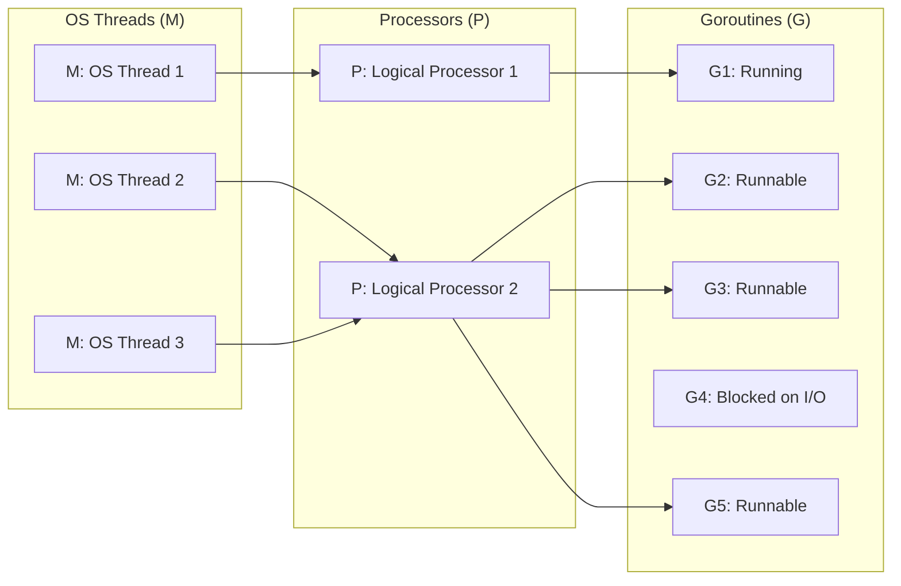
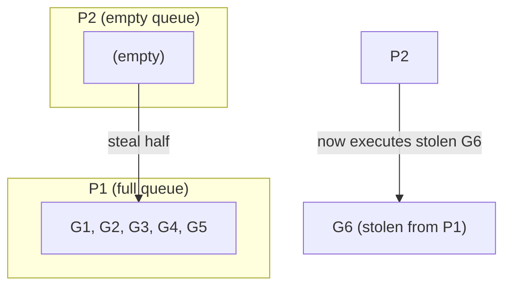
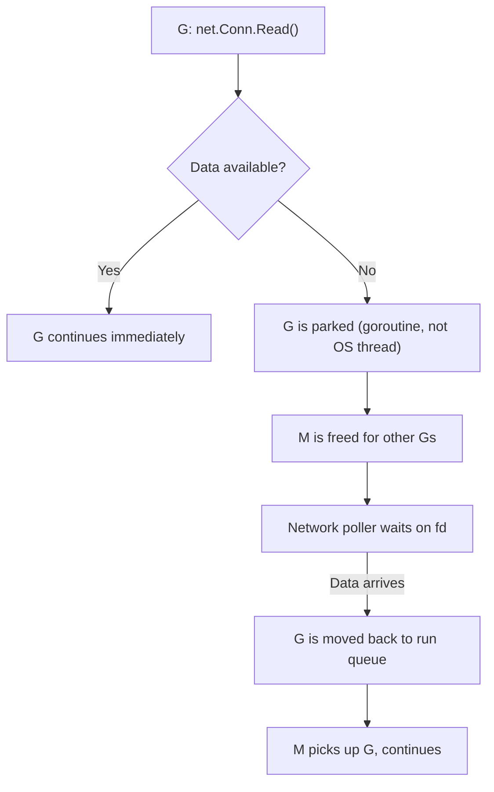

# Runtime Scheduler and GOMAXPROCS

> [!summary] Goal
> Understand how Go schedules goroutines onto OS threads: the M:P:G model, work stealing, network poller, sysmon, and GOMAXPROCS tuning.

## Table of Contents

1. [Why the Scheduler Matters](#why-the-scheduler-matters)
2. [M:P:G Model](#mpg-model)
3. [Work Stealing](#work-stealing)
4. [Network Poller](#network-poller)
5. [Sysmon](#sysmon)
6. [GOMAXPROCS Tuning](#gomaxprocs-tuning)
7. [Pitfalls](#pitfalls)

---

## Why the Scheduler Matters

Goroutines are not OS threads. They are lightweight coroutines multiplexed onto threads by the Go runtime. Understanding the scheduler helps you write efficient concurrent code.



---

## M:P:G Model

Go's scheduler uses three abstractions:

| Abstraction | Count | Purpose |
|-------------|-------|---------|
| **G** (Goroutine) | N (your goroutines) | A lightweight thread of execution, starts with ~4KB stack |
| **P** (Processor) | GOMAXPROCS (default: CPU count) | Logical processor — context for scheduling goroutines on OS threads |
| **M** (Machine) | N (OS threads) | An OS thread that executes goroutines assigned by P |

```go
fmt.Println(runtime.GOMAXPROCS(0))   // 8 (on an 8-core machine)
fmt.Println(runtime.NumGoroutine())  // current goroutine count
fmt.Println(runtime.NumCPU())        // logical CPU count
```

### How it works

1. Each P has a **local run queue** (LRQ) of goroutines ready to execute
2. There is also a **global run queue** (GRQ) for goroutines not yet assigned to a P
3. Each M picks a P and executes Gs from the P's local queue
4. When a G makes a blocking syscall, the M blocks, but the scheduler creates (or wakes) a new M to keep the P busy
5. When a G blocks on a channel or mutex, it's moved off the P and another G is scheduled

---

## Work Stealing

If a P's local queue is empty, it **steals** goroutines from another P's queue:



This ensures all CPUs stay busy even when work is unevenly distributed.

---

## Network Poller

Goroutines blocked on network I/O don't hold an OS thread. The **network poller** (integrated with `kqueue`/`epoll`/`iocp`) handles them:



**Why this matters**: A goroutine blocked on `net.Conn.Read()` does NOT block an OS thread. Thousands of blocked goroutines consume minimal resources.

---

## Sysmon

The system monitor (`sysmon`) is a background thread that:

- Preempts goroutines running for >10ms (since Go 1.14 — cooperative preemption)
- Retakes P from M blocked on a syscall
- Adds idle P to the free list
- Monitors network poller
- Triggers GC when needed

```go
// Check preemption
func longRunning() {
    for i := 0; i < 1_000_000_000; i++ {
        // sysmon will preempt this loop after ~10ms
    }
}
```

---

## GOMAXPROCS Tuning

```go
// Default: number of CPUs
fmt.Println(runtime.GOMAXPROCS(0))   // 8 on 8-core machine

// Increase for CPU-bound workloads
runtime.GOMAXPROCS(16)

// Decrease for containerized environments (respect CPU limits)
runtime.GOMAXPROCS(2)
```

| Workload | GOMAXPROCS | Reasoning |
|----------|------------|-----------|
| CPU-bound | `runtime.NumCPU()` | Keep all cores busy |
| I/O-bound | `runtime.NumCPU()` or higher | GOMAXPROCS doesn't limit I/O goroutines |
| Containerized | Set to container CPU limit | Prevent oversubscription |

### Container-aware GOMAXPROCS

```go
import "go.uber.org/automaxprocs/maxprocs"

// Automatically sets GOMAXPROCS to match container CPU limit
maxprocs.Set()
```

---

## Pitfalls

### Setting GOMAXPROCS too high in containers

If your container is limited to 2 CPUs but GOMAXPROCS defaults to 8 (host CPU count), Go creates 8 OS threads even though only 2 can run simultaneously — causing thread contention.

### Blocking syscalls hold OS threads

A goroutine making a blocking syscall (e.g., file I/O, CGo) holds its OS thread. If many goroutines block on syscalls, Go creates more OS threads (up to `GOMAXPROCS * 10,000`).

**Fix**: Use async I/O where possible (network I/O uses the poller; file I/O may not).

### Goroutine vs OS thread limits

A million goroutines is fine (4KB × 1M = 4GB stack). A million OS threads is impossible (1MB × 1M = 1TB stack).

---

> [!question]- Interview Questions
>
> **Q: How does the Go scheduler work?**
> A: Go uses an M:P:G model. M is an OS thread. P is a logical processor (number = GOMAXPROCS). G is a goroutine. P has a local run queue of Gs. M takes Gs from P's queue and executes them. When a G blocks, another is scheduled.
>
> **Q: What happens when a goroutine blocks on network I/O?**
> A: The goroutine is parked, and the M is freed for other goroutines. The network poller (using epoll/kqueue) waits for data. When data arrives, the goroutine is moved back to a run queue.
>
> **Q: What is work stealing?**
> A: When a P's local run queue is empty, it steals goroutines from another P's queue. This ensures all CPUs stay busy even with uneven work distribution.

---

## Cross-Links

- [[Go/01_Foundations/02_Goroutines_and_Channels]] for goroutine basics
- [[Go/03_Advanced/02_GC_Escape_Analysis_and_Performance]] for GC and scheduler interactions

---

## References

- [Go Scheduler Design Document](https://go.dev/src/runtime/HACKING.md)
- [Go Blog: Scheduling In Go](https://www.ardanlabs.com/blog/2018/08/scheduling-in-go-part1.html)
- [runtime package](https://pkg.go.dev/runtime)
- [automaxprocs](https://github.com/uber-go/automaxprocs)
