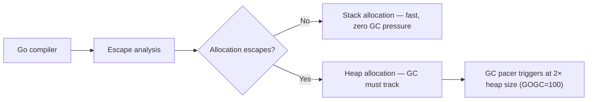
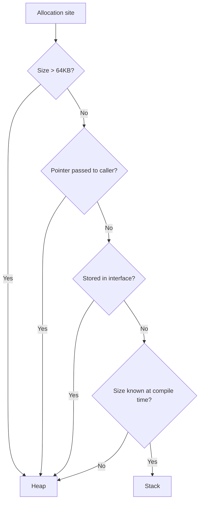
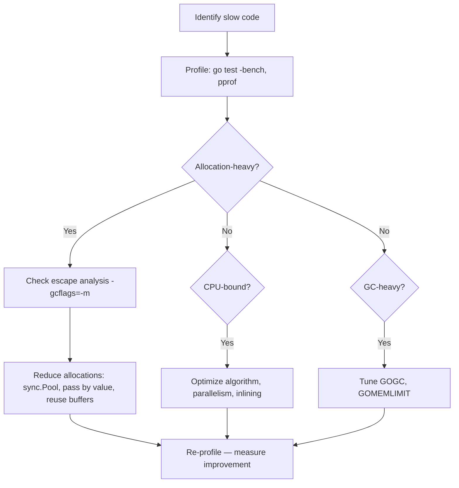

# GC, Escape Analysis, and Performance

> [!summary] Goal
> Understand Go's garbage collector, how escape analysis determines stack vs heap allocation, and how to tune GC for performance-sensitive applications.

## Table of Contents

1. [Why GC and Escape Analysis Matter](#why-gc-and-escape-analysis-matter)
2. [Go's GC Model](#gos-gc-model)
3. [Escape Analysis](#escape-analysis)
4. [GC Tuning](#gc-tuning)
5. [`sync.Pool` for Object Reuse](#sync-pool-for-object-reuse)
6. [Performance Optimization Workflow](#performance-optimization-workflow)
7. [Pitfalls](#pitfalls)

---

## Why GC and Escape Analysis Matter

Allocation on the heap costs more than the stack: more work for the GC, more cache misses, more memory bandwidth. Escape analysis determines which allocations can stay on the stack.



---

## Go's GC Model

Go uses a **concurrent, tri-color, mark-sweep** garbage collector:

| Phase | What happens | Stop-the-world? |
|-------|-------------|-----------------|
| **Mark** | Trace live objects from roots (goroutine stacks, globals) | Concurrent — very short STW |
| **Sweep** | Reclaim unmarked memory | Concurrent |

```
GC cycle:
  1. Mark Start (STW: 10-100µs)
  2. Concurrent Mark (runs on mutator goroutines)
  3. Mark Termination (STW: 10-100µs)
  4. Concurrent Sweep (runs lazily)
```

```go
// View GC stats
var m runtime.MemStats
runtime.ReadMemStats(&m)
fmt.Printf("Heap: %d MB, Next GC at: %d MB\n",
    m.HeapAlloc/1024/1024,
    m.NextGC/1024/1024)
```

---

## Escape Analysis

### What triggers allocation (escape)

```go
func toHeap() *int {
    x := 42
    return &x              // ✅ escapes — returned to caller
}

func toHeap2() any {
    x := 42
    return x               // ✅ escapes — storing int in interface{} allocates
}

func toHeap3() {
    data := make([]int, 1000)
    _ = data               // ✅ escapes — large slice escapes the stack
}

func onStack() int {
    x := 42                // ✅ stack — not referenced outside
    return x
}

func onStack2() {
    data := make([]int, 10)  // ✅ stack — small enough, doesn't escape
    _ = data
}
```

### Checking escape analysis

```bash
go build -gcflags=-m ./...
# ./main.go:5:6: moved to heap: x
# ./main.go:11:11: 42 escapes to interface
# ./main.go:17:17: make([]int, 1000) escapes to heap
```



### Common escape triggers

| Pattern | Escapes? | Fix |
|---------|----------|-----|
| `return &x` | ✅ | Return by value if possible |
| `return interfaceValue` | ✅ | Return concrete type |
| `make([]T, n)` where n is dynamic | ✅ | Use fixed-size array or pool |
| `fmt.Printf("%v", x)` | ✅ | Use pointer if `x` is large |
| `x := 42; return x` | ❌ | Stay on stack |

---

## GC Tuning

### `GOGC` — target heap growth

```bash
GOGC=100      # default — GC when heap doubles
GOGC=200      # GC when heap triples — less frequent, larger peaks
GOGC=50       # GC when heap grows 50% — more frequent, lower peaks
GOGC=off      # never trigger GC automatically (use with care)
```

### `GOMEMLIMIT` (Go 1.19+)

Sets a soft memory limit that the GC tries not to exceed:

```go
debug.SetMemoryLimit(500 * 1024 * 1024)    // 500 MB soft limit
// GC will run more frequently as heap approaches the limit
```

| Setting | Effect |
|---------|--------|
| No limit (default) | GC runs when heap doubles |
| `GOMEMLIMIT=500MiB` | GC runs more aggressively near limit |
| `GOGC=off` + `GOMEMLIMIT` | GC triggered only by memory pressure |

```bash
# Environment variables
export GOGC=100
export GOMEMLIMIT=500MiB

# In container with 512 MB limit
export GOMEMLIMIT=400MiB    # leave room for OS
```

---

## `sync.Pool` for Object Reuse

```go
type BigStruct struct {
    ID   int
    Data [1024]byte
}

var pool = sync.Pool{
    New: func() any {
        return &BigStruct{}
    },
}

func process() {
    obj := pool.Get().(*BigStruct)
    defer pool.Put(obj)

    obj.ID = compute()
    // use obj...
}  // obj returned to pool — no allocation
```

Benchmark:

```go
func BenchmarkWithoutPool(b *testing.B) {
    for i := 0; i < b.N; i++ {
        obj := &BigStruct{}
        processObj(obj)
    }
}

func BenchmarkWithPool(b *testing.B) {
    for i := 0; i < b.N; i++ {
        obj := pool.Get().(*BigStruct)
        processObj(obj)
        pool.Put(obj)
    }
}
// WithPool: 0 allocs/op vs WithoutPool: 1 allocs/op
```

---

## Performance Optimization Workflow



---

## Pitfalls

### `sync.Pool` items disappear under GC

When GC runs, items in a `sync.Pool` are silently removed. `sync.Pool` reduces allocation pressure but does not guarantee persistence.

### `GOGC=off` without `GOMEMLIMIT` is dangerous

Without a memory limit, `GOGC=off` means the heap grows until the OS kills the process (OOM).

### Escape of `fmt.Sprintf` and other interface arguments

```go
str := fmt.Sprintf("%d", x)    // x escapes to interface{} → heap
```

For hot paths, use `strconv.Itoa` instead: `strconv.Itoa(x)` — no allocation.

---

> [!question]- Interview Questions
>
> **Q: How does escape analysis work?**
> A: The compiler determines whether a value's lifetime exceeds the function scope. If it does (returned, stored in interface, stored in heap-allocated struct), it allocates on the heap. Otherwise, it stays on the stack.
>
> **Q: What does `GOGC` control?**
> A: `GOGC=100` (default) means GC runs when the heap grows by 100% (doubles). Higher values = less frequent GC, larger memory peaks. Lower values = more frequent GC, lower memory peaks.
>
> **Q: What is `GOMEMLIMIT`?**
> A: A soft memory limit introduced in Go 1.19. The GC becomes more aggressive as the heap approaches the limit, preventing out-of-memory situations in resource-constrained environments.

---

## Cross-Links

- [[Go/03_Advanced/04_Profiling_pprof_and_Tracing]] for profiling GC
- [[Go/04_Playbooks/02_Debug_High_CPU_and_GC_Pressure]] for debugging GC issues
- [[Go/02_Core/02_Concurrency_Patterns_WorkerPools_FanInOut]] for sync.Pool usage

---

## References

- [Go GC: How It Works](https://go.dev/blog/go15gc)
- [Go 1.19 Memory Limit](https://go.dev/doc/go1.19#runtime)
- [Escape Analysis](https://go.dev/wiki/EscapeAnalysis)
- [Debugging Performance](https://go.dev/doc/diagnostics)
