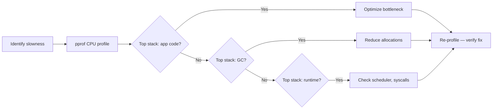
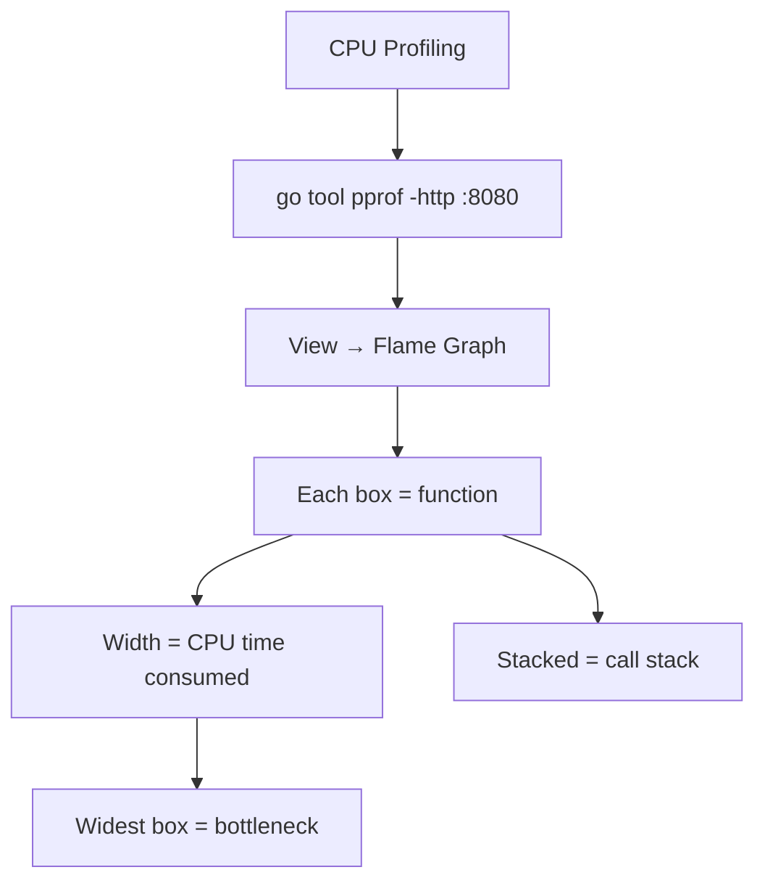

# Profiling: pprof and Tracing

> [!summary] Goal
> Profile Go programs to find CPU and memory hotspots, analyze goroutines, trace execution, and generate flame graphs.

## Table of Contents

1. [Why Profiling Matters](#why-profiling-matters)
2. [Profile Types](#profile-types)
3. [Using `net/http/pprof`](#using-net-http-pprof)
4. [Using `go tool pprof`](#using-go-tool-pprof)
5. [Flame Graphs](#flame-graphs)
6. [Execution Tracing with `go tool trace`](#execution-tracing-with-go-tool-trace)
7. [Pitfalls](#pitfalls)

---

## Why Profiling Matters

Before optimizing, measure. Profiling shows exactly where CPU time is spent, where memory is allocated, and which goroutines are blocking.



---

## Profile Types

| Profile | Command | What it shows |
|---------|---------|---------------|
| **CPU** | `/debug/pprof/profile?seconds=30` | Where CPU time is spent (sampled every 10ms) |
| **Heap** | `/debug/pprof/heap` | Current memory allocations (in-use objects) |
| **Allocs** | `/debug/pprof/allocs` | Past memory allocations (all objects ever allocated) |
| **Goroutine** | `/debug/pprof/goroutine` | Stack traces of all goroutines |
| **Mutex** | `/debug/pprof/mutex` | Mutex contention |
| **Block** | `/debug/pprof/block` | Goroutine blocking events |
| **Threadcreate** | `/debug/pprof/threadcreate` | OS thread creation |

---

## Using `net/http/pprof`

```go
import (
    "net/http"
    _ "net/http/pprof"              // registers handlers on DefaultServeMux
)

func main() {
    // Go 1.22+ — register on a custom mux
    mux := http.NewServeMux()
    mux.HandleFunc("GET /debug/pprof/", http.DefaultServeMux)  // forward to default

    srv := &http.Server{Addr: ":6060", Handler: mux}
    log.Fatal(srv.ListenAndServe())
}
```

```bash
# Collect profiles
curl -o cpu.pprof http://localhost:6060/debug/pprof/profile?seconds=30
curl -o heap.pprof http://localhost:6060/debug/pprof/heap
curl -o goroutine.pprof http://localhost:6060/debug/pprof/goroutine
curl -o allocs.pprof http://localhost:6060/debug/pprof/allocs
```

### Non-HTTP applications

```go
import "runtime/pprof"

func main() {
    f, _ := os.Create("cpu.pprof")
    pprof.StartCPUProfile(f)
    defer pprof.StopCPUProfile()

    // ... run application ...

    // Heap profile
    f2, _ := os.Create("heap.pprof")
    pprof.WriteHeapProfile(f2)
    f2.Close()
}
```

---

## Using `go tool pprof`

```bash
# Interactive mode
go tool pprof http://localhost:6060/debug/pprof/heap
(pprof) top          # show top 10 consuming functions
(pprof) top20        # show top 20
(pprof) list MyFunc  # show source lines for MyFunc
(pprof) web          # open call graph in browser
(pprof) peek         # show caller/callee relationships

# Web UI
go tool pprof -http :8080 http://localhost:6060/debug/pprof/profile?seconds=30

# Compare profiles
go tool pprof -http :8080 --base old.pprof new.pprof
```

### Common pprof commands

```bash
# CPU — find hot functions
go tool pprof -http :8080 cpu.pprof

# Heap — find memory hogs
go tool pprof -http :8080 -alloc_space heap.pprof

# Goroutine — see all goroutines
go tool pprof -http :8080 goroutine.pprof

# Mutex — see lock contention
go tool pprof -http :8080 mutex.pprof
```

---

## Flame Graphs

```bash
# Generate SVG flame graph from a profile
go tool pprof -http :8080 cpu.pprof
# Click "Flame Graph" in the web UI

# Or via command line:
go tool pprof -output=flamegraph.svg -svg http://localhost:6060/debug/pprof/profile?seconds=30
```



---

## Execution Tracing with `go tool trace`

```go
import "runtime/trace"

func main() {
    f, _ := os.Create("trace.out")
    trace.Start(f)
    defer trace.Stop()
    // ... run application ...
}
```

```bash
# Collect and view trace
go run main.go                      # generates trace.out
go tool trace trace.out              # opens web UI

# During tests
go test -trace trace.out ./...
go tool trace trace.out
```

The trace viewer shows:
- **Goroutine activity**: when each goroutine runs, blocks, or is waiting
- **Network blocking**: I/O wait times
- **Syscalls**: blocking system calls
- **GC events**: when GC runs, how long
- **Scheduler latency**: how long goroutines wait to run

---

## Pitfalls

### Profiling in production adds overhead

CPU profiling samples at 100Hz (every 10ms). It adds ~5% CPU overhead on busy servers.

**Fix**: Use sampling profiles in production, not continuous tracing. Use dedicated profiling tools like Pyroscope or Parca.

### Heap profile shows `inuse_space` vs `alloc_space`

```bash
# inuse_space (default) — objects currently alive (not garbage collected)
# alloc_space — all objects ever allocated (including GC'd ones)

go tool pprof -http :8080 -alloc_space heap.pprof   # find allocation "hot spots"
go tool pprof -http :8080 -inuse_space heap.pprof   # find memory "hogs"
```

### goroutine profile shows blocked goroutines

If `goroutine.pprof` shows thousands of goroutines blocked on `chan receive`, you have a goroutine leak.

---

> [!question]- Interview Questions
>
> **Q: What is the difference between `inuse_space` and `alloc_space` in heap profiling?**
> A: `inuse_space` shows memory currently alive (not GC'd) — finding memory hogs. `alloc_space` shows all allocations ever — identifying allocation patterns.
>
> **Q: How do you generate a flame graph?**
> A: Use `go tool pprof -http :8080 cpu.pprof` and click "Flame Graph" in the web UI. Each box represents a function, and width represents CPU time consumed.
>
> **Q: What does `go tool trace` show that pprof doesn't?**
> A: pprof shows aggregated CPU/memory (where). Trace shows the time dimension: goroutine scheduling delays, GC pause timing, I/O wait, and concurrency patterns (when).

---

## Cross-Links

- [[Go/01_Foundations/05_Testing_Benchmarks_and_Profiling]] for benchmark profiling
- [[Go/04_Playbooks/02_Debug_High_CPU_and_GC_Pressure]] for debugging CPU issues
- [[Go/03_Advanced/02_GC_Escape_Analysis_and_Performance]] for GC tuning

---

## References

- [Go Diagnostics](https://go.dev/doc/diagnostics)
- [pprof](https://pkg.go.dev/net/http/pprof)
- [runtime/pprof](https://pkg.go.dev/runtime/pprof)
- [runtime/trace](https://pkg.go.dev/runtime/trace)
- [Go Blog: Profiling Go Programs](https://go.dev/blog/pprof)
