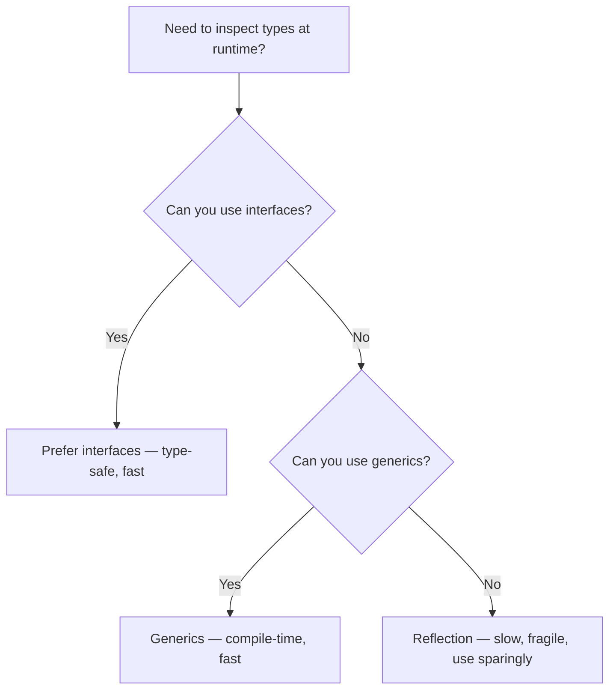

# Reflection and Unsafe

> [!summary] Goal
> Inspect and manipulate types at runtime with `reflect`, understand struct tags, and know when (and when not) to use `unsafe`.

## Table of Contents

1. [Why Reflection Matters](#why-reflection-matters)
2. [`reflect.TypeOf` and `reflect.ValueOf`](#reflect-typeof-and-reflect-valueof)
3. [Reading and Writing Struct Fields](#reading-and-writing-struct-fields)
4. [Struct Tags with Reflection](#struct-tags-with-reflection)
5. [`reflect.DeepEqual`](#reflect-deepequal)
6. [`unsafe` Package](#unsafe-package)
7. [Pitfalls](#pitfalls)

---

## Why Reflection Matters

Reflection lets your code inspect and interact with types it wasn't compiled against — useful for serialization, testing, and generic utilities. But it comes at a cost.



---

## `reflect.TypeOf` and `reflect.ValueOf`

```go
import "reflect"

var x int = 42

t := reflect.TypeOf(x)        // int
v := reflect.ValueOf(x)       // <int Value>

fmt.Println(t.Name())         // "int"
fmt.Println(t.Kind())         // "int" (kind is the base kind, unlike Name for custom types)
fmt.Println(v.Int())          // 42

// Kind vs Name
type User struct{}
t := reflect.TypeOf(User{})
fmt.Println(t.Name())          // "User"
fmt.Println(t.Kind())          // "struct"
```

### Kind types

| Kind | String | Examples |
|------|--------|----------|
| `reflect.Struct` | `"struct"` | `struct{...}` |
| `reflect.Slice` | `"slice"` | `[]int` |
| `reflect.Map` | `"map"` | `map[string]int` |
| `reflect.Ptr` | `"ptr"` | `*T` |
| `reflect.Interface` | `"interface"` | `any`, `error` |
| `reflect.Func` | `"func"` | `func()` |

---

## Reading and Writing Struct Fields

```go
type User struct {
    ID    string
    Email string
    Name  string
    age   int  // unexported — not accessible via reflection
}

u := User{ID: "1", Email: "a@b.com", Name: "Alice", age: 30}
v := reflect.ValueOf(&u).Elem()     // get the struct value (must be pointer)

// Read fields
for i := 0; i < v.NumField(); i++ {
    field := v.Field(i)
    fmt.Printf("%s: %v (type: %s, exported: %t)\n",
        v.Type().Field(i).Name,
        field.Interface(),
        field.Type(),
        field.CanInterface(),        // false for unexported fields
    )
}

// Write exported fields
v.FieldByName("Name").SetString("Bob")
fmt.Println(u.Name)                 // "Bob"

// Unexported fields — cannot be set via reflection
// v.FieldByName("age").SetInt(31)  // PANIC
```

---

## Struct Tags with Reflection

```go
type Config struct {
    Host    string `json:"host" yaml:"host" default:"localhost"`
    Port    int    `json:"port" yaml:"port" default:"8080"`
    Debug   bool   `json:"debug,omitempty"`
    secret  string // unexported — no tags
}

func readTags(v any) {
    t := reflect.TypeOf(v)
    if t.Kind() == reflect.Ptr {
        t = t.Elem()
    }

    for i := 0; i < t.NumField(); i++ {
        f := t.Field(i)
        if !f.IsExported() {
            continue
        }
        jsonTag := f.Tag.Get("json")
        yamlTag := f.Tag.Get("yaml")
        defaultVal := f.Tag.Get("default")
        fmt.Printf("%s: json=%s yaml=%s default=%s\n",
            f.Name, jsonTag, yamlTag, defaultVal)
    }
}
```

### Using tags for validation

```go
type LoginRequest struct {
    Email   string `validate:"required,email"`
    Password string `validate:"required,min=8"`
}

func validate(v any) error {
    t := reflect.TypeOf(v)
    rv := reflect.ValueOf(v)

    for i := 0; i < t.NumField(); i++ {
        field := t.Field(i)
        value := rv.Field(i)

        rules := field.Tag.Get("validate")
        if rules == "" {
            continue
        }

        for _, rule := range strings.Split(rules, ",") {
            switch {
            case rule == "required" && value.String() == "":
                return fmt.Errorf("%s is required", field.Name)
            case strings.HasPrefix(rule, "min=") && value.String() != "":
                min, _ := strconv.Atoi(strings.TrimPrefix(rule, "min="))
                if len(value.String()) < min {
                    return fmt.Errorf("%s must be at least %d chars", field.Name, min)
                }
            }
        }
    }
    return nil
}
```

---

## `reflect.DeepEqual`

Deeply compares two values — handles slices, maps, structs, and cycles:

```go
m1 := map[string]int{"a": 1, "b": 2}
m2 := map[string]int{"a": 1, "b": 2}
fmt.Println(m1 == m2)                    // compilation error — maps not comparable
fmt.Println(reflect.DeepEqual(m1, m2))   // true

s1 := []int{1, 2, 3}
s2 := []int{1, 2, 3}
fmt.Println(reflect.DeepEqual(s1, s2))   // true
```

> [!warning] `DeepEqual` has pitfalls with recursive types (infinite recursion) and unexported fields (panics). Use `cmp` package (Go 1.21+) for safer comparisons.

---

## `unsafe` Package

The `unsafe` package provides low-level memory operations that bypass Go's type safety:

```go
import "unsafe"

var x int64 = 42
size := unsafe.Sizeof(x)      // 8 (bytes on 64-bit platform)
align := unsafe.Alignof(x)    // 8

// Pointer arithmetic (unsafe, non-portable)
arr := [3]int16{1, 2, 3}
base := unsafe.Pointer(&arr[0])
second := (*int16)(unsafe.Pointer(uintptr(base) + unsafe.Sizeof(arr[0])))
fmt.Println(*second)          // 2 (but this is fragile!)
```

> [!danger] Code using `unsafe` is not portable across architectures, OS versions, or Go releases. Only use `unsafe` when you have measured a performance bottleneck that cannot be solved any other way. Most Go programs should never use `unsafe`.

### When to use `unsafe` (rarely)

- Optimizing memory layout in hot paths (usually not worth it)
- Interfacing with C code (use cgo instead)
- Implementing high-performance data structures

### When NOT to use `unsafe`

- Any application-level code
- Code that must be portable
- Code that must pass `go vet`

---

## Advanced Reflection: `MakeFunc` and Struct Tags

### `reflect.MakeFunc` — creating functions at runtime

```go
import "reflect"

// MakeFunc creates a function with a given signature at runtime.
// When called, it passes the actual arguments to a user-provided callback.
// Use case: adapters, wrappers, RPC-style dispatch.

func MakeTimedFunc(fn any) any {
    fv := reflect.ValueOf(fn)
    if fv.Kind() != reflect.Func {
        panic("not a function")
    }

    // Create a wrapper with the same signature:
    wrapper := reflect.MakeFunc(fv.Type(), func(args []reflect.Value) []reflect.Value {
        start := time.Now()
        result := fv.Call(args)
        log.Printf("called %s in %v", runtime.FuncForPC(fv.Pointer()).Name(), time.Since(start))
        return result
    })

    return wrapper.Interface()
}

// Usage: log.Debug = MakeTimedFunc(log.Debug).(func(string, ...any))
```

### `reflect.StructField` tags — parsing validation tags

```go
type User struct {
    Name  string `json:"name"  validate:"required,min=3"`
    Email string `json:"email" validate:"required,email"`
}

func validate(v any) error {
    t := reflect.TypeOf(v)
    if t.Kind() != reflect.Struct {
        return fmt.Errorf("expected struct, got %s", t.Kind())
    }

    for i := 0; i < t.NumField(); i++ {
        field := t.Field(i)
        tag := field.Tag.Get("validate")
        if tag == "" {
            continue
        }
        // Parse "required,min=3,max=100" etc.
        for _, rule := range strings.Split(tag, ",") {
            switch {
            case rule == "required":
                // check field value
            case strings.HasPrefix(rule, "min="):
                // parse length and validate
            }
        }
    }
    return nil
}
```

## `unsafe` Extended

### `unsafe.Add`, `unsafe.Slice` (Go 1.17+)

```go
import "unsafe"

// unsafe.Add — pointer arithmetic without converting to uintptr first.
// Safer than old-style: var ptr unsafe.Pointer; unsafe.Pointer(uintptr(ptr) + offset)

var arr [10]int64
base := unsafe.Pointer(&arr[0])

// Old way (error-prone):
// p := unsafe.Pointer(uintptr(base) + 3*8)  // easy to forget uintptr steps

// New way (Go 1.17+):
p := unsafe.Add(base, 3*int64(unsafe.Sizeof(arr[0]))) // &arr[3]
*(*int64)(p) = 42
```

```go
// unsafe.Slice — create a slice from a pointer + length
// Without copying the underlying data.

// Example: convert a [1024]byte buffer to []byte efficiently:
var buf [1024]byte
slice := unsafe.Slice(&buf[0], len(buf))
// slice is a []byte backed by buf — no allocation!

// Safety: the slice MUST NOT outlive the backing array.
// Using unsafe.Slice on a stack array and returning it creates a dangling reference.
```

### `unsafe.String`, `unsafe.StringData` (Go 1.20+)

```go
import "unsafe"

// unsafe.String creates a string from a pointer + length.
// unsafe.StringData returns a pointer to a string's underlying byte array.

// Convert []byte to string without allocation (only safe if the byte slice never changes):
var data []byte = []byte("hello")
s := unsafe.String(&data[0], len(data))
// s == "hello" — but if data is modified, s becomes corrupted.

// Convert string to []byte without copying (read-only!):
func stringHeader(s string) unsafe.Pointer {
    return unsafe.StringData(s)  // pointer to first byte
}

// ⚠️  These are only safe when:
//   1. The string's memory is immutable (you never modify it).
//   2. The byte slice lives at least as long as the string view.
//   3. You are in a performance-critical hot path where allocation is measured.
```

---

## Pitfalls

### Reflection is slow

Reflection can be 10-100x slower than direct access. `reflect.Value.SetInt` is much slower than `x = 42`.

**Fix**: Cache reflection results. Use interfaces and generics first.

### `CanSet` returns false for unexported fields

```go
v := reflect.ValueOf(myStruct).FieldByName("unexported")
v.SetInt(42)             // PANIC — cannot set unexported field
```

### `DeepEqual` with recursive types

```go
type Node struct {
    Value int
    Next  *Node
}
n1 := &Node{Value: 1}
n1.Next = n1                         // cycle!
reflect.DeepEqual(n1, n1)            // hangs or panics
```

**Fix**: Use `cmp` package or custom comparison that handles cycles.

---

> [!question]- Interview Questions
>
> **Q: When should you use reflection?**
> A: For serialization libraries, testing utilities, ORMs, and CLI flag binding — any case where you must handle types you don't know at compile time. Prefer interfaces and generics first.
>
> **Q: What is the difference between `Name` and `Kind` in reflect?**
> A: `Name` returns the type's declared name (`"User"` for `type User struct{}`). `Kind` returns the underlying base kind (`"struct"`, `"slice"`, `"map"`).
>
> **Q: Is `unsafe` ever safe to use?**
> A: In production application code, almost never. Most Go programs should use zero lines of `unsafe`. It's reserved for systems programming and performance-critical libraries where the benefit has been rigorously benchmarked.

---

## Cross-Links

- [[Go/01_Foundations/03_Interfaces_and_Error_Handling]] for interface-based polymorphism
- [[Go/02_Core/05_Stdlib_IO_Encoding_and_JSON]] for struct tag usage in JSON
- [[Go/03_Advanced/03_Generics_in_Go_Practical]] for compile-time alternatives to reflection

---

## References

- [reflect package](https://pkg.go.dev/reflect)
- [Go Blog: Laws of Reflection](https://go.dev/blog/laws-of-reflection)
- [unsafe package](https://pkg.go.dev/unsafe)
- [cmp package](https://pkg.go.dev/cmp)
