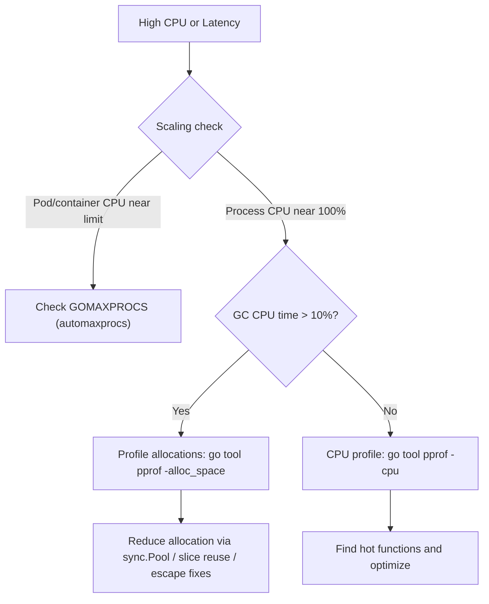

# Playbook: Debug High CPU and GC Pressure

> [!summary] Goal
> Diagnose high CPU and GC pressure: CPU profiling with `pprof`, GC trace analysis with `GODEBUG=gctrace=1`, allocation hotspot detection, `pprof` diff for regression analysis, and escape analysis verification.

## Triage Flow



## GODEBUG GC Trace

```bash
# Enable GC logging:
GODEBUG=gctrace=1 ./myapp

# Output format (Go 1.19+):
# gc 7 @15.2s 2%: 0.021+1.5+0.013 ms clock, 0.17+0.63/1.5/0.001+0.10 ms cpu, 16->16->8 MB, 16 MB goal, 8 P

# Fields:
#   gc 7              — GC cycle #7
#   @15.2s             — 15.2 seconds after start
#   2%                 — % CPU in GC since start (total)
#   0.021+1.5+0.013 ms — STW sweep termination + concurrent mark + STW mark termination
#   16->16->8 MB       — heap size: before GC → after GC and mark → alive after GC
#   16 MB goal         — target heap size for next GC
#   8 P                — number of GC workers (GOMAXPROCS)

# If GC CPU > 10%: high allocation rate.
# If GC CPU > 25%: critical — allocate less or increase GOGC.
# If heap "before" and "goal" are close: GC running too frequently.
```

## pprof Diff for Regressions

```bash
# Compare two profiles (before/after optimization, or good build vs bad build):
go tool pprof -base=before.prof after.prof

# In the interactive shell:
(pprof) top
# Shows DELTA: functions that use MORE or LESS CPU in the "after" profile.

# Useful for CI: collect profiles on main and compare with PR builds.
# Keeps teams from introducing accidental performance regressions.
```

## Allocation Profiling

```bash
# Collect allocation profile (sampled, low overhead):
curl -o alloc.prof http://localhost:6060/debug/pprof/allocs

# Analyze with -alloc_space to see total bytes allocated (not in-use):
go tool pprof -alloc_space alloc.prof
(pprof) top10

# Filter out runtime/standard library to see YOUR code:
(pprof) tagignore runtime sync net/http

# List allocations in a specific function:
(pprof) list myFunction

# Look for: high allocation in unexpected places, especially repeated
# allocations inside loops (strings.Builder, fmt.Sprintf, append patterns).
```

---

## Cross-Links

- [[Go/03_Advanced/02_GC_Escape_Analysis_and_Performance]] for escape analysis
- [[Go/03_Advanced/04_Profiling_pprof_and_Tracing]] for pprof and trace tools
- [[Go/04_Playbooks/01_Debug_Goroutine_Leaks_and_Deadlocks]] for goroutine debugging
- [[Go/03_Advanced/05_Reflection_and_Unsafe]] for unsafe.String performance
