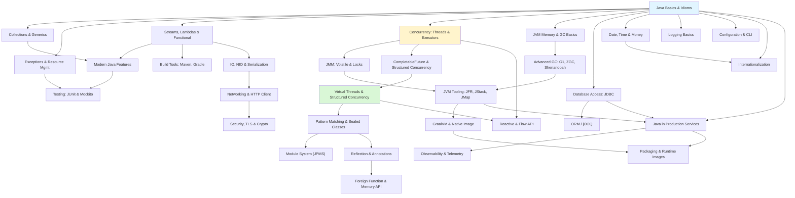

# Java

> [!summary] Scope
> Complete Java reference from language fundamentals through JVM internals, concurrency, performance, and modern features (records, sealed classes, virtual threads, pattern matching). Covers date/time/money, logging, configuration, persistence (JDBC, JPA, jOOQ), i18n, reactive streams, security/TLS/crypto, observability (metrics, tracing), packaging (jlink, native image), and production operations.

## Learning Path

## Foundations

| File | Topics |
|------|--------|
| **F01** [[Java/01_Foundations/01_Java_Basics_and_Idioms]] | Type system, boxing/unboxing, immutability, equals/hashCode, records, enums, try-with-resources, text blocks |
| **F02** [[Java/01_Foundations/02_Collections_and_Generics]] | List, Set, Map, Queue, Deque, Collections utilities, generic types, wildcards, type erasure, `Comparator` vs `Comparable` |
| **F03** [[Java/01_Foundations/03_Exceptions_and_Resource_Management]] | Checked vs unchecked, custom exceptions, try-with-resources, try-catch-finally, exception chaining, best practices |
| **F04** [[Java/01_Foundations/04_Streams_Lambdas_and_Functional_Java]] | Lambda syntax, method references, `Stream` API (map/filter/reduce/collect), `Optional`, `Function` package, parallel streams, collectors |
| **F05** [[Java/01_Foundations/05_Modern_Java_Language_Features]] | Records, sealed classes, pattern matching (`instanceof`, `switch`), text blocks, `var`, enhanced `switch`, useful `null` APIs |
| **F06** [[Java/01_Foundations/06_Build_Tools_Maven_Gradle]] | Maven lifecycle, POM, dependencies, plugins; Gradle tasks, Kotlin DSL, multi-project builds; comparison table |
| **F07** [[Java/01_Foundations/07_Testing_with_JUnit_and_Mockito]] | JUnit 5 (lifecycle, assertions, parameterized), Mockito (`@Mock`, `verify`, argument captors), Testcontainers, coverage |
| **F08** [[Java/01_Foundations/08_Date_Time_and_Money]] | `java.time` types, time zones, formatting, `Duration`/`Period`, money with `BigDecimal`, rounding, `Clock` for testability |
| **F09** [[Java/01_Foundations/09_Logging_Basics_for_Java]] | SLF4J façade, log levels, Logback configuration, structured logging, MDC, logging in libraries vs applications |
| **F10** [[Java/01_Foundations/10_Configuration_and_CLI_Basics]] | Config sources and precedence, properties/YAML loading, CLI parsing (picocli), immutable config objects, secrets handling |

## Core

| File | Topics |
|------|--------|
| **C01** [[Java/02_Core/01_Concurrency_Threads_and_Executors]] | Thread lifecycle, `Runnable`/`Callable`, `ExecutorService`, `Future`, `CompletableFuture`, `synchronized`, `Lock`/`ReentrantLock`, `Semaphore`, `CountDownLatch`, `CyclicBarrier`, `ConcurrentHashMap`, `BlockingQueue` |
| **C02** [[Java/02_Core/02_JVM_Memory_and_GC_Basics]] | Heap (young/old/metaspace), stack, GC roots, stop-the-world, GC algorithms (mark-sweep, mark-compact, copying), JVM flags, OOM analysis |
| **C03** [[Java/02_Core/03_IO_NIO_and_Serialization]] | `InputStream`/`OutputStream` hierarchy, `Reader`/`Writer`, `File`, NIO channels, `ByteBuffer`, `Selector`, `Path`/`Files`, serialization (`ObjectOutputStream`, `readResolve`, `serialVersionUID`) |
| **C04** [[Java/02_Core/04_Database_Access_JDBC]] | Connection lifecycle, `Statement`/`PreparedStatement`/`CallableStatement`, `ResultSet`, transactions, connection pooling (HikariCP), JOOQ vs JDBC vs JPA |
| **C05** [[Java/02_Core/05_Persistence_Beyond_JDBC_ORM_and_JOOQ]] | JPA/Hibernate entities, persistence context, lazy loading, jOOQ type-safe SQL, JDBC vs JPA vs jOOQ decision guide |
| **C06** [[Java/02_Core/06_Reactive_and_Flow_API]] | `java.util.concurrent.Flow` (Publisher/Subscriber/Subscription), backpressure, `SubmissionPublisher`, comparison with threads/Loom/futures |
| **C07** [[Java/02_Core/07_Internationalization_and_Localization]] | `Locale`, `ResourceBundle`, formatting numbers/dates/currencies, charsets and Unicode, plural rules |
| **C08** [[Java/02_Core/08_Java_in_Production_Services]] | Health checks, graceful shutdown, config/secrets in prod, logs/metrics/traces, deployment options, service lifecycle |

## Advanced

| File | Topics |
|------|--------|
| **A01** [[Java/03_Advanced/01_CompletableFuture_and_Structured_Concurrency]] | CompletableFuture composition, `thenApply`/`thenCompose`, `allOf`/`anyOf`, error handling, structured concurrency (`StructuredTaskScope`), cancellation |
| **A02** [[Java/03_Advanced/02_JMM_Volatile_and_Locks]] | Java Memory Model, happens-before, `volatile`, `synchronized` semantics, `LockSupport`, `ReentrantReadWriteLock`, `StampedLock` |
| **A03** [[Java/03_Advanced/03_JVM_Tooling_JFR_JStack_JMap]] | JFR (events, recording, continuous), JStack (thread dumps, deadlock detection), JMap (heap dumps), JCMD (diagnostic commands) |
| **A04** [[Java/03_Advanced/04_Garbage_Collectors_G1_ZGC_Shenandoah]] | G1 (region-based, mixed GC), ZGC (colored pointers, concurrent), Shenandoah (forwarding pointers), GC comparison (latency, throughput, heap) |
| **A05** [[Java/03_Advanced/05_GraalVM_Native_Image_and_AOT]] | GraalVM JIT vs native-image, AOT pipeline, Substrate VM, tracing agent, configuration, limitations |
| **A06** [[Java/03_Advanced/06_Virtual_Threads_and_Structured_Concurrency]] | Virtual threads (Project Loom), platform vs virtual threads, structured concurrency, `ScopedValue`, pinning |
| **A07** [[Java/03_Advanced/07_Pattern_Matching_and_Sealed_Classes]] | Pattern matching for `instanceof`/`switch`, sealed classes, exhaustive switch, `when` clauses, record patterns, type narrowing |
| **A08** [[Java/03_Advanced/08_Module_System_JPMS]] | `module-info.java`, exports, requires, opens, services (`provides`/`uses`), unnamed/automatic modules, migration |
| **A09** [[Java/03_Advanced/09_Reflection_and_Annotations]] | `Class`/`Method`/`Field`, `MethodHandle`, `VarHandle`, `Proxy`, annotation processing (`@Retention`/`@Target`), compile-time vs runtime |
| **A10** [[Java/03_Advanced/10_Foreign_Function_and_Memory_API]] | `MemorySegment`, `MemoryLayout`, `Linker`, `SymbolLookup`, downcall handles, upcall stubs, replacing JNI |
| **A11** [[Java/03_Advanced/11_Networking_and_HTTP_Client]] | `HttpClient` (sync/async), `WebSocket`, `ServerSocketChannel`, `Selector`, non-blocking I/O, HTTP/2 support |
| **A12** [[Java/03_Advanced/12_Atomics_CAS_and_VarHandle]] | CAS hardware (CMPXCHG, LL/SC), all atomic classes, `LongAdder`/`Striped64`, ABA problem, `VarHandle` memory ordering modes, false sharing `@Contended` |
| **A13** [[Java/03_Advanced/13_Java_Security_TLS_and_Cryptography]] | JSSE, KeyStore/TrustStore, TLS on client and server, mTLS, JCE (hash, symmetric, asymmetric), password hashing, serialization security |
| **A14** [[Java/03_Advanced/14_Observability_and_Telemetry_in_Java]] | Structured JSON logging, Micrometer metrics, OpenTelemetry tracing, correlation IDs, JFR integration, incremental adoption |
| **A15** [[Java/03_Advanced/15_Java_Packaging_and_Runtime_Images]] | Fat JAR, layered JAR for containers, jlink custom runtime, jpackage installers, GraalVM native image comparison, container optimizations |

## Playbooks

| File | Topics |
|------|--------|
| **P01** [[Java/04_Playbooks/01_Diagnose_High_CPU_or_Latency]] | perf + JFR, thread dumps, CPU hotspots, GC tuning, async profiling, async-profiler |
| **P02** [[Java/04_Playbooks/02_Diagnose_OOM_and_Memory_Leaks]] | Heap dump analysis (Eclipse MAT, JProfiler), GC log analysis, leak patterns, OOM prevention |
| **P03** [[Java/04_Playbooks/03_Debug_Concurrency_Issues]] | Thread dump analysis, deadlock detection, race condition patterns, Loom debugging, `jstack` loop sampling |

## Projects

| File | Topics |
|------|--------|
| **Pr01** [[Java/05_Projects/01_Build_a_ThreadPool_and_Benchmark]] | Custom thread pool, work-stealing, JMH benchmarks, throughput/latency testing |
| **Pr02** [[Java/05_Projects/02_Build_a_Simple_Web_Server]] | `HttpServer`, virtual threads, routing, middleware, JSON handling |

## References

- [Java Language Specification](https://docs.oracle.com/javase/specs/)
- [JVM Specification](https://docs.oracle.com/javase/specs/jvms/)
- [OpenJDK](https://openjdk.org/)
- [Baeldung Java Guides](https://www.baeldung.com/)
