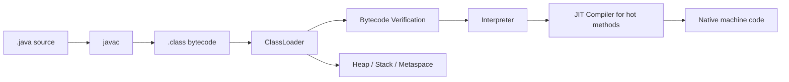

# Java Basics and Idioms

> [!summary] Goal
> Write modern Java that is readable, safe, and production-friendly by understanding both the language surface and the runtime model underneath it.

## Table of Contents

1. [What Java Actually Is](#what-java-actually-is)
2. [Source to Runtime Flow](#source-to-runtime-flow)
3. [Primitive vs Reference Types](#primitive-vs-reference-types)
4. [Objects, Identity, and Equality](#objects-identity-and-equality)
5. [Strings, Records, and Enums](#strings-records-and-enums)
6. [Immutability and API Design](#immutability-and-api-design)
7. [Null Handling and Optional](#null-handling-and-optional)
8. [Everyday Idioms](#everyday-idioms)
9. [Common Pitfalls](#common-pitfalls)
10. [Best Practices](#best-practices)

---

## What Java Actually Is

Java is not just a syntax layer. It is a full execution stack:
- `javac` compiles source to bytecode
- the JVM loads classes, verifies bytecode, and executes it
- hot code is JIT-compiled to machine code
- memory is managed by the garbage collector
- the standard library provides the real programming model used in applications

That matters because many "simple" Java decisions have runtime consequences:
- using a mutable key in `HashMap` can break lookups
- returning `null` changes every caller’s control flow
- allocating temporary objects in a hot loop changes GC pressure
- bad `equals` / `hashCode` implementations silently degrade correctness and performance

---

## Source to Runtime Flow



### Why this matters

- **Compilation errors** catch type-level problems early.
- **Bytecode verification** protects the JVM from malformed class behavior.
- **JIT compilation** is why warm-up matters for benchmarks.
- **GC and object allocation** are part of application behavior, not a separate concern.

---

## Primitive vs Reference Types

### Primitive types

Java primitives store raw values:

| Type | Size | Example | Notes |
|------|------|---------|-------|
| `boolean` | JVM-dependent | `true` | logical value |
| `byte` | 8-bit | `1` | small integer |
| `short` | 16-bit | `10` | uncommon in app code |
| `int` | 32-bit | `42` | default integer type |
| `long` | 64-bit | `42L` | use for large counters / timestamps |
| `float` | 32-bit | `1.5f` | avoid for money |
| `double` | 64-bit | `3.14` | default floating-point type |
| `char` | 16-bit | `'A'` | UTF-16 code unit, not a full Unicode character model |

### Reference types

Reference types point to objects on the heap:
- classes
- arrays
- interfaces
- enums
- records
- `String`

### Example

```java
int count = 10;                 // value stored directly
String name = "Rishav";        // reference to object
User user = new User("rishav");
```

### Why this matters

- Primitives avoid allocation and nullability.
- References can be `null`.
- Wrapper types (`Integer`, `Long`, etc.) introduce allocation / boxing overhead and null handling.

### Autoboxing pitfall

```java
List<Integer> ids = new ArrayList<>();
for (int i = 0; i < 1_000_000; i++) {
    ids.add(i);   // boxing from int -> Integer
}
```

This is ergonomic, but in hot paths it can create significant allocation pressure.

---

## Objects, Identity, and Equality

There are three different ideas developers often blur together:

1. **Identity**: are these the exact same object? (`==` for references)
2. **Logical equality**: do these objects represent the same value? (`equals`)
3. **Hashing contract**: can these objects be used safely in hash-based collections? (`hashCode`)

### `==` vs `equals`

```java
String a = new String("java");
String b = new String("java");

System.out.println(a == b);      // false: different objects
System.out.println(a.equals(b)); // true: same logical value
```

### `equals` / `hashCode` contract

If two objects are equal according to `equals`, they must return the same `hashCode`.

```java
public final class Money {
    private final String currency;
    private final long cents;

    public Money(String currency, long cents) {
        this.currency = currency;
        this.cents = cents;
    }

    @Override
    public boolean equals(Object o) {
        if (this == o) return true;
        if (!(o instanceof Money other)) return false;
        return cents == other.cents && Objects.equals(currency, other.currency);
    }

    @Override
    public int hashCode() {
        return Objects.hash(currency, cents);
    }
}
```

### Important definition

> [!tip] Definition
> **Value object**: an object whose meaning comes from its data, not its identity. Value objects should usually be immutable and should implement `equals` / `hashCode` consistently.

---

## Strings, Records, and Enums

## Strings

`String` is immutable. Every "modification" creates a new object.

```java
String full = firstName + " " + lastName;
```

This is fine for normal code, but repeated concatenation in loops can be expensive.

```java
StringBuilder sb = new StringBuilder();
for (String part : parts) {
    sb.append(part).append(',');
}
String result = sb.toString();
```

## Records

Use records for immutable data carriers.

```java
public record UserSummary(long id, String name, String email) {}
```

Use when:
- the type mainly carries data
- you want generated constructor/accessors/`equals`/`hashCode`/`toString`
- immutability is correct for the model

Do not use when:
- the type has complex mutable lifecycle/state
- invariants require non-trivial construction logic beyond a compact constructor

## Enums

Enums are real types, not just named constants.

```java
public enum OrderStatus {
    CREATED,
    PAID,
    SHIPPED,
    CANCELLED
}
```

Enums are ideal when:
- the set of values is closed and known
- switch exhaustiveness matters
- behavior can be attached to the enum when useful

---

## Immutability and API Design

Immutability reduces the number of states your code can be in.

### Prefer immutable data where practical

```java
public final class Account {
    private final long id;
    private final String owner;

    public Account(long id, String owner) {
        this.id = id;
        this.owner = owner;
    }

    public long id() { return id; }
    public String owner() { return owner; }
}
```

### Why immutability helps

- easier reasoning in concurrent code
- safer map/set keys
- fewer defensive copies at boundaries
- easier caching and memoization

### When mutable state is still valid

- counters, buffers, builders, connection objects, caches, lifecycle-managed services

The point is not "everything immutable". The point is to make mutation explicit and justified.

---

## Null Handling and Optional

### Null is a control-flow decision

Returning `null` forces every caller to remember a branch.

```java
User user = repository.findById(id);
if (user != null) {
    sendWelcomeEmail(user);
}
```

### `Optional` guidance

Good use:

```java
Optional<User> findByEmail(String email)
```

Usually avoid:
- `Optional` fields inside entities / DTOs
- `Optional` parameters
- using `Optional` everywhere instead of normal branching

### Good pattern

```java
return repository.findByEmail(email)
        .filter(User::isActive)
        .map(User::displayName);
```

### Bad pattern

```java
Optional<String> maybeName = Optional.ofNullable(name);
if (maybeName.isPresent()) {
    System.out.println(maybeName.get());
}
```

If you immediately call `get`, `Optional` added ceremony, not clarity.

---

## Everyday Idioms

## Prefer interfaces in APIs

```java
public List<String> findNames() {
    return List.of("a", "b");
}
```

Return `List`, not `ArrayList`, unless callers must rely on implementation details.

## Keep constructors valid

```java
public record EmailAddress(String value) {
    public EmailAddress {
        if (value == null || value.isBlank() || !value.contains("@")) {
            throw new IllegalArgumentException("Invalid email");
        }
    }
}
```

## Use `var` where it improves readability, not where it hides type meaning

Good:

```java
var usersById = new HashMap<Long, User>();
```

Less good:

```java
var x = service.compute(); // What is x?
```

## Favor library methods over reinvention

- `Objects.requireNonNull`
- `List.of`, `Map.of`
- `Comparator.comparing`
- `Collectors.groupingBy`

---

## Common Pitfalls

### Mutable map keys

```java
Map<User, String> roles = new HashMap<>();
User user = new User("alice");
roles.put(user, "admin");
user.setName("bob"); // dangerous if name participates in hashCode
```

This can make the entry effectively unreachable in the map.

### Floating point for money

Use `BigDecimal` or integer minor units (`long cents`), not `double`.

### Overusing inheritance

Prefer composition unless the subtype relationship is genuinely stable and substitutable.

### Leaking implementation details

Returning mutable internal collections is an API bug.

```java
public List<String> roles() {
    return List.copyOf(roles);
}
```

---

## Best Practices

- Prefer immutability for value-like domain objects.
- Implement `equals` and `hashCode` together.
- Use records for plain immutable carriers.
- Return empty collections instead of `null`.
- Use `Optional` mainly for optional return values.
- Keep constructors and factory methods invariant-safe.
- Prefer clear names and simple control flow over clever chaining.

---

> [!question]- Interview Questions
>
> **Q: What is the difference between `==` and `equals()` in Java?**
> A: `==` compares primitive values directly or reference identity for objects. `equals()` compares logical equality as defined by the type.
>
> **Q: Why are immutable objects preferred in many Java designs?**
> A: They are easier to reason about, safer in concurrent code, and avoid accidental state changes.
>
> **Q: When should you use a record?**
> A: When the type is primarily a transparent, immutable data carrier with value-based semantics.
>
> **Q: Why is a bad `hashCode()` implementation dangerous?**
> A: Hash-based collections depend on it for correct lookup and performance. Wrong implementations can cause missing entries or excessive collisions.
>
> **Q: Is `Optional` a replacement for `null` everywhere?**
> A: No. It is most useful for optional return values, not fields, parameters, or every control-flow branch.

---

## Cross-Links

- [[Java/01_Foundations/02_Collections_and_Generics]]
- [[Java/01_Foundations/03_Exceptions_and_Resource_Management]]
- [[Java/02_Core/02_JVM_Memory_and_GC_Basics]]

---

## References

- [Java Language Specification](https://docs.oracle.com/javase/specs/)
- [Java SE Documentation](https://docs.oracle.com/en/java/javase/)
- [Records](https://docs.oracle.com/en/java/javase/17/language/records.html)
