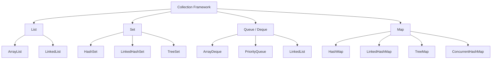
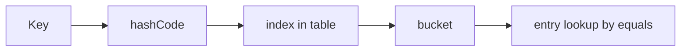

# Collections and Generics

> [!summary] Goal
> Choose the right collection based on access patterns, memory behavior, and semantics, and understand generics well enough to design type-safe APIs without guessing at wildcard syntax.

## Table of Contents

1. [Why Collections Choice Matters](#why-collections-choice-matters)
2. [Collections Framework Map](#collections-framework-map)
3. [How to Choose the Right Collection](#how-to-choose-the-right-collection)
4. [Core Implementations and Internals](#core-implementations-and-internals)
5. [Generics Fundamentals](#generics-fundamentals)
6. [Wildcards and PECS](#wildcards-and-pecs)
7. [Common Scenarios](#common-scenarios)
8. [Pitfalls](#pitfalls)

---

## Why Collections Choice Matters

Collections are not interchangeable.

The right choice affects:
- asymptotic complexity
- constant factors and memory overhead
- ordering guarantees
- duplicate handling
- concurrency behavior
- API clarity

Example mistakes:
- using `LinkedList` where `ArrayDeque` is better
- using `HashMap` when ordering matters
- using raw types and losing compile-time safety
- storing mutable keys in hash-based collections

---

## Collections Framework Map



---

## How to Choose the Right Collection

| Need | Good default | Why |
|------|--------------|-----|
| Ordered sequence | `ArrayList` | fast iteration, O(1) amortized append |
| FIFO / stack / deque | `ArrayDeque` | better than `LinkedList` for most queue/stack use |
| Unique values | `HashSet` | fast membership checks |
| Key/value lookup | `HashMap` | best default map |
| Insertion-order map | `LinkedHashMap` | preserves insertion order |
| Sorted keys | `TreeMap` | ordered by comparator / natural ordering |
| Top-N / min-max | `PriorityQueue` | heap-based priority operations |

### Simple rule of thumb

- Start with `ArrayList`, `HashMap`, `HashSet`, `ArrayDeque`
- Move away from defaults only when ordering, sorting, concurrency, or memory behavior requires it

---

## Core Implementations and Internals

## `ArrayList`

Backed by a resizable array.

Why it is usually the default list:
- contiguous storage gives good cache locality
- O(1) random access
- append is amortized O(1)

Tradeoff:
- insert/delete in the middle shifts elements and is O(n)

```java
List<String> names = new ArrayList<>();
names.add("Ada");
names.add("Linus");
System.out.println(names.get(1));
```

## `HashMap`

Backed by an array of buckets. A key’s `hashCode()` determines the bucket, then collisions are resolved within that bucket.



Important internals:
- average-case O(1) lookup/insert
- resize happens when load factor threshold is crossed
- collisions hurt performance
- correctness depends on stable `equals` / `hashCode`

```java
Map<String, Integer> counts = new HashMap<>();
counts.merge("java", 1, Integer::sum);
```

## `LinkedHashMap`

Like `HashMap`, but also keeps a linked order of entries.

Use when:
- predictable iteration order matters
- you want a simple LRU-like structure via access order

## `TreeMap` / `TreeSet`

Sorted structures backed by a balanced tree.

Use when:
- sorted traversal matters
- range operations matter (`headMap`, `tailMap`, `subMap`)

Tradeoff:
- O(log n) operations instead of average O(1)

## `ArrayDeque`

Best default for stack/queue/deque patterns.

```java
Deque<Integer> deque = new ArrayDeque<>();
deque.addLast(1);
deque.addLast(2);
int first = deque.removeFirst();
```

Why prefer it over `LinkedList`:
- less object overhead
- better locality
- fewer pointer-chasing costs

## `PriorityQueue`

Heap-backed queue where the smallest (or comparator-first) element is returned first.

```java
PriorityQueue<Integer> pq = new PriorityQueue<>();
pq.add(5);
pq.add(1);
pq.add(3);
System.out.println(pq.poll()); // 1
```

## `EnumMap` / `EnumSet`

Specialized map and set implementations for enum keys. **Much faster than `HashMap`** because the key set is known at compile time — `EnumMap` uses an internal array indexed by `ordinal()` (no hashing, no collisions).

```java
enum Status { PENDING, ACTIVE, BLOCKED, DELETED }

Map<Status, Integer> userCounts = new EnumMap<>(Status.class);
userCounts.put(Status.ACTIVE, 150);

// Performance: EnumMap.get() → array[ordinal] — one array load, no hash, no equals.
// Equivalent EnumSet: bit vector internally → extremely compact and fast.

// When to use:
//   - Any Map<Enum, V> or Set<Enum> → always prefer EnumMap/EnumSet
//   - Especially in hot paths where map access is frequent

// Behind the scenes:
//   EnumMap has two arrays: key universe (all enum constants) and value array.
//   put(key, val): values[key.ordinal()] = val
//   get(key):      return values[key.ordinal()]
//   No hashCode(), no equals(), no collision resolution needed.
```

## `WeakHashMap`

A `Map` where keys are held by **weak references**. When a key is no longer reachable from strong references anywhere in the application, the entry is automatically removed (on the next GC cycle that clears the weak reference).

```java
WeakHashMap<Key, ExpensiveData> cache = new WeakHashMap<>();

// Usage pattern: the KEY should be something the caller holds externally.
// When the caller discards the key, the cache entry is eligible for GC.

// Common use case: metadata attached to objects you don't control the lifecycle of.
// Example: classloader — cache metadata per classloader, auto-clean when classloader is GC'd.

// How it works:
//   1. Keys are wrapped in WeakReference.
//   2. ReferenceQueue tracks cleared weak references.
//   3. On every operation (get, put, size), the map polls the ReferenceQueue
//      and removes stale entries.
//   4. The VALUE is a strong reference — it prevents the value from being GC'd
//      until the entry is removed.

// ⚠️  WeakHashMap caveats:
//   - Only keys are weak, NOT values. If the value references the key,
//     the key can never be GC'd → memory leak.
//   - Size is approximate (entries are removed lazily).
//   - Not thread-safe (use Collections.synchronizedMap or ConcurrentHashMap).

// When to use WeakHashMap:
//   - Classloader-scoped caches (prevent permgen/metaspace leaks).
//   - Metadata maps where entries should die with the key.
//   - Any cache where entries should auto-clean when the key becomes unreachable.

// When NOT to use WeakHashMap:
//   - Most application caches (use Caffeine, Guava Cache, or LRU LinkedHashMap).
//   - Thread-safe scenarios.
//   - When keys are strings or other short-lived objects (they'd be GC'd immediately).
```

## Sequenced Collections (Java 21+)

Java 21 introduced `SequencedCollection`, `SequencedSet`, and `SequencedMap` — interfaces for collections with a defined encounter order and operations at both ends.

```java
// SequencedCollection — for List, Deque, and any ordered collection
// Adds: addFirst, addLast, getFirst, getLast, removeFirst, removeLast, reversed()

SequencedCollection<String> seq = new ArrayList<>();
seq.addLast("middle");
seq.addFirst("first");
seq.addLast("last");
System.out.println(seq.getFirst());   // "first"
System.out.println(seq.getLast());    // "last"
System.out.println(seq.reversed());   // ["last", "middle", "first"]

// SequencedSet — for LinkedHashSet (ordered, unique, no duplicates)
SequencedSet<String> set = new LinkedHashSet<>();
set.add("b");
set.add("a");
set.addFirst("z");     // "z" becomes first (LinkedHashSet supports this)
System.out.println(set.getFirst());   // "z"

// SequencedMap — for LinkedHashMap, TreeMap
SequencedMap<String, Integer> map = new LinkedHashMap<>();
map.put("a", 1);
map.put("b", 2);
map.putFirst("z", 0);     // Add or move to front
map.putLast("c", 3);      // Add or move to end

System.out.println(map.firstEntry());  // "z"=0
System.out.println(map.pollFirstEntry());  // Remove and return first entry

// Why this matters:
//   Before Java 21: no uniform API for "first" or "last" across ordered collections.
//   TreeMap: firstKey()/lastKey()
//   LinkedHashMap: iterate manually (no direct first/last access)
//   ArrayList: get(0)/get(size-1)
//   Deque: getFirst()/getLast()
//   Now: ONE interface for ALL ordered collections.
```

---

## Generics Fundamentals

Generics let the compiler enforce type safety.

```java
List<String> names = new ArrayList<>();
names.add("java");
// names.add(42); // compile error
```

### Why generics exist

Without generics, collections become `Object` buckets and force casts everywhere.

```java
List raw = new ArrayList();
raw.add("hello");
raw.add(42);

String value = (String) raw.get(1); // runtime ClassCastException
```

### Type erasure

Java generics are implemented with **type erasure**:
- generic type parameters mostly disappear at runtime
- the compiler inserts casts and checks where needed

Consequences:
- you cannot do `new T()` directly
- you cannot check `if (x instanceof List<String>)`
- arrays and generics do not mix naturally

---

## Wildcards and PECS

### Invariance

`List<Integer>` is **not** a subtype of `List<Number>`.

If it were, this would be unsafe:

```java
List<Integer> ints = new ArrayList<>();
// List<Number> nums = ints; // not allowed
// nums.add(3.14);           // would corrupt ints
```

### PECS rule

> [!tip] Definition
> **PECS** = Producer Extends, Consumer Super.

- `? extends T` when you only read values as `T`
- `? super T` when you want to write `T` values safely

```java
double sum(List<? extends Number> numbers) {
    double total = 0;
    for (Number n : numbers) total += n.doubleValue();
    return total;
}

void addDefaults(List<? super Integer> out) {
    out.add(1);
    out.add(2);
}
```

---

## Common Scenarios

## Counting frequencies

```java
Map<String, Integer> counts = new HashMap<>();
for (String word : words) {
    counts.merge(word, 1, Integer::sum);
}
```

## Preserving insertion order in API output

```java
Map<String, String> ordered = new LinkedHashMap<>();
```

## Maintaining a leaderboard top 10

```java
PriorityQueue<Score> top = new PriorityQueue<>(Comparator.comparingInt(Score::value));
```

## Building a queue worker

```java
Deque<Job> jobs = new ArrayDeque<>();
```

## Returning a read-only result

```java
return List.copyOf(results);
```

---

## Pitfalls

### Using `LinkedList` by habit

It looks like it should be good for inserts/deletes, but in real applications its memory overhead and poor locality often make it a poor default.

### Mutable keys in `HashMap`

If fields used by `equals` / `hashCode` change after insertion, lookups can break.

### Raw types

```java
List values = new ArrayList();
```

This disables generic safety and should be avoided in normal code.

### `Arrays.asList` surprise

```java
List<String> xs = Arrays.asList("a", "b");
// xs.add("c"); // UnsupportedOperationException
```

It returns a fixed-size list view, not a regular growable `ArrayList`.

### Autoboxing in hot paths

Repeatedly boxing primitives into wrappers can add avoidable allocation and CPU cost.

---

> [!question]- Interview Questions
>
> **Q: Why is `ArrayList` usually preferred over `LinkedList`?**
> A: Better cache locality, lower object overhead, and better performance for common access/append patterns.
>
> **Q: Why does `HashMap` need both `equals` and `hashCode`?**
> A: `hashCode` narrows the bucket; `equals` confirms exact key equality within collisions.
>
> **Q: What is type erasure?**
> A: Java generics are primarily enforced at compile time; runtime mostly sees erased types plus inserted casts/checks.
>
> **Q: What does PECS mean?**
> A: Producer extends, consumer super. Use `? extends T` for reading, `? super T` for writing.
>
> **Q: Why is `List<Integer>` not a subtype of `List<Number>`?**
> A: Because generics are invariant in Java; allowing that would make writes unsafe.

---

## Cross-Links

- [[Java/01_Foundations/01_Java_Basics_and_Idioms]]
- [[Java/02_Core/01_Concurrency_Threads_and_Executors]]

---

## References

- [Collections Framework](https://docs.oracle.com/en/java/javase/17/docs/api/java.base/java/util/doc-files/coll-overview.html)
- [Generics Tutorial](https://docs.oracle.com/javase/tutorial/java/generics/)
