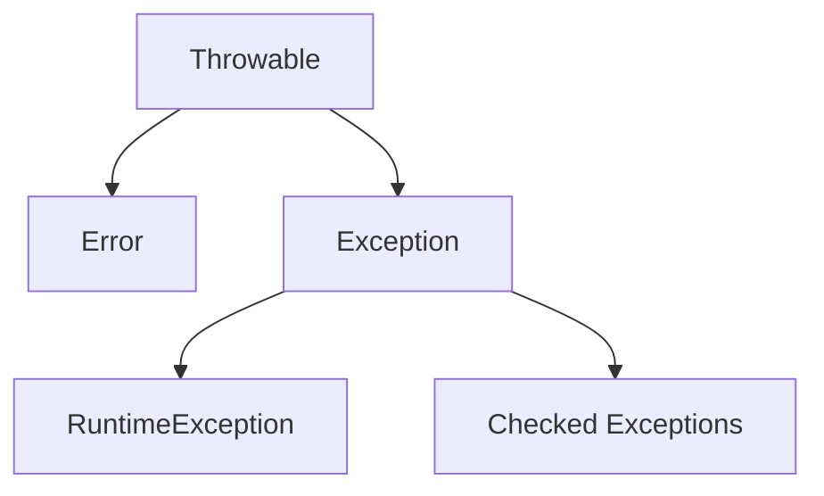
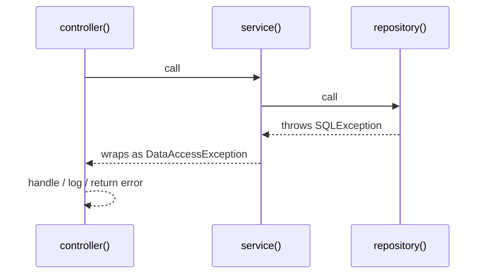

# Exceptions and Resource Management

> [!summary] Goal
> Design error-handling flows that are useful to callers, observable in production, and safe for resource lifecycle management.

## Table of Contents

1. [Why Exceptions Exist](#why-exceptions-exist)
2. [Exception Hierarchy](#exception-hierarchy)
3. [Checked vs Unchecked](#checked-vs-unchecked)
4. [How Stack Unwinding Works](#how-stack-unwinding-works)
5. [Wrapping Exceptions Correctly](#wrapping-exceptions-correctly)
6. [Try-with-Resources](#try-with-resources)
7. [Suppressed Exceptions](#suppressed-exceptions)
8. [Common Scenarios](#common-scenarios)
9. [Pitfalls](#pitfalls)

---

## Why Exceptions Exist

> [!info] Checked vs unchecked exceptions
> **Checked exceptions** (subclasses of `Exception` but not `RuntimeException`) must be declared in the `throws` clause or caught. They represent recoverable conditions the caller should handle. **Unchecked exceptions** (`RuntimeException` and its subclasses, `Error`) represent programming bugs or unrecoverable failures that callers typically shouldn't handle.

Exceptions separate the normal path from the failure path.

That matters because error handling is not just syntax. It defines:
- what failures a caller can react to
- what information survives for logging/debugging
- whether resources are safely released
- whether failures get silently hidden

---

## Exception Hierarchy



### Rough meaning

- `Error`: JVM / environment level problems you usually do not recover from normally
- checked exceptions: caller is forced to acknowledge them
- `RuntimeException`: unchecked exceptions; common for programming errors and many application-level failures

---

## Checked vs Unchecked

### Checked exceptions

Part of the method contract.

```java
public String readConfig(Path path) throws IOException {
    return Files.readString(path);
}
```

Use when:
- the caller can realistically recover or choose a fallback
- the boundary is library-style or infrastructure-facing

### Unchecked exceptions

```java
if (port <= 0) {
    throw new IllegalArgumentException("port must be positive");
}
```

Use when:
- the caller violated a precondition
- the error is not practically recoverable at that level
- you want cleaner application/service code and centralized handling higher up

### Practical guidance

- checked exceptions are often good at IO / integration boundaries
- unchecked exceptions are often good in domain/service layers
- consistency matters more than ideology

---

## How Stack Unwinding Works

When an exception is thrown, Java walks back up the call stack looking for a matching catch block.



### Why wrapping matters

The most useful exception strategy preserves:
- the original cause
- the business context
- the right abstraction level

Bad:

```java
catch (SQLException e) {
    throw new RuntimeException("DB failed");
}
```

Better:

```java
catch (SQLException e) {
    throw new OrderRepositoryException("Failed to load order " + orderId, e);
}
```

The cause chain is now preserved.

---

## Wrapping Exceptions Correctly

### Add context, don’t destroy evidence

```java
public User loadUser(long id) {
    try {
        return repository.load(id);
    } catch (SQLException e) {
        throw new UserLookupException("Failed to load user id=" + id, e);
    }
}
```

### Good custom exception example

```java
public class UserLookupException extends RuntimeException {
    public UserLookupException(String message, Throwable cause) {
        super(message, cause);
    }
}
```

Do not create custom exception classes for every tiny thing. Create them when they represent a meaningful handling boundary.

---

## Try-with-Resources

Any object implementing `AutoCloseable` can be managed automatically.

```java
try (var in = Files.newInputStream(path);
     var reader = new BufferedReader(new InputStreamReader(in))) {
    return reader.readLine();
}
```

### Why it is better than manual finally blocks

- less boilerplate
- safer when multiple resources are involved
- preserves both main and close failures via suppressed exceptions

---

## Suppressed Exceptions

If both the main work and `close()` fail, Java keeps the close failure as **suppressed**, instead of losing it.

```java
try (MyResource r = new MyResource()) {
    throw new IllegalStateException("main failure");
}
```

You can inspect them with:

```java
for (Throwable suppressed : ex.getSuppressed()) {
    logger.error("suppressed", suppressed);
}
```

This is one reason `try-with-resources` is better than hand-written cleanup.

---

## Common Scenarios

## Reading a file safely

```java
public String loadTemplate(Path path) {
    try {
        return Files.readString(path);
    } catch (IOException e) {
        throw new IllegalStateException("Cannot read template: " + path, e);
    }
}
```

## Validating arguments

```java
public void transfer(long fromId, long toId, long cents) {
    if (fromId == toId) throw new IllegalArgumentException("accounts must differ");
    if (cents <= 0) throw new IllegalArgumentException("cents must be positive");
}
```

## Preserving interrupt status

```java
try {
    queue.take();
} catch (InterruptedException e) {
    Thread.currentThread().interrupt();
    return;
}
```

This is critical in concurrent code; swallowing interrupts breaks cancellation protocols.

---

## Pitfalls

### Catching `Exception` too broadly

It can hide programming errors and make failures harder to classify.

### Logging and rethrowing everywhere

If every layer logs the same exception, production logs become noisy and misleading. Usually log at the boundary where the exception is actually handled.

### Dropping the cause

Always preserve the original throwable when wrapping.

### Using checked exceptions mechanically

Forcing callers to declare or catch exceptions they cannot handle just adds friction.

### Ignoring interrupted status

This is a correctness bug in concurrent programs, not just a style issue.

---

> [!question]- Interview Questions
>
> **Q: What is the difference between checked and unchecked exceptions?**
> A: Checked exceptions are part of the method contract and must be handled or declared. Unchecked exceptions extend `RuntimeException` and usually represent programming errors or failures handled at higher layers.
>
> **Q: Why is `try-with-resources` preferred over manual cleanup?**
> A: It reduces boilerplate, reliably closes resources, and preserves suppressed exceptions from cleanup failures.
>
> **Q: What is exception wrapping?**
> A: Translating a low-level exception into a higher-level one while preserving the original cause and adding useful context.
>
> **Q: Why should you restore interrupt status after catching `InterruptedException`?**
> A: Because interruption is a cooperative cancellation signal. Swallowing it can break shutdown and timeout behavior.

---

## Cross-Links

- [[Java/02_Core/01_Concurrency_Threads_and_Executors]]
- [[Java/03_Advanced/03_JVM_Tooling_JFR_JStack_JMap]]

---

## References

- [Exceptions Trail](https://docs.oracle.com/javase/tutorial/essential/exceptions/)
- [The try-with-resources Statement](https://docs.oracle.com/javase/tutorial/essential/exceptions/tryResourceClose.html)
