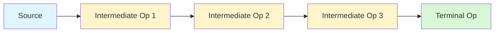
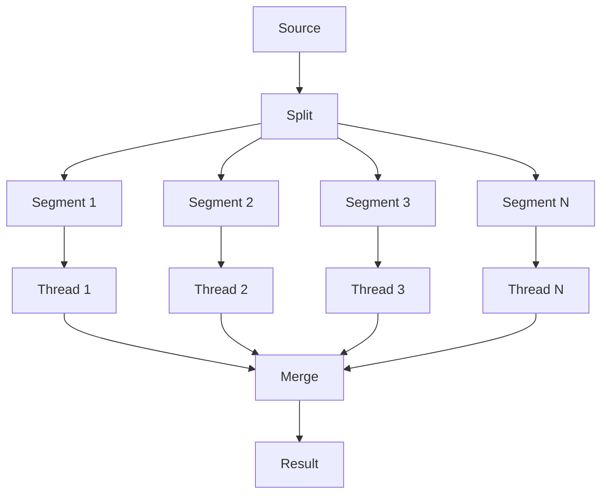

# Streams, Lambdas, and Functional Java

> [!summary] Goal
> Write declarative, safe data-processing pipelines in Java: use lambdas and streams to express what to compute rather than how to iterate, and understand when functional style improves clarity versus when it obscures intent.

## Table of Contents

1. [Why Functional Style in Java](#why-functional-style-in-java)
2. [Lambda Expressions](#lambda-expressions)
3. [Functional Interfaces](#functional-interfaces)
4. [Method References](#method-references)
5. [Streams Pipeline](#streams-pipeline)
6. [Intermediate Operations](#intermediate-operations)
7. [Terminal Operations](#terminal-operations)
8. [Collectors Deep-Dive](#collectors-deep-dive)
9. [Reduction with `reduce`](#reduction-with-reduce)
10. [Parallel Streams](#parallel-streams)
11. [`Optional` Deep-Dive](#optional-deep-dive)
12. [Common Patterns](#common-patterns)
13. [Pitfalls](#pitfalls)

---

## Why Functional Style in Java

### Declarative vs imperative

```java
// Imperative — how
List<String> names = new ArrayList<>();
for (User u : users) {
    if (u.isActive()) {
        names.add(u.getName().toUpperCase());
    }
}

// Declarative — what
List<String> names = users.stream()
    .filter(User::isActive)
    .map(User::getName)
    .map(String::toUpperCase)
    .toList();
```

The declarative version:
- states **what** to compute, not **how** to iterate
- composes operations — each step is independently testable
- is lazy — intermediate operations don't run until a terminal operation is called
- leaves iteration strategy open (sequential, parallel, ordered, unordered)

### When to use streams

| Use streams | Avoid streams |
|-------------|---------------|
| Transforming collection data | Complex branching logic |
| Filtering + mapping + collecting | Performance-critical tight loops (overhead matters) |
| Grouping / partitioning / aggregating | Mutable shared state |
| Declarative data pipelines | Code that's harder to read as a stream |
| Parallelizable operations | Small data where imperative is clearer |

---

## Lambda Expressions

### Syntax

```java
// Full form:  (parameters) -> { body }
(File f) -> { return f.getName().endsWith(".java"); }

// Single parameter — omit parentheses
f -> f.getName().endsWith(".java")

// Single expression — omit braces and return
f -> f.getName().endsWith(".java")

// Multiple parameters
(a, b) -> a.length() - b.length()

// No parameters
() -> new Random().nextInt()

// Type inference — compiler infers from context
// These are equivalent:
Predicate<File> p = (File f) -> f.isDirectory();
Predicate<File> p = f -> f.isDirectory();
```

### Variable capture

Lambdas can capture local variables from the enclosing scope, but they must be **effectively final** — not reassigned after initialization:

```java
String prefix = "user_";      // effectively final
Function<Long, String> f = id -> prefix + id;

// This does NOT compile:
String prefix = "user_";
prefix = "admin_";            // reassigned → not effectively final
Function<Long, String> f = id -> prefix + id;
```

> [!tip] Definition
> **Effectively final**: a variable that is never reassigned after initialization, even without the `final` keyword. Java 8+ allows lambdas and anonymous classes to capture effectively-final variables.

### `this` in lambdas vs anonymous classes

```java
public class Processor {
    private String name = "processor";

    public void process() {
        Runnable r1 = () -> System.out.println(this.name);
            // 'this' refers to the Processor instance

        Runnable r2 = new Runnable() {
            private String name = "anonymous";
            public void run() {
                System.out.println(this.name);
                // 'this' refers to the anonymous class instance
            }
        };
    }
}
```

---

## Functional Interfaces

A functional interface has exactly one abstract method. It can have any number of `default` or `static` methods.

### Built-in functional interfaces (`java.util.function`)

| Interface | Method | Signature | Use case |
|-----------|--------|-----------|----------|
| `Predicate<T>` | `test` | `T → boolean` | Filtering, validation |
| `Consumer<T>` | `accept` | `T → void` | Side effects (print, log, save) |
| `Function<T,R>` | `apply` | `T → R` | Transformation |
| `Supplier<T>` | `get` | `() → T` | Lazy or deferred value |
| `UnaryOperator<T>` | `apply` | `T → T` | Same-type transformation |
| `BinaryOperator<T>` | `apply` | `(T, T) → T` | Reduction (sum, max, min) |
| `BiFunction<T,U,R>` | `apply` | `(T, U) → R` | Two-argument transformation |
| `BiPredicate<T,U>` | `test` | `(T, U) → boolean` | Two-argument test |

### Using functional interfaces

```java
// Predicate
Predicate<String> isLong = s -> s.length() > 10;
boolean result = isLong.test("hello world");  // true

// Consumer
Consumer<String> logger = msg -> System.out.println("LOG: " + msg);
logger.accept("processing started");

// Function
Function<String, Integer> parser = Integer::parseInt;
Integer val = parser.apply("42");

// Supplier — lazy evaluation
Supplier<Long> timeSupplier = System::currentTimeMillis;
long now = timeSupplier.get();  // evaluated here, not at creation

// Composing
Predicate<String> startsWithA = s -> s.startsWith("A");
Predicate<String> endsWithZ = s -> s.endsWith("Z");
Predicate<String> startsAandEndsZ = startsWithA.and(endsWithZ);

Function<String, String> trim = String::trim;
Function<String, String> upper = String::toUpperCase;
Function<String, String> trimThenUpper = trim.andThen(upper);
```

### `@FunctionalInterface` annotation

Marks an interface as intended for lambda use. The compiler will error if the interface has more than one abstract method:

```java
@FunctionalInterface
interface StringProcessor {
    String process(String input);
    // boolean equals(Object o);  // OK — Object methods don't count
    // void doOther();            // ERROR — second abstract method
}
```

---

## Method References

Shorthand for lambdas that simply call an existing method.

| Form | Syntax | Example | Equivalent lambda |
|------|--------|---------|-------------------|
| Static method | `ClassName::staticMethod` | `Integer::parseInt` | `s -> Integer.parseInt(s)` |
| Instance method on instance | `instance::method` | `logger::info` | `msg -> logger.info(msg)` |
| Instance method on parameter | `ClassName::instanceMethod` | `String::toUpperCase` | `s -> s.toUpperCase()` |
| Constructor | `ClassName::new` | `ArrayList::new` | `() -> new ArrayList()` |
| Array constructor | `Type[]::new` | `int[]::new` | `n -> new int[n]` |

```java
// Static method
Function<String, Integer> f1 = Integer::parseInt;

// Instance method on a specific object
List<String> names = List.of("Alice", "Bob");
names.forEach(System.out::println);

// Instance method on a parameter
List<String> upper = names.stream()
    .map(String::toUpperCase)
    .toList();

// Constructor
Supplier<List<String>> listMaker = ArrayList::new;
List<String> list = listMaker.get();

// Array constructor
IntFunction<int[]> arrayMaker = int[]::new;
int[] arr = arrayMaker.apply(10);
```

---

## Streams Pipeline



### Stream sources

```java
// From collections
Stream<String> stream = list.stream();
Stream<String> parallel = list.parallelStream();

// From arrays
Stream<String> arrayStream = Arrays.stream(array);
Stream<String> fullArray = Stream.of("a", "b", "c");

// From values
Stream<Integer> intStream = Stream.of(1, 2, 3);
Stream<Integer> nullable = Stream.ofNullable(someValue);

// From functions (infinite streams)
Stream<Double> randoms = Stream.generate(Math::random);
Stream<Integer> evens = Stream.iterate(0, n -> n + 2);

// From primitives
IntStream ints = IntStream.range(0, 100);
LongStream longs = LongStream.rangeClosed(1, 100);
DoubleStream doubles = DoubleStream.of(1.0, 2.0, 3.0);

// From files
Stream<String> lines = Files.lines(path);
Stream<Path> entries = Files.list(dir);
```

### Pipeline execution is lazy

Intermediate operations are not executed until a terminal operation is invoked:

```java
Stream<String> stream = list.stream()
    .filter(s -> {
        System.out.println("filter: " + s);
        return s.length() > 3;
    })
    .map(s -> {
        System.out.println("map: " + s);
        return s.toUpperCase();
    });

System.out.println("Nothing printed yet — no terminal op");

List<String> result = stream.toList();  // NOW the pipeline runs
```

---

## Intermediate Operations

Operations that return a new `Stream`. They are **lazy** — nothing happens until a terminal operation is called.

### `filter`

```java
List<User> adults = users.stream()
    .filter(u -> u.age() >= 18)
    .toList();
```

### `map`

One-to-one transformation:

```java
List<String> names = users.stream()
    .map(User::name)
    .toList();
```

### `flatMap`

One-to-many transformation, then flatten:

```java
// Each user has multiple addresses — get all cities
List<String> allCities = users.stream()
    .flatMap(u -> u.addresses().stream())
    .map(Address::city)
    .distinct()
    .toList();

// Handling Optional inside streams
List<String> nonEmpty = listOfOptionals.stream()
    .flatMap(Optional::stream)
    .toList();
```

### `distinct`

Removes duplicates based on `equals()`:

```java
List<String> unique = list.stream().distinct().toList();
```

### `sorted`

```java
// Natural order (requires Comparable)
List<String> sorted = list.stream().sorted().toList();

// Custom comparator
List<User> byAge = users.stream()
    .sorted(Comparator.comparingInt(User::age))
    .toList();

// Multiple fields
List<User> sorted = users.stream()
    .sorted(Comparator.comparing(User::lastName)
        .thenComparing(User::firstName))
    .toList();
```

### `peek`

For debugging — performs an action on each element as it passes through:

```java
List<String> result = list.stream()
    .filter(s -> s.length() > 3)
    .peek(s -> System.out.println("After filter: " + s))
    .map(String::toUpperCase)
    .peek(s -> System.out.println("After map: " + s))
    .toList();
```

> [!warning] Do not use `peek` for production logic. It is meant for debugging. The action is not guaranteed to be called if the stream is optimized (e.g., `count()` may skip elements).

### `limit` and `skip`

```java
List<String> first10 = list.stream()
    .limit(10)
    .toList();

List<String> afterFirst5 = list.stream()
    .skip(5)
    .toList();

// Pagination
List<String> page = list.stream()
    .skip(page * size)
    .limit(size)
    .toList();
```

### `takeWhile` and `dropWhile` (Java 9+)

```java
// Take elements while condition is true, then stop
List<String> shortNames = list.stream()
    .takeWhile(s -> s.length() <= 5)
    .toList();

// Drop elements while condition is true, then emit the rest
List<String> remaining = list.stream()
    .dropWhile(s -> s.length() <= 5)
    .toList();
```

### Common intermediate operations reference

| Operation | Purpose | Lazy? |
|-----------|---------|-------|
| `filter(pred)` | Keep elements matching predicate | Yes |
| `map(fn)` | Transform each element | Yes |
| `flatMap(fn)` | Transform to stream, flatten | Yes |
| `distinct()` | Remove duplicates | Yes |
| `sorted()` / `sorted(cmp)` | Sort elements | Yes (buffers) |
| `peek(action)` | Debug/inspect each element | Yes |
| `limit(n)` | Truncate to at most `n` elements | Yes |
| `skip(n)` | Discard first `n` elements | Yes |
| `takeWhile(pred)` | Take while true, then stop | Yes |
| `dropWhile(pred)` | Drop while true, then emit | Yes |

---

## Terminal Operations

Operations that produce a result or side effect. They **trigger** pipeline execution.

### `toList()` (Java 16+)

```java
List<String> result = stream.toList();   // immutable list
```

### `collect(Collector)`

The most flexible terminal operation. Used with the `Collectors` utility class:

```java
// Basic collectors
List<String> list = stream.collect(Collectors.toList());          // mutable list
Set<String> set = stream.collect(Collectors.toSet());             // mutable set
Collection<String> col = stream.collect(Collectors.toCollection(ArrayList::new));

// To map
Map<Long, User> byId = users.stream()
    .collect(Collectors.toMap(User::id, Function.identity()));

// Map with conflict resolution
Map<String, User> byName = users.stream()
    .collect(Collectors.toMap(
        User::name,
        Function.identity(),
        (existing, incoming) -> existing   // keep first on conflict
    ));

// Joining strings
String csv = names.stream().collect(Collectors.joining(", "));
```

### `forEach` / `forEachOrdered`

```java
// Order not guaranteed for parallel streams
list.stream().forEach(System.out::println);

// Guaranteed encounter order
list.stream().forEachOrdered(System.out::println);
```

> [!warning] `forEach` with parallel streams loses encounter order. Use `forEachOrdered` if order matters (but this reduces parallelism).

### `reduce`

Combines elements into a single value using an associative accumulation function:

```java
// Sum with identity
int sum = IntStream.range(1, 100)
    .reduce(0, Integer::sum);

// Without identity (returns Optional)
Optional<Integer> product = IntStream.range(1, 5)
    .reduce((a, b) -> a * b);

// Reduce to a different type (three-argument version)
List<String> result = list.stream()
    .reduce(
        new ArrayList<String>(),          // identity
        (acc, item) -> {                  // accumulator
            acc.add(transform(item));
            return acc;
        },
        (left, right) -> {                // combiner (used for parallel)
            left.addAll(right);
            return left;
        }
    );
```

### `min` / `max`

```java
Optional<User> youngest = users.stream()
    .min(Comparator.comparingInt(User::age));

Optional<User> oldest = users.stream()
    .max(Comparator.comparingInt(User::age));
```

### `count`

```java
long activeCount = users.stream()
    .filter(User::isActive)
    .count();
```

### `anyMatch` / `allMatch` / `noneMatch`

Short-circuiting — stops processing as soon as the answer is known:

```java
boolean hasAdults = users.stream()
    .anyMatch(u -> u.age() >= 18);

boolean allActive = users.stream()
    .allMatch(User::isActive);

boolean noMinors = users.stream()
    .noneMatch(u -> u.age() < 18);
```

### `findFirst` / `findAny`

```java
Optional<User> first = users.stream()
    .filter(User::isActive)
    .findFirst();     // first in encounter order

Optional<User> any = users.parallelStream()
    .filter(User::isActive)
    .findAny();       // any element (faster in parallel)
```

### Terminal operations reference

| Operation | Returns | Short-circuiting? |
|-----------|---------|-------------------|
| `toList()` | `List<T>` | No |
| `collect(Collector)` | `R` | No |
| `forEach(action)` | `void` | No |
| `reduce(identity, acc)` | `T` | No |
| `min(cmp)` / `max(cmp)` | `Optional<T>` | No |
| `count()` | `long` | No |
| `anyMatch(pred)` | `boolean` | Yes |
| `allMatch(pred)` | `boolean` | Yes |
| `noneMatch(pred)` | `boolean` | Yes |
| `findFirst()` | `Optional<T>` | Yes |
| `findAny()` | `Optional<T>` | Yes |

---

## Collectors Deep-Dive

### `Collectors.groupingBy`

```java
// Group by a classifier function
Map<Role, List<User>> byRole = users.stream()
    .collect(Collectors.groupingBy(User::role));

// Group by with downstream collector
Map<Role, Long> countByRole = users.stream()
    .collect(Collectors.groupingBy(
        User::role,
        Collectors.counting()
    ));

Map<Role, Set<String>> namesByRole = users.stream()
    .collect(Collectors.groupingBy(
        User::role,
        Collectors.mapping(User::name, Collectors.toSet())
    ));

Map<Role, Optional<User>> oldestByRole = users.stream()
    .collect(Collectors.groupingBy(
        User::role,
        Collectors.maxBy(Comparator.comparingInt(User::age))
    ));
```

### `Collectors.partitioningBy`

Like `groupingBy` but the keys are always `true`/`false`:

```java
Map<Boolean, List<User>> partitioned = users.stream()
    .collect(Collectors.partitioningBy(u -> u.age() >= 18));

List<User> adults = partitioned.get(true);
List<User> minors = partitioned.get(false);
```

### `Collectors.teeing` (Java 12+)

Combine two collectors into one:

```java
// Compute average and sum in one pass
record Stats(long sum, double avg) {}

Stats stats = numbers.stream()
    .collect(Collectors.teeing(
        Collectors.summingInt(Integer::intValue),
        Collectors.averagingInt(Integer::intValue),
        Stats::new
    ));
```

### Custom collector

```java
// Collect into an ImmutableSet with a custom merge strategy
Collector<String, ?, ImmutableSet<String>> toImmutableSet =
    Collector.of(
        ImmutableSet::builder,                // supplier
        ImmutableSet.Builder::add,             // accumulator
        (b1, b2) -> b1.addAll(b2.build()),     // combiner
        ImmutableSet.Builder::build            // finisher
    );
```

---

## Reduction with `reduce`

### Three forms

```java
// 1. Identity + accumulator
//    sum = 0 + 1 + 2 + 3 + 4
int sum = IntStream.range(0, 5)
    .reduce(0, Integer::sum);       // 10

// 2. Accumulator only (returns Optional — stream might be empty)
OptionalInt sum = IntStream.range(0, 5)
    .reduce(Integer::sum);          // Optional[10]

// 3. Identity + accumulator + combiner (for parallel, and type-changing)
int product = IntStream.range(1, 5)
    .reduce(1, (a, b) -> a * b);    // 1 * 1 * 2 * 3 * 4 = 24
```

### When to use `reduce` vs `collect`

| `reduce` | `collect` |
|----------|-----------|
| Produces one value from many | Produces a mutable container |
| Immutable accumulation (each step creates new value) | Mutable accumulation (mutates container) |
| Works naturally in parallel (associative) | Needs explicit combiner |
| Example: sum, max, product | Example: list, map, set |

---

## Parallel Streams

### How they work

Parallel streams split the source into segments, process each segment in a separate thread from the **common fork-join pool** (`ForkJoinPool.commonPool()`), then combine results.



### When to use (and not use)

```java
// GOOD — pure computation, large dataset
long total = veryLargeList.parallelStream()
    .filter(this::expensiveComputation)
    .count();

// BAD — blocking I/O in parallel stream
veryLargeList.parallelStream()
    .forEach(this::makeHttpCall);  // blocks common pool threads!

// BAD — shared mutable state
List<Integer> results = Collections.synchronizedList(new ArrayList<>());
veryLargeList.parallelStream()
    .forEach(results::add);  // thread-safe but wrong — ordering + race
```

### Rules of thumb

- **Faster** when: large dataset, CPU-bound operations, independent elements, expensive per-element computation
- **Slower** when: small dataset, sequential operations like `limit`/`skip`/`findFirst`, blocking operations, shared mutable state
- **Same** when: trivial per-element work (parallel overhead dominates)
- The common pool has `Runtime.getRuntime().availableProcessors() - 1` threads

---

## `Optional` Deep-Dive

### Creation

```java
Optional<String> empty = Optional.empty();
Optional<String> value = Optional.of("hello");     // throws NPE if null
Optional<String> nullable = Optional.ofNullable(someVar); // safe if null
```

### Safe consumption

```java
// ifPresent — execute action only if value present
optional.ifPresent(val -> process(val));

// ifPresentOrElse (Java 9+)
optional.ifPresentOrElse(
    val -> process(val),
    () -> log.warning("value not found")
);

// orElse — provide default
String result = optional.orElse("default");

// orElseGet — lazy default (supplier, evaluated only when needed)
String result = optional.orElseGet(() -> computeDefault());

// orElseThrow — throw if absent
String result = optional.orElseThrow(() -> new NotFoundException("missing"));

// or (Java 9+) — alternative Optional if empty
Optional<String> result = optional.or(() -> fallbackOptional());
```

### Transformation

```java
// map — one-to-one, wraps result in Optional
Optional<String> upper = optional.map(String::toUpperCase);

// flatMap — one-to-one, avoids Optional<Optional>
Optional<String> nested = optional.flatMap(val -> lookupSomething(val));

// filter — keep if predicate matches
Optional<String> longVal = optional.filter(s -> s.length() > 10);

// stream() — convert to Stream (useful in flatMap over collections)
optional.stream()  // empty → empty stream, present → singleton stream
```

### Common patterns

```java
// Chain multiple Optional-producing calls
String result = findUser(id)
    .flatMap(this::lookupProfile)
    .map(Profile::displayName)
    .orElse("Guest");

// Aggregate multiple Optionals
Optional<String> combined = Stream.of(opt1, opt2, opt3)
    .flatMap(Optional::stream)
    .reduce((a, b) -> a + ", " + b);
```

### Pitfalls to avoid

```java
// BAD — Optional.get() without checking
String val = optional.get();  // NoSuchElementException if empty

// BAD — Optional fields
public class User {
    private Optional<String> middleName;  // not serializable, not a collection
}

// BAD — Optional parameters
public void setName(Optional<String> name) {
    // caller has to wrap: setName(Optional.of("bob"))
    //                                      vs
    // setName("bob") — normal and clear
}

// BAD — using Optional for 'if not null' branching
if (optional.isPresent()) {
    process(optional.get());
}
// PREFER
optional.ifPresent(this::process);
```

---

## Common Patterns

### Grouping and counting

```java
Map<String, Long> wordCount = words.stream()
    .collect(Collectors.groupingBy(
        Function.identity(),
        Collectors.counting()
    ));
```

### Pagination

```java
List<List<String>> pages = list.stream()
    .collect(Collectors.groupingBy(
        item -> list.indexOf(item) / pageSize,
        Collectors.toList()
    )).values().stream().toList();
```

### Map of lists

```java
Map<Department, List<Employee>> byDept = employees.stream()
    .collect(Collectors.groupingBy(Employee::department));
```

### Collecting to map with merge

```java
Map<String, User> byEmail = users.stream()
    .collect(Collectors.toMap(
        User::email,
        Function.identity(),
        (first, second) -> first  // keep first on duplicate email
    ));
```

### Partitioning

```java
Map<Boolean, List<Order>> partitioned = orders.stream()
    .collect(Collectors.partitioningBy(Order::isPaid));
```

---

## Pitfalls

### Modifying source during stream operation

```java
List<String> list = new ArrayList<>(List.of("a", "b", "c"));
list.stream()
    .filter(s -> {
        list.add("x");  // ConcurrentModificationException (most of the time)
        return true;
    })
    .toList();
```

**Fix**: Never modify the stream source during pipeline execution.

### Stateful lambda in parallel stream

```java
// BAD — shared counter has race conditions
int[] counter = {0};
list.parallelStream().forEach(s -> counter[0]++);

// FIX — use atomic or collect instead
long count = list.parallelStream().count();
```

### Overusing streams for simple operations

```java
// Stream is overkill for finding the max
// BAD
int max = list.stream().max(Integer::compareTo).orElse(0);
// GOOD
int max = Collections.max(list);

// BAD
String joined = list.stream().collect(Collectors.joining(", "));
// GOOD
String joined = String.join(", ", list);
```

### Not closing stream-backed resources

```java
// BAD — file handle leak
Stream<String> lines = Files.lines(path);
lines.filter(l -> l.contains("ERROR")).limit(10).forEach(System.out::println);
// stream is not closed!

// GOOD — try-with-resources
try (Stream<String> lines = Files.lines(path)) {
    lines.filter(l -> l.contains("ERROR")).limit(10).forEach(System.out::println);
}
```

### `forEach` order assumptions with parallel streams

```java
list.parallelStream()
    .forEach(System.out::println);  // not in list order
```

**Fix**: Use `forEachOrdered` or collect to a list for ordered processing.

### `findFirst` vs `findAny` in parallel

```java
// findFirst respects order — more overhead in parallel
Optional<String> first = list.parallelStream().findFirst();

// findAny returns any element — faster in parallel
Optional<String> any = list.parallelStream().findAny();
```

Use `findAny` in parallel streams unless encounter order is semantically required.

---

> [!question]- Interview Questions
>
> **Q: What is the difference between intermediate and terminal operations on a stream?**
> A: Intermediate operations (filter, map, sorted) return a new Stream and are lazy—they don't execute until a terminal operation is called. Terminal operations (collect, forEach, reduce) trigger pipeline execution and produce a result or side effect.
>
> **Q: What is a functional interface?**
> A: An interface with exactly one abstract method. Examples: `Predicate`, `Function`, `Consumer`, `Supplier`. Used as the target type for lambda expressions.
>
> **Q: When would you use `reduce` vs `collect`?**
> A: `reduce` is for immutable accumulation (sum, product, concatenation) where each step creates a new value. `collect` is for mutable accumulation (building a list, map, or set) where a mutable container is modified in place.
>
> **Q: How do parallel streams work?**
> A: They split the source into segments, process each segment in a separate thread from the common fork-join pool, then combine results. They help with CPU-bound operations on large datasets but hurt with blocking I/O, small datasets, or operations that require ordering.
>
> **Q: What are method references and what forms do they take?**
> A: Method references are shorthand for lambdas that call an existing method. Forms: static (`Integer::parseInt`), instance on a specific object (`logger::info`), instance on a parameter (`String::toUpperCase`), constructor (`ArrayList::new`), array constructor (`int[]::new`).
>
> **Q: What is the `Optional` type meant for?**
> A: It conveys that a return value may be absent, forcing the caller to handle both cases. It is designed for return values, not for fields, method parameters, or collections.

---

## Cross-Links

- [[Java/01_Foundations/01_Java_Basics_and_Idioms]] for Optional basics and records
- [[Java/01_Foundations/02_Collections_and_Generics]] for collection sources and PECS
- [[Java/01_Foundations/03_Exceptions_and_Resource_Management]] for exceptions in lambda bodies
- [[Java/02_Core/01_Concurrency_Threads_and_Executors]] for the fork-join pool used by parallel streams
- [[Java/03_Advanced/01_CompletableFuture_and_Structured_Concurrency]] for async composition style

---

## References

- [Java Stream API](https://docs.oracle.com/en/java/javase/17/docs/api/java.base/java/util/stream/Stream.html)
- [Java Functional Interfaces](https://docs.oracle.com/en/java/javase/17/docs/api/java.base/java/util/function/package-summary.html)
- [Oracle Stream Tutorial](https://docs.oracle.com/javase/tutorial/collections/streams/)
- [Optional API](https://docs.oracle.com/en/java/javase/17/docs/api/java.base/java/util/Optional.html)
- [Brian Goetz — State of the Lambda](https://cr.openjdk.org/~briangoetz/lambda/lambda-state-final.html)
