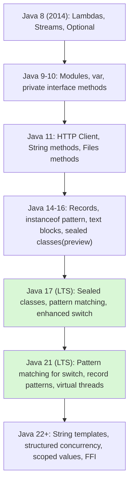

# Modern Java Language Features

> [!summary] Goal
> Use Java's modern language features — records, sealed classes, pattern matching, text blocks, and enhanced switch — to write safer, more expressive code with less boilerplate.

## Table of Contents

1. [Why Modern Java Matters](#why-modern-java-matters)
2. [Records](#records)
3. [Sealed Classes and Interfaces](#sealed-classes-and-interfaces)
4. [Pattern Matching for `instanceof`](#pattern-matching-for-instanceof)
5. [Pattern Matching for `switch`](#pattern-matching-for-switch)
6. [Enhanced Switch Expressions](#enhanced-switch-expressions)
7. [Text Blocks](#text-blocks)
8. [Helpful NullPointerExceptions](#helpful-nullpointerexceptions)
9. [Local Variable Type Inference (`var`)](#local-variable-type-inference)
10. [Common Patterns](#common-patterns)
11. [Pitfalls](#pitfalls)

---

## Why Modern Java Matters



> [!info] Java Language Evolution
> Since Java 8, the JDK has accelerated its release cadence (every 6 months) with LTS releases every 2-3 years. Each release brings both language features (JEPs) and library enhancements. Modern Java looks nothing like Java 8 — records, sealed classes, pattern matching, and virtual threads are transforming how Java code is written.

Starting with Java 17 (LTS), the language evolves faster and more predictably. Modern features eliminate entire categories of boilerplate and bugs:

| Feature | What it eliminates |
|---------|-------------------|
| Records | Manual constructors, `equals`/`hashCode`/`toString`, getters |
| Sealed classes | Missing `default` branches in switch, undocumented type hierarchies |
| Pattern matching | Unsafe casts, verbose `instanceof` chains |
| Switch expressions | Break statements, accidental fall-through |
| Text blocks | Unreadable concatenated strings, broken formatting |
| `var` | Redundant type repetition |

---

## Records

Introduced in Java 14 (preview) and finalized in Java 16.

### What records solve

A record is a transparent, immutable carrier for data. The compiler automatically generates:

- Canonical constructor (with validation possible via compact form)
- Accessor methods (`recordComponent()`)
- `equals()` and `hashCode()` based on all components
- `toString()` showing all components

### Declaration

```java
public record Point(int x, int y) {}

// Usage
Point p = new Point(3, 4);
int x = p.x();        // accessor (not getX())
int y = p.y();
String s = p.toString();  // "Point[x=3, y=4]"
boolean eq = p.equals(new Point(3, 4));  // true
```

### Compact constructor (validation)

```java
public record Email(String value) {
    public Email {
        if (value == null || value.isBlank() || !value.contains("@")) {
            throw new IllegalArgumentException("Invalid email: " + value);
        }
    }
}
```

### Custom methods on records

Records can have instance and static methods:

```java
public record Range(int min, int max) {
    public Range {
        if (min > max) throw new IllegalArgumentException("min > max");
    }

    public boolean contains(int value) {
        return value >= min && value <= max;
    }

    public static Range of(int min, int max) {
        return new Range(min, max);
    }
}
```

### Records and annotations

Records work naturally with annotations for serialization, validation, and mapping:

```java
@JsonPropertyOrder({"id", "name", "email"})
public record UserResponse(
    @JsonProperty("user_id") long id,
    String name,
    @Email String email
) {}
```

### Local records (Java 16+)

Records can be defined inside methods — useful for intermediate data:

```java
public List<String> process(List<Order> orders) {
    record OrderSummary(long id, int itemCount) {}

    return orders.stream()
        .map(o -> new OrderSummary(o.id(), o.items().size()))
        .filter(s -> s.itemCount() > 0)
        .map(s -> "Order " + s.id() + ": " + s.itemCount() + " items")
        .toList();
}
```

### Limitations

| Aspect | Limitation |
|--------|------------|
| Extends | Cannot extend any class (implicitly extends `java.lang.Record`) |
| State | All fields are `private final` — cannot be mutable |
| Inheritance | Cannot be abstract; subclasses cannot extend records |
| Encapsulation | All components are exposed via accessors — no hidden state |

---

## Sealed Classes and Interfaces

Introduced in Java 15 (preview) and finalized in Java 17.

### What sealed classes solve

A sealed class or interface restricts which other classes or interfaces may extend or implement it. This enables:

- Exhaustive pattern matching (compiler knows all subtypes)
- Documented, controlled type hierarchies
- Safer domain modeling (no unexpected subtypes)

### Syntax

```java
public sealed class Shape
    permits Circle, Rectangle, Triangle { }

// Each permitted class must be:
// - final (no further subclassing)
// - sealed (further restricted hierarchy)
// - non-sealed (open hierarchy)

public final class Circle extends Shape {
    private final double radius;
    public Circle(double radius) { this.radius = radius; }
    public double radius() { return radius; }
}

public sealed class Rectangle extends Shape permits Square {
    private final double width;
    private final double height;
    public Rectangle(double w, double h) { this.width = w; this.height = h; }
    public double width() { return width; }
    public double height() { return height; }
}

// non-sealed makes Square open for its own subclasses
public non-sealed class Square extends Rectangle {
    public Square(double side) { super(side, side); }
}
```

### Sealed interfaces

```java
public sealed interface Vehicle permits Car, Truck, Motorcycle { }

public final class Car implements Vehicle { }
public final class Truck implements Vehicle { }
public final class Motorcycle implements Vehicle { }
```

### Exhaustive switch with sealed types

The compiler knows every subtype of a sealed type and can verify switch exhaustiveness:

```java
public double area(Shape shape) {
    return switch (shape) {
        case Circle c    -> Math.PI * c.radius() * c.radius();
        case Rectangle r -> r.width() * r.height();
        case Triangle t  -> 0.5 * t.base() * t.height();
        // No default needed — all subtypes covered
    };
}
```

### Permitted class location

Permitted subclasses must be in the same module (Java 9+) or the same package:

```java
// In the same package
package com.example.shapes;

public sealed class Shape permits Circle, Rectangle, Triangle { }
public final class Circle extends Shape { }
public final class Rectangle extends Shape { }
public final class Triangle extends Shape { }
```

---

## Pattern Matching for `instanceof`

Introduced in Java 14 (preview) and finalized in Java 16.

### The old way

```java
if (obj instanceof String) {
    String s = (String) obj;        // explicit cast
    System.out.println(s.length());
}
```

### The new way

```java
if (obj instanceof String s) {      // pattern variable s is scoped
    System.out.println(s.length()); // s is already a String
}
```

### Pattern variable scope

The pattern variable is in scope where the match is guaranteed:

```java
// In if condition + body
if (obj instanceof String s && s.length() > 5) {
    System.out.println(s);
}

// NOT in else branch
if (obj instanceof String s) {
    System.out.println(s);
} else {
    // s is NOT in scope here
}

// With ! operator (Java 19+)
if (!(obj instanceof String s)) {
    // s is NOT in scope here
} else {
    // s IS in scope here (compiler knows it matched)
    System.out.println(s.length());
}
```

### Combining conditions

```java
public String formattedObject(Object obj) {
    if (obj instanceof String s && !s.isBlank()) {
        return "String: " + s;
    }
    if (obj instanceof Number n && n.doubleValue() > 0) {
        return "Positive number: " + n;
    }
    return "Unknown: " + obj;
}
```

---

## Pattern Matching for `switch`

Introduced in Java 17 (preview), finalized in Java 21.

### Basic pattern switch

```java
public String describe(Object obj) {
    return switch (obj) {
        case Integer i -> "int: " + i;
        case Long l    -> "long: " + l;
        case String s  -> "string: " + s;
        case null      -> "null";                  // explicit null handling
        default        -> "unknown: " + obj;
    };
}
```

### Guarded patterns (when clauses)

```java
public String describe(Object obj) {
    return switch (obj) {
        case String s when s.length() > 10 -> "long string: " + s;
        case String s                      -> "short string: " + s;
        case Integer i when i < 0          -> "negative int: " + i;
        case Integer i                     -> "non-negative int: " + i;
        case null                          -> "null";
        default                            -> "other";
    };
}
```

### Exhaustiveness with sealed types

```java
public sealed interface Payment permits CreditCard, PayPal, BankTransfer { }
public record CreditCard(String last4) implements Payment { }
public record PayPal(String email) implements Payment { }
public record BankTransfer(String iban) implements Payment { }

public String processPayment(Payment payment) {
    return switch (payment) {
        case CreditCard cc     -> "Processing credit card ending in " + cc.last4();
        case PayPal pp         -> "Processing PayPal account " + pp.email();
        case BankTransfer bt   -> "Processing bank transfer to " + bt.iban();
        // No default needed — sealed hierarchy is exhaustive
    };
}
```

---

## Enhanced Switch Expressions

Introduced in Java 12 (preview) and finalized in Java 14.

### Arrow syntax — no fall-through

```java
// OLD switch statement — fall-through is error-prone
String result;
switch (day) {
    case MONDAY:
    case FRIDAY:
        result = "Work day";
        break;
    case SATURDAY:
    case SUNDAY:
        result = "Weekend";
        break;
    default:
        result = "Midweek";
}

// NEW switch expression — arrow syntax, no break needed
String result = switch (day) {
    case MONDAY, FRIDAY -> "Work day";
    case SATURDAY, SUNDAY -> "Weekend";
    default -> "Midweek";
};
```

### `yield` for block bodies

```java
int numLetters = switch (day) {
    case MONDAY, FRIDAY, SUNDAY -> 6;
    case TUESDAY -> 7;
    case THURSDAY, SATURDAY -> {
        System.out.println("Computing for: " + day);
        yield 8;       // yield returns a value from a block
    }
    case WEDNESDAY -> 9;
};
```

### Exhaustiveness requirement

Switch expressions must be exhaustive — every possible value must be handled:

```java
// This does NOT compile — no default or coverage for all enum constants
int code = switch (color) {
    case RED -> 1;
    case GREEN -> 2;
    // missing BLUE
};
```

---

## Text Blocks

Introduced in Java 13 (preview) and finalized in Java 15.

### What text blocks solve

Multiline strings without concatenation, escaping newlines, or broken formatting.

### Syntax

```java
String html = """
    <html>
        <body>
            <h1>Hello, %s!</h1>
        </body>
    </html>
    """.formatted(name);
```

### How indentation works

The closing `"""` determines the common indentation to strip:

```java
String sql = """
        SELECT id, name, email
        FROM users
        WHERE active = TRUE
        ORDER BY name
        """;
// The closing """ is at column 0, so 8 spaces of common whitespace are stripped
// Result: "SELECT id, name, email\nFROM users\nWHERE active = TRUE\nORDER BY name\n"
```

### Embedded expressions with `formatted()`

```java
String name = "Alice";
int age = 30;

String message = """
    Hello %s!
    You are %d years old.
    """.formatted(name, age);
```

### JSON and XML examples

```java
// JSON request body — no escaping needed
String json = """
    {
        "name": "Alice",
        "email": "alice@example.com",
        "roles": ["admin", "user"]
    }
    """;

String xml = """
    <root>
        <item id="1">
            <name>Widget</name>
        </item>
    </root>
    """;
```

### Trailing whitespace

Text blocks preserve trailing whitespace. Use `\s` (Java 14+) to force a space or `\` to suppress a newline:

```java
// Suppress newline at end of line
String code = """
    public void hello() {\
        System.out.println("Hello");\
    }
    """;
```

---

## Helpful NullPointerExceptions

Introduced in Java 14 (JEP 358).

### The problem

```java
// Old NPE message:  null
// (just "null" — no indication of which variable was null)
String name = user.department().manager().getName();
// NPE: null
```

### The solution

The JVM analyzes the bytecode and produces a precise message:

```
Cannot invoke "String.length()" because the return value of "Department.manager()" is null
```

This tells you exactly which method return was null — no need to trace through every variable.

### Enabling

Helpful NPEs are enabled by default in Java 15+. They work only when the entire expression is in a single line; if split across multiple lines, the message is less precise.

```java
// This benefits from helpful NPEs:
user.department().manager().getName();

// This gets a less precise message:
var dept = user.department();
var mgr = dept.manager();
mgr.getName();   // "because 'mgr' is null"
```

---

## Local Variable Type Inference (`var`)

Introduced in Java 10.

### When to use `var`

```java
// GOOD — type is obvious from the right-hand side
var names = new ArrayList<String>();
var usersById = new HashMap<Long, User>();
var stream = list.stream().filter(active).map(User::name);

// GOOD — reduces noise for complex generic types
Map<String, List<Order>> ordersByCustomer = getOrders();
// vs
var ordersByCustomer = getOrders();
```

### When to avoid `var`

```java
// BAD — hides the type, making code less readable
var x = service.compute();           // What is x? A list? A string? An optional?
var result = process(input);         // What does process return?

// BAD — loses information for primitives
var count = 0;                       // int, but might be long
var items = getItems();              // could return List, Set, Collection...

// BAD — cannot use with diamond
var list = new ArrayList<>();        // inferred as ArrayList<Object>
var map = new HashMap<>();           // inferred as HashMap<Object, Object>
```

> [!tip] Use `var` when the right-hand side clearly indicates the type, and avoid it when the type is not obvious from context.

---

## Common Patterns

### Algebraic data types with sealed + records

```java
public sealed interface Result<T, E extends Exception>
    permits Success, Error {}

public record Success<T, E extends Exception>(T value) implements Result<T, E> {}
public record Error<T, E extends Exception>(E exception) implements Result<T, E> {}

// Usage with exhaustive pattern matching
public <T> T unwrap(Result<T, ?> result) {
    return switch (result) {
        case Success<T, ?> s -> s.value();
        case Error<?, ?> e   -> throw new RuntimeException(e.exception());
    };
}
```

### Value objects with records

```java
public record Money(String currency, long cents) {
    public Money {
        if (currency == null || currency.isBlank()) throw new IllegalArgumentException();
    }

    public static Money of(String currency, long cents) {
        return new Money(currency, cents);
    }

    public Money add(Money other) {
        if (!this.currency.equals(other.currency)) {
            throw new IllegalArgumentException("Currency mismatch");
        }
        return new Money(this.currency, this.cents + other.cents);
    }
}
```

### JSON serialization with records

```java
// Jackson works with records out of the box
ObjectMapper mapper = new ObjectMapper();
mapper.findAndRegisterModules();

// Deserialize
User user = mapper.readValue(json, User.class);

// Serialize
String json = mapper.writeValueAsString(user);
```

---

## Pitfalls

### Records: Mutable state via arrays

```java
public record Broken(String... items) {
    // The array is NOT immutable — items can be mutated
}

var r = new Broken("a", "b");
r.items()[0] = "x";  // mutates the record's state!
```

**Fix**: Use `List.of()` for varargs in records.

### Sealed classes: Forgetting permits

Not all subtypes need to be in the same file, but they must all be listed in `permits`. Missing one is a compile error.

### Sealed classes: No anonymous subclasses

Anonymous classes cannot extend sealed classes.

### Switch: Missing default with non-sealed types

```java
// If any subtype is non-sealed, switch cannot be exhaustive without default
public non-sealed class Triangle extends Shape { }

// Compile error — Triangle is non-sealed, compiler cannot verify exhaustiveness
return switch (shape) {
    case Circle c -> 1;
    case Rectangle r -> 2;
    // need default
};
```

### Text blocks: Surprising indentation

```java
// The closing """ position matters
String s = """
    indented
""";
// Starting delimiter is at column 0, closing at column 0
// Strip happens by "common leading whitespace" — 4 spaces stripped
// Result: "indented\n"
```

**Fix**: Align the closing `"""` with the last line of content.

### var: Diamond inference

```java
var list = new ArrayList<>();  // ArrayList<Object>, not what you wanted
```

**Fix**: Specify the type parameter or add a type witness.

---

> [!question]- Interview Questions
>
> **Q: What are records and when should you use them?**
> A: Records are transparent, immutable data carriers that auto-generate constructor, accessors, `equals`/`hashCode`/`toString`. Use them for DTOs, value objects, and API responses — any immutable grouping of data.
>
> **Q: What problem do sealed classes solve?**
> A: They restrict which classes can extend/implement a type, enabling exhaustive pattern matching (compiler-verified) and creating documented, controlled type hierarchies.
>
> **Q: How does pattern matching for `switch` work?**
> A: Switch cases can include type patterns (e.g., `case String s`), guarded patterns with `when` clauses, and null handling. With sealed types, the compiler verifies exhaustiveness.
>
> **Q: What is the difference between a switch statement and a switch expression?**
> A: A switch statement performs control flow; a switch expression produces a value. Switch expressions use arrow syntax (no fall-through) and must be exhaustive.
>
> **Q: How do text blocks handle indentation?**
> A: The common leading whitespace (based on the closing `"""` position) is stripped. Trailing whitespace is preserved. Use `formatted()` for variable interpolation.

---

## Cross-Links

- [[Java/01_Foundations/01_Java_Basics_and_Idioms]] for foundational object model concepts
- [[Java/01_Foundations/04_Streams_Lambdas_and_Functional_Java]] for lambdas and functional interfaces
- [[Java/02_Core/03_IO_NIO_and_Serialization]] for record serialization with Jackson
- [[Java/02_Core/04_Database_Access_JDBC]] for using records as DTOs with JDBC result set mapping
- [[SpringBoot/01_Foundations/01_Boot_Project_Structure_and_Profiles]] for Jackson configuration

---

## References

- [Records JEP 395](https://openjdk.org/jeps/395)
- [Sealed Classes JEP 409](https://openjdk.org/jeps/409)
- [Pattern Matching for instanceof JEP 394](https://openjdk.org/jeps/394)
- [Pattern Matching for switch JEP 441](https://openjdk.org/jeps/441)
- [Switch Expressions JEP 361](https://openjdk.org/jeps/361)
- [Text Blocks JEP 378](https://openjdk.org/jeps/378)
- [Helpful NullPointerExceptions JEP 358](https://openjdk.org/jeps/358)
- [Local-Variable Type Inference (var) JEP 286](https://openjdk.org/jeps/286)
