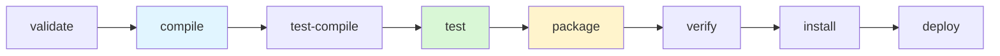
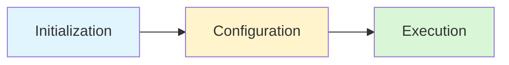
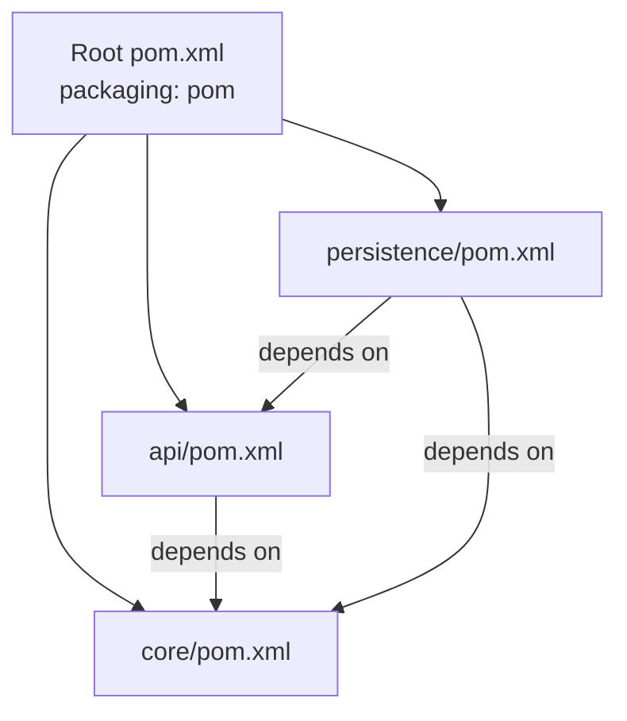

# Build Tools: Maven and Gradle

> [!summary] Goal
> Understand Java build tools well enough to manage dependencies, configure builds, and navigate project structures in any Java codebase — without guessing at XML or DSL syntax.

## Table of Contents

1. [Why Build Tools Matter](#why-build-tools-matter)
2. [Standard Project Layout](#standard-project-layout)
3. [Maven Essentials](#maven-essentials)
4. [Gradle Essentials](#gradle-essentials)
5. [Dependency Management](#dependency-management)
6. [Build Lifecycle](#build-lifecycle)
7. [Common Plugins](#common-plugins)
8. [Multi-Module Projects](#multi-module-projects)
9. [Maven vs Gradle](#maven-vs-gradle)
10. [Pitfalls](#pitfalls)

---

## Why Build Tools Matter

A build tool automates:
- compilation of source code
- dependency resolution (downloading libraries)
- running tests
- packaging (JAR, WAR, executable)
- deployment to repositories

Without a build tool, Java projects quickly devolve into manual classpath management and fragile scripts.

> [!tip] Definition
> **Build tool**: a program that automates the process of converting source code into an executable artifact. Maven and Gradle are the two dominant build tools in the Java ecosystem.

---

## Standard Project Layout

Both Maven and Gradle follow the same convention-over-configuration directory structure:

```
project-root/
├── pom.xml               # Maven configuration (or build.gradle for Gradle)
├── src/
│   ├── main/
│   │   ├── java/         # production source code
│   │   │   └── com/example/
│   │   │       └── App.java
│   │   └── resources/    # config files, properties, XML, YAML
│   │       └── application.properties
│   └── test/
│       ├── java/         # test source code
│       │   └── com/example/
│       │       └── AppTest.java
│       └── resources/    # test resources
│           └── test-data.csv
└── target/               # compiled output (Maven) or build/ (Gradle)
    └── classes/
```

### Why the convention matters

- Any Java developer can open any Maven/Gradle project and find source files immediately
- IDEs (IntelliJ, Eclipse, VS Code) recognize the layout automatically
- Build tools assume this layout by default — no extra configuration needed

---

## Maven Essentials

### `pom.xml` structure

```xml
<?xml version="1.0" encoding="UTF-8"?>
<project xmlns="http://maven.apache.org/POM/4.0.0">
    <modelVersion>4.0.0</modelVersion>

    <!-- Coordinates — uniquely identify the project -->
    <groupId>com.example</groupId>          <!-- reversed domain name -->
    <artifactId>my-app</artifactId>          <!-- project/module name -->
    <version>1.0.0-SNAPSHOT</version>       <!-- version number -->
    <packaging>jar</packaging>              <!-- jar, war, pom, etc. -->

    <!-- Inheritance from parent POM -->
    <parent>
        <groupId>org.springframework.boot</groupId>
        <artifactId>spring-boot-starter-parent</artifactId>
        <version>3.2.0</version>
    </parent>

    <!-- Properties — reusable values -->
    <properties>
        <java.version>17</java.version>
        <maven.compiler.source>17</maven.compiler.source>
        <maven.compiler.target>17</maven.compiler.target>
    </properties>

    <!-- Dependencies -->
    <dependencies>
        <dependency>
            <groupId>org.junit.jupiter</groupId>
            <artifactId>junit-jupiter</artifactId>
            <version>5.10.0</version>
            <scope>test</scope>
        </dependency>
    </dependencies>

    <!-- Build configuration -->
    <build>
        <plugins>
            <plugin>
                <groupId>org.apache.maven.plugins</groupId>
                <artifactId>maven-compiler-plugin</artifactId>
                <version>3.11.0</version>
                <configuration>
                    <source>17</source>
                    <target>17</target>
                </configuration>
            </plugin>
        </plugins>
    </build>
</project>
```

### Key Maven concepts

| Concept | Description |
|---------|-------------|
| **Coordinates** | `groupId:artifactId:version` — uniquely identifies a project/artifact |
| **Packaging** | `jar` (library), `war` (web app), `pom` (parent/BOM) |
| **Scope** | Controls dependency visibility: `compile` (default), `provided`, `runtime`, `test`, `system` |
| **Transitive deps** | Maven pulls in dependencies of your dependencies automatically |
| **SNAPSHOT** | A version in development (e.g., `1.0.0-SNAPSHOT`) — Maven checks for updates |

### Common Maven commands

```bash
mvn clean          # delete target/ directory
mvn compile        # compile source code
mvn test           # run tests
mvn package        # compile + test + package into JAR/WAR
mvn verify         # package + integration tests
mvn install        # install artifact into local repository (~/.m2/repository)
mvn deploy         # deploy to remote repository

# Skip tests
mvn package -DskipTests     # compile tests but don't run them
mvn package -Dmaven.test.skip=true  # don't even compile tests

# Build without network (offline)
mvn package -o
```

### Dependency scope

| Scope | Available at compile? | Available at runtime? | Included in packaged artifact? | Example |
|-------|---------------------|----------------------|-------------------------------|---------|
| `compile` | Yes | Yes | Yes | Core library |
| `provided` | Yes | No (container provides it) | No | Servlet API |
| `runtime` | No | Yes | Yes | JDBC driver |
| `test` | Yes (test only) | No | No | JUnit, Mockito |
| `system` | Yes (explicit path) | Yes | Usually | Rarely used |

---

## Gradle Essentials

### Build script structure (Groovy DSL)

```groovy
plugins {
    id 'java'
    id 'application'
}

group = 'com.example'
version = '1.0.0'
sourceCompatibility = '17'

repositories {
    mavenCentral()
}

dependencies {
    implementation 'org.slf4j:slf4j-api:2.0.9'
    implementation 'com.google.guava:guava:32.1.3-jre'

    testImplementation 'org.junit.jupiter:junit-jupiter:5.10.0'
    testImplementation 'org.mockito:mockito-core:5.6.0'
}

test {
    useJUnitPlatform()
}

application {
    mainClass = 'com.example.App'
}
```

### Build script structure (Kotlin DSL)

```kotlin
plugins {
    java
    application
}

group = "com.example"
version = "1.0.0"

repositories {
    mavenCentral()
}

dependencies {
    implementation("org.slf4j:slf4j-api:2.0.9")
    implementation("com.google.guava:guava:32.1.3-jre")

    testImplementation("org.junit.jupiter:junit-jupiter:5.10.0")
    testImplementation("org.mockito:mockito-core:5.6.0")
}

tasks.test {
    useJUnitPlatform()
}
```

### Gradle wrapper

The wrapper ensures everyone builds with the same Gradle version:

```bash
# Generate wrapper files (committed to version control)
gradle wrapper --gradle-version 8.5

# Now anyone can build without installing Gradle:
./gradlew build     # Unix
gradlew.bat build   # Windows
```

`gradlew` + `gradlew.bat` + `gradle/wrapper/` should be in version control.

### Common Gradle commands

```bash
./gradlew build          # compile + test + package
./gradlew test           # run tests
./gradlew clean          # delete build/
./gradlew assemble       # package without tests
./gradlew check          # run all verification (tests, lint, etc.)
./gradlew tasks          # list available tasks
./gradlew dependencies   # show dependency tree
```

### Dependency configurations

| Configuration | Purpose | Equivalent Maven scope |
|---------------|---------|----------------------|
| `implementation` | Available at compile and runtime | `compile` |
| `api` | Exposed to consumers (used in libraries) | `compile` |
| `compileOnly` | Needed only at compile time | `provided` |
| `runtimeOnly` | Needed only at runtime | `runtime` |
| `testImplementation` | Available during tests | `test` |
| `testRuntimeOnly` | Needed only during test runtime | `test runtime` |

> [!tip] Prefer `implementation` over `api` — it restricts transitive exposure and speeds up compilation.

---

## Dependency Management

### Version conflicts

When two dependencies pull different versions of the same library, a conflict arises.

**Maven**: uses "nearest wins" strategy — the version closest in the dependency tree wins.

```bash
mvn dependency:tree   # visualize the dependency tree
```

**Gradle**: uses "newest wins" by default (configurable).

```bash
./gradlew dependencies   # show dependency tree
```

### Enforcing versions

**Maven** — using `dependencyManagement` or BOM:

```xml
<!-- BOM (Bill of Materials) -->
<dependencyManagement>
    <dependencies>
        <dependency>
            <groupId>org.springframework.boot</groupId>
            <artifactId>spring-boot-dependencies</artifactId>
            <version>3.2.0</version>
            <type>pom</type>
            <scope>import</scope>
        </dependency>
    </dependencies>
</dependencyManagement>
```

```xml
<!-- Force a specific version for transitive dependencies -->
<dependency>
    <groupId>com.fasterxml.jackson.core</groupId>
    <artifactId>jackson-databind</artifactId>
    <version>2.16.0</version>
</dependency>
```

**Gradle** — using `platform` or forced versions:

```kotlin
// BOM
implementation(platform("org.springframework.boot:spring-boot-dependencies:3.2.0"))

// Force a version
implementation("com.fasterxml.jackson.core:jackson-databind") {
    version {
        strictly("2.16.0")
    }
}
```

### Excluding transitive dependencies

```xml
<!-- Maven -->
<dependency>
    <groupId>com.example</groupId>
    <artifactId>problematic-lib</artifactId>
    <exclusions>
        <exclusion>
            <groupId>old.logging</groupId>
            <artifactId>old-logger</artifactId>
        </exclusion>
    </exclusions>
</dependency>
```

```kotlin
// Gradle
implementation("com.example:problematic-lib") {
    exclude(group = "old.logging", module = "old-logger")
}
```

### Local repository

**Maven**: `~/.m2/repository/` — Maven downloads dependencies here and caches them.

```bash
# Clear local cache (fix corrupted downloads)
rm -rf ~/.m2/repository/com/example/problematic-lib

# Re-download
mvn dependency:resolve
```

**Gradle**: `~/.gradle/caches/` — similar caching mechanism.

---

## Build Lifecycle

### Maven lifecycle



Each phase runs all previous phases. `mvn package` runs validate → compile → test-compile → test → package.

### Gradle lifecycle



Gradle has three phases:
1. **Initialization**: determines which projects participate
2. **Configuration**: evaluates build scripts, creates task graph
3. **Execution**: runs tasks in order

---

## Common Plugins

### Maven plugins

| Plugin | Purpose |
|--------|---------|
| `maven-compiler-plugin` | Compile Java source (configurable Java version) |
| `maven-surefire-plugin` | Run unit tests |
| `maven-failsafe-plugin` | Run integration tests |
| `maven-shade-plugin` | Create uber/fat JAR with all dependencies |
| `maven-jar-plugin` | Package into JAR |
| `maven-war-plugin` | Package into WAR |
| `maven-checkstyle-plugin` | Enforce coding standards |
| `maven-spotbugs-plugin` | Detect potential bugs |
| `spotless-maven-plugin` | Auto-format code |

### Gradle plugins

| Plugin | Purpose |
|--------|---------|
| `java` | Compile, test, package |
| `application` | Run and package executable apps |
| `spring-boot` | Spring Boot packaging |
| `checkstyle` | Coding standards |
| `spotbugs` | Bug detection |
| `spotless` | Auto-format code |
| `shadow` | Fat JAR (like maven-shade) |

---

## Multi-Module Projects

### Maven multi-module

```xml
<!-- Root pom.xml -->
<project>
    <groupId>com.example</groupId>
    <artifactId>my-project</artifactId>
    <version>1.0.0</version>
    <packaging>pom</packaging>

    <modules>
        <module>core</module>
        <module>api</module>
        <module>persistence</module>
    </modules>
</project>
```



Each module has its own `pom.xml` with the parent set to the root:

```xml
<parent>
    <groupId>com.example</groupId>
    <artifactId>my-project</artifactId>
    <version>1.0.0</version>
</parent>

<artifactId>core</artifactId>
```

### Gradle multi-module

```kotlin
// settings.gradle.kts
rootProject.name = "my-project"
include("core", "api", "persistence")
```

```kotlin
// core/build.gradle.kts
plugins { java }
```

```kotlin
// api/build.gradle.kts
plugins { java }
dependencies {
    implementation(project(":core"))
}
```

---

## Maven vs Gradle

| Aspect | Maven | Gradle |
|--------|-------|--------|
| **Configuration** | XML (declarative) | Groovy or Kotlin DSL (programmable) |
| **Learning curve** | Shallow — predictable XML | Steeper — DSL is code |
| **Performance** | Sequential by default | Parallel and incremental by default |
| **Build cache** | Manual with plugins | Built-in (task-level output cache) |
| **Dependency resolution** | Nearest-wins | Newest-wins by default (configurable) |
| **Custom logic** | Requires plugins or awkward XML | Scripts can contain any logic |
| **Flexibility** | Limited (rigid lifecycle) | Extremely flexible (custom tasks) |
| **Market share** | Dominant in enterprise | Dominant in Android; growing in backend |
| **IDE support** | Excellent (IntelliJ, Eclipse) | Excellent |
| **Incremental build** | Partial (compiler only) | Full (task-level) |

### When to choose

| Choose Maven | Choose Gradle |
|-------------|---------------|
| Enterprise project with a large team (predictability) | Need for custom build logic |
| Existing Maven infrastructure (CI, repos) | Performance is critical (incremental builds) |
| Team prefers declarative config | Android projects |
| Simpler dependency model is sufficient | Multi-language builds (Java + Kotlin + Scala) |

---

## Pitfalls

### SNAPSHOT dependencies in production releases

```xml
<version>1.0.0-SNAPSHOT</version>  // should never be in a release
```

**Fix**: Use release versions (`1.0.0`, `1.0.1`) for production deployments.

### Dependency hell from version conflicts

```bash
# Maven: check the tree
mvn dependency:tree | grep "conflict\|omitted"

# Gradle: check the tree
./gradlew dependencies | grep "->"
```

**Fix**: Use BOMs (Spring Boot, JUnit, Jackson) to align versions.

### Forgetting to run `clean`

```bash
# Old artifacts cause strange build errors
mvn package   # if target/ has stale files
```

**Fix**: Always use `mvn clean package` or `./gradlew clean build` for full rebuilds.

### Not using the wrapper

```bash
# BAD — depends on system-installed Gradle
gradle build

# GOOD — uses project-specific version
./gradlew build
```

**Fix**: Always use the Gradle wrapper (`gradlew`) for reproducible builds.

### Maven: mixing plugin versions

```xml
<!-- BAD — implicit version depends on parent POM, may conflict -->
<plugin>
    <groupId>org.apache.maven.plugins</groupId>
    <artifactId>maven-compiler-plugin</artifactId>
    <!-- no version specified -->
</plugin>
```

**Fix**: Pin plugin versions explicitly in `<pluginManagement>`.

### Gradle configuration cache issues

Gradle's configuration cache can cause confusing errors when build scripts dynamically compute values at configuration time.

**Fix**: Use `provider { }` or `lazy { }` for values that change between builds.

---

> [!question]- Interview Questions
>
> **Q: What is the difference between Maven and Gradle?**
> A: Maven uses declarative XML and a fixed lifecycle. Gradle uses a programmable DSL (Groovy/Kotlin with incremental builds and a build cache. Maven is more predictable; Gradle is faster and more flexible.
>
> **Q: What is a BOM and why is it useful?**
> A: A Bill of Materials (`pom` packaging) declares a set of dependency versions in one place. Importing a BOM ensures all related dependencies use compatible versions without specifying each version individually.
>
> **Q: What are the Maven dependency scopes?**
> A: `compile` (available everywhere), `provided` (container provides it, not packaged), `runtime` (needed at runtime only), `test` (test only), `system` (explicit path, rarely used).
>
> **Q: What is the purpose of `mvnw` / `gradlew`?**
> A: The wrapper scripts ensure every developer and CI system builds with exactly the same tool version, eliminating "works on my machine" issues related to build tool versions.
>
> **Q: How does Maven resolve dependency conflicts?**
> A: Maven uses "nearest wins" — the version closest to the root in the dependency tree is used. Use `mvn dependency:tree` to visualize conflicts.

---

## Cross-Links

- [[Java/01_Foundations/01_Java_Basics_and_Idioms]] for Java compilation basics
- [[Java/01_Foundations/07_Testing_with_JUnit_and_Mockito]] for test configuration with surefire
- [[Java/02_Core/03_IO_NIO_and_Serialization]] for resource loading in classpath
- [[SpringBoot/03_Advanced/03_AutoConfiguration_Internals]] for Spring Boot starter POM structure
- [[SpringBoot/01_Foundations/01_Boot_Project_Structure_and_Profiles]] for Spring Boot project layout

---

## References

- [Maven Getting Started Guide](https://maven.apache.org/guides/getting-started/)
- [Maven: Introduction to the POM](https://maven.apache.org/guides/introduction/introduction-to-the-pom.html)
- [Gradle User Manual](https://docs.gradle.org/current/userguide/userguide.html)
- [Gradle Build Tool — Building Java Applications](https://docs.gradle.org/current/samples/sample_building_java_applications.html)
- [Maven Wrapper](https://maven.apache.org/wrapper/)
- [Gradle Wrapper](https://docs.gradle.org/current/userguide/gradle_wrapper.html)
