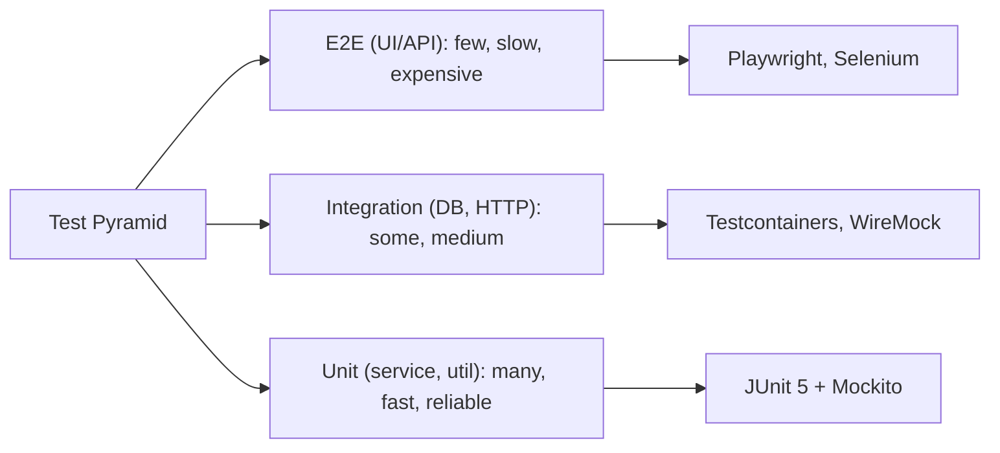

# Testing with JUnit and Mockito

> [!summary] Goal
> Write reliable, maintainable unit tests for Java code: structure tests clearly, isolate dependencies with mocks, and integrate testing into the build lifecycle.

## Table of Contents

1. [Why Testing Matters](#why-testing-matters)
2. [JUnit 5 Architecture](#junit-5-architecture)
3. [Writing Tests](#writing-tests)
4. [Lifecycle Methods](#lifecycle-methods)
5. [Assertions](#assertions)
6. [Parameterized Tests](#parameterized-tests)
7. [Test Suites and Tagging](#test-suites-and-tagging)
8. [Mockito Essentials](#mockito-essentials)
9. [Verifying Interactions](#verifying-interactions)
10. [Argument Matchers and Captors](#argument-matchers-and-captors)
11. [Spy vs Mock](#spy-vs-mock)
12. [Testing Patterns](#testing-patterns)
13. [Pitfalls](#pitfalls)

---

## Why Testing Matters



> [!info] Test pyramid
> The test pyramid guides how many tests of each type to write. Unit tests should form the base (fast, isolated, deterministic). Integration tests verify external interactions. E2E tests cover critical happy paths only. Aim for a 70/20/10 split (unit/integration/e2e).

---

## JUnit 5 Architecture

JUnit 5 consists of three modules:

| Module | Purpose |
|--------|---------|
| **JUnit Platform** | Launches test frameworks on the JVM. Integrates with build tools and IDEs. |
| **JUnit Jupiter** | The new programming model (annotations, assertions, extensions). |
| **JUnit Vintage** | Runs JUnit 3/4 tests on the JUnit 5 platform. |

### Required Maven dependencies

```xml
<dependency>
    <groupId>org.junit.jupiter</groupId>
    <artifactId>junit-jupiter</artifactId>
    <version>5.10.0</version>
    <scope>test</scope>
</dependency>
```

### Required Gradle dependency

```groovy
testImplementation 'org.junit.jupiter:junit-jupiter:5.10.0'
```

---

## Writing Tests

### Basic test class

```java
import org.junit.jupiter.api.Test;
import static org.junit.jupiter.api.Assertions.*;

class CalculatorTest {

    private final Calculator calc = new Calculator();

    @Test
    void shouldAddTwoNumbers() {
        int result = calc.add(2, 3);
        assertEquals(5, result);
    }

    @Test
    void shouldThrowOnDivisionByZero() {
        assertThrows(ArithmeticException.class,
            () -> calc.divide(10, 0));
    }
}
```

### Naming conventions

```java
// Behavior-style names (recommended — reads like a sentence)
@Test
void shouldThrowExceptionWhenEmailIsInvalid() { }

@Test
void shouldReturnEmptyWhenUserNotFound() { }

// Given-When-Then style
@Test
void givenActiveUser_whenProcessingOrder_thenOrderIsConfirmed() { }
```

---

## Lifecycle Methods

```java
import org.junit.jupiter.api.*;

class OrderServiceTest {

    @BeforeAll
    static void setupDatabase() {
        // Runs once before ALL tests (must be static)
    }

    @AfterAll
    static void tearDownDatabase() {
        // Runs once after ALL tests (must be static)
    }

    @BeforeEach
    void setUp() {
        // Runs before EACH test method
        service = new OrderService();
    }

    @AfterEach
    void tearDown() {
        // Runs after EACH test method
        // Good for cleanup, resetting state
    }

    @Test
    void testOne() { }

    @Test
    void testTwo() { }
}
```

### Lifecycle per-instance mode

By default, JUnit creates a new test instance per method. Use `@TestInstance(Lifecycle.PER_CLASS)` to share one instance (allows `@BeforeAll`/`@AfterAll` on non-static methods):

```java
@TestInstance(TestInstance.Lifecycle.PER_CLASS)
class SharedStateTest {
    private int counter = 0;

    @BeforeAll
    void init() { /* non-static allowed */ }

    @Test
    void test() { counter++; }
}
```

> [!warning] `PER_CLASS` shared state between tests can cause order dependencies. Use it only when necessary (e.g., expensive setup that must run once).

---

## Assertions

### Standard assertions

```java
assertEquals(expected, actual);
assertEquals(0.001, 3.14159, 3.14);    // delta for floats

assertNotEquals(unexpected, actual);
assertTrue(condition);
assertFalse(condition);
assertNull(object);
assertNotNull(object);

assertSame(expectedRef, actualRef);     // reference identity (==)
assertNotSame(unexpectedRef, actualRef);

assertThrows(IllegalArgumentException.class, () -> {
    new Email("invalid");
});

// Multiple assertions — all are evaluated, failures reported together
assertAll("user",
    () -> assertEquals("Alice", user.name()),
    () -> assertTrue(user.isActive()),
    () -> assertNotNull(user.email())
);
```

### Timeout assertions

```java
// Fails if the lambda takes longer than 5 seconds
assertTimeout(ofSeconds(5), () -> {
    service.processLargeReport();
});
```

### Third-party assertion libraries

AssertJ provides fluent assertions with better failure messages:

```java
import static org.assertj.core.api.Assertions.*;

assertThat(result)
    .isNotNull()
    .hasSize(3)
    .extracting(User::name)
    .containsExactly("Alice", "Bob", "Charlie");

assertThat(exception)
    .hasMessage("Invalid email")
    .hasCauseInstanceOf(NullPointerException.class);
```

---

## Parameterized Tests

Test the same logic with multiple inputs:

```java
import org.junit.jupiter.params.ParameterizedTest;
import org.junit.jupiter.params.provider.*;

class EmailValidatorTest {

    @ParameterizedTest
    @ValueSource(strings = {
        "user@example.com",
        "alice@company.co.uk",
        "user+tag@example.org"
    })
    void shouldAcceptValidEmails(String email) {
        assertTrue(EmailValidator.isValid(email));
    }

    @ParameterizedTest
    @ValueSource(strings = {
        "not-an-email",
        "@example.com",
        "user@",
        ""
    })
    void shouldRejectInvalidEmails(String email) {
        assertFalse(EmailValidator.isValid(email));
    }

    @ParameterizedTest
    @CsvSource({
        "1, 2, 3",
        "10, 20, 30",
        "0, 0, 0"
    })
    void shouldAddNumbers(int a, int b, int expected) {
        assertEquals(expected, calc.add(a, b));
    }

    @ParameterizedTest
    @MethodSource("userProvider")
    void shouldProcessUser(User user, boolean expectedActive) {
        assertEquals(expectedActive, service.process(user));
    }

    static Stream<Arguments> userProvider() {
        return Stream.of(
            Arguments.of(new User("Alice", true), true),
            Arguments.of(new User("Bob", false), false)
        );
    }

    @ParameterizedTest
    @EnumSource(OrderStatus.class)
    void shouldHandleAllStatuses(OrderStatus status) {
        assertDoesNotThrow(() -> service.handleStatus(status));
    }
}
```

### Custom display names

```java
@ParameterizedTest(name = "{0} + {1} = {2}")
@CsvSource({ "1, 2, 3", "4, 5, 9" })
void add(int a, int b, int sum) {
    assertEquals(sum, calc.add(a, b));
}
// Output: add(int, int, int) [1 + 2 = 3]
```

---

## Test Suites and Tagging

### Tagging tests

```java
import org.junit.jupiter.api.Tag;
import org.junit.jupiter.api.Test;

@Tag("slow")
@Test
void slowIntegrationTest() { }

@Tag("fast")
@Test
void fastUnitTest() { }
```

Run only specific tags via Maven:

```xml
<plugin>
    <groupId>org.apache.maven.plugins</groupId>
    <artifactId>maven-surefire-plugin</artifactId>
    <configuration>
        <groups>fast</groups>    <!-- include only fast tests -->
        <excludedGroups>slow</excludedGroups>
    </configuration>
</plugin>
```

### Test suites (JUnit 5)

```java
import org.junit.platform.suite.api.*;

@Suite
@SelectPackages("com.example.service")
@IncludeTags("fast")
@ExcludeTags("slow")
class FastServiceTestSuite { }
```

---

## Mockito Essentials

### What mocking solves

When testing class A which depends on class B, a mock replaces B with a controllable double. This:
- isolates the test to A's behavior only
- removes dependency on B's implementation
- eliminates side effects (database writes, network calls)

### Maven dependency

```xml
<dependency>
    <groupId>org.mockito</groupId>
    <artifactId>mockito-core</artifactId>
    <version>5.6.0</version>
    <scope>test</scope>
</dependency>
```

### Creating mocks

```java
// Method 1: static mock()
UserRepository repo = mock(UserRepository.class);

// Method 2: annotation (requires MockitoExtension or openMocks)
@ExtendWith(MockitoExtension.class)
class UserServiceTest {

    @Mock
    private UserRepository userRepository;

    @Mock
    private EmailService emailService;

    @InjectMocks       // creates the service and injects mocks into it
    private UserService userService;

    @Test
    void shouldRegisterUser() {
        // given
        User user = new User("alice@example.com", "Alice");
        when(userRepository.save(any())).thenReturn(user);

        // when
        User result = userService.register("alice@example.com", "Alice");

        // then
        assertEquals("Alice", result.name());
    }
}
```

### Stubbing — controlling mock behavior

```java
// Return a value
when(repo.findById(42L)).thenReturn(Optional.of(user));
when(repo.findById(99L)).thenReturn(Optional.empty());

// Return different values on successive calls
when(iterator.next())
    .thenReturn("first")
    .thenReturn("second")
    .thenThrow(new RuntimeException("no more items"));

// Void methods — use doThrow/doReturn/doAnswer
doThrow(new DatabaseException("timeout"))
    .when(repo).delete(anyLong());

// Answer with computation
when(repo.save(any())).thenAnswer(invocation -> {
    User u = invocation.getArgument(0);
    return new User(u.id() == 0 ? 1L : u.id(), u.name(), u.email());
});

// Throw an exception
when(repo.findById(anyLong())).thenThrow(DatabaseException.class);
```

### BDD-style stubbing (Mockito BDD)

```java
// given
given(repo.findByEmail("alice@example.com")).willReturn(Optional.of(alice));

// when
User result = service.findByEmail("alice@example.com");

// then
then(repo).should(times(1)).findByEmail("alice@example.com");
```

---

## Verifying Interactions

```java
// Verify a method was called
verify(repo).findById(42L);

// Verify with call count
verify(repo, times(1)).findById(42L);    // exactly once (default)
verify(repo, atLeast(1)).findById(42L);  // at least once
verify(repo, atMost(3)).findById(42L);   // at most 3 times
verify(repo, never()).delete(anyLong()); // never called

// Verify in order
InOrder inOrder = inOrder(repo, emailService);
inOrder.verify(repo).save(any());
inOrder.verify(emailService).sendWelcomeEmail(any());

// Verify no more interactions
verifyNoMoreInteractions(repo);

// Verify no interactions at all
verifyNoInteractions(emailService);
```

---

## Argument Matchers and Captors

### Argument matchers

```java
import static org.mockito.ArgumentMatchers.*;

when(repo.findById(anyLong())).thenReturn(Optional.of(user));
when(repo.findByEmail(anyString())).thenReturn(Optional.empty());
when(repo.save(any(User.class))).thenReturn(user);

// Specific matchers
when(repo.findByEmail(contains("@example.com"))).thenReturn(Optional.of(user));
when(repo.findByEmail(startsWith("admin"))).thenReturn(Optional.of(adminUser));
when(repo.save(argThat(u -> u.isActive()))).thenReturn(activeUser);
```

### Argument captors

Capture the argument passed to a method for further assertions:

```java
@Captor
private ArgumentCaptor<User> userCaptor;

@Test
void shouldSaveUserWithCorrectEmail() {
    // when
    service.register("alice@example.com", "Alice");

    // then
    verify(repo).save(userCaptor.capture());
    User saved = userCaptor.getValue();

    assertEquals("alice@example.com", saved.email());
    assertEquals("Alice", saved.name());
    assertTrue(saved.isActive());
}
```

---

## Spy vs Mock

| Aspect | `mock()` | `spy()` |
|--------|----------|---------|
| Default behavior | All methods return defaults (null, 0, false) | Real methods are called |
| When to use | When you want no real code executed | When you want real behavior but need to stub some methods |
| Partial mocking | Not possible (all methods stubbed) | Stub specific methods, call real for others |

```java
// Mock — all methods return defaults
List<String> mockList = mock(List.class);
mockList.add("hello");    // does nothing (returns false)
mockList.size();          // returns 0

// Spy — real methods by default, can stub selectively
List<String> realList = new ArrayList<>();
List<String> spyList = spy(realList);
spyList.add("hello");     // real add() called
spyList.size();           // returns 1

// Stub a specific method on a spy
doReturn(100).when(spyList).size();
spyList.size();           // returns 100 (stubbed)
```

---

## Testing Patterns

### Given-When-Then

```java
@Test
void shouldSendWelcomeEmailOnRegistration() {
    // given
    User user = new User("alice@example.com", "Alice");
    when(repo.findByEmail(user.email())).thenReturn(Optional.empty());
    when(repo.save(any())).thenReturn(user.withId(1L));

    // when
    User result = service.register(user.email(), user.name());

    // then
    assertThat(result.id()).isNotNull();
    verify(emailService).sendWelcomeEmail(result.email());
}
```

### Testing exceptions

```java
@Test
void shouldThrowWhenEmailAlreadyExists() {
    // given
    when(repo.findByEmail("existing@example.com"))
        .thenReturn(Optional.of(new User("existing@example.com", "Existing")));

    // when & then
    assertThrows(DuplicateEmailException.class,
        () -> service.register("existing@example.com", "Someone"));
}

// Asserting exception properties
Throwable exception = assertThrows(DuplicateEmailException.class,
    () -> service.register("existing@example.com", "Someone"));
assertEquals("Email already registered", exception.getMessage());
```

### Testing with timeouts

```java
@Test
void shouldCompleteWithinLimit() {
    assertTimeout(ofSeconds(2), () -> {
        service.processLargeReport();
    });
}
```

### Clearing mock state between tests

```java
@BeforeEach
void setUp() {
    reset(mockDependency);  // clears all stubbing and verification
}
```

---

## Pitfalls

### Testing implementation, not behavior

```java
// BAD — tests internal implementation detail
@Test
void shouldCallCalculateMethod() {
    service.process();
    verify(service).calculate();  // tests HOW, not WHAT
}

// GOOD — tests observable behavior
@Test
void shouldReturnCorrectTotal() {
    BigDecimal result = service.process();
    assertEquals(new BigDecimal("42.00"), result);
}
```

### Over-mocking

```java
// BAD — mocking value objects
User user = mock(User.class);
when(user.name()).thenReturn("Alice");
// Value objects should be real instances!

// GOOD
User user = new User("Alice", "alice@example.com");
```

**Rule of thumb**: Don't mock types you don't own (String, Integer, List, etc.). Use real instances for value objects.

### Mocking everything

If a test mocks every dependency, it may test nothing real. A balance:

- Mock: external services, repositories, message queues
- Don't mock: value objects, collections, utility methods
- Consider real: in-memory implementations for integration tests

### Flaky tests from shared state

```java
// BAD — tests depend on each other via static state
@Test
void testOne() { SharedState.counter++; }

@Test
void testTwo() { assertTrue(SharedState.counter > 0); }  // depends on order!
```

**Fix**: Reset shared state in `@BeforeEach` or avoid global state entirely.

### Not using `@BeforeEach` for setup

```java
// BAD — duplicated setup in every test
@Test
void testOne() {
    Calculator calc = new Calculator();
    assertEquals(5, calc.add(2, 3));
}

@Test
void testTwo() {
    Calculator calc = new Calculator();
    assertEquals(0, calc.subtract(2, 2));
}

// GOOD — extract to @BeforeEach
private Calculator calc;

@BeforeEach
void setUp() {
    calc = new Calculator();
}
```

### Forgetting to verify interactions

```java
// BAD — stubbed mock is never verified to have been called
when(repo.save(any())).thenReturn(user);
service.register("alice@example.com", "Alice");
// Never verified that repo.save() was actually called
```

**Fix**: Add `verify()` calls for interactions that must happen.

### Using `@SpringBootTest` for every test

```java
// BAD — slow, loads entire application context
@SpringBootTest
class UserServiceTest { }

// GOOD — pure unit test with mocks
@ExtendWith(MockitoExtension.class)
class UserServiceTest { }
```

---

> [!question]- Interview Questions
>
> **Q: What is the difference between `@Mock` and `@InjectMocks`?**
> A: `@Mock` creates a mock instance. `@InjectMocks` creates a real instance of the annotated class and injects the `@Mock` fields into it via constructor, setter, or field injection.
>
> **Q: When would you use `spy()` instead of `mock()`?**
> A: Use `spy()` when you want real behavior by default but need to stub a few specific methods. Use `mock()` when you want to stub all methods and no real code should execute.
>
> **Q: What is the purpose of `ArgumentCaptor`?**
> A: It captures the argument passed to a mocked method so you can assert its properties after the method is called. Useful when the argument is created inside the method under test.
>
> **Q: What is the difference between `thenReturn` and `thenAnswer`?**
> A: `thenReturn` returns a fixed value. `thenAnswer` computes the return value based on the invocation (access to arguments, call count, etc.).
>
> **Q: How do you verify a method was called exactly 3 times?**
> A: `verify(mock, times(3)).methodName(args)`.
>
> **Q: What is the Given-When-Then pattern?**
> A: A test structure: Given (arrange preconditions), When (execute the action under test), Then (assert expected outcomes). Improves readability and separates setup from assertion.

---

## Cross-Links

- [[Java/01_Foundations/03_Exceptions_and_Resource_Management]] for testing exception paths
- [[Java/01_Foundations/04_Streams_Lambdas_and_Functional_Java]] for testing stream-heavy code
- [[Java/01_Foundations/06_Build_Tools_Maven_Gradle]] for Maven surefire / Gradle test configuration
- [[Java/02_Core/04_Database_Access_JDBC]] for testing database access code
- [[Java/04_Playbooks/01_Diagnose_High_CPU_or_Latency]] for using testing to reproduce production issues

---

## References

- [JUnit 5 User Guide](https://junit.org/junit5/docs/current/user-guide/)
- [Mockito Documentation](https://site.mockito.org/)
- [AssertJ Documentation](https://assertj.github.io/doc/)
- [Maven Surefire Plugin](https://maven.apache.org/surefire/maven-surefire-plugin/)
- [Given-When-Then (Martin Fowler)](https://martinfowler.com/bliki/GivenWhenThen.html)
