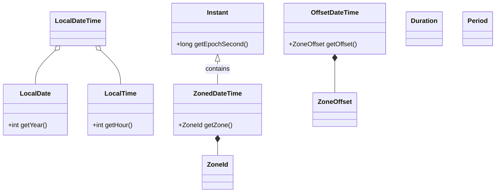
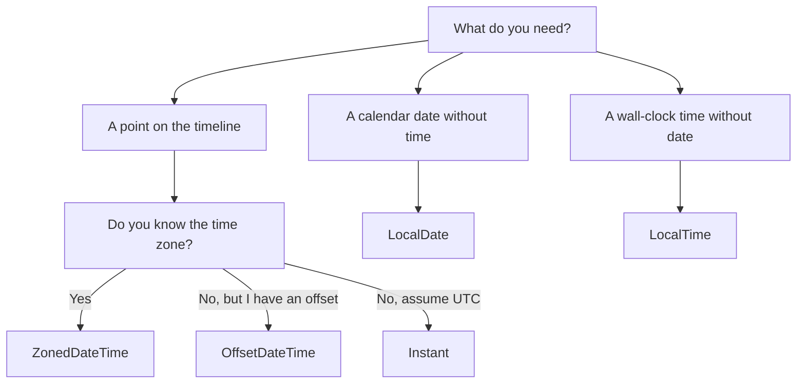

# Date, Time, and Money

> [!summary] Goal
> Use `java.time` and `BigDecimal` safely in production: choose the right temporal type, handle time zones, format correctly, and avoid the classic `double`-for-money mistake.

## Table of Contents

1. [Why `java.util.Date` Is Broken](#why-javautildate-is-broken)
2. [Core `java.time` Types](#core-javatime-types)
3. [Choosing the Right Type](#choosing-the-right-type)
4. [Time Zones and Offsets](#time-zones-and-offsets)
5. [Formatting and Parsing](#formatting-and-parsing)
6. [Duration and Period](#duration-and-period)
7. [Money with BigDecimal](#money-with-bigdecimal)
8. [How to Use Clocks for Testability](#how-to-use-clocks-for-testability)
9. [Pitfalls](#pitfalls)
10. [Q&A](#qa)

---

## Why `java.util.Date` Is Broken

The old API had fundamental design flaws:
- `Date` is mutable — breaks use as a map key.
- Month is 0-indexed (`11` = December).
- The name lies: `Date` represents a timestamp, not a date.
- Formatting is not thread-safe.
- No clear distinction between an instant, a local date, and a zoned date.

Use `java.time` (JSR-310, Java 8+) for all new code.

---

## Core `java.time` Types



| Type | What It Stores | When to Use |
|------|---------------|-------------|
| `Instant` | UTC timestamp (epoch seconds + nanos) | API timestamps, DB timestamps, logging |
| `LocalDate` | year-month-day, no time/zone | Birthdays, contract dates |
| `LocalTime` | hour-minute-second, no date/zone | Business hours, schedules |
| `LocalDateTime` | date + time, no zone | "Next meeting at 3pm" before time zone is known |
| `ZonedDateTime` | date + time + zone ID | User-facing scheduling, DST-aware logic |
| `OffsetDateTime` | date + time + fixed offset | API/DB interchange (ISO 8601 with offset) |
| `Duration` | seconds/nanos | Time-based amounts (1h 30m) |
| `Period` | years/months/days | Calendar-based amounts (2 months) |

### Quick reference

```java
Instant now          = Instant.now();                  // UTC
LocalDate today      = LocalDate.now();                 // system clock
ZonedDateTime inNY   = ZonedDateTime.now(ZoneId.of("America/New_York"));
```

---

## Choosing the Right Type



---

## Time Zones and Offsets

### Key classes

- `ZoneId` — a time zone ID like `"Europe/London"` (includes DST rules).
- `ZoneOffset` — a fixed offset like `+05:30`.

```java
// List available zones
Set<String> zones = ZoneId.getAvailableZoneIds();

// Convert between zones
ZonedDateTime paris = ZonedDateTime.now(ZoneId.of("Europe/Paris"));
ZonedDateTime tokyo = paris.withZoneSameInstant(ZoneId.of("Asia/Tokyo"));

// Offset vs zone
OffsetDateTime odt = OffsetDateTime.parse("2026-05-28T10:15:30+05:30");
```

### DST-safe arithmetic

Always prefer `ZonedDateTime` with `plusDays`, `plusHours`, etc. — it adjusts for DST gaps and overlaps automatically.

```java
// Safe across DST transitions
ZonedDateTime zdt = ZonedDateTime.of(2026, 3, 8, 1, 30, 0, 0, ZoneId.of("US/Eastern"));
ZonedDateTime later = zdt.plusHours(2); // skips ahead correctly
```

---

## Formatting and Parsing

Use `DateTimeFormatter` — it is thread-safe and immutable.

```java
DateTimeFormatter iso = DateTimeFormatter.ISO_INSTANT;
DateTimeFormatter custom = DateTimeFormatter.ofPattern("yyyy-MM-dd HH:mm:ss");

String formatted = ZonedDateTime.now().format(custom);
ZonedDateTime parsed = ZonedDateTime.parse("2026-05-28T10:15:30+05:30", DateTimeFormatter.ISO_DATE_TIME);
```

### Common patterns

```java
// ISO 8601 with offset
DateTimeFormatter.ISO_OFFSET_DATE_TIME

// Custom
DateTimeFormatter.ofPattern("dd/MMM/yyyy")

// Locale-aware
DateTimeFormatter.ofPattern("dd MMMM yyyy", Locale.FRENCH)
```

### Parsing pitfalls

- `LocalDate.parse("2026-02-29")` throws `DateTimeParseException` (not a leap day) — handle gracefully.
- For lenient parsing use `DateTimeFormatterBuilder` with `parseLenient()`.

---

## Duration and Period

```java
// Duration — machine time
Duration d = Duration.ofHours(2).plusMinutes(30);
long seconds = d.toSeconds();

// Period — calendar time
Period p = Period.ofMonths(3).plusDays(10);
int totalMonths = p.toTotalMonths();
```

### When to use which

| Use case | Class |
|----------|-------|
| Timeout or interval | `Duration` |
| Adding 2 months to a date | `Period` |
| Human-readable "3 years 2 months" | `Period` |
| Elapsed nanos between instants | `Duration` |

---

## Money with BigDecimal

### Why not double

```java
double total = 0.0;
for (int i = 0; i < 10; i++) total += 0.1; // 0.9999999999999999
```

`double` cannot represent most decimal fractions exactly. Use `BigDecimal` for money.

### Using BigDecimal

```java
BigDecimal price = new BigDecimal("19.99");       // String constructor — safe
BigDecimal tax   = new BigDecimal("0.08");
BigDecimal total = price.multiply(tax.add(BigDecimal.ONE))
                         .setScale(2, RoundingMode.HALF_UP);

// Avoid: new BigDecimal(0.1) — uses the inexact binary representation
```

### Rounding modes

| Mode | Behavior |
|------|----------|
| `HALF_UP` | Round to nearest, ties up (standard) |
| `HALF_EVEN` | Round to nearest, ties to even (banker's rounding) |
| `DOWN` | Truncate |
| `UP` | Round away from zero |

### Money value object pattern

```java
public record Money(BigDecimal amount, CurrencyUnit currency) {
    public Money {
        Objects.requireNonNull(amount);
        Objects.requireNonNull(currency);
        if (amount.scale() > currency.getDefaultFractionDigits())
            throw new IllegalArgumentException("Scale exceeds currency precision");
    }

    public Money add(Money other) {
        if (!this.currency.equals(other.currency))
            throw new IllegalArgumentException("Currency mismatch");
        return new Money(this.amount.add(other.amount), this.currency);
    }
}
```

---

## How to Use Clocks for Testability

Inject a `Clock` instead of calling `Instant.now()` directly.

```java
public class OrderService {
    private final Clock clock;

    public OrderService(Clock clock) {
        this.clock = clock;
    }

    public Instant calculateExpiry() {
        return Instant.now(clock).plus(30, ChronoUnit.MINUTES);
    }
}
```

In tests:

```java
Clock fixed = Clock.fixed(Instant.parse("2026-05-28T10:00:00Z"), ZoneOffset.UTC);
OrderService svc = new OrderService(fixed);
```

---

## Pitfalls

- **Storing `LocalDateTime` for a global event** — loses time zone. Prefer `Instant` or `OffsetDateTime` in DB columns.
- **`BigDecimal` from `double`** (`new BigDecimal(0.1)`) — always use `BigDecimal(String)` or `BigDecimal.valueOf`.
- **Mutating a temporal object** — all `java.time` objects are immutable. Operations return new instances.
- **Forgetting `setScale` before rounding** — `BigDecimal` tracks scale; operations may produce unexpected scales.
- **Assuming `Duration` and `Period` are interchangeable** — `Duration.ofDays(1)` = 24 hours; `Period.ofDays(1)` = 1 calendar day.
- **Parsing lenient input without error handling** — always catch `DateTimeParseException` for user-supplied values.

---

## Q&A

> [!question]- How should I store a timestamp in PostgreSQL?

Use `TIMESTAMP WITH TIME ZONE`. In JDBC, pass an `OffsetDateTime` or `Instant`. With JPA, annotate with `@Column(columnDefinition = "TIMESTAMP WITH TIME ZONE")`.

> [!question]- Why is `BigDecimal` preferred over `double` for currency?

`double` rounds to binary fractions (e.g., `0.1` is a repeating fraction in binary). `BigDecimal` uses decimal arithmetic, giving exact results for money amounts.

> [!question]- What is the difference between `ZonedDateTime` and `OffsetDateTime`?

`ZonedDateTime` carries a time-zone ID (e.g., `"America/Chicago"`) that knows DST rules. `OffsetDateTime` carries only a fixed offset (`-06:00`). Prefer `OffsetDateTime` in API payloads and `ZonedDateTime` for business logic.

## References

- [JSR-310: Date and Time API](https://jcp.org/en/jsr/detail?id=310)
- [Oracle: `java.time` tutorial](https://docs.oracle.com/javase/tutorial/datetime/)
- [BigDecimal Javadoc](https://docs.oracle.com/en/java/javase/21/docs/api/java.base/java/math/BigDecimal.html)
- [[Java/01_Foundations/01_Java_Basics_and_Idioms]]
- [[Java/02_Core/04_Database_Access_JDBC]]
