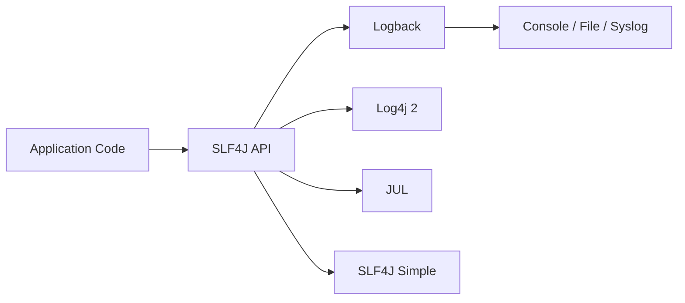
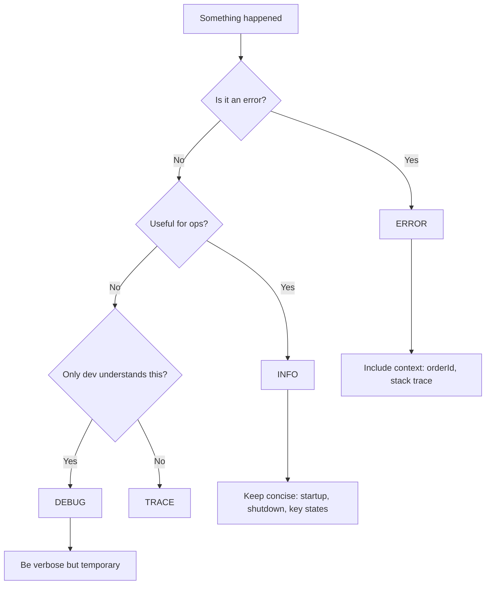

# Logging Basics for Java

> [!summary] Goal
> Set up structured, production-safe logging in a plain Java application: choose the right façade, configure appenders, write useful log statements, and avoid common logging pitfalls.

## Table of Contents

1. [Why Logging Matters](#why-logging-matters)
2. [The SLF4J Façade](#the-slf4j-fa%C3%A7ade)
3. [Log Levels and When to Use Them](#log-levels-and-when-to-use-them)
4. [Logback Configuration](#logback-configuration)
5. [Structured Logging and MDC](#structured-logging-and-mdc)
6. [Logging in Libraries vs Applications](#logging-in-libraries-vs-applications)
7. [How to Wire Logging Into a Plain Java App](#how-to-wire-logging-into-a-plain-java-app)
8. [Pitfalls](#pitfalls)
9. [Q&A](#qa)

---

## Why Logging Matters

Logs are the primary data source for understanding what a running application did, when, and why. A well-structured log:
- Makes debugging production issues faster.
- Provides input metrics (error rates, latency).
- Helps with auditing and compliance.

Without logs, you are blind. With too many logs, you cannot see signal.

---

## The SLF4J Façade



SLF4J is the standard logging façade:

```java
import org.slf4j.Logger;
import org.slf4j.LoggerFactory;

public class PaymentService {
    private static final Logger log = LoggerFactory.getLogger(PaymentService.class);

    public void process(Order order) {
        log.info("Processing order {}", order.id());
    }
}
```

> [!tip] Use parameterized logging — avoid string concatenation. SLF4J evaluates the format string only if the level is active.

```java
// Good
log.debug("Loaded {} items for user {}", count, userId);

// Bad — string concatenation happens even when debug is disabled
log.debug("Loaded " + count + " items for user " + userId);
```

---

## Log Levels and When to Use Them

| Level | Purpose | Production Default |
|-------|---------|-------------------|
| `ERROR` | Something is definitely wrong, needs attention | Enabled |
| `WARN` | Something unexpected but not fatal | Enabled |
| `INFO` | Important lifecycle events (startup, shutdown, key decisions) | Enabled |
| `DEBUG` | Detailed diagnostic information | Disabled |
| `TRACE` | Very fine-grained execution details | Disabled |

### Decision flow



---

## Logback Configuration

Place `logback.xml` on the classpath (e.g., `src/main/resources/logback.xml`).

```xml
<configuration>
    <appender name="CONSOLE" class="ch.qos.logback.core.ConsoleAppender">
        <encoder>
            <pattern>%d{HH:mm:ss.SSS} [%thread] %-5level %logger{36} - %msg%n</pattern>
        </encoder>
    </appender>

    <appender name="FILE" class="ch.qos.logback.core.rolling.RollingFileAppender">
        <file>logs/app.log</file>
        <rollingPolicy class="ch.qos.logback.core.rolling.TimeBasedRollingPolicy">
            <fileNamePattern>logs/app.%d{yyyy-MM-dd}.log</fileNamePattern>
            <maxHistory>30</maxHistory>
        </rollingPolicy>
        <encoder>
            <pattern>%d{ISO8601} [%thread] %-5level %logger{36} - %msg%n</pattern>
        </encoder>
    </appender>

    <root level="INFO">
        <appender-ref ref="CONSOLE"/>
        <appender-ref ref="FILE"/>
    </root>
</configuration>
```

### Key practices

- Use **rolling file appenders** with retention policy.
- Include `%thread` and `%logger` in the pattern.
- Set `root` level to `INFO` in production. Override per-package for libraries you debug.

---

## Structured Logging and MDC

### MDC (Mapped Diagnostic Context)

Pass contextual data through asynchronous boundaries without threading it manually.

```java
import org.slf4j.MDC;

// Before processing a request
MDC.put("requestId", request.id());
MDC.put("userId", request.userId());
log.info("Processing payment");
// All log lines in this thread include requestId

// Clean up
MDC.clear();
```

### Structured (JSON) logging with Logstash encoder

Add to `pom.xml`:

```xml
<dependency>
    <groupId>net.logstash.logback</groupId>
    <artifactId>logstash-logback-encoder</artifactId>
    <version>7.4</version>
</dependency>
```

Then in `logback.xml`:

```xml
<appender name="JSON" class="ch.qos.logback.core.ConsoleAppender">
    <encoder class="net.logstash.logback.encoder.LogstashEncoder"/>
</appender>
```

This outputs JSON log lines that can be ingested by Elasticsearch, Loki, or Datadog.

---

## Logging in Libraries vs Applications

**Libraries** (JARs included by other projects):
- Depend only on SLF4J API (`compile` scope).
- Do NOT bundle any logging implementation.
- Log at `DEBUG`/`TRACE` — let the consumer tune levels.

```xml
<dependency>
    <groupId>org.slf4j</groupId>
    <artifactId>slf4j-api</artifactId>
    <version>2.0.12</version>
</dependency>
```

**Applications**:
- Pick ONE logging implementation (Logback or Log4j 2).
- Configure via `logback.xml` or `log4j2.xml`.
- Use `log:Level` overrides for noisier libraries.

---

## How to Wire Logging Into a Plain Java App

```java
public class Main {
    private static final Logger log = LoggerFactory.getLogger(Main.class);

    public static void main(String[] args) {
        log.info("Application starting with args: {}", Arrays.toString(args));

        try {
            new AppRunner().run();
        } catch (Exception e) {
            log.error("Application failed", e);
            System.exit(1);
        }

        log.info("Application shutdown complete");
    }
}
```

Add to `pom.xml`:

```xml
<dependency>
    <groupId>ch.qos.logback</groupId>
    <artifactId>logback-classic</artifactId>
    <version>1.5.6</version>
</dependency>
```

---

## Pitfalls

- **Classpath logging conflicts** — if you see `SLF4J: Class path contains multiple SLF4J bindings`, you have more than one logging implementation on the classpath. Use `mvn dependency:tree` to find the duplicates and exclude them.
- **String concatenation in log messages** — use parameterized `{}` syntax.
- **Logging sensitive data** — never log passwords, tokens, PII, or full credit card numbers.
- **Not cleaning up MDC** — thread pools reuse threads; MDC values leak across requests. Always clear in a `finally` block.
- **Over-logging in hot paths** — logging inside a tight loop kills throughput. Use counters or sampled logging instead.
- **Swallowing exceptions** — `log.error("something happened")` without passing the throwable loses the stack trace.

```java
// Good
log.error("Payment failed for order {}", orderId, exception);

// Bad
log.error("Payment failed for order {}: {}", orderId, exception.getMessage());
```

---

## Q&A

> [!question]- Should I use SLF4J, Log4j 2, or java.util.logging?

Always use SLF4J as the API. Choose Logback or Log4j 2 as the implementation. `java.util.logging` (JUL) is a last resort — it is harder to configure and performs worse.

> [!question]- How do I change log levels at runtime without restarting?

Logback supports `scanPeriod="60 seconds"` in `<configuration>`. Edit the `logback.xml` file and the app picks up changes. Alternatively, JMX-based changers or a simple REST endpoint.

> [!question]- What is the async appender and should I use it?

Async appenders write to a bounded queue and flush in a background thread. They can improve latency for the application thread. Use `AsyncAppender` from Logback and size the queue large enough (default 256 may overflow under load; use 1024+).

## References

- [SLF4J Manual](https://www.slf4j.org/manual.html)
- [Logback Documentation](https://logback.qos.ch/documentation.html)
- [Logstash Logback Encoder](https://github.com/logfellow/logstash-logback-encoder)
- [[Java/01_Foundations/06_Build_Tools_Maven_Gradle]]
