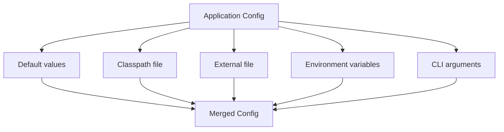
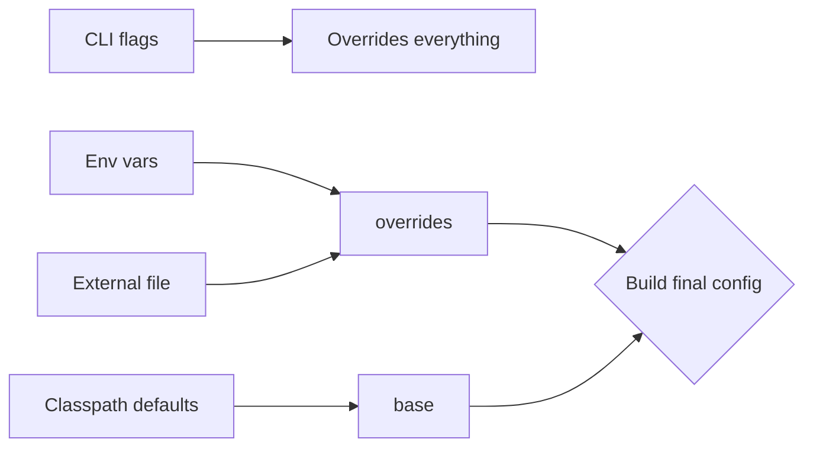

# Configuration and CLI Basics

> [!summary] Goal
> Build Java applications and CLI tools that read configuration from multiple sources, respect precedence, and are easy to run and debug.

## Table of Contents

1. [Config Sources in a Plain Java App](#config-sources-in-a-plain-java-app)
2. [Config Precedence](#config-precedence)
3. [Loading Properties and YAML](#loading-properties-and-yaml)
4. [CLI Parsing with picocli](#cli-parsing-with-picocli)
5. [Structuring a Config Object](#structuring-a-config-object)
6. [Secrets Handling](#secrets-handling)
7. [How to Structure a main() for a CLI Tool](#how-to-structure-a-main-for-a-cli-tool)
8. [Pitfalls](#pitfalls)
9. [Q&A](#qa)

---

## Config Sources in a Plain Java App



Common sources, in increasing precedence:

1. **Defaults** compiled into the app.
2. **`application.properties`** (or `.yaml`) on the classpath.
3. **External file** (`/etc/app/config.properties`) — overrides defaults.
4. **Environment variables** — override per environment.
5. **CLI flags** — single-run overrides.

---

## Config Precedence



A concrete precedence stack:

```java
public class AppConfig {
    private final String dbUrl;
    private final int port;

    public AppConfig() {
        this.dbUrl = resolve("DB_URL", "app.db.url", "jdbc:h2:mem:default");
        this.port  = Integer.parseInt(resolve("PORT", "app.port", "8080"));
    }

    private String resolve(String envKey, String propKey, String defaultValue) {
        // CLI → env → property → default
        String cli = System.getProperty(propKey);         // -Dapp.db.url=...
        if (cli != null) return cli;
        String env = System.getenv(envKey);
        if (env != null) return env;
        return defaultValue;
    }
}
```

---

## Loading Properties and YAML

### Properties file (`application.properties`)

```ini
app.name=my-service
app.port=8080
db.url=jdbc:postgresql://localhost:5432/app
```

```java
Properties props = new Properties();
try (InputStream in = getClass().getClassLoader().getResourceAsStream("application.properties")) {
    if (in != null) props.load(in);
}
String port = props.getProperty("app.port", "8080");
```

### YAML file with SnakeYAML

```xml
<dependency>
    <groupId>org.yaml</groupId>
    <artifactId>snakeyaml</artifactId>
    <version>2.2</version>
</dependency>
```

```yaml
app:
  name: my-service
  port: 8080
db:
  url: jdbc:postgresql://localhost:5432/app
```

```java
Yaml yaml = new Yaml();
try (InputStream in = Files.newInputStream(Path.of("/etc/app/config.yaml"))) {
    Map<String, Object> raw = yaml.load(in);
    // Navigate the nested map manually
}
```

---

## CLI Parsing with picocli

picocli is a modern, annotation-driven CLI library.

```xml
<dependency>
    <groupId>info.picocli</groupId>
    <artifactId>picocli</artifactId>
    <version>4.7.6</version>
</dependency>
```

```java
import picocli.CommandLine;
import picocli.CommandLine.Command;
import picocli.CommandLine.Option;
import picocli.CommandLine.Parameters;

@Command(name = "upload", description = "Upload a file to the server")
public class UploadCommand implements Runnable {

    @Option(names = {"-s", "--server"}, defaultValue = "http://localhost:8080")
    String server;

    @Option(names = {"-v", "--verbose"})
    boolean verbose;

    @Parameters(paramLabel = "FILE", description = "File(s) to upload")
    List<Path> files;

    @Override
    public void run() {
        // Implement upload logic
    }

    public static void main(String[] args) {
        System.exit(new CommandLine(new UploadCommand()).execute(args));
    }
}
```

> [!tip] picocli generates help automatically. Run `java -jar myapp.jar --help` for usage output.

---

## Structuring a Config Object

Use an immutable record or class to hold configuration:

```java
public record AppConfig(
    String name,
    int port,
    boolean verbose,
    DatabaseConfig database
) {
    public record DatabaseConfig(String url, String user, int poolSize) {}

    public static AppConfig fromProperties(Properties props) {
        return new AppConfig(
            props.getProperty("app.name"),
            Integer.parseInt(props.getProperty("app.port")),
            Boolean.parseBoolean(props.getProperty("app.verbose", "false")),
            new DatabaseConfig(
                props.getProperty("db.url"),
                props.getProperty("db.user"),
                Integer.parseInt(props.getProperty("db.poolSize", "10"))
            )
        );
    }
}
```

Pass this single object through constructors instead of reading `System.getenv()` everywhere.

---

## Secrets Handling

- **Never** hard-code secrets in config files committed to source control.
- Use environment variables or a secrets manager (Vault, AWS Secrets Manager).
- Mask secrets in logs:

```java
public static String mask(String raw) {
    if (raw == null || raw.length() < 8) return "****";
    return raw.substring(0, 2) + "****" + raw.substring(raw.length() - 2);
}
```

---

## How to Structure a main() for a CLI Tool

```java
@Command(name = "importer", mixinStandardHelpOptions = true)
public class Importer implements Runnable {

    @Option(names = "--config", defaultValue = "/etc/importer/config.yaml")
    Path configFile;

    @Override
    public void run() {
        try {
            AppConfig config = loadConfig(configFile);
            new ImportService(config).run();
        } catch (Exception e) {
            System.err.println("Fatal: " + e.getMessage());
            System.exit(1);
        }
    }

    public static void main(String[] args) {
        System.exit(new CommandLine(new Importer()).execute(args));
    }
}
```

### Guidelines

- Exit codes: `0` success, `1` runtime error, `2` CLI usage error.
- Errors go to `stderr`, output goes to `stdout`.
- Logging goes to configured appenders (not `System.out`).
- Use `mixinStandardHelpOptions = true` for free `--help` and `--version`.

---

## Pitfalls

- **Config spread across the codebase** — centralize in one immutable config object.
- **Mutable config** — if config can change at runtime, the app behaves unpredictably. Prefer immutable config re-read on signal.
- **Sensitive data in logs** — never log a full config dump.
- **Silently ignored typos** — validate loaded config and fail fast on unknown or missing keys.
- **Assuming files exist** — always provide sensible defaults or clear error messages.

---

## Q&A

> [!question]- Should I use System.getProperty or System.getenv for config?

Both, combined with precedence. Properties (set via `-D`) are good for per-launch overrides. Environment variables are good for environment-specific config (dev/staging/prod).

> [!question]- How do I handle multi-profile config (dev/staging/prod)?

Use an `APP_ENV` env var to select the config file. Fall back from `application-prod.properties` → `application.properties` → defaults.

> [!question]- Is SnakeYAML production-safe?

Yes, but keep it updated. Older versions (< 2.0) had deserialization vulnerabilities. Always load YAML as a `Map`/`List` — never reflectively instantiate classes from YAML.

## References

- [picocli Documentation](https://picocli.info/)
- [SnakeYAML](https://github.com/snakeyaml/snakeyaml)
- [[Java/01_Foundations/06_Build_Tools_Maven_Gradle]]
