# Concurrency: Threads and Executors

> [!summary] Goal
> Use Java concurrency primitives safely in production: model work as tasks, size pools deliberately, respect interruption, and avoid hidden queue growth and thread leaks.

## Table of Contents

1. [Why Concurrency Is Hard](#why-concurrency-is-hard)
2. [Threading Model](#threading-model)
3. [Executor Abstractions](#executor-abstractions)
4. [Thread Pool Internals](#thread-pool-internals)
5. [How to Choose a Pool](#how-to-choose-a-pool)
6. [Interrupts and Cancellation](#interrupts-and-cancellation)
7. [Semaphores](#semaphores)
8. [Coordination Primitives](#coordination-primitives)
9. [Lock Variants and Conditions](#lock-variants-and-conditions)
10. [BlockingQueue](#blockingqueue)
11. [ConcurrentHashMap Internals](#concurrenthashmap-internals)
12. [Shared State and Coordination](#shared-state-and-coordination)
13. [Common Production Scenarios](#common-production-scenarios)
14. [Pitfalls](#pitfalls)

---

## Why Concurrency Is Hard

Concurrency bugs are dangerous because they are often:
- non-deterministic
- timing-sensitive
- hard to reproduce locally
- catastrophic under production load

The goal is not “use threads everywhere.” The goal is:
- do useful work in parallel where it helps
- isolate blocking work
- bound resource usage
- preserve cancellation and failure semantics

---

## Threading Model

In Java, each thread has:
- its own call stack
- shared access to heap objects
- scheduler interaction via the JVM and OS

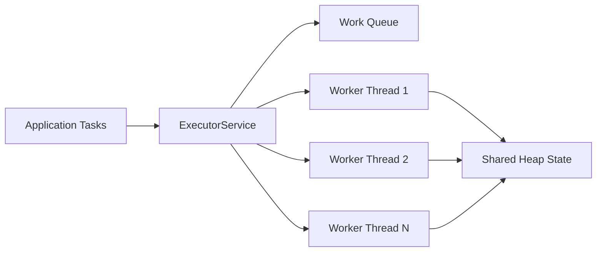

Important implication:
- local variables are per-thread
- object fields are shared unless confined or immutable

---

## Executor Abstractions

### `Executor`

Minimal interface for submitting a task.

```java
Executor executor = Runnable::run;
executor.execute(() -> System.out.println("hello"));
```

### `ExecutorService`

Adds lifecycle and result APIs:
- `submit`
- `shutdown`
- `shutdownNow`
- `awaitTermination`

```java
ExecutorService pool = Executors.newFixedThreadPool(8);
Future<Integer> future = pool.submit(() -> 42);
```

### `ScheduledExecutorService`

For periodic or delayed execution.

Use for:
- retries
- cleanup loops
- delayed maintenance work

Do not use it as a general “just run this later somehow” hammer when proper event-driven flow is clearer.

---

## Thread Pool Internals

At a high level, a thread pool is:
- a set of worker threads
- a work queue
- a saturation policy
- shutdown semantics

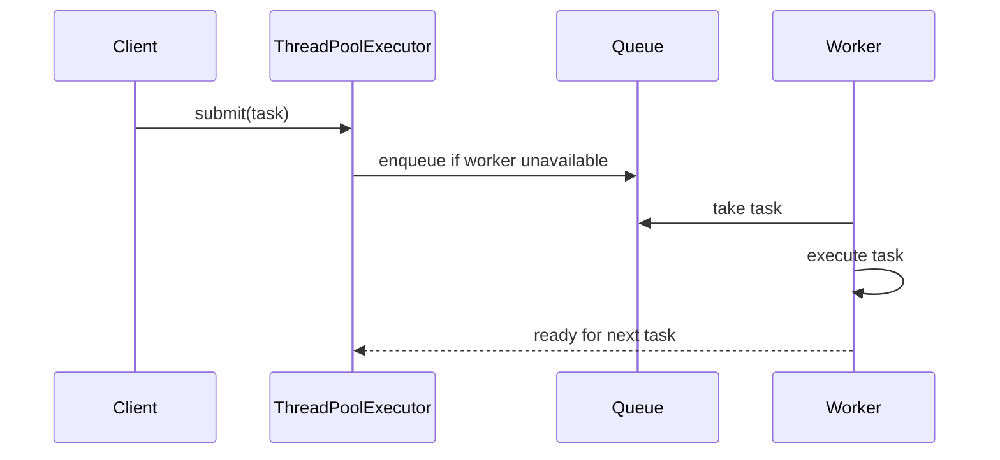

### Why queue choice matters

- **Unbounded queue**: easy to use, but can hide overload until latency or memory explodes
- **Bounded queue**: forces backpressure/rejection decisions earlier
- **Direct handoff** (`SynchronousQueue`): useful when you want submission to require an available worker or spawn within pool policy

### `ThreadPoolExecutor` core knobs

- `corePoolSize`
- `maximumPoolSize`
- `keepAliveTime`
- `workQueue`
- `ThreadFactory`
- `RejectedExecutionHandler`

Example:

```java
var pool = new ThreadPoolExecutor(
        8,
        16,
        60, TimeUnit.SECONDS,
        new ArrayBlockingQueue<>(1000),
        Executors.defaultThreadFactory(),
        new ThreadPoolExecutor.CallerRunsPolicy()
);
```

---

## How to Choose a Pool

### CPU-bound work

Use a relatively small pool, often around available cores.

Why:
- too many threads increase context switching
- only so many threads can make CPU progress at once

### Blocking IO work

Use more threads than cores, or isolate blocking work in a dedicated pool.

Why:
- threads spend time waiting on network/disk/database

### Important operational rule

Do not mix unrelated workloads in one pool if they have different latency / blocking behavior.

Example anti-pattern:
- request handling tasks + long DB polling + scheduled cleanup jobs all share one fixed pool

This leads to priority inversion and starvation.

---

## ForkJoinPool

> [!info] ForkJoinPool
> `ForkJoinPool` is a specialized `ExecutorService` for **work-stealing**: tasks can split (fork) into subtasks, and idle workers "steal" work from busy workers' queues. It's the engine behind `parallelStream()` and `CompletableFuture`'s common pool. Unlike `ThreadPoolExecutor` (which uses a shared work queue), each worker in a `ForkJoinPool` has its own deque — this is what makes work-stealing possible.

### Work-stealing vs work-sharing

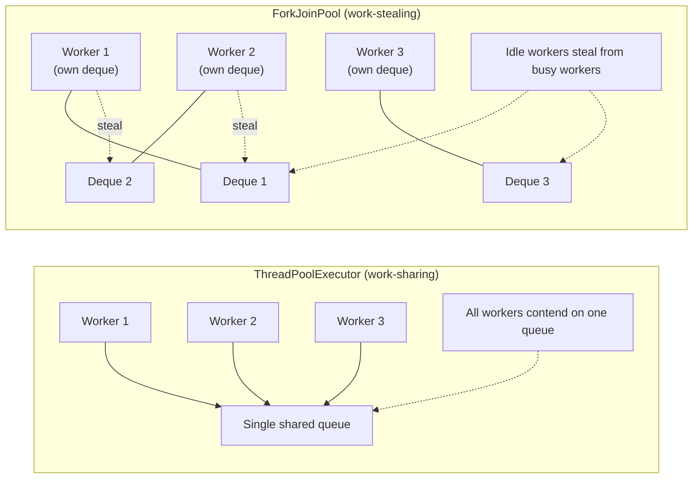

| Aspect | `ThreadPoolExecutor` | `ForkJoinPool` |
|--------|:--------------------:|:--------------:|
| **Queue** | Single shared `BlockingQueue` | Per-worker deque |
| **Contention** | High on the shared queue | Low (stealing from tail) |
| **Task type** | Independent tasks | Recursive (can fork/join) |
| **Best for** | I/O-bound, short tasks | CPU-bound, recursive decomposition |
| **Stealing** | No | Yes — idle workers steal from busy workers' deque tails |

### Core API

```java
// Common pool (used by parallelStream, CompletableFuture)
ForkJoinPool commonPool = ForkJoinPool.commonPool();
// Size = CPU cores - 1 (configurable: -Djava.util.concurrent.ForkJoinPool.common.parallelism=N)

// Custom pool
ForkJoinPool customPool = new ForkJoinPool(4); // 4 worker threads

// Submit a task
customPool.execute(() -> System.out.println("runnable"));
customPool.submit(() -> "callable");

// ForkJoinTask — the base for recursive tasks
// Usually you extend RecursiveAction (void) or RecursiveTask<V> (with result)
```

### RecursiveTask example: parallel sum

```java
public class ParallelSum extends RecursiveTask<Long> {
    private static final long THRESHOLD = 10_000;
    private final int[] array;
    private final int start, end;

    public ParallelSum(int[] array, int start, int end) {
        this.array = array;
        this.start = start;
        this.end = end;
    }

    @Override
    protected Long compute() {
        int length = end - start;
        if (length <= THRESHOLD) {
            // Small enough: compute directly
            long sum = 0;
            for (int i = start; i < end; i++) sum += array[i];
            return sum;
        }

        // Large: split in half, fork subtasks
        int mid = start + length / 2;
        ParallelSum left = new ParallelSum(array, start, mid);
        ParallelSum right = new ParallelSum(array, mid, end);

        left.fork();                    // Enqueue left in worker's deque
        long rightResult = right.compute(); // Compute right in current thread
        long leftResult = left.join();  // Wait for left result (may steal!)
        return leftResult + rightResult;
    }

    public static void main(String[] args) {
        int[] data = new int[1_000_000];
        Arrays.fill(data, 1);

        ForkJoinPool pool = ForkJoinPool.commonPool();
        long result = pool.invoke(new ParallelSum(data, 0, data.length));
        System.out.println("Sum: " + result); // 1,000,000
    }
}
```

### How work-stealing works internally

```text
ForkJoinPool internals:
  1. Each worker maintains its own deque of tasks.
  2. Worker pushes new tasks (fork) to the TOP of its deque (LIFO).
  3. Worker pops tasks from the TOP for its own execution (LIFO — cache-friendly).
  4. Idle workers steal from the BOTTOM of other workers' deques (FIFO — steals the largest remaining subtask).
  5. This minimizes contention: only stealers access the deque bottom,
     and only the owner accesses the top.

Stealing algorithm:
  - Idle worker scans random workers' deques.
  - If it finds work in another deque's tail → CAS and steal.
  - If all workers are idle → all threads block (no spinning).
  - The thief executes the stolen task directly (no forking).

Work-stealing is efficient because:
  - Forked subtasks are large (at the top of the deque).
  - Stolen tasks are large (bottom of the deque — the oldest, largest task).
  - Overhead: one CAS per steal, no queue contention in the common case.
```

### ForkJoinPool vs ThreadPoolExecutor: when to use which

```text
Use ForkJoinPool when:
  - Work is CPU-bound and can be recursively decomposed.
  - You use parallelStream() or CompletableFuture (they use common pool).
  - Tasks are compute-heavy with minimal blocking.
  - You need work-stealing across uneven workloads.

Use ThreadPoolExecutor when:
  - Work is I/O-bound (network, disk, database).
  - Tasks block frequently (ForkJoinPool doesn't handle blocking well).
  - Tasks are independent (no fork/join needed).
  - You need a bounded queue for backpressure.
  - You need fine-grained control over saturation policy.

⚠️  Managed blockers:
  - If your ForkJoinPool task MUST block (e.g., waiting for another service),
    use ForkJoinPool.managedBlock() to tell the pool to add a temporary
    compensating worker (avoids starvation):

    ForkJoinPool.managedBlock(new ForkJoinPool.ManagedBlocker() {
        @Override public boolean block() {
            queue.take();  // Your blocking call
            return false;
        }
        @Override public boolean isReleasable() { return false; }
    });
```

### Common pool configuration

```properties
# JVM flags for common pool
-Djava.util.concurrent.ForkJoinPool.common.parallelism=8  # Default: CPU-1
-Djava.util.concurrent.ForkJoinPool.common.threadFactory=...  # Custom factory
-Djava.util.concurrent.ForkJoinPool.common.exceptionHandler=...  # Uncaught handler
```

---

## Interrupts and Cancellation

Interruption is Java’s cooperative cancellation signal.

### Correct handling pattern

```java
try {
    queue.take();
} catch (InterruptedException e) {
    Thread.currentThread().interrupt();
    return;
}
```

### What interruption means

- it does not forcibly stop arbitrary code
- blocking methods may throw `InterruptedException`
- your code must respect it and exit cleanly where appropriate

### Why swallowing interrupts is a bug

If you catch and ignore interruption, callers cannot reliably cancel work or shut down services.

---

## Semaphores

`Semaphore` is a coordination primitive that controls how many threads may enter a section or use a limited resource at the same time.

### Beginner intuition

Think of a semaphore as a bucket of permits:
- `acquire()` takes one permit
- `release()` returns one permit
- when no permits remain, new callers wait

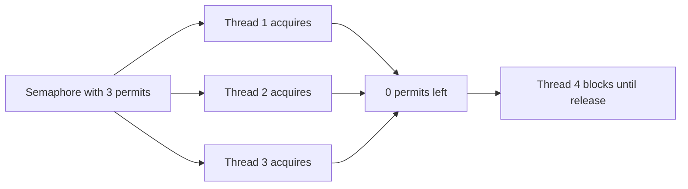

### Why semaphores exist

Semaphores solve a different problem from locks:
- a **lock** protects a critical section so usually only one thread enters at a time
- a **semaphore** limits concurrency to **N simultaneous users**

Use semaphores when you need:
- bounded access to a finite resource pool
- concurrency limiting for downstream calls
- bulkhead-style protection under load
- throttling background work

Do not use semaphores as a drop-in replacement for every lock. They are about **permits**, not ownership of a single critical section.

### Core API

```java
Semaphore semaphore = new Semaphore(10); // 10 permits

semaphore.acquire();      // blocks until permit available
semaphore.release();      // returns permit
semaphore.tryAcquire();   // non-blocking attempt
```

Important methods:
- `acquire()`
- `acquire(int permits)`
- `tryAcquire()`
- `tryAcquire(timeout, unit)`
- `release()`
- `availablePermits()`

### Internal working model

Java's `Semaphore` is built on `AbstractQueuedSynchronizer` (AQS).

At a high level:
- permit count is stored in synchronizer state
- acquire attempts atomically decrement state when permits are available
- when permits are unavailable, the calling thread joins a wait queue
- release increments state and unparks waiting threads according to policy

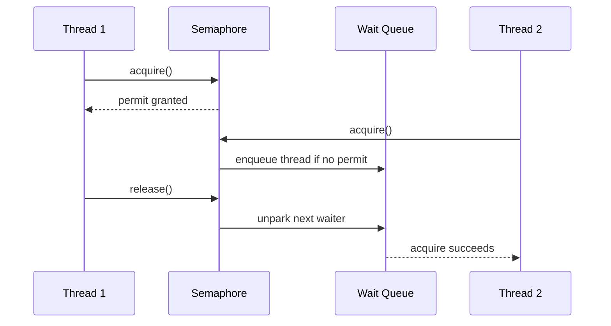

### Fair vs non-fair semaphore

```java
Semaphore fair = new Semaphore(5, true);
Semaphore nonFair = new Semaphore(5, false);
```

#### Non-fair semaphore

- default in most code
- higher throughput in many cases
- a newly arriving thread may acquire a permit before older waiting threads

#### Fair semaphore

- attempts FIFO ordering
- reduces starvation risk
- may reduce throughput because strict ordering limits opportunistic acquisition

### When to use fair mode

Use fairness when:
- starvation is unacceptable
- tasks are similar in cost and ordering fairness matters

Avoid fairness by default when:
- raw throughput matters more
- short tasks should opportunistically move through quickly

### Binary semaphore vs counting semaphore

#### Binary semaphore

One permit only.

```java
Semaphore binary = new Semaphore(1);
```

This can look similar to a lock, but semantics differ:
- semaphore does not encode ownership like a `ReentrantLock`
- one thread may release a permit acquired by another thread, which is legal but often design-smelly unless intentionally modeling handoff

#### Counting semaphore

Multiple permits.

```java
Semaphore dbConnections = new Semaphore(20);
```

This is the usual and most useful form.

### Scenario 1: Limiting concurrent downstream calls

```java
class InventoryClientLimiter {
    private final Semaphore permits = new Semaphore(50);

    public InventoryResponse fetch(String sku) throws InterruptedException {
        permits.acquire();
        try {
            return inventoryClient.fetch(sku);
        } finally {
            permits.release();
        }
    }
}
```

Why this is useful:
- prevents 500 request threads from hammering one downstream dependency
- creates an explicit concurrency budget
- acts like a lightweight bulkhead

### Scenario 2: Bounded resource pool

```java
class ResourcePool<T> {
    private final Semaphore available;
    private final BlockingQueue<T> queue;

    ResourcePool(List<T> resources) {
        this.available = new Semaphore(resources.size());
        this.queue = new LinkedBlockingQueue<>(resources);
    }

    T borrow() throws InterruptedException {
        available.acquire();
        try {
            return queue.take();
        } catch (InterruptedException e) {
            available.release();
            Thread.currentThread().interrupt();
            throw e;
        }
    }

    void giveBack(T resource) {
        queue.add(resource);
        available.release();
    }
}
```

This is a classic counting-semaphore use case.

### Scenario 3: Try-acquire for fast failure

```java
if (!semaphore.tryAcquire()) {
    throw new RejectedExecutionException("Too many concurrent exports");
}

try {
    runExport();
} finally {
    semaphore.release();
}
```

Use this when waiting is worse than failing fast.

### Scenario 4: Timed acquire with deadline

```java
if (!semaphore.tryAcquire(100, TimeUnit.MILLISECONDS)) {
    return Response.status(429).build();
}

try {
    processRequest();
} finally {
    semaphore.release();
}
```

This is often better than waiting forever under overload.

### Relationship with thread pools and queues

Semaphores work well together with executors:
- executor limits worker threads
- queue controls queued backlog
- semaphore can limit a particular expensive step inside those tasks

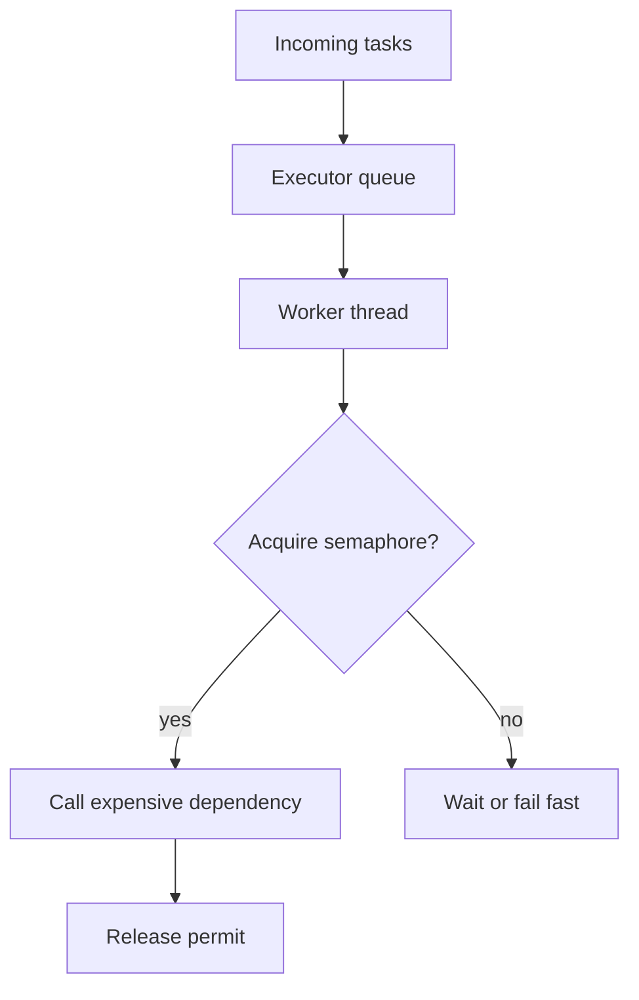

This is useful when the whole executor should keep running, but one downstream dependency needs tighter concurrency control.

### Important correctness rule

Always release permits in a `finally` block.

```java
semaphore.acquire();
try {
    doWork();
} finally {
    semaphore.release();
}
```

### Common bugs

#### Permit leak

If an exception path skips `release()`, capacity shrinks over time and the system eventually deadlocks or stalls.

#### Releasing without successful acquire

This inflates permit count incorrectly and breaks the concurrency guarantee.

#### Holding permit across slow or unrelated work

If you keep a permit while doing logging, serialization, or unrelated local processing, you reduce throughput unnecessarily.

#### Using semaphore where ownership matters

If you need reentrancy, ownership tracking, or condition variables, a lock is often the better primitive.

### Advanced point: semaphore is a coordination primitive, not backpressure by itself

A semaphore limits in-flight work, but it does not decide what should happen to excess demand.

You still need a policy:
- block
- timeout
- reject
- degrade gracefully

That policy is what makes the difference between a resilient service and a stalled one.

---

## ThreadLocal

> [!info] ThreadLocal
> `ThreadLocal` provides per-thread storage: each thread accessing a `ThreadLocal` variable gets its own, independently initialized copy. It solves the problem of sharing thread-confined state without passing it through every method parameter. Common uses: request-scoped context (user ID, trace ID), per-thread caches (SimpleDateFormat, database connections), and transaction-scoped state.

### How ThreadLocal works internally

```text
ThreadLocal does NOT use a global map. Instead:

  1. Each Thread object has a field: ThreadLocal.ThreadLocalMap threadLocals.
  2. ThreadLocalMap is a custom hash map (not java.util.HashMap).
  3. The map uses OPEN ADDRESSING (linear probing), not separate chaining.
  4. Keys are WeakReference<ThreadLocal<?>> — the ThreadLocal object can be
     GC'd even if a thread is still alive.
  5. Values are strong references — they prevent the value from being GC'd
     until the thread dies or the entry is removed.

set(value):
  Thread t = Thread.currentThread();
  ThreadLocalMap map = t.threadLocals;
  if (map != null)
      map.set(this, value);
  else
      t.threadLocals = new ThreadLocalMap(this, value);

get():
  Thread t = Thread.currentThread();
  ThreadLocalMap map = t.threadLocals;
  if (map != null) {
      ThreadLocalMap.Entry e = map.getEntry(this);
      if (e != null) return (T)e.value;
  }
  return setInitialValue();
```

### Basic usage

```java
// ThreadLocal with lambda initializer (Java 8+)
private static final ThreadLocal<SimpleDateFormat> DATE_FORMAT =
    ThreadLocal.withInitial(() -> new SimpleDateFormat("yyyy-MM-dd"));

// Each thread gets its own SimpleDateFormat (not shared → no synchronization)
// Without ThreadLocal, you'd need to synchronize or create a new formatter per call.
public String formatDate(Date date) {
    return DATE_FORMAT.get().format(date);
}

// Request context (common in web frameworks)
private static final ThreadLocal<UserContext> CONTEXT = new ThreadLocal<>();

public static void setContext(UserContext ctx) {
    CONTEXT.set(ctx);
}

public static UserContext getContext() {
    return CONTEXT.get();
}

// Clean up after request (crucial in thread pools!)
public static void clear() {
    CONTEXT.remove();
}
```

### When to use ThreadLocal

```text
✅ Good uses for ThreadLocal:
  - Caching expensive, non-thread-safe objects (SimpleDateFormat, Random, Calendar).
  - Request-scoped context (user ID, request ID, locale) in web applications.
  - Transaction-scoped state (Hibernate Session, JPA EntityManager).
  - Per-thread counters or metrics (before LongAdder existed).
  - Framework internals (Spring's RequestContextHolder, Log4j's ThreadContext).

❌ Bad uses for ThreadLocal:
  - Passing "hidden" parameters between methods (creates invisible coupling).
  - Storing values across asynchronous boundaries (CompletableFuture, callbacks).
  - Any use where the thread lifecycle is unclear (thread pools → memory leaks).
```

### ThreadLocal memory leaks in thread pools

```java
// ❌ MEMORY LEAK PATTERN:
public class RequestHandler {
    private static final ThreadLocal<byte[]> HUGE_BUFFER =
        ThreadLocal.withInitial(() -> new byte[1024 * 1024]); // 1 MB per thread

    public void handle(Request req) {
        byte[] buf = HUGE_BUFFER.get();
        // ... use buffer ...
        // ❌ BUFFER IS NEVER REMOVED!
        // In a thread pool: every thread that handled a request keeps its 1 MB buffer
        // 100 thread pool threads × 1 MB = 100 MB retained forever
    }
}
```

```text
The leak mechanism:
  1. Thread pool has 100 threads.
  2. Each thread sets a ThreadLocal value.
  3. The ThreadLocalMap entry has: key=WeakReference<ThreadLocal>, value=strong reference.
  4. The ThreadLocal object can be GC'd (weak reference allows it).
  5. BUT: the VALUE remains in the map forever (strong reference, no GC until the map is cleaned).
  6. If you never call remove(), the map entry persists for the thread's lifetime.
  7. Thread pool threads live indefinitely → the value leaks.

✅ Fix:
  - Always call remove() in a finally block:
    try {
        buf = HUGE_BUFFER.get();
        process(buf);
    } finally {
        HUGE_BUFFER.remove();  // Remove entry from thread-local map
    }

  - Or use try-with-resources pattern if you wrap ThreadLocal in AutoCloseable.
```

### InheritableThreadLocal

```java
// InheritableThreadLocal: child threads inherit the parent's value.
// Used by: frameworks that spawn worker threads and need to propagate context.

private static final InheritableThreadLocal<String> REQUEST_ID =
    new InheritableThreadLocal<>();

// Parent thread:
REQUEST_ID.set("req-123");
// Child thread (started from parent):
new Thread(() -> {
    System.out.println(REQUEST_ID.get());  // "req-123" — inherited!
}).start();

// Limitation: inheritance happens ONCE at thread creation time.
// If the parent changes the value later, the child's copy is NOT updated.
// If you pass through executors (not direct Thread creation), inheritance
// depends on whether the executor propagates it (most don't).
```

### TransmittableThreadLocal

```java
// TransmittableThreadLocal (from alibaba/transmittable-thread-local library)
// Solves: propagate ThreadLocal values across thread pools and async boundaries.

// This is NOT in the JDK — it's an open-source library (com.alibaba:transmittable-thread-local).
// It wraps the executor to capture + replay ThreadLocal values.

// Why it's needed:
//   - InheritableThreadLocal only works with new Thread(), not thread pools.
//   - CompletableFuture, ExecutorService, parallelStream don't propagate ThreadLocal.
//   - TransmittableThreadLocal captures the value at task submission time and
//     replays it in the worker thread.

// Usage:
TransmittableThreadLocal<String> context = new TransmittableThreadLocal<>();
context.set("req-456");

// The value is automatically propagated to the worker thread:
executor.submit(() -> {
    System.out.println(context.get());  // "req-456"
});
```

### ScopedValue (JDK 21+) — the ThreadLocal replacement for virtual threads

```java
// ScopedValue (JDK 21, preview) is the modern alternative to ThreadLocal.
// Unlike ThreadLocal, ScopedValue is:
//   - Immutable per scope (can't be changed once set)
//   - Inherited by virtual threads (no leak, no propagation issues)
//   - No memory leak (value is tied to the scope, not the thread)

// Declare a ScopedValue (like a ThreadLocal but immutable)
private static final ScopedValue<User> CURRENT_USER = ScopedValue.newInstance();

// Bind the value for a scope — available in this thread AND any VTs spawned inside
ScopedValue.where(CURRENT_USER, user)
    .run(() -> {
        // Inside this scope: CURRENT_USER.get() returns user
        handleRequest();
    });

// Nested scopes (shadowing):
ScopedValue.where(CURRENT_USER, adminUser)
    .run(() -> {
        // Admin user here
        ScopedValue.where(CURRENT_USER, regularUser)
            .run(() -> {
                // Regular user here (shadows outer scope)
            });
    });
```

### ThreadLocal best practices

```text
✅ DO:
  - Always call remove() in a finally block (especially in thread pools).
  - Use withInitial() for thread-safe initialization.
  - Make ThreadLocal variables private static final.
  - Consider ScopedValue (JDK 21+) for new code (virtual-thread-safe).

❌ DON'T:
  - Store large objects without removing them.
  - Use ThreadLocal for "implicit parameters" between methods.
  - Depend on ThreadLocal across async boundaries (use TransmittableThreadLocal or pass explicitly).
  - Mix ThreadLocal with virtual threads without considering ScopedValue.
```

---

## Coordination Primitives

Java provides several coordination tools beyond plain locks and semaphores. The right primitive depends on whether you want:
- one-time waiting
- repeated phase synchronization
- dynamic participant registration
- producer/consumer handoff

### Quick mental model

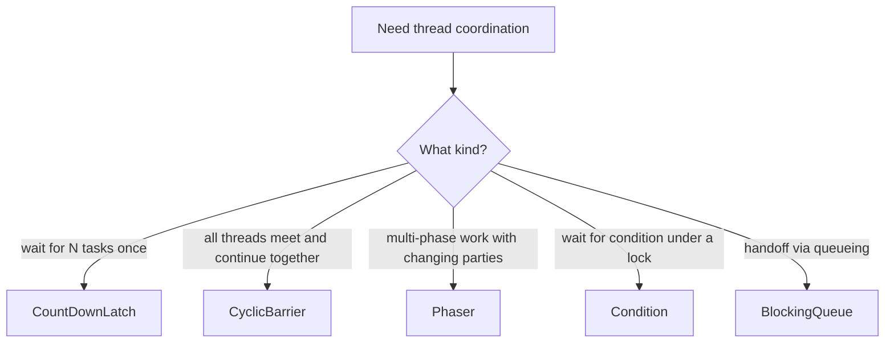

### `CountDownLatch`

`CountDownLatch` is a one-shot gate.

Use it when:
- one thread must wait for N other operations to finish
- startup sequences need “wait until all subsystems are ready”
- tests need to coordinate concurrent workers deterministically

Core methods:
- `await()`
- `countDown()`

```java
CountDownLatch latch = new CountDownLatch(3);

pool.submit(() -> { loadConfig(); latch.countDown(); });
pool.submit(() -> { warmCache(); latch.countDown(); });
pool.submit(() -> { connectMetrics(); latch.countDown(); });

latch.await();
startServingTraffic();
```

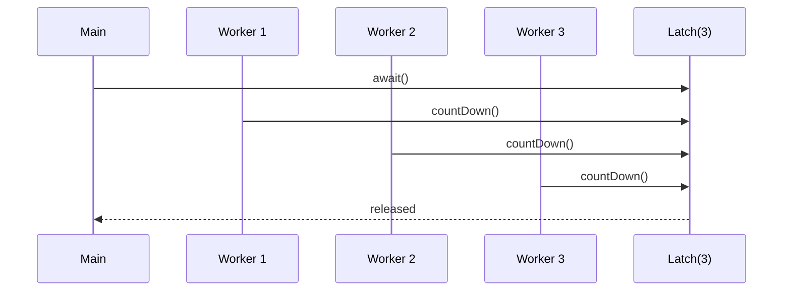

Important property:
- latch count only moves downward
- once it reaches zero, it cannot be reset

#### Common bug

If one worker fails before calling `countDown()`, the waiter may block forever unless timeout/failure propagation exists.

### `CyclicBarrier`

`CyclicBarrier` lets a fixed group of threads wait until all parties reach the same barrier, then all are released together.

Use it when:
- parallel stages must advance in lockstep
- simulation / batch phase processing uses the same fixed set of workers repeatedly

```java
CyclicBarrier barrier = new CyclicBarrier(3, () -> System.out.println("phase done"));

Runnable task = () -> {
    doPhaseOne();
    barrier.await();
    doPhaseTwo();
};
```

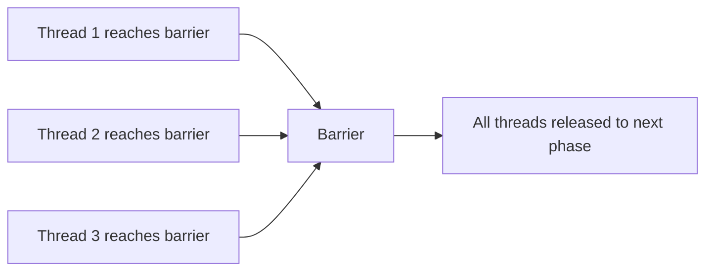

Important difference from `CountDownLatch`:
- `CyclicBarrier` is reusable across cycles
- all participating threads usually wait at the barrier

#### When not to use it

Do not use it when participant count changes dynamically; `Phaser` handles that more naturally.

### `Phaser`

`Phaser` generalizes barrier-style coordination for multi-phase work with dynamic registration.

Use it when:
- phases repeat
- participants can join/leave between phases
- the workflow is more complex than a fixed barrier

```java
Phaser phaser = new Phaser(1); // main thread registered

for (int i = 0; i < 3; i++) {
    phaser.register();
    pool.submit(() -> {
        doWorkPhase1();
        phaser.arriveAndAwaitAdvance();
        doWorkPhase2();
        phaser.arriveAndDeregister();
    });
}

phaser.arriveAndAwaitAdvance();
phaser.arriveAndDeregister();
```

Why it matters:
- more flexible than `CyclicBarrier`
- easier for complex staged workflows

#### Practical advice

Use `Phaser` only when you actually need that flexibility. For many teams, `CountDownLatch` or `CyclicBarrier` is easier to reason about.

---

## Lock Variants and Conditions

### `ReentrantLock`

`ReentrantLock` is an explicit mutual-exclusion lock with more control than `synchronized`.

### What reentrancy means

Reentrancy means the thread that already owns the lock can acquire it again without deadlocking itself.

```java
ReentrantLock lock = new ReentrantLock();

void outer() {
    lock.lock();
    try {
        inner();
    } finally {
        lock.unlock();
    }
}

void inner() {
    lock.lock();
    try {
        // same thread can re-enter
    } finally {
        lock.unlock();
    }
}
```

The lock keeps a hold count. Each successful acquire by the owning thread increments it; each `unlock()` decrements it. The lock is released only when the hold count reaches zero.

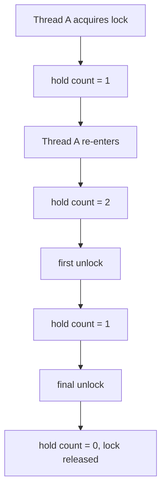

### Why use `ReentrantLock`

Use `ReentrantLock` when you need features beyond intrinsic locking:
- timed locking (`tryLock(timeout, unit)`)
- interruptible lock acquisition (`lockInterruptibly()`)
- fairness option
- explicit `Condition` objects
- advanced diagnostics / lock-state methods in specialized cases

If you only need simple mutual exclusion with minimal complexity, `synchronized` is often still a good choice.

### Core API

#### Basic lock/unlock

```java
ReentrantLock lock = new ReentrantLock();

lock.lock();
try {
    updateSharedState();
} finally {
    lock.unlock();
}
```

### Critical correctness rule

Always `unlock()` in `finally`.

Failure to do so can permanently block other threads.

#### Non-blocking `tryLock()`

```java
if (lock.tryLock()) {
    try {
        doWork();
    } finally {
        lock.unlock();
    }
} else {
    handleContention();
}
```

Use this when waiting indefinitely is unacceptable.

#### Timed `tryLock()`

```java
if (lock.tryLock(100, TimeUnit.MILLISECONDS)) {
    try {
        writeConfig();
    } finally {
        lock.unlock();
    }
} else {
    throw new TimeoutException("Could not acquire config lock in time");
}
```

Use this when:
- you want bounded waiting
- lock contention should degrade gracefully instead of hanging forever

#### `lockInterruptibly()`

```java
try {
    lock.lockInterruptibly();
    try {
        process();
    } finally {
        lock.unlock();
    }
} catch (InterruptedException e) {
    Thread.currentThread().interrupt();
    return;
}
```

Use this when waiting for the lock should remain cancellable.

This is one of the strongest reasons to choose `ReentrantLock` over `synchronized` in some production workflows.

### Fair vs non-fair `ReentrantLock`

```java
ReentrantLock fairLock = new ReentrantLock(true);
ReentrantLock nonFairLock = new ReentrantLock(false);
```

#### Non-fair lock

- default in most code
- usually higher throughput
- allows barging: a newly arriving thread may acquire before a waiter

#### Fair lock

- attempts first-come, first-served ordering
- reduces starvation risk
- can reduce throughput under contention

Use fairness only when starvation avoidance matters more than throughput.

### Ownership and semantics

Unlike a semaphore, `ReentrantLock` has an ownership model:
- one thread owns the lock
- only the owning thread should unlock it

That makes it better than a binary semaphore when you need strong lock semantics around a critical section.

### Internal working model

`ReentrantLock` is built on `AbstractQueuedSynchronizer` (AQS).

High-level behavior:
- lock state tracks ownership/hold count
- uncontended acquisition succeeds quickly
- contended acquisition places threads in an AQS queue
- unlock hands progress to queued waiters according to policy

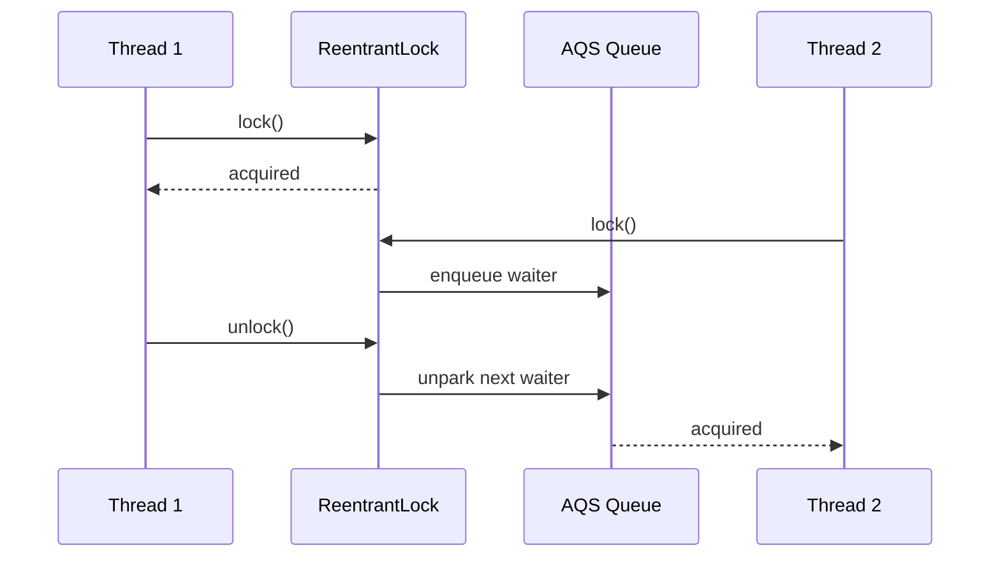

### When `ReentrantLock` is a good fit

- protecting mutable in-memory state with non-trivial lock management
- lock acquisition must be cancellable or timed
- you need multiple explicit `Condition`s
- you want to avoid deadlock by trying alternative acquisition strategies

### When `synchronized` is often enough

- small, simple critical sections
- straightforward object monitor protection
- you do not need timed/interruption-aware/fair acquisition semantics

### Real-world scenario: avoid deadlock with timed locking

```java
boolean transfer(Account from, Account to, long cents) throws InterruptedException {
    if (!from.lock.tryLock(50, TimeUnit.MILLISECONDS)) return false;
    try {
        if (!to.lock.tryLock(50, TimeUnit.MILLISECONDS)) return false;
        try {
            from.withdraw(cents);
            to.deposit(cents);
            return true;
        } finally {
            to.lock.unlock();
        }
    } finally {
        from.lock.unlock();
    }
}
```

This is not a universal deadlock cure, but it is a useful strategy when lock ordering cannot be made perfectly simple.

### Common mistakes

#### Missing `unlock()` on exception path

This is the classic production bug.

#### Unlocking without ownership

Causes `IllegalMonitorStateException`.

#### Mixing unrelated state under one coarse lock

Creates unnecessary contention.

#### Overusing explicit locks where simpler patterns would do

Sometimes immutability, confinement, or a concurrent collection is clearer and safer.

### `ReadWriteLock`

`ReadWriteLock` separates readers and writers:
- multiple readers can proceed together
- writers require exclusive access

Use it when:
- reads are much more frequent than writes
- the protected state is expensive enough that reduced read contention matters

```java
ReadWriteLock rw = new ReentrantReadWriteLock();

rw.readLock().lock();
try {
    return cacheSnapshot();
} finally {
    rw.readLock().unlock();
}
```

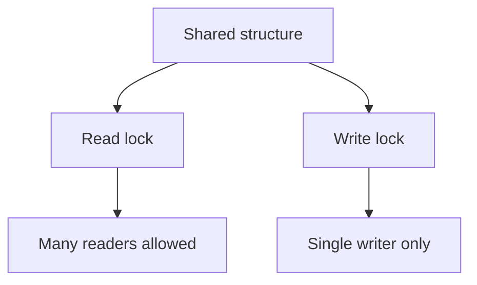

#### When it helps

- configuration snapshots
- in-memory lookup-heavy registries
- metadata structures with rare writes

#### When it hurts

- write-heavy workloads
- short trivial reads where lock overhead dominates
- designs where read operations still trigger writes indirectly

### `StampedLock`

`StampedLock` provides:
- read lock
- write lock
- optimistic read

The optimistic-read mode is the interesting part: read first without blocking, then validate whether a write occurred.

```java
StampedLock lock = new StampedLock();

long stamp = lock.tryOptimisticRead();
double currentX = x;
double currentY = y;
if (!lock.validate(stamp)) {
    stamp = lock.readLock();
    try {
        currentX = x;
        currentY = y;
    } finally {
        lock.unlockRead(stamp);
    }
}
```

Use it when:
- reads dominate heavily
- optimistic reads are likely to succeed
- you are comfortable with more complex code

Avoid it when:
- simplicity matters more than squeezing contention wins
- your team is likely to misuse stamp lifecycle

#### Important caution

`StampedLock` is powerful but easier to misuse than `ReentrantReadWriteLock`. Prefer it only when the benefit is justified.

### `Condition`

`Condition` works with a lock and lets threads wait for a specific state transition.

Conceptually, it gives you explicit wait-sets instead of using intrinsic monitor methods (`wait/notify`) directly.

```java
ReentrantLock lock = new ReentrantLock();
Condition notEmpty = lock.newCondition();

lock.lock();
try {
    while (queue.isEmpty()) {
        notEmpty.await();
    }
    consume(queue.remove());
} finally {
    lock.unlock();
}
```

Use `Condition` when:
- one lock protects state
- threads need to wait until a particular predicate becomes true
- you want explicit condition queues like `notEmpty`, `notFull`

#### Critical rule

Always wait in a loop, not an `if`, because wakeups can be spurious or the condition may no longer hold when the thread resumes.

```java
while (!ready) {
    condition.await();
}
```

### `Condition` vs low-level `wait/notify`

The `Condition` API is the modern equivalent of `Object.wait()`/`Object.notify()` — but with multiple, named condition queues per lock. For the underlying mechanics of `wait/notify` (monitor wait-set, spurious wakeup, lost notification), see [[Java/03_Advanced/02_JMM_Volatile_and_Locks#wait/notify/notifyAll|the wait/notify section in A02]].

---

## BlockingQueue

`BlockingQueue` is one of the most practical concurrency primitives in Java.

It combines:
- thread-safe handoff
- optional capacity bounds
- blocking semantics for producers/consumers

Use it for:
- producer/consumer pipelines
- worker queues
- bounded buffering
- backpressure-friendly internal handoff

### Core methods

- `put()` blocks when full
- `take()` blocks when empty
- `offer()` can fail fast
- `poll(timeout, unit)` waits with deadline

```java
BlockingQueue<Job> queue = new ArrayBlockingQueue<>(100);

queue.put(job);
Job next = queue.take();
```

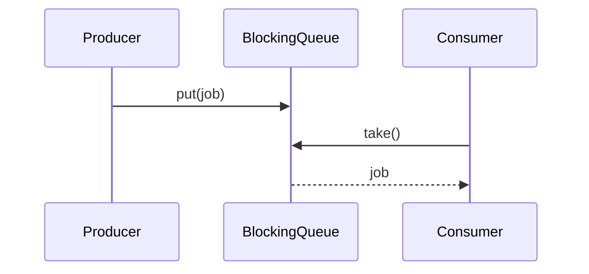

### Common implementations

#### `ArrayBlockingQueue`

- bounded
- fixed-size array backing
- good when a hard capacity limit matters

#### `LinkedBlockingQueue`

- linked-node based
- optional bound, often used unbounded or very large
- easy to misuse if left effectively unbounded

#### `SynchronousQueue`

- zero-capacity handoff queue
- each insert waits for a corresponding take
- useful for direct handoff executor patterns

### Why it matters operationally

If a queue is unbounded, it can convert a concurrency problem into a latency + memory problem.

---

## ConcurrentHashMap Internals

`ConcurrentHashMap` is for concurrent access to a map without one coarse global lock.

Use it when:
- many threads read/write shared key-value state
- `Collections.synchronizedMap` would be too coarse
- you need concurrent access with better scalability than one monitor

### High-level internal idea

- bucketed hash table design
- operations coordinate at finer granularity than one global map lock
- reads are optimized for concurrency
- updates coordinate per-bin / per-structure as needed

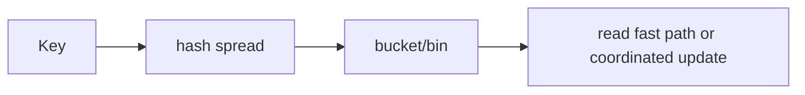

### Good usage example

```java
ConcurrentHashMap<String, AtomicInteger> counts = new ConcurrentHashMap<>();

counts.computeIfAbsent("java", k -> new AtomicInteger())
      .incrementAndGet();
```

### Important API notes

- compound operations still need careful APIs
- prefer atomic map methods such as:
  - `computeIfAbsent`
  - `compute`
  - `merge`
  - `putIfAbsent`

Bad pattern:

```java
if (!map.containsKey(key)) {
    map.put(key, value); // race window
}
```

Better:

```java
map.putIfAbsent(key, value);
```

### When not to use it

- when a plain immutable snapshot map is enough
- when operations must update multiple data structures under one invariant
- when you need ordering semantics (`ConcurrentSkipListMap` may be a better fit)

---

## Shared State and Coordination

### Prefer immutable or thread-confined state

Best option: avoid sharing mutable state at all.

### Safe building blocks

- `ConcurrentHashMap`
- `BlockingQueue`
- atomics (`AtomicInteger`, `AtomicReference`)
- explicit locks when invariants span multiple fields
- semaphores when you need bounded concurrent access instead of exclusive locking
- latches/barriers/phasers for lifecycle and phase coordination
- read/write locks when read concurrency is high and writes are rare enough to justify complexity

### Example: simple task counting

```java
AtomicInteger completed = new AtomicInteger();

pool.submit(() -> {
    doWork();
    completed.incrementAndGet();
});
```

### Important definition

> [!tip] Definition
> **Thread confinement** means a value is only ever accessed by one thread (or one execution context), so synchronization is unnecessary.

---

## Common Production Scenarios

## Isolating slow downstream calls

```java
ExecutorService dbPool = Executors.newFixedThreadPool(16);
ExecutorService emailPool = Executors.newFixedThreadPool(4);
```

Separate pools prevent one slow dependency from consuming all worker capacity.

## Bounded queue with visible backpressure

```java
var pool = new ThreadPoolExecutor(
        4, 4,
        0L, TimeUnit.MILLISECONDS,
        new ArrayBlockingQueue<>(200),
        new ThreadPoolExecutor.AbortPolicy()
);
```

This fails fast under overload instead of hiding the problem behind unbounded queue growth.

## Graceful shutdown

```java
pool.shutdown();
if (!pool.awaitTermination(30, TimeUnit.SECONDS)) {
    pool.shutdownNow();
}
```

---

## Pitfalls

### Using `Executors.newFixedThreadPool` blindly

It uses an unbounded queue, which can hide overload and grow memory/latency under sustained pressure.

### One pool for everything

Mixing CPU-bound, blocking IO, and background maintenance work in one pool is a classic production mistake.

### Forgetting task timeouts

Tasks that never return consume capacity indefinitely.

### Ignoring interruption

Breaks cancellation, shutdown, and backpressure behavior.

### Creating threads manually in application code

Manual thread management makes ownership, shutdown, metrics, and diagnosis harder than necessary.

---

> [!question]- Interview Questions
>
> **Q: Why is `ExecutorService` preferred over creating threads manually?**
> A: It centralizes thread reuse, lifecycle management, queueing, shutdown, and metrics-friendly control of concurrency.
>
> **Q: Why is an unbounded queue dangerous in a thread pool?**
> A: It hides overload. Instead of failing early, latency and memory can grow until the process becomes unstable.
>
> **Q: What does interruption mean in Java?**
> A: It is a cooperative cancellation signal that code must observe and respect; it does not forcibly stop arbitrary execution.
>
> **Q: When should you use separate thread pools?**
> A: When workloads have different blocking behavior, latency goals, or failure domains.
>
> **Q: When should you use a `Semaphore` instead of a lock?**
> A: When you need to allow up to N concurrent users of a resource or operation, rather than exclusive single-owner access.
>
> **Q: What is the difference between fair and non-fair semaphores?**
> A: Fair semaphores prefer FIFO-style ordering and reduce starvation risk; non-fair semaphores usually provide better throughput but can let newer threads overtake waiters.
>
> **Q: What is the most common semaphore bug in production code?**
> A: Permit leaks caused by missing `release()` on failure paths.
>
> **Q: When should you use `CountDownLatch` vs `CyclicBarrier`?**
> A: Use `CountDownLatch` for one-shot waiting on N completions. Use `CyclicBarrier` when a fixed group of threads must repeatedly meet and continue together.
>
> **Q: What problem does `Phaser` solve better than `CyclicBarrier`?**
> A: Multi-phase coordination with dynamic registration and deregistration of participants.
>
> **Q: What does reentrancy mean in `ReentrantLock`?**
> A: The same thread can acquire the same lock multiple times, and the lock is only released after the matching number of `unlock()` calls.
>
> **Q: When should you prefer `ReentrantLock` over `synchronized`?**
> A: When you need timed acquisition, interruptible acquisition, fairness control, or explicit `Condition` objects.
>
> **Q: What is the most common `ReentrantLock` bug?**
> A: Forgetting to call `unlock()` in a `finally` block, causing threads to block indefinitely.
>
> **Q: When is `ReadWriteLock` useful?**
> A: When reads dominate writes enough that allowing concurrent readers reduces contention meaningfully.
>
> **Q: Why is `StampedLock` considered more advanced/risky?**
> A: It offers optimistic reads and can be faster in specific workloads, but its stamp-based lifecycle is easier to misuse than conventional locks.
>
> **Q: Why should `Condition.await()` usually be in a `while` loop?**
> A: Because wakeups can be spurious and the condition may no longer hold when the thread resumes.
>
> **Q: Why is `BlockingQueue` so useful in concurrent designs?**
> A: It combines safe producer/consumer handoff with optional capacity bounds and built-in blocking semantics.
>
> **Q: Why is `ConcurrentHashMap` still not enough for all compound workflows?**
> A: Because multiple-step or cross-structure invariants still require a higher-level synchronization strategy.

---

## Cross-Links

- [[Java/03_Advanced/01_CompletableFuture_and_Structured_Concurrency]]
- [[Java/03_Advanced/02_JMM_Volatile_and_Locks]]
- [[SystemDesign/03_Advanced/02_Backpressure_and_Load_Shedding]]

---

## References

- [java.util.concurrent Package Summary](https://docs.oracle.com/en/java/javase/17/docs/api/java.base/java/util/concurrent/package-summary.html)
- [ThreadPoolExecutor](https://docs.oracle.com/en/java/javase/17/docs/api/java.base/java/util/concurrent/ThreadPoolExecutor.html)
- [Semaphore](https://docs.oracle.com/en/java/javase/17/docs/api/java.base/java/util/concurrent/Semaphore.html)
- [CountDownLatch](https://docs.oracle.com/en/java/javase/17/docs/api/java.base/java/util/concurrent/CountDownLatch.html)
- [CyclicBarrier](https://docs.oracle.com/en/java/javase/17/docs/api/java.base/java/util/concurrent/CyclicBarrier.html)
- [Phaser](https://docs.oracle.com/en/java/javase/17/docs/api/java.base/java/util/concurrent/Phaser.html)
- [BlockingQueue](https://docs.oracle.com/en/java/javase/17/docs/api/java.base/java/util/concurrent/BlockingQueue.html)
- [ConcurrentHashMap](https://docs.oracle.com/en/java/javase/17/docs/api/java.base/java/util/concurrent/ConcurrentHashMap.html)
- [ReentrantLock](https://docs.oracle.com/en/java/javase/17/docs/api/java.base/java/util/concurrent/locks/ReentrantLock.html)
- [ReadWriteLock](https://docs.oracle.com/en/java/javase/17/docs/api/java.base/java/util/concurrent/locks/ReadWriteLock.html)
- [StampedLock](https://docs.oracle.com/en/java/javase/17/docs/api/java.base/java/util/concurrent/locks/StampedLock.html)
- [Condition](https://docs.oracle.com/en/java/javase/17/docs/api/java.base/java/util/concurrent/locks/Condition.html)
