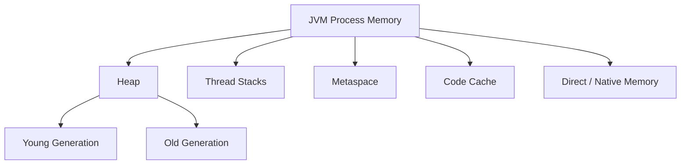
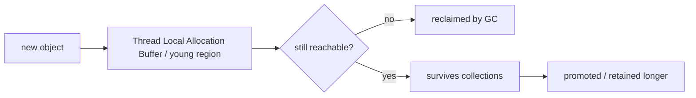

# JVM Memory and GC Basics

> [!summary] Goal
> Build the runtime intuition needed to diagnose heap pressure, GC pauses, and OOMs without jumping straight to random JVM flags.

## Table of Contents

1. [Why JVM Memory Knowledge Matters](#why-jvm-memory-knowledge-matters)
2. [Main Runtime Memory Areas](#main-runtime-memory-areas)
3. [Object Allocation Lifecycle](#object-allocation-lifecycle)
4. [How Garbage Collection Fits In](#how-garbage-collection-fits-in)
5. [Common Symptoms and What They Mean](#common-symptoms-and-what-they-mean)
6. [OOM Categories](#oom-categories)
7. [Practical Tuning Mindset](#practical-tuning-mindset)

---

## Why JVM Memory Knowledge Matters

Many Java incidents are memory-shape problems, not just “not enough RAM.”

Examples:
- too much short-lived allocation -> frequent young GC and latency jitter
- retained objects -> slow heap growth and eventual OOM
- too many threads -> native memory pressure and `unable to create new native thread`
- too much class generation -> metaspace growth

If you only think “heap = memory,” you will misdiagnose real systems.

---

## Main Runtime Memory Areas



## Heap

Stores ordinary objects and arrays.

Typical intuition:
- many objects die young
- surviving objects may be promoted to older regions/generations

## Thread stacks

Each thread has its own stack:
- method frames
- local variables
- call history

Too many threads can exhaust memory even when heap looks fine.

## Metaspace

Stores class metadata.

Growth sources:
- many loaded classes
- dynamic proxies / generated classes
- classloader leaks

## Direct / native memory

Not all memory is on-heap.

Examples:
- NIO direct buffers
- thread stacks
- native libraries
- GC/internal runtime overhead

---

## Object Layout in Memory

Every Java object on the heap has a fixed structure determined by the JVM. Understanding this layout helps predict memory usage, GC behavior, and the impact of `-XX:+UseCompressedOops`.

```text
On a 64-bit JVM with compressed OOPs (default for heaps < 32 GB):

                        ┌──────────────────────────┐
                        │   Mark Word (8 bytes)     │ ← Object header
                        ├──────────────────────────┤
                        │  Klass Pointer (4 bytes)  │ ← Class metadata pointer
                        ├──────────────────────────┤
                        │   Instance fields ...     │
                        ├──────────────────────────┤
                        │   Padding (to 8-byte)     │ ← Alignment
                        └──────────────────────────┘

             Total header: 12 bytes (mark word + compressed klass pointer)
             Alignment:    Objects are aligned to 8 bytes
                           (e.g., a 12-byte header + 1-byte field = 16 bytes)

On a 64-bit JVM WITHOUT compressed OOPs (heap > 32 GB):
             Mark word:   8 bytes
             Klass ptr:   8 bytes (uncompressed)
             Total header: 16 bytes
```

### Mark word (8 bytes)

The mark word stores runtime metadata: identity hashcode, GC age, lock state (biased/lightweight/heavyweight), and the thread ID for biased locking. It is NOT a fixed field — the JVM repurposes its bits depending on the object's state.

### Klass pointer

Points to the internal class metadata structure (`Klass` in HotSpot). With compressed OOPs (`-XX:+UseCompressedOops`, default for heaps < 32 GB), this is 4 bytes. Without it, 8 bytes. The klass pointer is what allows `getClass()` and `instanceof` to work — there's no per-object type information in the mark word.

```bash
# Check object size with JOL (Java Object Layout)
# Add dependency: org.openjdk.jol:jol-core

# At runtime:
System.out.println(ClassLayout.parseClass(String.class).toPrintable());

# Output (example):
# java.lang.String object internals:
#  OFFSET  SIZE   TYPE DESCRIPTION
#      0     4    (object header mark word, part 1)
#      4     4    (object header mark word, part 2)
#      8     4    (object header: klass pointer)
#     12     4    byte[] String.value
#     16     4    int String.hash
#     20     2    byte String.coder
#     22     6    (loss due to padding)
# Instance size: 28 bytes
```

### Compressed OOPs (Ordinary Object Pointers)

```text
-XX:+UseCompressedOops (default for heaps < 32 GB):
  - Object references are 4 bytes (instead of 8).
  - Maximum addressable heap: ~32 GB (4 bytes × 8-byte alignment = 32 GB).
  - Above 32 GB: references must be 8 bytes → heap grows but uses more memory per reference.

Performance impact:
  - Smaller references → less memory → fewer cache lines → faster.
  - Compressed OOPs add a shift instruction on each dereference (multiply by 8).
  - On modern CPUs, this shift is nearly free (1 cycle).
  - Even with compressed OOPs, the JVM can NOT address more than ~32 GB of Java objects.
  - For heaps > 32 GB: use -XX:-UseCompressedOops (but references become 8 bytes).
```

### Escape analysis and stack allocation

> [!info] Escape analysis is a JIT optimization (JDK 6u23+) that determines whether an object "escapes" the method that creates it. If the object is only used within the method (and not returned, stored in a field, or passed to another thread), the JIT can allocate it on the **stack** instead of the heap — and it's freed when the method returns, without GC involvement.

```java
// Beneficial: object does NOT escape → stack allocated (no GC pressure)
public long sum(int a, int b) {
    record Pair(int x, int y) {}
    Pair p = new Pair(a, b);   // Pair is only used within this method
    return (long) p.x() + p.y();
}

// Not beneficial: object escapes → heap allocated
public Pair create(int a, int b) {
    return new Pair(a, b);     // Returned → caller may use it → must be on heap
}

// Worse: object stored in field → heap allocated + retained
private Pair last;
public void store(int a, int b) {
    last = new Pair(a, b);     // Field reference → heap + long-lived
}
```

```text
Escape analysis + Scalar Replacement:
  The JIT can go further: if an object doesn't escape, the JIT can replace
  it with individual primitives ("scalar replacement") — no object at all.

  Example:
    Point p = new Point(x, y);
    int sum = p.x + p.y;

    Becomes (after scalar replacement):
    int __temp_x = x;     // No Point object created
    int __temp_y = y;
    int sum = __temp_x + __temp_y;

  This is why creating small temporary objects in hot paths is NOT always
  bad — the JIT may eliminate them entirely.

  Enable with: -XX:+DoEscapeAnalysis (default: on)
  Monitor with: -XX:+PrintEscapeAnalysis
```

### TLABs (Thread Local Allocation Buffers)

```text
TLABs are per-thread memory regions in the Eden space where objects are
allocated WITHOUT synchronization. Each thread has its own TLAB, and
allocation is a simple pointer bump within the TLAB.

Without TLABs: every `new` would require CAS or locking on Eden's allocation pointer.
With TLABs: `new` is a pointer bump (like stack allocation) — ~10 CPU instructions.

How TLABs work:
  1. Each thread requests a TLAB from Eden (CAS on a shared Eden pointer).
  2. Thread allocates objects inside its TLAB via pointer bump (no CAS).
  3. When TLAB is exhausted, thread requests a new one.
  4. Objects that don't fit in the remaining TLAB space are either:
       - allocated in a "retained TLAB" (larger object, direct to Eden), or
       - cause a new TLAB allocation.

  TLAB sizing is automatic: -XX:+UseTLAB (default: on)
  TLAB size: -XX:TLABSize=<bytes>
  Statistics: -XX:+PrintTLAB (diagnostic output)
```

### Card tables and remembered sets

```text
Card tables are how the JVM tracks old-to-young references for GC.

  - The heap is divided into 512-byte "cards."
  - When a reference from old generation is written to point to a young
    generation object, the card is marked as "dirty."
  - During young GC, only dirty cards are scanned for references.
  - This avoids scanning the entire old generation during minor GC.

  Write barrier (applied by JIT for every reference field store):
    o.x = newValue;
    // After the store, the JIT inserts:
    cardTable[address >> 9] = DIRTY;   // Mark 512-byte region as dirty

  Performance cost: each reference store includes the card-marking overhead.
  This is why even setting a reference field has non-zero cost.
```

### Safepoints

```text
A safepoint is a point where all application threads are stopped (or at
known safe positions) so the JVM can perform global operations: GC,
class redefinition, thread dump, bias revocation, and deoptimization.

Threads reach safepoints at:
  - Backward branches (loop iterations, method returns).
  - Explicit safepoint checks (inserted by JIT).
  - Thread state transitions (blocking, parking).

Safepoint mechanics:
  1. The JVM sets a global safepoint flag.
  2. Each thread checks the flag at safepoint polls (loop back edges, return points).
  3. If the flag is set, the thread parks itself.
  4. When all threads are parked → safepoint is reached.
  5. The JVM performs the operation (e.g., GC).
  6. The JVM clears the flag, and all threads resume.

Problems:
  - A thread in a tight loop without safepoint polls will DELAY the safepoint.
    Example: while (true) { hotCode(); }  // No back-edge in some JIT-compiled loops
  - Fix: -XX:+UseCountedLoopSafepoints (ensures loop back edges have safepoint checks)
  - Long-running native methods (no Java frames) also delay safepoints.
  - Monitor safepoint time with: -XX:+PrintSafepointStatistics -XX:PrintSafepointStatisticsCount=1
  
  Safepoint-induced latency:
    - A safepoint typically takes 1-10ms (modern GC, G1 young).
    - If it takes > 100ms, investigate: too many threads, thread blocking on native, 
      or loops without safepoint polls.
```

---

## Object Allocation Lifecycle



### Important intuition

- allocation is usually cheap
- retention is often the real problem
- high allocation rate can still hurt because GC must keep cleaning up

### Example of allocation-heavy code

```java
for (Order order : orders) {
    String logLine = "order=" + order.id() + ", amount=" + order.amount();
    logger.debug(logLine);
}
```

If this runs in a hot path at high throughput, temporary object creation can become visible in GC behavior.

---

## How Garbage Collection Fits In

Garbage collection reclaims objects that are no longer reachable from GC roots.

### GC roots include

- active thread stacks
- static fields
- JNI/native references
- certain JVM internals

### Important definition

> [!tip] Definition
> **Reachability** means an object can still be reached from a GC root. If it is reachable, it is not garbage, even if your business logic “doesn’t need it anymore.”

### What usually drives GC pain

- allocation bursts
- long-lived retained graphs
- large heaps with tight pause goals
- poor object lifetime shape for the chosen collector

---

## Common Symptoms and What They Mean

### Frequent short pauses

Often means:
- high allocation rate
- young generation pressure

### Long occasional pauses

Often means:
- old generation pressure
- mixed/major collections
- compaction or remembered-set overhead depending on collector

### Heap steadily climbs and never settles

Often means:
- true leak or unbounded retention

### Latency spikes during traffic bursts

Could mean:
- allocation spikes
- queue growth causing more objects retained longer
- downstream slowness increasing object lifetime

---

## OOM Categories

### `java.lang.OutOfMemoryError: Java heap space`

Heap pressure / retention problem.

### `java.lang.OutOfMemoryError: Metaspace`

Too much class metadata, often from classloader leaks or excessive dynamic generation.

### `java.lang.OutOfMemoryError: unable to create new native thread`

Usually too many threads or too little native memory available for thread stacks.

### Direct buffer / native memory issues

May not show up as ordinary heap growth, which is why heap-only thinking is dangerous.

---

## Practical Tuning Mindset

### Fix code and workload shape first

Before tuning flags:
- identify allocation hotspots
- find retained objects
- verify thread counts
- inspect container and JVM memory limits together

### Good first questions

1. Is this high allocation or high retention?
2. Is the pressure on heap, metaspace, threads, or native memory?
3. Did workload shape change, or only configuration?
4. Do we have evidence from GC logs / JFR / heap histogram?

### Example operational checklist

```bash
jcmd <pid> GC.heap_info
jcmd <pid> GC.class_histogram
jcmd <pid> Thread.print
```

Then decide whether the issue is:
- leak
- spike
- undersized limits
- pool/queue misuse causing retention

---

## Pitfalls

### Confusing heap size with available memory

`-Xmx` sets only the heap. Native memory (metaspace, thread stacks, direct buffers, GC metadata) adds significant overhead. A 2 GB heap can result in 3+ GB RSS. Always reserve at least 25% extra for non-heap memory.

### Object retention through caches

The most common OOM cause is unbounded caches. A `HashMap` used as a cache grows until the heap is exhausted. Use `WeakHashMap`, `CacheBuilder`, or `LinkedHashMap` with size-bounded eviction.

### Assuming System.gc() actually runs

`System.gc()` is just a hint. The JVM can ignore it (`-XX:+DisableExplicitGC`). For GC-triggered operations (like direct buffer cleanup), use `-XX:+ExplicitGCInvokesConcurrent` instead of relying on System.gc().

### Metaspace growth from dynamic class loading

Each loaded class (via reflection, cglib, JSP compilation) takes metaspace. Applications that generate classes (Spring, Hibernate, scripts) can fill metaspace. Monitor with `jstat -gc` or JFR, or set `-XX:MaxMetaspaceSize`.

---

## Best Practices

- Use evidence before flags.
- Treat memory as heap + native + stacks + metaspace, not just heap.
- Watch allocation rate as well as heap occupancy.
- Bound caches, queues, and buffers.
- Keep thread counts intentional.
- Tune only after understanding workload shape.

---

> [!question]- Interview Questions
>
> **Q: What is the difference between heap and stack in Java?**
> A: Heap stores objects shared across threads; each thread has its own stack containing call frames and local variables.
>
> **Q: Why can a Java process run out of memory even if heap usage looks okay?**
> A: Because memory also includes thread stacks, metaspace, direct/native memory, and JVM/runtime overhead.
>
> **Q: What usually matters more than allocation itself?**
> A: Retention. Allocation is often cheap; keeping objects reachable for too long is what turns pressure into leaks and major GC pain.
>
> **Q: What is a GC root?**
> A: A starting reference used by the collector to determine object reachability, such as stack references, statics, and JNI roots.

---

## Cross-Links

- [[Java/03_Advanced/03_JVM_Tooling_JFR_JStack_JMap]]
- [[Java/03_Advanced/04_Garbage_Collectors_G1_ZGC_Shenandoah]]
- [[Java/04_Playbooks/02_Diagnose_OOM_and_Memory_Leaks]]

---

## References

- [Java Virtual Machine Specification](https://docs.oracle.com/javase/specs/)
- [Java HotSpot VM Options](https://docs.oracle.com/en/java/javase/17/docs/specs/man/java.html)
