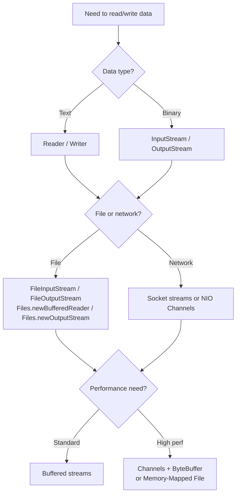
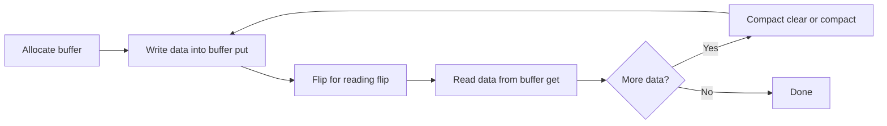

# I/O, NIO, and Serialization

> [!summary] Goal
> Read and write data safely in Java: choose the right I/O abstraction for the job, understand Java serialization's pitfalls and security model, and know when to reach for modern alternatives like JSON or Protocol Buffers.

## Table of Contents

1. [Why I/O Model Matters](#why-i-o-model-matters)
2. [I/O Streams Hierarchy](#i-o-streams-hierarchy)
3. [Reading and Writing Text](#reading-and-writing-text)
4. [Reading and Writing Binary Data](#reading-and-writing-binary-data)
5. [File I/O with NIO.2](#file-i-o-with-nio-2)
6. [NIO Channels and Buffers](#nio-channels-and-buffers)
7. [Memory-Mapped Files](#memory-mapped-files)
8. [Java Serialization Protocol](#java-serialization-protocol)
9. [Serialization Internals](#serialization-internals)
10. [Serialization Security](#serialization-security)
11. [Modern Alternatives to Java Serialization](#modern-alternatives-to-java-serialization)
12. [I/O Best Practices](#i-o-best-practices)
13. [Pitfalls](#pitfalls)

---

## Why I/O Model Matters

I/O is where most applications spend their waiting time. The choice of I/O model affects:

- **Latency**: blocking I/O ties up a thread per operation
- **Throughput**: buffered vs unbuffered, synchronous vs asynchronous
- **Memory**: how much data sits in Java heap vs direct buffers
- **Complexity**: NIO's `Selector` model is more powerful but harder to get right



> [!tip] Definition
> **Blocking I/O**: the calling thread pauses until data is available. Simple but inefficient for many concurrent connections.
> **Non-blocking I/O**: the call returns immediately with whatever data is available (or none). The thread can poll or use a `Selector` to wait for multiple channels at once.
> **Synchronous I/O**: the application waits for the operation to complete before proceeding.
> **Asynchronous I/O**: the operation is submitted and a callback is invoked when it completes.

---

## I/O Streams Hierarchy

### Byte streams — for binary data

```
InputStream (abstract)
├── FileInputStream        — read bytes from a file
├── ByteArrayInputStream   — read bytes from an in-memory byte array
├── BufferedInputStream    — adds buffering (avoids one OS call per byte)
├── DataInputStream        — read primitives in a portable way
├── ObjectInputStream      — read Java objects (serialization)
├── FilterInputStream      — base for wrapping decorators
└── SequenceInputStream    — concatenate multiple streams

OutputStream (abstract)
├── FileOutputStream       — write bytes to a file
├── ByteArrayOutputStream  — write bytes to an in-memory byte array
├── BufferedOutputStream   — adds buffering
├── DataOutputStream       — write primitives in a portable way
├── ObjectOutputStream     — write Java objects (serialization)
└── FilterOutputStream     — base for wrapping decorators
```

### Character streams — for text data

```
Reader (abstract)
├── FileReader             — read characters from a file (uses default charset!)
├── InputStreamReader      — bridge from byte to char (specify charset!)
├── BufferedReader         — buffering + readLine()
├── StringReader           — read from a String
└── CharArrayReader

Writer (abstract)
├── FileWriter             — write characters to a file (uses default charset!)
├── OutputStreamWriter     — bridge from char to byte (specify charset!)
├── BufferedWriter         — buffering + newLine()
├── PrintWriter            — formatted text output
├── StringWriter           — write to a String (via StringBuffer)
└── CharArrayWriter
```

### The wrapping pattern

Streams use the Decorator pattern. Wrap a base stream with buffering and functionality:

```java
// Reading text from a file (correct charset)
try (BufferedReader reader = new BufferedReader(
        new InputStreamReader(
            new FileInputStream("data.txt"), StandardCharsets.UTF_8))) {
    String line;
    while ((line = reader.readLine()) != null) {
        process(line);
    }
}

// Writing binary data with buffering
try (BufferedOutputStream out = new BufferedOutputStream(
        new FileOutputStream("output.bin"))) {
    out.write(data);
}
```

> [!tip] **Always specify a charset** when bridging bytes to characters with `InputStreamReader`/`OutputStreamWriter`. Relying on the JVM's default charset (`Charset.defaultCharset()`) makes your code platform-dependent.

---

## Reading and Writing Text

### Modern approach (NIO.2 convenience methods)

```java
// Read entire file into a String (small files)
String content = Files.readString(Path.of("notes.txt"), StandardCharsets.UTF_8);

// Read all lines into a List
List<String> lines = Files.readAllLines(Path.of("data.csv"), StandardCharsets.UTF_8);

// Write a String to a file
Files.writeString(Path.of("output.txt"), "Hello, World!", StandardCharsets.UTF_8);

// Write lines to a file
Files.write(Path.of("lines.txt"), List.of("line1", "line2"), StandardCharsets.UTF_8);
```

### Streaming large text files (don't load into memory)

```java
try (Stream<String> lines = Files.lines(Path.of("huge.log"), StandardCharsets.UTF_8)) {
    lines.filter(l -> l.contains("ERROR"))
         .limit(100)
         .forEach(System.out::println);
}
// Stream is lazy — only one line in memory at a time
// Stream is backed by a BufferedReader; closing the stream closes the reader
```

### Classic buffered reader/writer

```java
try (BufferedReader reader = Files.newBufferedReader(
         Path.of("data.txt"), StandardCharsets.UTF_8);
     BufferedWriter writer = Files.newBufferedWriter(
         Path.of("output.txt"), StandardCharsets.UTF_8)) {

    String line;
    while ((line = reader.readLine()) != null) {
        writer.write(transform(line));
        writer.newLine();
    }
}
```

---

## Reading and Writing Binary Data

### `DataInputStream` / `DataOutputStream`

Read and write primitives portably (big-endian, IEEE 754 for floats):

```java
// Writing
try (DataOutputStream out = new DataOutputStream(
        new BufferedOutputStream(new FileOutputStream("data.bin")))) {
    out.writeInt(42);
    out.writeUTF("hello");      // modified UTF-8
    out.writeLong(System.currentTimeMillis());
    out.writeDouble(3.14);
}

// Reading (must read in exactly the same order)
try (DataInputStream in = new DataInputStream(
        new BufferedInputStream(new FileInputStream("data.bin")))) {
    int i = in.readInt();
    String s = in.readUTF();
    long t = in.readLong();
    double d = in.readDouble();
}
```

### ByteArray streams — in-memory I/O

Useful for testing, serialization to byte arrays, and stream transformations:

```java
// Write to byte array
var bos = new ByteArrayOutputStream();
try (var out = new ObjectOutputStream(bos)) {
    out.writeObject(someObject);
}
byte[] bytes = bos.toByteArray();

// Read from byte array
try (var in = new ObjectInputStream(new ByteArrayInputStream(bytes))) {
    SomeObject obj = (SomeObject) in.readObject();
}
```

---

## File I/O with NIO.2

The `java.nio.file` package (introduced in Java 7) provides a modern, platform-independent file system API.

### Core types

| Type | Purpose |
|------|---------|
| `Path` | Represents a file or directory path (replaces `java.io.File`) |
| `Files` | Static utility methods for file operations |
| `FileSystem` | Default or custom file system |
| `FileVisitor` | Walk file trees with control over recursion |
| `WatchService` | Monitor directory changes |
| `FileChannel` | Read/write/mmap operations on files |

### `Path` vs old `java.io.File`

| Feature | `java.io.File` | `java.nio.file.Path` |
|---------|---------------|----------------------|
| Symlink support | Limited | Full |
| Attribute access | Basic | Rich (permissions, owner, ACLs, creation time) |
| File system boundaries | Single FS | Multiple filesystems |
| Charset handling | None | Explicit |
| Error handling | Returns boolean | Throws exception |
| Immutable | No | Yes |

### Common `Files` operations

```java
Path source = Path.of("src", "main", "java", "App.java");
Path target = Path.of("backup", "App.java");

// Copy
Files.copy(source, target, StandardCopyOption.REPLACE_EXISTING);

// Move/rename
Files.move(source, target, StandardCopyOption.ATOMIC_MOVE);

// Delete
Files.deleteIfExists(target);

// Create directories (including parents)
Files.createDirectories(Path.of("a/b/c"));

// File attributes
boolean exists = Files.exists(path);
boolean isDir = Files.isDirectory(path);
long size = Files.size(path);
FileTime lastModified = Files.getLastModifiedTime(path);

// List directory contents (lazy Stream)
try (Stream<Path> entries = Files.list(Path.of("."))) {
    entries.filter(Files::isRegularFile).forEach(System.out::println);
}
```

### Walking a file tree

```java
Path start = Path.of("src");
Files.walkFileTree(start, new SimpleFileVisitor<>() {
    @Override
    public FileVisitResult visitFile(Path file, BasicFileAttributes attrs) {
        if (file.toString().endsWith(".java")) {
            System.out.println(file);
        }
        return FileVisitResult.CONTINUE;
    }
});

// Simpler: Files.walk returns a lazy Stream
try (Stream<Path> allFiles = Files.walk(start)) {
    allFiles.filter(p -> p.toString().endsWith(".java"))
            .forEach(System.out::println);
}
```

### Watching a directory for changes

```java
WatchService watcher = FileSystems.getDefault().newWatchService();
Path dir = Path.of("/var/log");
dir.register(watcher, ENTRY_CREATE, ENTRY_MODIFY, ENTRY_DELETE);

while (true) {
    WatchKey key = watcher.take();  // blocks
    for (WatchEvent<?> event : key.pollEvents()) {
        System.out.printf("%s: %s%n", event.kind(), event.context());
    }
    if (!key.reset()) break;
}
```

---

## NIO Channels and Buffers

### Channels vs Streams

| Aspect | Stream (`InputStream`/`OutputStream`) | Channel (`ReadableByteChannel`/`WritableByteChannel`) |
|--------|---------------------------------------|------------------------------------------------------|
| Direction | InputStream reads, OutputStream writes | One channel can do both (if `ByteChannel`) |
| Data access | Byte by byte or byte array | Through `ByteBuffer` |
| Scatter/gather | No | Yes (multiple buffers) |
| Non-blocking | No | Yes (with `SelectableChannel`) |
| Memory-mapped | No | Yes (`FileChannel.map`) |
| Transfer between channels | No | Yes (`transferTo`/`transferFrom`) |

### `ByteBuffer` lifecycle



```java
// Allocate a buffer
ByteBuffer buf = ByteBuffer.allocate(1024);        // heap buffer
ByteBuffer direct = ByteBuffer.allocateDirect(1024); // off-heap (faster I/O)

buf.putInt(42);
buf.putLong(System.currentTimeMillis());
buf.put("hello".getBytes(StandardCharsets.UTF_8));

buf.flip();  // switch from write mode to read mode

int i = buf.getInt();
long t = buf.getLong();
byte[] bytes = new byte[buf.remaining()];
buf.get(bytes);

buf.clear(); // reset for writing again
```

> [!tip] Definition
> **Direct buffer**: memory allocated outside the Java heap. I/O operations on direct buffers avoid copying between native memory and heap. Allocation cost is higher, so reuse them.
> **Heap buffer**: backed by a `byte[]` on the Java heap. JNI I/O may require an intermediate copy to native memory.

### FileChannel — high-performance file I/O

```java
try (FileChannel channel = FileChannel.open(
         Path.of("large.bin"), StandardOpenOption.READ)) {

    ByteBuffer buf = ByteBuffer.allocateDirect(8192);
    while (channel.read(buf) != -1) {
        buf.flip();
        while (buf.hasRemaining()) {
            process(buf.get());
        }
        buf.clear();
    }
}
```

### Transfer between channels (zero-copy)

```java
try (FileChannel source = FileChannel.open(Path.of("src.bin"), StandardOpenOption.READ);
     FileChannel target = FileChannel.open(Path.of("dst.bin"),
             StandardOpenOption.CREATE, StandardOpenOption.WRITE)) {

    long transferred = source.transferTo(0, source.size(), target);
    // or
    // long transferred = target.transferFrom(source, 0, source.size());
}
```

`transferTo`/`transferFrom` can be optimized by the OS to avoid copying through userspace entirely (sendfile on Linux).

### Non-blocking I/O with `Selector`

```mermaid
flowchart TD
    A[ServerSocketChannel.open] --> B[Configure non-blocking]
    B --> C[Register with Selector<br>OP_ACCEPT]
    C --> D[Selector.select]
    D --> E{Event?}
    E -->|OP_ACCEPT| F[Accept connection]
    F --> G[Register new SocketChannel<br>OP_READ|OP_WRITE]
    G --> D
    E -->|OP_READ| H[Read from channel]
    H --> D
    E -->|OP_WRITE| I[Write to channel]
    I --> D
```

```java
Selector selector = Selector.open();
ServerSocketChannel server = ServerSocketChannel.open();
server.bind(new InetSocketAddress(8080));
server.configureBlocking(false);
server.register(selector, SelectionKey.OP_ACCEPT);

while (true) {
    selector.select();  // blocks until at least one channel is ready
    for (SelectionKey key : selector.selectedKeys()) {
        if (key.isAcceptable()) {
            SocketChannel client = server.accept();
            client.configureBlocking(false);
            client.register(selector, SelectionKey.OP_READ);
        } else if (key.isReadable()) {
            SocketChannel client = (SocketChannel) key.channel();
            ByteBuffer buf = ByteBuffer.allocate(1024);
            client.read(buf);
            // process
        }
        selector.selectedKeys().clear();
    }
}
```

> [!warning] NIO selector code is subtle. Common bugs: forgetting to clear `selectedKeys`, not handling partial reads/writes, and blocking the selector thread with non-I/O work. For most applications, use Netty or Vert.x instead of raw NIO.

---

## Memory-Mapped Files

Map a region of a file directly into virtual memory. The OS pages data in and out on demand.

```java
try (FileChannel channel = FileChannel.open(
         Path.of("large.bin"), StandardOpenOption.READ)) {

    MappedByteBuffer mapped = channel.map(
        FileChannel.MapMode.READ_ONLY, 0, channel.size());

    // Read directly from mapped memory
    while (mapped.hasRemaining()) {
        byte b = mapped.get();
    }
}
```

Advantages:
- no explicit read/write calls — treat the file as a byte array
- OS handles caching and paging
- extremely fast for sequential and random access to large files
- can share memory between processes (with `READ_WRITE` mode)

Caveats:
- mapping size limited by virtual address space (but typically up to several TB)
- unmapping is not deterministic (wait for GC or use `Cleaner`)
- writes to a `READ_WRITE` mapped file are not guaranteed to be visible to other processes until `force()` is called

---

## Java Serialization Protocol

### What Java serialization is

Java's built-in serialization converts an object graph into a byte stream and back. It uses reflection and a wire protocol specific to the JVM.

**When (not) to use it:**

| Use Java serialization | Avoid it |
|------------------------|----------|
| RMI (Remote Method Invocation) | Inter-service communication |
| Distributed caching (in-process) | HTTP APIs / REST |
| Deep clone (convenience, not performance) | Persistent storage (schema evolution is hard) |
| Spark closures (must be serializable) | Cross-language communication |

### Making a class serializable

```java
import java.io.Serializable;

public class User implements Serializable {
    private static final long serialVersionUID = 1L;

    private long id;
    private String name;
    private transient String password;   // not serialized
    private Address address;             // must also be Serializable
}

public record Address(String street, String city) implements Serializable {}
```

### Writing and reading objects

```java
// Serialize to file
try (var out = new ObjectOutputStream(
        new BufferedOutputStream(new FileOutputStream("user.ser")))) {
    out.writeObject(user);
    out.writeObject(order);  // multiple objects in one stream
}

// Deserialize from file
try (var in = new ObjectInputStream(
        new BufferedInputStream(new FileInputStream("user.ser")))) {
    User user = (User) in.readObject();
    Order order = (Order) in.readObject();  // read in same order
}
```

---

## Serialization Internals

### The wire format

Java serialization writes:
1. **Magic bytes** (`0xAC ED 0x00 05`)
2. **Class descriptor** — fully qualified class name, `serialVersionUID`, field count and names
3. **Object data** — field values in canonical order, reference handles for shared objects
4. **Null markers**, array lengths, string data

### `serialVersionUID`

Every serializable class has an ID that must match between serialization and deserialization:

```java
private static final long serialVersionUID = 1L;
```

- If not declared, the JVM computes one from class details (fields, methods, interfaces)
- Computed UIDs change when the class structure changes → `InvalidClassException` on deserialization
- **Always declare `serialVersionUID` explicitly** to control versioning

### The `transient` keyword

Fields marked `transient` are skipped during serialization:

```java
private transient String password;       // not serialized
private transient Logger log;            // not serializable anyway
private transient AtomicInteger counter; // state that should be rebuilt
```

On deserialization, `transient` fields are set to their default values (`null`, `0`, `false`).

### Custom serialization hooks

```java
public class SensitiveData implements Serializable {
    private static final long serialVersionUID = 1L;

    private String encryptedPayload;

    @Serial
    private void writeObject(ObjectOutputStream out) throws IOException {
        out.defaultWriteObject();         // serialize normal fields
        out.writeObject(encrypt(encryptedPayload)); // custom logic
    }

    @Serial
    private void readObject(ObjectInputStream in) throws IOException, ClassNotFoundException {
        in.defaultReadObject();          // deserialize normal fields
        this.encryptedPayload = decrypt((String) in.readObject());
    }

    @Serial
    private void readObjectNoData() throws ObjectStreamException {
        // Called if no serialization data exists for this class
        this.encryptedPayload = "";
    }

    @Serial
    private Object readResolve() throws ObjectStreamException {
        // Replace the deserialized object (used for singletons)
        return INSTANCE;
    }

    @Serial
    private Object writeReplace() throws ObjectStreamException {
        // Replace the object being serialized
        return this;
    }
}
```

### `Externalizable` — full control

```java
public class User implements Externalizable {
    private long id;
    private String name;

    public User() {}  // must have public no-arg constructor

    @Override
    public void writeExternal(ObjectOutput out) throws IOException {
        out.writeLong(id);
        out.writeUTF(name);
    }

    @Override
    public void readExternal(ObjectInput in) throws IOException, ClassNotFoundException {
        this.id = in.readLong();
        this.name = in.readUTF();
    }
}
```

`Externalizable` is faster than `Serializable` (no reflection for field enumeration) but requires manual field management.

### Inheritance and serialization

- If a superclass implements `Serializable`, all subclasses are serializable
- If a superclass does **not** implement `Serializable`:
  - its fields are not serialized
  - it must have a no-arg constructor (called during deserialization)
  - `InvalidClassException` is thrown if the no-arg constructor is missing

---

## Serialization Security

### The deserialization vulnerability

Java deserialization is a major security risk. The `readObject()` method can instantiate arbitrary classes on the classpath and call their methods. Attackers craft malicious byte streams that trigger gadget chains — sequences of method calls that result in remote code execution.

```java
// This is dangerous if the stream is from an untrusted source
ObjectInputStream in = new ObjectInputStream(
    new ByteArrayInputStream(untrustedBytes));
Object obj = in.readObject();  // could execute arbitrary code
```

### `ObjectInputFilter` (Java 9+)

Filter classes allowed during deserialization:

```java
// Allowlist approach — deny by default, allow specific classes
ObjectInputStream in = new ObjectInputStream(inputStream);
in.setObjectInputFilter(info -> {
    if (info.serialClass() == null) return Status.UNDECIDED; // end of stream
    if (info.serialClass().getName().startsWith("com.myapp.")) {
        return Status.ALLOWED;
    }
    if (info.serialClass().getName().startsWith("java.")) {
        return Status.ALLOWED;
    }
    return Status.REJECTED;  // reject everything else
});
```

### Global filter (JVM-wide)

```java
// Set via system property:
// -Djdk.serialFilter=com.myapp.**;java.base.**;!**

// Or programmatically via JVM-wide filter
ObjectInputFilter.Config.setSerialFilter(info -> {
    // same logic
});
```

### Security rules

1. **Never deserialize untrusted data** with default `ObjectInputStream`
2. Always use `ObjectInputFilter` (allowlist, not denylist)
3. Prefer structured data formats (JSON, Protobuf) over Java serialization at trust boundaries
4. Keep dependencies updated (many gadget chain targets are in common libraries)

---

## Modern Alternatives to Java Serialization

| Format | Schema? | Language-agnostic? | Performance | Best for |
|--------|---------|-------------------|-------------|----------|
| Java Serialization | Implicit (class def) | No | Slow | Legacy RMI / in-process |
| JSON (Jackson) | Optional | Yes | Fast | REST APIs, config files, web |
| Protocol Buffers | Required (`.proto`) | Yes | Very fast | Inter-service RPC, streaming |
| Avro | Required (`.avsc`) | Yes | Very fast | Kafka, big data, schema evolution |
| YAML | Implicit | Yes | Slow | Configuration files |

### Jackson (JSON) — the modern default for most applications

```java
// Serialize
ObjectMapper mapper = new ObjectMapper();
mapper.findAndRegisterModules();  // for Java 8+ types (Optional, Instant, etc.)

String json = mapper.writeValueAsString(user);

// Deserialize
User user = mapper.readValue(json, User.class);

// Collection types
List<User> users = mapper.readValue(
    jsonArray,
    mapper.getTypeFactory().constructCollectionType(List.class, User.class)
);
```

### Protocol Buffers — fast and compact

```java
// Generated from: message User { int64 id = 1; string name = 2; }
UserProto.User user = UserProto.User.newBuilder()
    .setId(42)
    .setName("Alice")
    .build();

byte[] bytes = user.toByteArray();
UserProto.User parsed = UserProto.User.parseFrom(bytes);
```

---

## I/O Best Practices

### Always buffer

```java
// BAD — one OS call per byte
InputStream in = new FileInputStream("file.bin");
int b;
while ((b = in.read()) != -1) { /* ... */ }

// GOOD — buffered
InputStream in = new BufferedInputStream(new FileInputStream("file.bin"));
```

### Always specify charset

```java
// BAD — platform-dependent
InputStreamReader reader = new InputStreamReader(in);

// GOOD — explicit
InputStreamReader reader = new InputStreamReader(in, StandardCharsets.UTF_8);
```

### Close in reverse order of opening

Actually, `try-with-resources` handles this automatically — resources are closed in the reverse order of their declaration.

```java
try (ObjectOutputStream out = new ObjectOutputStream(
        new BufferedOutputStream(new FileOutputStream("data.ser")))) {
    // FileOutputStream → BufferedOutputStream → ObjectOutputStream
    // Close order: ObjectOutputStream → BufferedOutputStream → FileOutputStream
}
```

### Use NIO.2 for new code

`java.io.File` is effectively legacy. Use `Path` and `Files` for all new development.

---

## Pitfalls

### Not closing streams

```java
// LEAKED: file descriptor is never closed
InputStream in = new FileInputStream("file.bin");
int data = in.read();
```

**Fix**: `try-with-resources` on every stream.

### Forgetting `serialVersionUID`

```java
public class User implements Serializable {
    // no serialVersionUID declared
    private String name;
}
// After adding an 'email' field, deserializing old data throws InvalidClassException
```

**Fix**: Always declare `private static final long serialVersionUID = 1L;`.

### Deserializing untrusted data

The most common source of RCE vulnerabilities in Java applications.

**Fix**: Use `ObjectInputFilter`, avoid Java serialization at trust boundaries, prefer JSON or Protobuf.

### Platform-dependent charset

```java
new FileReader("data.txt");         // BAD — uses platform default charset
new FileWriter("output.txt");       // BAD — uses platform default charset
```

**Fix**: Use `Files.newBufferedReader(path, charset)` or specify charset explicitly.

### Reading the whole file into memory unnecessarily

```java
byte[] all = Files.readAllBytes(Path.of("huge.bin"));  // OOM if large
```

**Fix**: Stream the file with `BufferedInputStream` or `Files.lines()`.

### Ignoring `transient` in serializable classes

Non-transient fields must be serializable themselves. An `OutputStream` or `Thread` field in a `Serializable` class will throw `NotSerializableException`.

**Fix**: Mark non-serializable fields as `transient`.

### NIO buffer state management

Forgetting `flip()` between write and read modes is the most common NIO bug.

```java
ByteBuffer buf = ByteBuffer.allocate(1024);
channel.read(buf);           // position advances
// buf.flip() is needed here
channel.write(buf);          // writes from current position → wrong!
```

**Fix**: `flip()` before reading, `compact()` or `clear()` after reading.

---

> [!question]- Interview Questions
>
> **Q: What is the difference between `InputStream` and `Reader`?**
> A: `InputStream` reads bytes; `Reader` reads characters. Convert bytes to characters using `InputStreamReader` with a specific charset.
>
> **Q: How does Java serialization work? Can you control which fields are serialized?**
> A: Java serialization converts an object graph to bytes using reflection. Use `transient` to exclude fields, or implement `writeObject`/`readObject` for custom logic. Always declare `serialVersionUID`.
>
> **Q: What is the security concern with Java serialization?**
> A: Deserializing untrusted data can trigger arbitrary code execution via gadget chains. Use `ObjectInputFilter` (Java 9+) to whitelist allowed classes and prefer structured data formats (JSON, Protobuf) at trust boundaries.
>
> **Q: What is the difference between a direct `ByteBuffer` and a heap `ByteBuffer`?**
> A: Direct buffers allocate memory outside the Java heap, avoiding copy during native I/O operations. They are faster for I/O but slower to allocate. Heap buffers are backed by `byte[]` and may require an extra copy during I/O.
>
> **Q: When would you use memory-mapped files?**
> A: For very large files where random access performance matters, for sharing memory between processes, or when the OS's paging behavior is more efficient than manual read/write. Common in databases and search indexes.

---

## Cross-Links

- [[Java/01_Foundations/01_Java_Basics_and_Idioms]] for charset awareness and object model
- [[Java/01_Foundations/03_Exceptions_and_Resource_Management]] for try-with-resources patterns
- [[Java/02_Core/02_JVM_Memory_and_GC_Basics]] for direct buffer memory and OOM scenarios
- [[Java/02_Core/04_Database_Access_JDBC]] for JDBC result set streaming patterns
- [[Java/03_Advanced/03_JVM_Tooling_JFR_JStack_JMap]] for diagnosing byte[] retention in heap histograms
- [[Java/04_Playbooks/01_Diagnose_High_CPU_or_Latency]] for diagnosing CPU-heavy serialization in production
- [[Java/04_Playbooks/02_Diagnose_OOM_and_Memory_Leaks]] for buffer-related native memory issues

---

## References

- [Java I/O Streams (Oracle)](https://docs.oracle.com/javase/tutorial/essential/io/streams.html)
- [NIO.2 File I/O (Oracle)](https://docs.oracle.com/javase/tutorial/essential/io/fileio.html)
- [Java Object Serialization Specification](https://docs.oracle.com/javase/8/docs/platform/serialization/spec/serialTOC.html)
- [ByteBuffer API](https://docs.oracle.com/en/java/javase/17/docs/api/java.base/java/nio/ByteBuffer.html)
- [OWASP Deserialization Cheat Sheet](https://cheatsheetseries.owasp.org/cheatsheets/Deserialization_Cheat_Sheet.html)
- [Jackson Project](https://github.com/FasterXML/jackson)
- [Protocol Buffers Java Tutorial](https://protobuf.dev/getting-started/javatutorial/)
