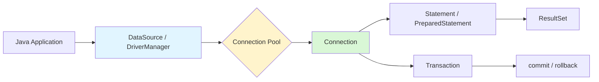
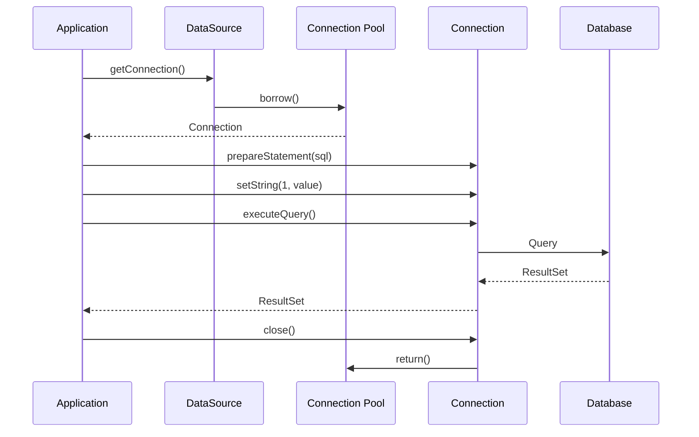
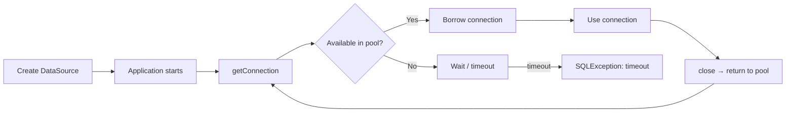

# Database Access: JDBC

> [!summary] Goal
> Talk to relational databases from Java: manage connections, execute queries safely, tune for throughput, and design data-access layers that scale. Understand JDBC as the foundation beneath every Java database library (JPA, MyBatis, jOOQ, Spring Data).

## Table of Contents

1. [Why JDBC Still Matters](#why-jdbc-still-matters)
2. [JDBC Architecture](#jdbc-architecture)
3. [Core API Interfaces](#core-api-interfaces)
4. [Connection Management](#connection-management)
5. [Connection Pooling](#connection-pooling)
6. [Query Execution](#query-execution)
7. [Transactions and Isolation](#transactions-and-isolation)
8. [ResultSet Patterns](#resultset-patterns)
9. [Batch Operations](#batch-operations)
10. [Exception Handling and Best Practices](#exception-handling-and-best-practices)
11. [Common Production Scenarios](#common-production-scenarios)
12. [Pitfalls](#pitfalls)

---

## Why JDBC Still Matters

JDBC (Java Database Connectivity) is the lowest-level standard API for database access in Java. Every higher-level abstraction — JPA, Hibernate, MyBatis, jOOQ, Spring Data, Flyway — ultimately translates to JDBC calls.

Knowing JDBC well means you can:
- debug connection leaks and pool exhaustion in any framework
- tune batch size, fetch size, and isolation levels directly
- understand what Hibernate logs actually mean
- write efficient data access when an ORM is overkill

> [!tip] Definition
> **JDBC** is not a library or a driver. It is a specification (`java.sql` + `javax.sql` packages) that database vendors implement. You write code against the JDBC interfaces; the driver provides the implementation for your specific database (PostgreSQL, MySQL, Oracle, etc.).

---

## JDBC Architecture



### How a query flows through JDBC



---

## Core API Interfaces

### `DriverManager`

The original connection factory. Rarely used directly in production — exists mostly for legacy code and testing.

```java
Connection conn = DriverManager.getConnection(
    "jdbc:postgresql://localhost:5432/mydb",
    "user", "password"
);
```

Problems with `DriverManager`:
- no connection pooling
- credentials in code
- no configurable timeouts

> [!tip] Prefer `DataSource` over `DriverManager` in any real application.

### `DataSource`

The production standard. Returns `Connection` objects, usually from an internal pool.

```java
// HikariCP example — the pool is embedded in the DataSource
HikariConfig config = new HikariConfig();
config.setJdbcUrl("jdbc:postgresql://localhost:5432/mydb");
config.setUsername("user");
config.setPassword("password");
config.setMaximumPoolSize(10);

DataSource ds = new HikariDataSource(config);

try (Connection conn = ds.getConnection()) {
    // work with conn
}
```

### `Connection`

Represents a single database session. Responsible for:
- creating statements
- managing transactions
- providing metadata

Key methods:

| Method | Purpose |
|--------|---------|
| `createStatement()` | Simple SQL, no params |
| `prepareStatement(sql)` | Precompiled SQL with `?` params |
| `prepareCall(sql)` | Stored procedure calls |
| `setAutoCommit(boolean)` | Transaction boundary control |
| `commit()` / `rollback()` | End transaction |
| `close()` | Return to pool (always use try-with-resources) |
| `isValid(timeout)` | Check if connection is still alive |
| `getMetaData()` | Database info, table schemas |

### `Statement` vs `PreparedStatement`

| Aspect | `Statement` | `PreparedStatement` |
|--------|-------------|---------------------|
| SQL injection | Vulnerable | Safe (parameterized) |
| Parse once | No (unless DB caches identical SQL) | Yes (DB can cache plan) |
| Binary params | String concatenation needed | Native type support |
| Readability | Messy with inline values | Clean with `?` placeholders |
| Batch support | Limited | `addBatch()` / `executeBatch()` |

**Always use `PreparedStatement` for any query with user-supplied or variable data.**

```java
// BAD — SQL injection risk
Statement stmt = conn.createStatement();
ResultSet rs = stmt.executeQuery(
    "SELECT * FROM users WHERE email = '" + email + "'"
);

// GOOD — parameterized
PreparedStatement ps = conn.prepareStatement(
    "SELECT * FROM users WHERE email = ?"
);
ps.setString(1, email);
ResultSet rs = ps.executeQuery();
```

### `ResultSet`

A cursor over query results. Provides typed accessors:

```java
try (PreparedStatement ps = conn.prepareStatement(
         "SELECT id, name, email, created_at FROM users WHERE active = ?");
     ResultSet rs = ps.executeQuery()) {

    while (rs.next()) {
        long id = rs.getLong("id");
        String name = rs.getString("name");
        String email = rs.getString("email");
        Instant createdAt = rs.getTimestamp("created_at").toInstant();
        // map to object or process directly
    }
}
```

Key accessor methods: `getString`, `getInt`, `getLong`, `getDouble`, `getBoolean`, `getDate`, `getTimestamp`, `getObject`.

> [!question] **Q: When should you close a `ResultSet`?**
> A: As soon as you are done reading. `try-with-resources` on the `PreparedStatement` typically closes the associated `ResultSet` automatically. But if you hold the `ResultSet` open while doing slow processing, you tie up the connection.

### `SQLException`

Checked exception that can wrap multiple database errors. Use `getNextException()` to walk the chain. Always includes vendor-specific error code and SQLState.

```java
try (Connection conn = ds.getConnection()) {
    // db work
} catch (SQLException e) {
    log.error("SQL error: {} [state={}, code={}]",
        e.getMessage(), e.getSQLState(), e.getErrorCode());
    SQLException next = e.getNextException();
    while (next != null) {
        log.error("  chained: {}", next.getMessage());
        next = next.getNextException();
    }
}
```

---

## Connection Management

### Lifecycle



### The golden rule: always close connections

```java
// CORRECT: try-with-resources closes automatically
try (Connection conn = ds.getConnection();
     PreparedStatement ps = conn.prepareStatement(sql)) {
    // work
}
// conn and ps are closed, even if an exception is thrown

// WRONG: connection leak
Connection conn = ds.getConnection();
PreparedStatement ps = conn.prepareStatement(sql);
ResultSet rs = ps.executeQuery();
// if any line above throws, conn is never closed
```

Never keep a connection open longer than necessary. Holding connections across user think-time or external HTTP calls exhausts the pool quickly.

---

## Connection Pooling

### Why pooling is mandatory

Opening a database connection is expensive (TCP handshake, SSL negotiation, authentication, schema metadata load). A pool keeps a set of ready-to-use connections alive.

### HikariCP — the modern default

HikariCP is the default connection pool in Spring Boot. It is fast, lightweight, and reliable.

**Basic configuration:**

```java
HikariConfig config = new HikariConfig();
config.setJdbcUrl("jdbc:postgresql://localhost:5432/mydb");
config.setUsername("user");
config.setPassword("password");
config.setMaximumPoolSize(10);           // max connections in pool
config.setMinimumIdle(5);                // keep at least 5 idle
config.setConnectionTimeout(5000);       // wait 5s before timing out
config.setIdleTimeout(300000);           // 5 min idle before eviction
config.setMaxLifetime(1800000);          // 30 min max lifetime
config.setLeakDetectionThreshold(60000); // log warning if conn held > 60s

HikariDataSource ds = new HikariDataSource(config);
```

### Pool sizing math

The common formula for maximum pool size:

```
maxPoolSize = T × (C - 1)
```

Where `T` = number of threads and `C` = average number of concurrent DB calls per thread.

For a typical 8-core app server with 200 request threads and 1 DB call per request:

```
maxPoolSize = 200 × (1 - 1) ... wait, this formula is misleading.
```

The real guideline is simpler:

> [!tip] **Pool size rule of thumb**
> Start with `maxPoolSize = 10` for most applications. The database handles work best when concurrent connections are bounded. PostgreSQL, for example, dedicates one backend process per connection — too many connections cause context-switching thrash. 10–30 connections often *outperform* 100+ connections.

**What consumes a connection:**
- active query execution
- transaction open (with locks held)
- idle-but-not-returned (connection leak)

### Connection pool metrics to watch

| Metric | What it tells you |
|--------|-------------------|
| Active connections | Current load on the database |
| Idle connections | Headroom |
| Pending acquires | Threads waiting for a connection (pool is too small) |
| Timeout rate | Pool exhaustion |
| Connection creation rate | Connections being recycled too often (maxLifetime too short) |
| Leak detection warnings | Connections not being returned |

> [!question] **Q: What does connection pool exhaustion look like in production?**
> A: Thread dumps show many threads blocked in `HikariPool.getConnection()` or `pool-1-thread-*` waiting on `Semaphore`. Application logs show `Connection is not available, request timed out after 5000ms`. Response latency spikes as queued requests pile up.

---

## Query Execution

### PreparedStatement in detail

```java
String sql = "INSERT INTO orders (user_id, total_cents, status) VALUES (?, ?, ?)";

try (PreparedStatement ps = conn.prepareStatement(sql)) {
    ps.setLong(1, userId);
    ps.setLong(2, totalCents);
    ps.setString(3, "PENDING");
    ps.executeUpdate();   // for INSERT/UPDATE/DELETE
}
```

**Never concatenate values into SQL strings.** `PreparedStatement` provides:
- SQL injection prevention (values are sent separately from the SQL)
- Type safety (`.setLong`, `.setTimestamp`, etc.)
- Query plan caching (database can reuse the execution plan for different parameter values)

### Fetch size — controlling how many rows come back

By default, some JDBC drivers load the entire `ResultSet` into memory. For large results, set `fetchSize` to stream rows:

```java
PreparedStatement ps = conn.prepareStatement("SELECT * FROM audit_logs");
ps.setFetchSize(1000);   // fetch 1000 rows at a time
ResultSet rs = ps.executeQuery();
// rows are now fetched in batches of 1000
```

Without `setFetchSize`, PostgreSQL's driver buffers the entire result. For queries returning millions of rows, this causes OOM.

> [!tip] Definition
> **Fetch size**: the number of rows transferred from the database to the client in one network round trip. Smaller values reduce memory per query but increase network round trips.

### Query timeout

Always set a statement timeout to prevent a runaway query from taking down the application:

```java
ps.setQueryTimeout(30);   // seconds
```

The database will cancel the query after 30 seconds. This is different from `connectionTimeout` (how long to wait for a connection from the pool).

---

## Transactions and Isolation

### Transaction boundaries

JDBC defaults to `autoCommit = true` — every statement is its own transaction.

```java
conn.setAutoCommit(false);
try {
    // multiple statements in one transaction
    ps1.executeUpdate();
    ps2.executeUpdate();
    conn.commit();
} catch (SQLException e) {
    conn.rollback();
    throw e;
} finally {
    conn.setAutoCommit(true);  // reset for next use
}
```

**Keep transactions short.** Holding a transaction open means:
- database locks are retained
- connection cannot be reused
- MVCC overhead accumulates

### Isolation levels

JDBC exposes all standard SQL isolation levels via `Connection`:

| Level | Dirty Read | Non-Repeatable Read | Phantom Read | Use Case |
|-------|-----------|-------------------|--------------|----------|
| `READ_UNCOMMITTED` | Possible | Possible | Possible | Rarely used in practice |
| `READ_COMMITTED` | Safe | Possible | Possible | Default in PostgreSQL, Oracle, SQL Server |
| `REPEATABLE_READ` | Safe | Safe | Possible | Default in MySQL/InnoDB |
| `SERIALIZABLE` | Safe | Safe | Safe | High contention, strict consistency |

```java
conn.setTransactionIsolation(Connection.TRANSACTION_REPEATABLE_READ);
```

> [!question] **Q: Should you always use SERIALIZABLE?**
> A: No. SERIALIZABLE has the highest performance cost (more lock contention, more serialization failures/retries). Use the weakest level that guarantees correctness for your specific operation. `READ_COMMITTED` is correct for the majority of applications.

### Savepoints

Partial rollback within a transaction:

```java
conn.setAutoCommit(false);
Savepoint sp = conn.setSavepoint("afterInsert");
try {
    // more work
    conn.commit();
} catch (SQLException e) {
    conn.rollback(sp);  // roll back to savepoint, keep prior work
    conn.commit();
}
```

---

## ResultSet Patterns

### Row mapping

```java
public record User(long id, String name, String email, Instant createdAt) {}

List<User> users = new ArrayList<>();
String sql = "SELECT id, name, email, created_at FROM users WHERE active = ?";

try (PreparedStatement ps = conn.prepareStatement(sql)) {
    ps.setBoolean(1, true);
    try (ResultSet rs = ps.executeQuery()) {
        while (rs.next()) {
            users.add(new User(
                rs.getLong("id"),
                rs.getString("name"),
                rs.getString("email"),
                rs.getTimestamp("created_at").toInstant()
            ));
        }
    }
}
```

### Streaming vs buffering

| Pattern | Memory | When to use |
|---------|--------|-------------|
| Buffered (default, no fetchSize) | Entire result in memory | Small result sets (< 10K rows) |
| Streaming (setFetchSize > 0) | One page at a time | Large result sets (> 10K rows) |
| Cursor (DB-specific) | One row at a time | Very large results, batch processing |

Streaming requires careful connection management — the connection is busy until the `ResultSet` is fully consumed or closed.

### Zero-row optimization

Use `SELECT EXISTS (subquery)` for presence checks instead of loading a row:

```java
// GOOD
PreparedStatement ps = conn.prepareStatement(
    "SELECT EXISTS (SELECT 1 FROM users WHERE email = ?)"
);
ps.setString(1, email);
ResultSet rs = ps.executeQuery();
rs.next();
boolean exists = rs.getBoolean(1);

// BAD — loads unnecessary data
PreparedStatement ps = conn.prepareStatement(
    "SELECT * FROM users WHERE email = ?"
);
ResultSet rs = ps.executeQuery();
boolean exists = rs.next();  // also works but wastes bandwidth
```

---

## Batch Operations

Executing many statements one by one is slow due to network round trips. Use batching for bulk operations:

```java
String sql = "INSERT INTO audit_log (user_id, action, timestamp) VALUES (?, ?, ?)";
try (PreparedStatement ps = conn.prepareStatement(sql)) {
    for (AuditEvent event : events) {
        ps.setLong(1, event.userId());
        ps.setString(2, event.action());
        ps.setTimestamp(3, Timestamp.from(event.timestamp()));
        ps.addBatch();               // queue the statement

        if (batchCount % 1000 == 0) {
            ps.executeBatch();       // flush every 1000
        }
    }
    ps.executeBatch();               // flush remainder
}
```

Benefits:
- reduces network round trips from N to N/ batchSize
- database can optimize bulk writes
- use with `conn.setAutoCommit(false)` for best performance

Tradeoff: batching within a long transaction increases lock duration and rollback cost.

---

## Exception Handling and Best Practices

### Pattern: try-with-resources everywhere

```java
public List<User> findActiveUsers(DataSource ds) throws SQLException {
    String sql = "SELECT id, name, email, created_at FROM users WHERE active = ?";
    try (Connection conn = ds.getConnection();
         PreparedStatement ps = conn.prepareStatement(sql)) {
        ps.setBoolean(1, true);
        try (ResultSet rs = ps.executeQuery()) {
            List<User> results = new ArrayList<>();
            while (rs.next()) {
                results.add(mapUser(rs));
            }
            return results;
        }
    }
    // Connection, PreparedStatement, and ResultSet are closed automatically
}
```

### Pattern: retry on transient errors

```java
int retries = 3;
while (retries > 0) {
    try (Connection conn = ds.getConnection();
         PreparedStatement ps = conn.prepareStatement(sql)) {
        // execute
        return;
    } catch (SQLException e) {
        if (isTransient(e) && --retries > 0) {
            Thread.sleep(100);  // exponential backoff in real code
            continue;
        }
        throw e;
    }
}
```

### Pattern: DAO layer

```java
public class UserDao {
    private final DataSource ds;

    public UserDao(DataSource ds) { this.ds = ds; }

    public Optional<User> findById(long id) {
        String sql = "SELECT id, name, email FROM users WHERE id = ?";
        try (Connection conn = ds.getConnection();
             PreparedStatement ps = conn.prepareStatement(sql)) {
            ps.setLong(1, id);
            try (ResultSet rs = ps.executeQuery()) {
                if (rs.next()) {
                    return Optional.of(new User(
                        rs.getLong("id"),
                        rs.getString("name"),
                        rs.getString("email")
                    ));
                }
            }
        } catch (SQLException e) {
            throw new DataAccessException("Failed to find user " + id, e);
        }
        return Optional.empty();
    }
}
```

---

## Common Production Scenarios

### Connection leak

**Symptoms**: Pool gradually empties, requests start timing out, thread dumps show `Connection.close()` never called for some paths.

**Diagnosis**: Enable leak detection threshold:

```java
config.setLeakDetectionThreshold(60000);  // 60 seconds
```

HikariCP logs a stack trace showing where the connection was acquired if it is not closed within the threshold.

**Fix**: Ensure every `getConnection()` is paired with a `close()` in a `finally` block or via `try-with-resources`.

### Connection pool exhaustion

**Symptoms**: Latency spikes, `Connection is not available` errors, threads waiting on `HikariPool.getConnection()`.

**Causes**:
- connection leaks (most common)
- database is slow, each query takes longer → connections held longer → pool drains
- pool size is too small for peak load
- thread pool is too large (more concurrent request threads than connections)

**Diagnosis**: Check pool metrics, look for long-running queries on the database.

### Transaction too long

A transaction that holds locks across user interaction or external API calls will cause contention. DBAs see `idle in transaction` connections with open locks.

**Fix**: Keep transactions inside a service method, never across HTTP request boundaries.

### N+1 queries

N+1 is not a JDBC problem but a common ORM anti-pattern. In raw JDBC, the fix is a single JOIN:

```java
// WRONG: N+1 — one query for the order, then N queries for line items
for (Order order : orders) {
    PreparedStatement ps = conn.prepareStatement(
        "SELECT * FROM line_items WHERE order_id = ?"
    );
    // ...
}

// RIGHT: single query
PreparedStatement ps = conn.prepareStatement(
    "SELECT o.*, li.* FROM orders o JOIN line_items li ON o.id = li.order_id WHERE o.id = ANY(?)"
);
```

### Deadlock

**Symptoms**: Two or more transactions waiting on locks held by each other. Database eventually detects the cycle and kills one transaction (the "victim").

**Fix**: Enforce consistent lock ordering across all code paths.

---

## Pitfalls

### Never closing resources

```java
// LEAK — connection stays open
Connection conn = ds.getConnection();
Statement stmt = conn.createStatement();
ResultSet rs = stmt.executeQuery(sql);
// no close() calls
```

**Fix**: Always use `try-with-resources`, or close in `finally` blocks.

### Autocommit off without commit

```java
conn.setAutoCommit(false);
// do work...
// forget to call commit()
// connection is returned to pool with open transaction
```

The next user of this connection inherits the open transaction, causing unpredictable behavior. Always pair `setAutoCommit(false)` with `commit()`/`rollback()` in a `try-finally`.

### SQL injection via Statement

```java
// BAD
Statement stmt = conn.createStatement();
stmt.executeQuery("SELECT * FROM users WHERE name = '" + input + "'");
// input: "' OR '1'='1" → returns ALL users
```

**Fix**: Always use `PreparedStatement` with `?` placeholders.

### Connection vs statement timeout confusion

```java
config.setConnectionTimeout(5000);  // wait 5s for a connection from pool
ps.setQueryTimeout(30);             // cancel query after 30s
```

These are independent. A query can run for hours even if `connectionTimeout` is 5 seconds (the connection was obtained quickly, but the query itself is slow).

### Driver not on classpath

```
java.lang.ClassNotFoundException: org.postgresql.Driver
```

Or in Spring Boot:

```
Failed to configure a DataSource: 'url' attribute is not specified
```

**Fix**: Ensure the JDBC driver dependency is in `pom.xml` or `build.gradle`.

### Fetching too many rows

Without `setFetchSize`, the PostgreSQL JDBC driver loads the entire result set into memory. For queries returning hundreds of thousands of rows, this causes OOM.

**Fix**: Use `setFetchSize(1000)` for large result sets.

---

> [!question]- Interview Questions
>
> **Q: What is the difference between `Statement` and `PreparedStatement`?**
> A: `PreparedStatement` precompiles SQL, supports parameterized queries (prevents SQL injection), and allows batch execution. `Statement` concatenates values into SQL strings and is vulnerable to injection.
>
> **Q: What is connection pooling and why is it important?**
> A: Connection pooling reuses a set of pre-established database connections instead of creating a new connection for every request. It avoids the overhead of TCP handshake, SSL negotiation, and authentication on every database call.
>
> **Q: How do you detect a connection leak?**
> A: Enable leak detection threshold (e.g., `leakDetectionThreshold=60000` in HikariCP). The pool logs the stack trace of where the connection was acquired if it is not returned within the threshold. Monitor pool metrics (active vs idle connections over time).
>
> **Q: What isolation levels does JDBC support and when would you use each?**
> A: `READ_UNCOMMITTED` (rarely used), `READ_COMMITTED` (safe default), `REPEATABLE_READ` (avoid non-repeatable reads), `SERIALIZABLE` (strict consistency, highest cost). Choose the weakest level sufficient for correctness.
>
> **Q: What is the difference between `connectionTimeout` and `setQueryTimeout`?**
> A: `connectionTimeout` is how long to wait for a connection from the pool. `setQueryTimeout` is how long the database is allowed to execute a query before it is cancelled. Both are independent timeout controls.

---

## Cross-Links

- [[Java/01_Foundations/03_Exceptions_and_Resource_Management]] for try-with-resources patterns
- [[Java/02_Core/01_Concurrency_Threads_and_Executors]] for thread-pool sizing alongside connection-pool math
- [[Java/02_Core/03_IO_NIO_and_Serialization]] for file I/O patterns used with JDBC
- [[SpringBoot/03_Advanced/03_AutoConfiguration_Internals]] for how Spring Boot auto-configures DataSource
- [[SpringBoot/04_Playbooks/03_Debug_Transactions_and_Locks]] for debugging transaction issues in Spring
- [[SQL/02_Core/03_Isolation_Levels_and_Anomalies]] for isolation level semantics
- [[SQL/05_Projects/01_Build_a_Mini_DB_Lab_With_psql]] for hands-on SQL experimentation

---

## References

- [JDBC Specification](https://docs.oracle.com/javase/8/docs/technotes/guides/jdbc/)
- [HikariCP Configuration](https://github.com/brettwooldridge/HikariCP#configuration-knobs-baby)
- [PostgreSQL JDBC Driver Documentation](https://jdbc.postgresql.org/documentation/)
- [Java SQL Package](https://docs.oracle.com/en/java/javase/17/docs/api/java.sql/java/sql/package-summary.html)
- [Oracle JDBC Tutorial](https://docs.oracle.com/javase/tutorial/jdbc/)
