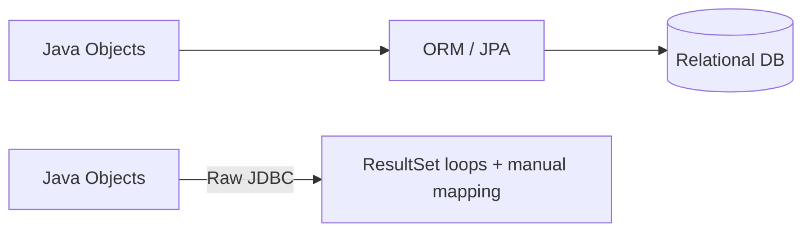
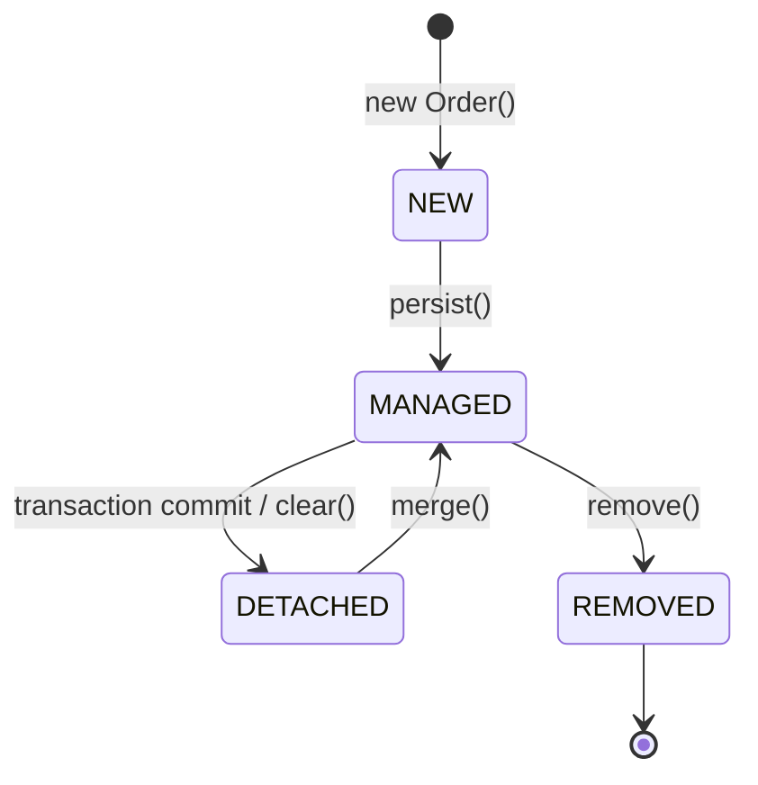
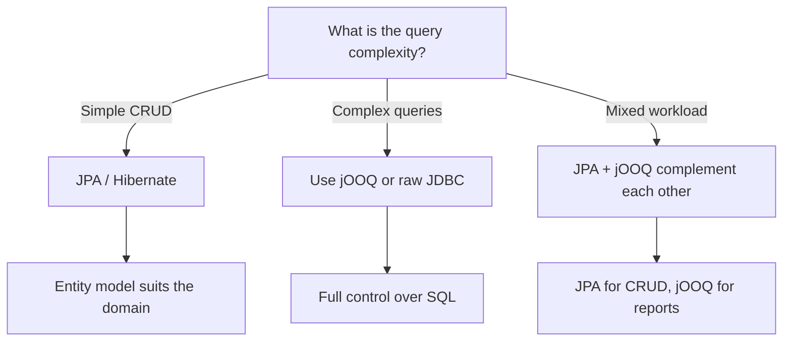

# Persistence Beyond JDBC: ORM and jOOQ

> [!summary] Goal
> Understand the trade-offs between JDBC, JPA/Hibernate, and jOOQ so you can choose the right persistence strategy for a given module.

## Table of Contents

1. [Why ORMs Exist](#why-orms-exist)
2. [JPA/Hibernate Core Concepts](#jpahibernate-core-concepts)
3. [Entity Mapping and the Persistence Context](#entity-mapping-and-the-persistence-context)
4. [Transactions and Lazy Loading](#transactions-and-lazy-loading)
5. [jOOQ and Type-Safe SQL](#jooq-and-type-safe-sql)
6. [Choosing Between JDBC, JPA, and jOOQ](#choosing-between-jdbc-jpa-and-jooq)
7. [Pitfalls](#pitfalls)
8. [Q&A](#qa)

---

## Why ORMs Exist



JDBC is flexible but verbose. Every query requires:
- Connection management
- `PreparedStatement` setup
- `ResultSet` iteration
- Manual object mapping
- Resource cleanup

ORMs automate the mapping layer. jOOQ gives you type-safe SQL without the full ORM overhead.

---

## JPA/Hibernate Core Concepts

### Entity

```java
@Entity
@Table(name = "orders")
public class Order {
    @Id
    @GeneratedValue(strategy = GenerationType.IDENTITY)
    private Long id;

    @Column(nullable = false)
    private String customerName;

    @OneToMany(mappedBy = "order", cascade = CascadeType.ALL)
    private List<OrderItem> items = new ArrayList<>();

    // Getters and setters (or @AccessType(AccessType.FIELD))
}
```

### Persistence Context

The persistence context is a first-level cache. During a transaction:
- Every entity is tracked (`managed` state).
- Changes are flushed automatically before commit.
- Repeated reads of the same row hit the cache, not the DB.



### Repository pattern (with JPA)

```java
@Repository
public class OrderRepository {
    @PersistenceContext
    private EntityManager em;

    public Order findById(Long id) {
        return em.find(Order.class, id);
    }

    public void save(Order order) {
        em.persist(order);
    }

    public List<Order> findByCustomer(String name) {
        return em.createQuery("SELECT o FROM Order o WHERE o.customerName = :name", Order.class)
                 .setParameter("name", name)
                 .getResultList();
    }
}
```

---

## Transactions and Lazy Loading

### Transaction boundaries

```java
try {
    em.getTransaction().begin();
    Order order = em.find(Order.class, 1L);
    order.setStatus("SHIPPED");         // auto-dirty-checked on flush
    em.getTransaction().commit();
} catch (Exception e) {
    em.getTransaction().rollback();
    throw e;
} finally {
    em.close();
}
```

### Lazy loading

```java
@OneToMany(mappedBy = "order", fetch = FetchType.LAZY)
private List<OrderItem> items;
```

Items are loaded only when `order.getItems()` is accessed — but only if the entity is still `managed`. Accessing lazy collections outside the transaction throws `LazyInitializationException`.

**Solutions:**
- Use `JOIN FETCH` in the query.
- Call `Hibernate.initialize()` while still in the transaction.
- Use a DTO projection instead of full entities.

---

## jOOQ and Type-Safe SQL

jOOQ generates Java classes from your database schema, giving you compile-time safety for SQL.

```java
// Generated by jOOQ codegen
dslContext.selectFrom(ORDERS)
          .where(ORDERS.CUSTOMER_NAME.eq("Rishav"))
          .and(ORDERS.STATUS.eq("PENDING"))
          .fetchInto(OrderRecord.class);
```

### When jOOQ shines

- Complex queries with window functions, CTEs, or recursive CTEs.
- You need full control over the SQL that is emitted.
- You want type safety without the persistence context overhead.

### Example: report query

```java
dslContext.select(
            ORDERS.CUSTOMER_NAME,
            count().as("order_count"),
            sum(ORDER_ITEMS.TOTAL).as("total_spent"))
          .from(ORDERS)
          .join(ORDER_ITEMS).on(ORDERS.ID.eq(ORDER_ITEMS.ORDER_ID))
          .groupBy(ORDERS.CUSTOMER_NAME)
          .having(count().gt(5))
          .fetch();
```

---

## Choosing Between JDBC, JPA, and jOOQ



| Aspect | JDBC | JPA/Hibernate | jOOQ |
|--------|------|---------------|------|
| SQL control | Full | Generated (may be surprising) | Full |
| Boilerplate | High | Low | Medium |
| Type safety | None | Partial (JPQL) | Full (generated classes) |
| Performance overhead | None | Persistence context, proxies | Minimal |
| Learning curve | Low | High (caching, proxies, states) | Medium (need schema → codegen) |

---

## Pitfalls

- **N+1 queries** — lazy loading in a loop. Fix with `JOIN FETCH`, entity graphs, or batch-size tuning.
- **Long transactions** — holding a transaction while processing external data bloats the persistence context and causes lock contention.
- **Open Session In View** — keeps the session open until the view renders, hiding lazy init issues at the cost of connection pool exhaustion.
- **`EAGER` everywhere** — every query becomes a multi-table join. Use `LAZY` by default and override with `JOIN FETCH`.
- **Relying on `merge` for detached entities** — `merge` issues a SELECT before the UPDATE. Use DTO updates or `EntityManager.update` (Hibernate 6+).
- **jOOQ code generation from dev DB** — schema drift breaks the build. Check in the generated code and regenerate only on schema changes.

---

## Q&A

> [!question]- Can I use JPA and jOOQ together?

Yes. Use JPA for CRUD operations (it models entities well) and jOOQ for complex queries, reports, or bulk operations. They can operate on the same `DataSource`.

> [!question]- When should I avoid Hibernate entirely?

When performance is critical and every SQL statement needs to be predictable (e.g., high-throughput financial systems). In those cases, raw JDBC or jOOQ gives you full control.

> [!question]- Why does my JPA query sometimes run much slower than the equivalent SQL?

Hibernate generates SQL without hints unless you add `@Index`, `@Fetch`, or entity graphs. Profile the generated SQL with logging (`hibernate.show_sql=true`) and examine the execution plan.

## References

- [JPA Specification](https://jcp.org/en/jsr/detail?id=338)
- [Hibernate Documentation](https://hibernate.org/orm/documentation/)
- [jOOQ Documentation](https://www.jooq.org/learn/)
- [[Java/02_Core/04_Database_Access_JDBC]]
