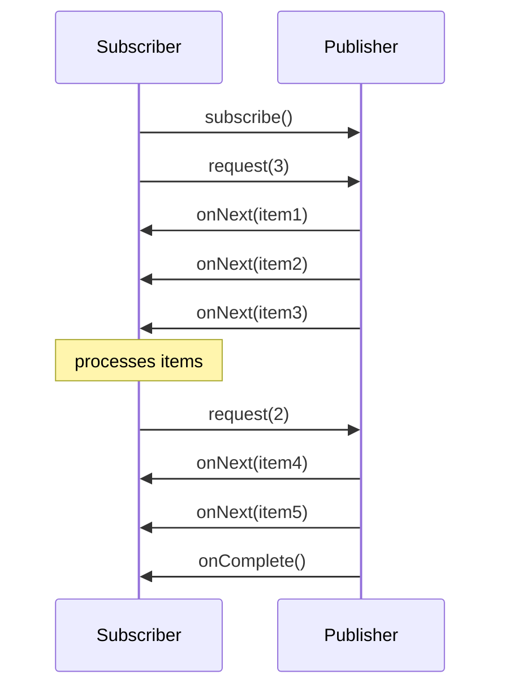
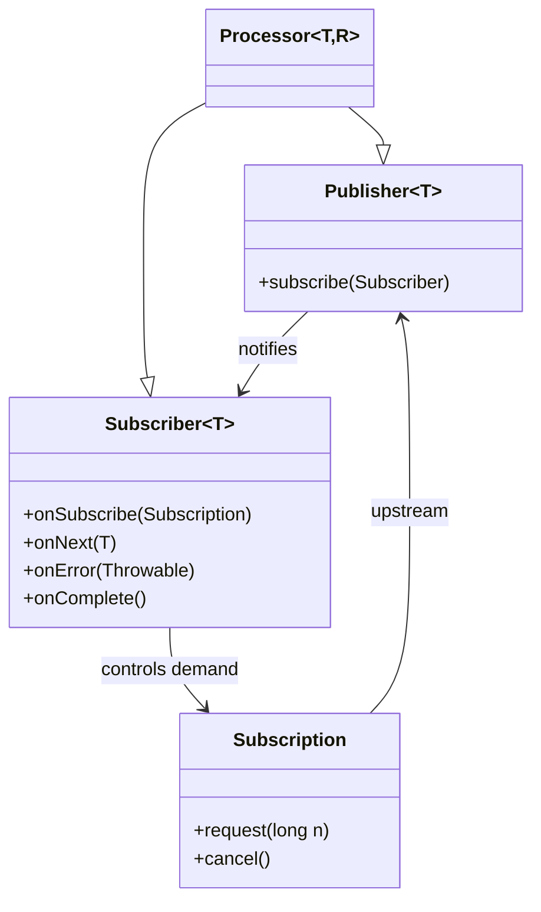
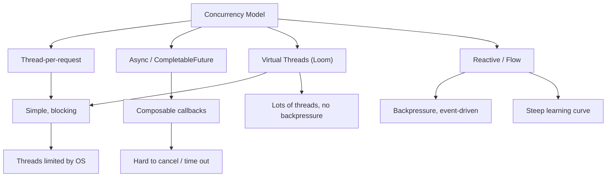

# Reactive and Flow API

> [!summary] Goal
> Understand the JDK's `java.util.concurrent.Flow` (Reactive Streams) model, how it relates to threads and Loom, and when to reach for it.

## Table of Contents

1. [What Reactive Streams Solve](#what-reactive-streams-solve)
2. [Flow API Types](#flow-api-types)
3. [Backpressure and Demand](#backpressure-and-demand)
4. [Simple Publisher and Subscriber Example](#simple-publisher-and-subscriber-example)
5. [Comparing Concurrency Models](#comparing-concurrency-models)
6. [Pitfalls](#pitfalls)
7. [Q&A](#qa)

---

## What Reactive Streams Solve

Traditional push-based models (like `Observable` without backpressure) drop messages or overflow memory when producer outruns consumer. Reactive Streams solve this with **demand-driven flow**: the subscriber controls how many items it can handle.



---

## Flow API Types

`java.util.concurrent.Flow` defines four interfaces:

| Interface | Role |
|-----------|------|
| `Publisher<T>` | Produces items for subscribers |
| `Subscriber<T>` | Receives items, signals demand |
| `Subscription` | Links publisher + subscriber; carries `request(n)` and `cancel()` |
| `Processor<T,R>` | Both subscriber and publisher (transform stage) |



---

## Backpressure and Demand

### Request semantics

- `request(1)` signals capacity for one more item.
- Request is **additive**: `request(1) + request(2)` = demand of 3.
- The publisher must never send more items than the cumulative requested count.
- If the subscriber never calls `request`, the publisher must not deliver.

### Implementations

- `SubmissionPublisher` — a JDK implementation of `Publisher` for simple use cases.
- Most production code uses **RxJava 3**, **Reactor (Project Reactor)**, or **Akka Streams** instead of bare `Flow`.

---

## Simple Publisher and Subscriber Example

```java
import java.util.concurrent.Flow.*;
import java.util.concurrent.SubmissionPublisher;

public class SimpleExample {
    public static void main(String[] args) throws InterruptedException {
        SubmissionPublisher<Integer> publisher = new SubmissionPublisher<>();

        Subscriber<Integer> subscriber = new Subscriber<>() {
            private Subscription sub;

            @Override
            public void onSubscribe(Subscription subscription) {
                this.sub = subscription;
                subscription.request(1); // start demand
            }

            @Override
            public void onNext(Integer item) {
                System.out.println("Received: " + item);
                sub.request(1); // request next item
            }

            @Override
            public void onError(Throwable throwable) {
                System.err.println("Error: " + throwable);
            }

            @Override
            public void onComplete() {
                System.out.println("Done");
            }
        };

        publisher.subscribe(subscriber);
        publisher.submit(1);
        publisher.submit(2);
        publisher.submit(3);
        publisher.close();

        Thread.sleep(100); // let async delivery complete
    }
}
```

### Processor example

```java
class DoublingProcessor extends SubmissionPublisher<Integer>
                       implements Processor<Integer, Integer> {
    private Subscription sub;

    @Override
    public void onSubscribe(Subscription subscription) {
        this.sub = subscription;
        subscription.request(Long.MAX_VALUE); // unbounded
    }

    @Override
    public void onNext(Integer item) {
        submit(item * 2);
    }

    @Override
    public void onError(Throwable throwable) {
        closeExceptionally(throwable);
    }

    @Override
    public void onComplete() {
        close();
    }
}
```

---

## Comparing Concurrency Models



| Aspect | Thread Pool | Virtual Threads | CompletableFuture | Reactive Flow |
|--------|-------------|-----------------|-------------------|---------------|
| Model | Blocking | Blocking | Async callbacks | Push/Pull stream |
| Backpressure | No (queue) | No | No | Yes |
| Concurrency limit | Pool size | Unlimited | Pool-bound | Flexible |
| Error handling | Try/catch | Try/catch | exceptionally | onError channel |
| Complexity | Low | Low | Medium | High |

---

## Pitfalls

- **Missing `request()` call** — the subscriber will never receive items. Always call `request` in `onSubscribe`.
- **Unbounded demand** (`request(Long.MAX_VALUE)`) — defeats backpressure. Use only when the consumer is fast enough.
- **Thread starvation** — `SubmissionPublisher` uses the common ForkJoinPool by default. Overload can starve other tasks.
- **Over-complicating simple tasks** — if you do not need backpressure, prefer virtual threads, `CompletableFuture`, or simple queues.
- **Mixing blocking operations in onNext** — `onNext` runs on the publisher's thread. Blocking here stalls the entire publisher.

---

## Q&A

> [!question]- Should I use Reactive Streams directly or a framework like Reactor?

Use bare `Flow` for learning or very simple cases. For production reactive pipelines, use Reactor or RxJava — they provide rich operators (map, flatMap, buffer, window, retry, etc.) that are absent from `Flow`.

> [!question]- When is backpressure critical?

When the producer can outpace the consumer by orders of magnitude — for example, reading a large file over a slow network, or processing messages from a high-throughput Kafka topic with a slow downstream.

> [!question]- Do virtual threads eliminate the need for Reactive Streams?

Virtual threads reduce the *threading* motivation for reactive (you can block without wasting OS threads), but they do not provide backpressure. If the producer is faster than the consumer and memory is finite, you still need Flow.

## References

- [Reactive Streams Specification](https://www.reactive-streams.org/)
- [Javadoc: `java.util.concurrent.Flow`](https://docs.oracle.com/en/java/javase/21/docs/api/java.base/java/util/concurrent/Flow.html)
- [Project Reactor](https://projectreactor.io/)
- [[Java/02_Core/01_Concurrency_Threads_and_Executors]]
- [[Java/03_Advanced/01_CompletableFuture_and_Structured_Concurrency]]
- [[Java/03_Advanced/06_Virtual_Threads_and_Structured_Concurrency]]
