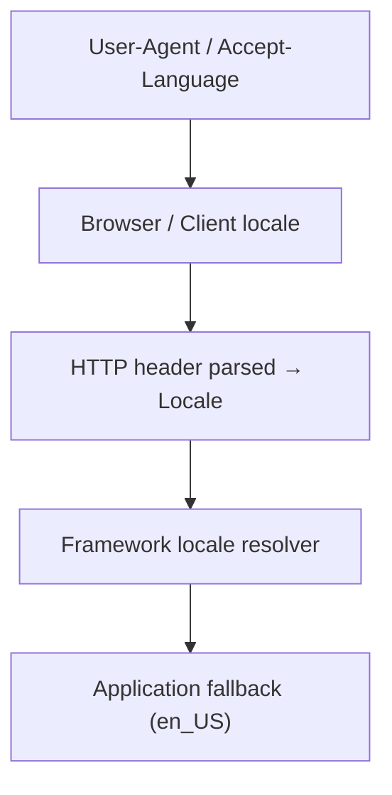
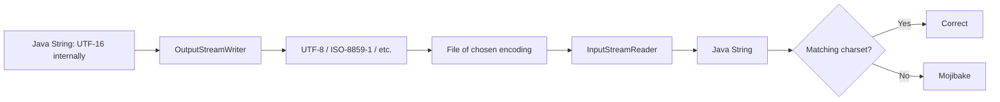

# Internationalization and Localization

> [!summary] Goal
> Build Java applications that adapt to language, region, and cultural conventions without hard-coding formats or strings.

## Table of Contents

1. [Why i18n Matters](#why-i18n-matters)
2. [Locale](#locale)
3. [ResourceBundle and Message Bundles](#resourcebundle-and-message-bundles)
4. [Formatting Numbers, Dates, and Currencies](#formatting-numbers-dates-and-currencies)
5. [Charsets and Unicode](#charsets-and-unicode)
6. [How to Add Localization to a CLI or Server App](#how-to-add-localization-to-a-cli-or-server-app)
7. [Pitfalls](#pitfalls)
8. [Q&A](#qa)

---

## Why i18n Matters

Users expect software to speak their language and respect their local conventions:
- Date formats: `05/28/2026` (US) vs `28.05.2026` (DE) vs `2026-05-28` (ISO).
- Number formats: `1,234.56` (US) vs `1.234,56` (DE).
- Currency symbols, names, sorting order, and plural rules vary.

Java's `java.util.Locale` and `java.text` / `java.time.format` packages handle most of this.

---

## Locale

A locale is a combination of language, country, and variant.

```java
Locale us    = Locale.US;                    // en_US
Locale de    = Locale.GERMANY;               // de_DE
Locale japan = Locale.JAPAN;                 // ja_JP
Locale custom = Locale.of("en", "IN");       // en_IN

// Get the default locale
Locale defaultLocale = Locale.getDefault();
```

### Resolution order



In a server app, resolve the locale per-request from:
- `Accept-Language` header
- User preference stored in DB
- URL parameter or cookie

---

## ResourceBundle and Message Bundles

Create `.properties` files per locale:

**`messages.properties`** (default / English)

```properties
greeting=Hello {0}!
order.confirm=Your order #{0} has been confirmed.
total=Total: {0}
```

**`messages_de.properties`** (German)

```properties
greeting=Hallo {0}!
order.confirm=Ihre Bestellung Nr. {0} wurde bestätigt.
total=Gesamtsumme: {0}
```

### Loading in code

```java
ResourceBundle bundle = ResourceBundle.getBundle("messages", locale);
String msg = MessageFormat.format(bundle.getString("greeting"), "Rishav");
```

### Plural and gender support

Java does not have built-in plural support. Use `ChoiceFormat` or ICU4J:

```java
// ICU4J (com.ibm.icu.text)
ICU4J.MeasureFormat
ICU4J.RuleBasedNumberFormat
```

Or handle plural rules manually with a helper that picks the right key suffix (`item.0`, `item.1`, `item.n`).

---

## Formatting Numbers, Dates, and Currencies

### Numbers

```java
NumberFormat nf = NumberFormat.getInstance(Locale.GERMANY);
String formatted = nf.format(1234.56); // "1.234,56"
```

### Currencies

```java
NumberFormat cf = NumberFormat.getCurrencyInstance(Locale.JAPAN);
String formatted = cf.format(99.99);   // "￥100"

// Controlled rounding
cf.setRoundingMode(RoundingMode.HALF_UP);
```

### Dates

```java
DateTimeFormatter dtf = DateTimeFormatter
    .ofLocalizedDate(FormatStyle.FULL)
    .withLocale(Locale.FRENCH);
String formatted = LocalDate.now().format(dtf);
// "jeudi 28 mai 2026"
```

---

## Charsets and Unicode

### Always specify charset

```java
// When reading/writing text files
Files.readString(Path.of("file.txt"), StandardCharsets.UTF_8);
Files.writeString(Path.of("file.txt"), content, StandardCharsets.UTF_8);

new InputStreamReader(inputStream, StandardCharsets.UTF_8);
new OutputStreamWriter(outputStream, StandardCharsets.UTF_8);
```

### Encoding pitfalls



- **Always use UTF-8** unless there is a strong reason (e.g., legacy system).
- Specify charset in every file I/O operation; do not rely on the JVM default (`file.encoding`).

---

## How to Add Localization to a CLI or Server App

### CLI app

```java
@Command(name = "greet")
public class GreetCommand implements Runnable {
    @Option(names = "--lang", defaultValue = "en")
    String lang;

    @Override
    public void run() {
        Locale locale = Locale.of(lang);
        ResourceBundle bundle = ResourceBundle.getBundle("messages", locale);
        String msg = bundle.getString("greeting");
        System.out.println(msg);
    }
}
```

### Server app

```java
public class LocaleFilter implements Filter {
    @Override
    public void doFilter(ServletRequest request, ServletResponse response, FilterChain chain) {
        String lang = ((HttpServletRequest) request).getHeader("Accept-Language");
        Locale locale = Locale.forLanguageTag(lang != null ? lang : "en");
        // Store in MDC or request attribute
        chain.doFilter(request, response);
    }
}
```

---

## Pitfalls

- **Assuming the JVM default locale** — it varies by OS and launch. Always specify locale explicitly for formatting.
- **Missing `resource` files** — `ResourceBundle.getBundle` throws `MissingResourceException` if the file is not on the classpath.
- **Character encoding in properties files** — `.properties` files are ISO-8859-1 by default. Use Unicode escapes (`\u00e9` for é) or switch to `.xml` bundle files.
- **Mixing `java.text` and `java.time`** — prefer `java.time.format.DateTimeFormatter` over `java.text.DateFormat` in modern code.
- **Ignoring pluralization** — for a list of one item, "1 item(s)" looks bad. Use ICU4J or a lookup table with `ChoiceFormat`.

---

## Q&A

> [!question]- What is the difference between `Locale.of` and `new Locale`?

`Locale.of` was added in Java 19 as a factory method that may reuse cached instances. Prefer `Locale.of` over `new Locale` in modern code.

> [!question]- How do I handle right-to-left languages in a server app?

Java does not handle rendering (that is the UI's job). The server side's responsibility is correct locale detection, text collation, and sending appropriate BCP 47 tags.

> [!question]- Should I use ICU4J or Java's built-in i18n?

For simple date/number formatting and message bundles, Java's built-in is enough. For plural rules, advanced collation, time zone name localization, and break iteration (word/line/sentence boundaries), add ICU4J.

## References

- [Oracle i18n Tutorial](https://docs.oracle.com/javase/tutorial/i18n/)
- [ICU4J User Guide](https://unicode-org.github.io/icu/userguide/)
- [BCP 47 Tags](https://tools.ietf.org/html/bcp47)
- [[Java/01_Foundations/08_Date_Time_and_Money]]
- [[Java/02_Core/03_IO_NIO_and_Serialization]]
