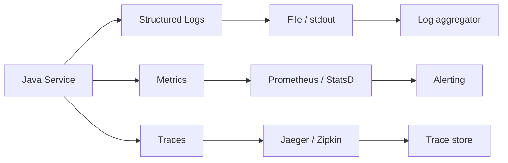

# Java in Production Services

> [!summary] Goal
> Bridge the gap between a working Java program and a production-grade service: health checks, graceful shutdown, config, secrets, metrics, and deployment shape.

## Table of Contents

1. [Typical Java Service Shape](#typical-java-service-shape)
2. [Health Checks and Readiness](#health-checks-and-readiness)
3. [Graceful Shutdown](#graceful-shutdown)
4. [Config and Secrets in Production](#config-and-secrets-in-production)
5. [Logs, Metrics, Traces](#logs-metrics-traces)
6. [Deployment Options](#deployment-options)
7. [How to Turn a Java Program Into a Production Service](#how-to-turn-a-java-program-into-a-production-service)
8. [Pitfalls](#pitfalls)
9. [Q&A](#qa)

---

## Typical Java Service Shape


A production Java service minimally needs:
- A listening port for traffic.
- A health endpoint for the load balancer / orchestrator.
- Logging that goes to a central sink.
- Metrics for dashboards and alerts.
- Graceful shutdown on `SIGTERM`.

---

## Health Checks and Readiness

### Simple HTTP health endpoint (no framework)

```java
import com.sun.net.httpserver.HttpServer;
import java.net.InetSocketAddress;

public class HealthServer {
    public static void start(int port) throws IOException {
        HttpServer server = HttpServer.create(new InetSocketAddress(port), 0);
        server.createContext("/health", exchange -> {
            String resp = "{\"status\":\"UP\"}";
            exchange.sendResponseHeaders(200, resp.length());
            try (var os = exchange.getResponseBody()) {
                os.write(resp.getBytes());
            }
        });
        server.setExecutor(Executors.newVirtualThreadPerTaskExecutor());
        server.start();
    }
}
```

### Meaningful health check

```java
server.createContext("/healthz", exchange -> {
    try {
        db.query("SELECT 1");
        // cache ping
        String resp = "{\"status\":\"UP\"}";
        exchange.sendResponseHeaders(200, resp.length());
    } catch (Exception e) {
        String resp = "{\"status\":\"DOWN\"}";
        exchange.sendResponseHeaders(503, resp.length());
    }
});
```

Production health endpoints should verify all downstream dependencies (DB, cache, external services).

---

## Graceful Shutdown

```java
Runtime.getRuntime().addShutdownHook(new Thread(() -> {
    log.info("Shutting down gracefully...");
    executor.shutdown();
    try {
        if (!executor.awaitTermination(30, TimeUnit.SECONDS)) {
            executor.shutdownNow();
        }
    } catch (InterruptedException e) {
        executor.shutdownNow();
        Thread.currentThread().interrupt();
    }
    closeResources();
    log.info("Shutdown complete");
}));
```

### Deployment contract

| Signal | Behavior |
|--------|----------|
| `SIGTERM` | Stop accepting new work, finish in-flight, close resources |
| `SIGKILL` | Hard kill after grace period (orchestrator enforces timeout) |
| Health check returning `503` | Load balancer removes instance from rotation before `SIGTERM` |

---

## Config and Secrets in Production

### Centralized config

| Approach | Pros | Cons |
|----------|------|------|
| Environment variables | Simple, cloud-native | Flat namespace, no validation |
| Config file + volume mount | File-based, easy to validate | Needs orchestration |
| Config server (Spring Cloud, Consul) | Dynamic refresh | Added infrastructure |
| Secrets manager (Vault, AWS SSM) | Encrypted, audited | Network dependency |

### Pattern: Config + Secrets split

```java
AppConfig config = AppConfig.fromProperties(loadConfigFile());   // non-sensitive
DatabaseSecrets secrets = vault.read("/secrets/db");              // sensitive
```

---

## Logs, Metrics, Traces



Each pillar serves a different purpose:

| Pillar | Purpose | Java tooling |
|--------|---------|------------|
| Logs | Debug specific events | SLF4J + Logback |
| Metrics | Dashboards, alerts | Micrometer, Dropwizard Metrics |
| Traces | End-to-end latency breakdown | OpenTelemetry |

---

## Deployment Options

| Shape | Startup | Footprint | Tooling |
|-------|---------|-----------|---------|
| Fat JAR | Slow | Full JDK | `java -jar` |
| jlink runtime | Fast | Trimmed JDK modules | `jlink` |
| Native image | Instant | Minimal | `native-image` (GraalVM) |
| Container (layered JAR) | Varies | Full/trimmed JDK | Docker, distroless base |

### Recommendation

- Start with a fat JAR in a distroless container.
- Gradual to jlink runtime for faster startup and smaller images.
- Evaluate native-image only if startup latency is critical (serverless, CLIs).

---

## How to Turn a Java Program Into a Production Service

```java
public class Main {
    private static final Logger log = LoggerFactory.getLogger(Main.class);

    public static void main(String[] args) {
        AppConfig config = AppConfig.load();
        log.info("Starting service: {}", config.name());

        HealthServer.start(config.healthPort());
        MetricsServer.start(config.metricsPort());
        var app = new Application(config);

        Runtime.getRuntime().addShutdownHook(new Thread(() -> {
            log.info("Shutting down");
            app.stop();
        }));

        app.start();
    }
}
```

Checklist:
1. Parse config (with defaults + override).
2. Start health endpoint.
3. Start metrics endpoint.
4. Start application logic (HTTP server, consumer, etc.).
5. Register shutdown hook for graceful stop.

---

## Pitfalls

- **Health check that never fails** — a true health check probes downstreams. If it always returns 200, it is useless.
- **No graceful shutdown** — connections drop, in-flight requests fail, queues lose messages.
- **Hard-coded config** — every environment change requires a rebuild.
- **Metrics without alerting** — collecting metrics is wasted effort if there is no alert rule on the p99 latency spike.
- **JVM flags not tuned for containers** — `-XX:+UseContainerSupport` is default in JDK 10+, but memory limits (`-Xmx` relative to container memory) still need explicit sizing.

---

## Q&A

> [!question]- What port should the health endpoint listen on?

A different port from the application traffic (e.g., `:8080` for API, `:8081` for health). This prevents the load balancer health check from competing with user traffic.

> [!question]- Should I use `System.exit` in production?

Avoid it. Prefer a shutdown hook or a command endpoint that triggers graceful stop. `System.exit` is abrupt and skips shutdown hooks in some edge cases.

> [!question]- How do I change log levels without restart?

Logback supports `scanPeriod="60 seconds"` — just edit the XML. For Micrometer/Prometheus, metrics are pull-scraped; no restart needed.

## References

- [12 Factor App: Config](https://12factor.net/config)
- [OpenTelemetry Java](https://opentelemetry.io/docs/languages/java/)
- [Micrometer](https://micrometer.io/)
- [[Java/01_Foundations/09_Logging_Basics_for_Java]]
- [[Java/01_Foundations/10_Configuration_and_CLI_Basics]]
- [[Java/03_Advanced/15_Java_Packaging_and_Runtime_Images]]
- [[Java/04_Playbooks/01_Diagnose_High_CPU_or_Latency]]
