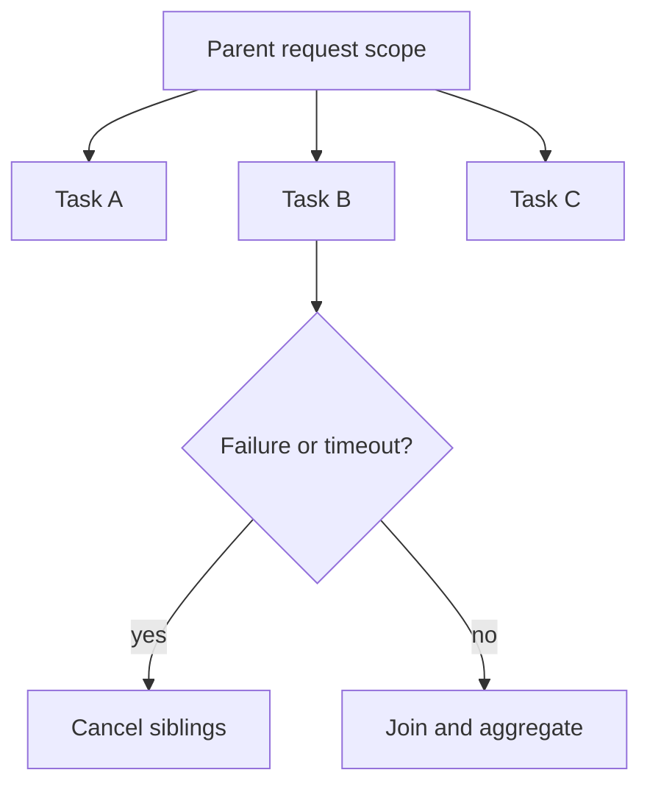

# `CompletableFuture` and Structured Concurrency

> [!summary] Goal
> Compose asynchronous work safely: fan-out, fan-in, deadlines, cancellation, failure propagation, and executor isolation without leaking work or hiding production failures.

## Table of Contents

1. [Why Async Composition Is Hard](#why-async-composition-is-hard)
2. [Future vs CompletableFuture](#future-vs-completablefuture)
3. [Execution Model and Threading](#execution-model-and-threading)
4. [Core Composition Patterns](#core-composition-patterns)
5. [Timeouts, Cancellation, and Failure](#timeouts-cancellation-and-failure)
6. [Structured Concurrency Mindset](#structured-concurrency-mindset)
7. [Common Server-Side Scenarios](#common-server-side-scenarios)
8. [Pitfalls](#pitfalls)

---

> [!info] CompletableFuture
> A `CompletableFuture<T>` is both a `Future<T>` (get the result later) and a `CompletionStage<T>` (chain dependent actions). It represents an asynchronous computation that can be composed, transformed, and combined with other futures. Unlike plain `Future`, you don't force the caller to block — you attach callbacks that run when the result is ready.

## Why Async Composition Is Hard

Async code usually fails not because `CompletableFuture` is complicated, but because developers forget that every async workflow also needs:
- executor ownership
- timeout boundaries
- cancellation behavior
- error propagation rules
- overload control

Without those, async code just hides blocking and failure instead of managing it.

---

## Future vs CompletableFuture

| Type | Strength | Limitation |
|------|----------|------------|
| `Future` | simple async result handle | poor composition, blocking-centric |
| `CompletableFuture` | compose, combine, transform, recover | easier to misuse if thread pools / timeouts are unclear |

### `Future`

```java
Future<String> future = executor.submit(() -> fetchUserName());
String value = future.get(200, TimeUnit.MILLISECONDS);
```

Good for simple request/response handoff.

### `CompletableFuture`

```java
CompletableFuture<String> future =
        CompletableFuture.supplyAsync(this::fetchUserName, executor)
                .thenApply(String::trim)
                .thenApply(String::toUpperCase);
```

Use when the workflow itself is asynchronous and needs composition.

---

## Execution Model and Threading

### Important rule

Stages do not run in a magical async universe. They run on:
- the thread that completed the previous stage, or
- an executor if you use an `Async` variant with an executor


### Why explicit executors matter

In server apps, do not casually rely on the common pool for important work.

Why:
- hidden contention with unrelated tasks
- hard-to-debug latency coupling
- poor operational visibility

Prefer:

```java
ExecutorService ioPool = Executors.newFixedThreadPool(32);

CompletableFuture<User> f = CompletableFuture.supplyAsync(
        () -> client.fetchUser(id),
        ioPool
);
```

---

## Core Composition Patterns

## Transform result

```java
future.thenApply(User::name);
```

## Flat-map async stages

Use `thenCompose` when the next step already returns a `CompletableFuture`.

```java
CompletableFuture<Account> result =
        fetchUser(userId)
                .thenCompose(user -> fetchAccount(user.accountId()));
```

## Combine independent calls

```java
var userFuture = CompletableFuture.supplyAsync(() -> fetchUser(userId), ioPool);
var ordersFuture = CompletableFuture.supplyAsync(() -> fetchOrders(userId), ioPool);

var combined = userFuture.thenCombine(ordersFuture, UserView::new);
```

## Fan-out and join

```java
var a = CompletableFuture.supplyAsync(() -> callA(), ioPool);
var b = CompletableFuture.supplyAsync(() -> callB(), ioPool);

var result = a.thenCombine(b, this::merge)
              .orTimeout(300, TimeUnit.MILLISECONDS)
              .join();
```

### `allOf` and `anyOf`

Use `allOf` when all tasks must finish.

```java
CompletableFuture<Void> all = CompletableFuture.allOf(f1, f2, f3);
```

Use `anyOf` when one winner is enough, but be deliberate about cancelling the losers if they are expensive.

---

## Timeouts, Cancellation, and Failure

### Timeout is not the same as cancellation

`orTimeout` marks the future as failed after a deadline, but it does not magically stop the underlying IO or external system call.

```java
var result = future.orTimeout(200, TimeUnit.MILLISECONDS);
```

If the underlying task is blocking on a client library that ignores interruption, the real work may continue.

### Exception flow

```java
var value = future
        .thenApply(this::parse)
        .exceptionally(ex -> fallback())
        .join();
```

Be careful: `exceptionally` converts failure into success. That may be correct, or it may hide an outage.

### `join()` vs `get()`

- `get()` throws checked exceptions (`ExecutionException`, `InterruptedException`)
- `join()` throws unchecked `CompletionException`

Server code often prefers `join()` in carefully scoped places, but you must still understand the wrapped cause.

---

## Structured Concurrency Mindset

The core idea of structured concurrency is simple:
- child tasks belong to a parent scope
- the parent should not exit while children are still orphaned
- if one child fails, siblings often need cancellation
- deadlines should apply to the whole scope, not be invented ad hoc in every branch



Even if your code is not using dedicated structured-concurrency APIs, you should design it with this model.

### Good operational behavior

- parent owns executor / scope lifecycle
- all children are awaited or cancelled
- time budget is propagated consistently
- one failing dependency does not leave background work running forever

---

## Common Server-Side Scenarios

## Parallel downstream fetches

```java
CompletableFuture<User> user = CompletableFuture.supplyAsync(() -> userClient.getUser(id), ioPool);
CompletableFuture<List<Order>> orders = CompletableFuture.supplyAsync(() -> orderClient.getOrders(id), ioPool);

return user.thenCombine(orders, UserOrdersResponse::new)
           .orTimeout(500, TimeUnit.MILLISECONDS);
```

Use when the calls are independent and total latency matters.

## Fallback on one dependency only

```java
CompletableFuture<Pricing> pricing = CompletableFuture
        .supplyAsync(() -> pricingClient.fetch(sku), ioPool)
        .completeOnTimeout(Pricing.unavailable(), 100, TimeUnit.MILLISECONDS);
```

Good when partial degradation is acceptable.

## Isolating executors by dependency class

Do not let a slow reporting service consume the same pool as core request-path user lookups.

---

## Pitfalls

### Async without executor ownership

If you do not know which executor runs the work, you do not really control latency or saturation.

### `allOf` without reading individual failures

The aggregate future alone often does not tell the full story. Inspect child futures and causes.

### Forgetting cancellation

One timed-out request can still leave expensive background work running.

### Nesting futures accidentally

Using `thenApply` when the callback returns a `CompletableFuture` creates `CompletableFuture<CompletableFuture<T>>`. Use `thenCompose`.

### Hiding outages with eager fallback

Fallbacks should be deliberate and observable, not blanket exception suppression.

---

> [!question]- Interview Questions
>
> **Q: What is the difference between `thenApply` and `thenCompose`?**
> A: `thenApply` transforms a value synchronously. `thenCompose` flattens a callback that already returns another `CompletableFuture`.
>
> **Q: Why should server apps prefer explicit executors with `CompletableFuture`?**
> A: To isolate workloads, control saturation, and avoid unpredictable common-pool contention.
>
> **Q: Does `orTimeout` cancel the underlying operation?**
> A: Not necessarily. It times out the future, but the underlying work may continue unless cancellation/interruption is observed.
>
> **Q: What problem does structured concurrency solve?**
> A: It prevents orphaned work by making child task lifetime, cancellation, and joining explicit within a parent scope.

---

## Cross-Links

- [[Java/02_Core/01_Concurrency_Threads_and_Executors]]
- [[Java/03_Advanced/02_JMM_Volatile_and_Locks]]
- [[SystemDesign/03_Advanced/02_Backpressure_and_Load_Shedding]]

---

## References

- [CompletableFuture](https://docs.oracle.com/en/java/javase/17/docs/api/java.base/java/util/concurrent/CompletableFuture.html)
- [Structured Concurrency (OpenJDK)](https://openjdk.org/jeps/428)
