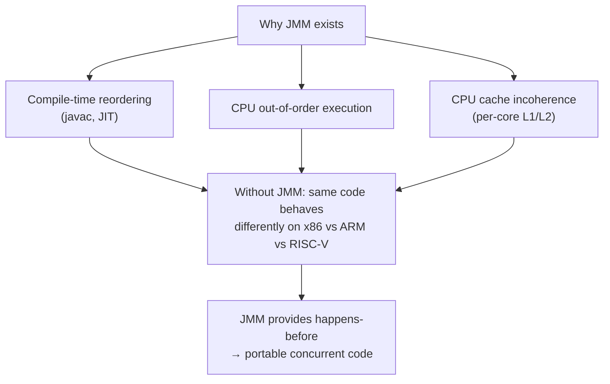
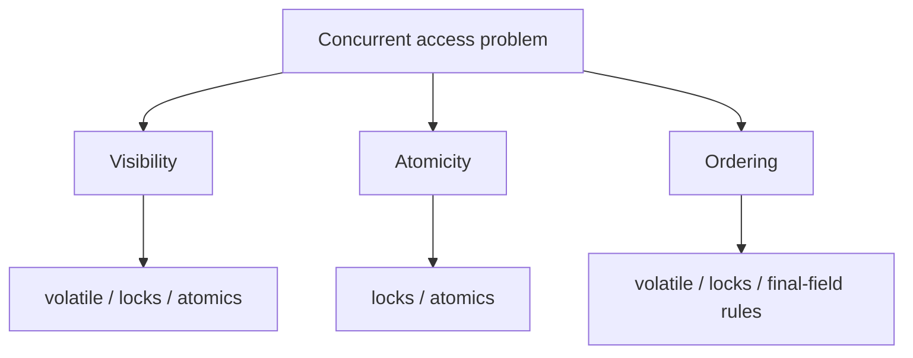
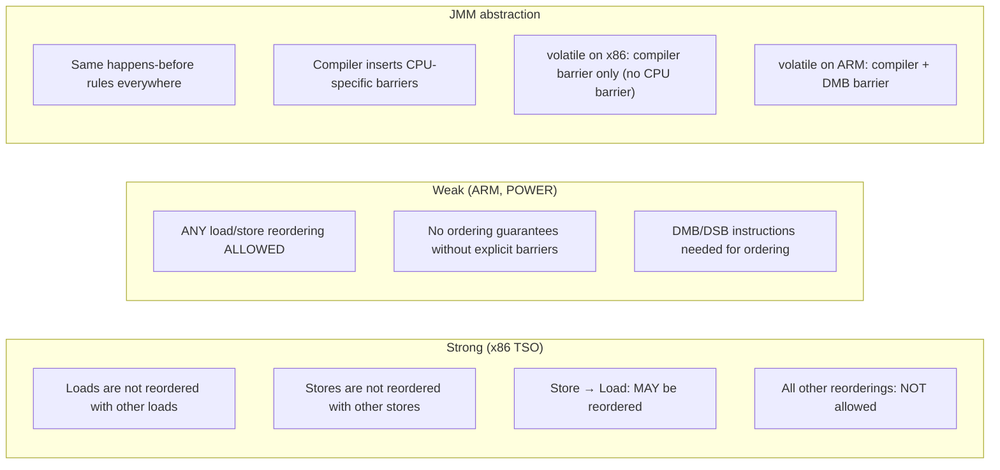
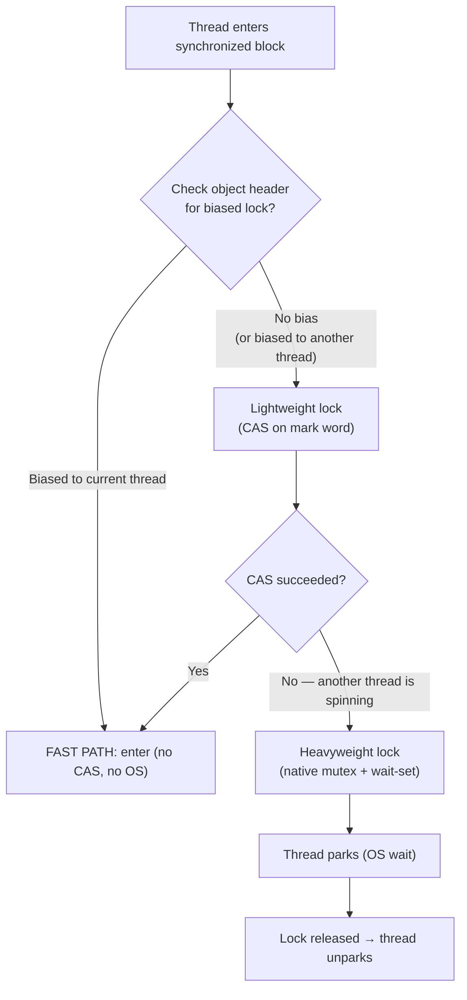

# Java Memory Model (JMM), `synchronized`, `volatile`, and `wait`/`notify`

> [!summary] Goal
> Understand the Java Memory Model deeply enough to reason about visibility, ordering, and atomicity. Master `synchronized` (monitors, reentrancy, inflation, wait/notify) and `volatile` (memory barriers, DCL, CPU architectures). Know what each primitive guarantees, what it does NOT guarantee, and when to reach for each.

## Table of Contents

1. [Why the JMM Exists](#why-the-jmm-exists)
2. [Three Different Problems](#three-different-problems)
3. [CPU Memory Models](#cpu-memory-models)
4. [Happens-Before Rules](#happens-before-rules)
5. [synchronized Deep-Dive](#synchronized-deep-dive)
6. [wait/notify/notifyAll](#wait-notify-notifyall)
7. [volatile Deep-Dive](#volatile-deep-dive)
8. [Double-Checked Locking](#double-checked-locking)
9. [Safe Publication Patterns](#safe-publication-patterns)
10. [Decision Guide](#decision-guide)
11. [Pitfalls](#pitfalls)

---

## Why the JMM Exists

> [!info] JMM
> The Java Memory Model (JLS §17.4) defines when writes by one thread become visible to another and what ordering guarantees exist. Without a defined model, concurrent Java code would be non-portable — code that works on x86 might break on ARM because the CPUs have different memory consistency guarantees.

Modern CPUs and compilers perform aggressive optimizations:
- **Compiler reordering**: javac + JIT may reorder independent instructions.
- **CPU out-of-order execution**: modern CPUs execute instructions in parallel and reorder the results.
- **Cache incoherence**: each core has its own L1/L2 cache. A write by Core 0 may not be visible to Core 1 until a cache coherence protocol (MESI) transfers the cache line.

The JMM is the contract that tames these optimizations. It defines the **happens-before** relation: if A happens-before B, then A's effects are visible to B and A is ordered before B. Everything else is undefined — the JVM/CPU can reorder freely.



---

## Three Different Problems

Many developers conflate visibility, atomicity, and ordering. They are distinct and require different tools.

### Visibility

Will one thread see another thread's write?

Without happens-before, a thread may read a stale value from its local cache indefinitely. `volatile`, locks, and atomics all guarantee visibility.

### Atomicity

Will a read-modify-write happen as one indivisible operation?

`count++` compiles to three operations: load, increment, store. Without atomicity, two threads can both load the same value, both increment, and both store — losing one increment. Only locks and atomics provide atomicity.

### Ordering

Will operations appear in a safe order to other threads?

Without ordering, the JIT or CPU may reorder `ready = true; data = 42` to `data = 42; ready = true`. If another thread sees `ready == true` but reads stale `data`, you get a data race. `volatile` provides ordering for single fields; locks provide ordering for a critical section.



---

## CPU Memory Models

> [!info] Memory model
> The JMM sits above the CPU's native memory model. x86 has a **strong** model (TSO — Total Store Order), ARM/POWER have **weak** models. Code that works on x86 may fail on ARM because ARM allows more reorderings. The JMM abstracts this: same Java code, same happens-before rules, regardless of CPU.



### Practical impact

```text
On x86 (TSO):
  - volatile reads are essentially free (no CPU barrier needed)
  - volatile writes are slightly more expensive (StoreLoad barrier)
  - synchronized is free when uncontended (biased lock, then lock elision)
  - Many JMM guarantees come "for free" from x86's strong model

On ARM (weak):
  - volatile reads AND writes require explicit DMB barriers (~50-100ns)
  - synchronized always requires memory barriers
  - Bugs that never reproduce on x86 can be frequent on ARM
  - This is why testing on ARM (Apple Silicon, AWS Graviton) finds real bugs
```

---

## Happens-Before Rules

> [!info] Happens-before
> If action A happens-before action B, then A is **visible to** and **ordered before** B. This is the JMM's fundamental guarantee.

### Complete list of happens-before rules (JLS §17.4.5)

| Rule | Example |
|------|---------|
| **Program order** | Within a thread, each action happens-before every subsequent action in program order |
| **Monitor lock** | An unlock on a monitor happens-before every subsequent lock on the same monitor |
| **Volatile field** | A write to a volatile field happens-before every subsequent read of that field |
| **Thread start** | `Thread.start()` happens-before the first action in the started thread |
| **Thread join** | The last action in a thread happens-before `Thread.join()` returns |
| **Interruption** | `interrupt()` happens-before the interrupted thread detects it |
| **Finalizer** | The end of an object's constructor happens-before `finalize()` starts |
| **Transitivity** | If A happens-before B and B happens-before C, then A happens-before C |

### How to reason with happens-before

```java
// Thread 1:
data = 42;                       // A
ready = true;                    // B (volatile write)

// Thread 2:
if (ready) {                     // C (volatile read) — reads true
    System.out.println(data);    // D — guaranteed to see 42
}

// JMM reasoning:
// A happens-before B   (program order in Thread 1)
// B happens-before C   (volatile: write → happens-before → read)
// C happens-before D   (program order in Thread 2)
// By transitivity: A happens-before D → Thread 2 sees data == 42
```

### What does NOT establish happens-before

```java
// ❌ This is NOT safe — no happens-before chain:
// Thread 1: ready = true;   ← ready is NOT volatile
// Thread 2: while (!ready); ← may loop forever (stale ready)
// Non-volatile writes are not guaranteed to be visible to other threads

// ❌ Thread.sleep() does NOT establish happens-before
// ❌ Thread.yield() does NOT establish happens-before
// ❌ System.currentTimeMillis() does NOT establish happens-before
```

---

## synchronized Deep-Dive

> [!info] synchronized in Java
> `synchronized` is Java's built-in mutual exclusion mechanism. It guarantees:
> 1. **Mutual exclusion**: only one thread at a time can execute the synchronized block.
> 2. **Happens-before**: an unlock happens-before a subsequent lock on the same monitor.
> 3. **Reorder safety**: all actions inside the block appear ordered to any thread that acquires the same monitor later.

### Bytecode level: `MONITORENTER` / `MONITOREXIT`

```java
public class SyncExample {
    private final Object lock = new Object();
    private int counter;

    public void increment() {
        synchronized (lock) {
            counter++;
        }
    }
}
```

```text
Compiled bytecode for increment():

  aload_0           ; push 'this'
  getfield lock     ; push lock object reference
  dup               ; duplicate for MONITOREXIT
  astore_1          ; store reference for exception handling
  MONITORENTER      ; <-- ENTER THE MONITOR
  aload_0
  dup
  getfield counter
  iconst_1
  iadd
  putfield counter
  aload_1
  MONITOREXIT       ; <-- EXIT THE MONITOR
  goto return

  // Exception handler: if anything throws, MONITOREXIT again
  aload_1
  MONITOREXIT
  athrow
```

> [!tip] The JVM guarantees that `MONITOREXIT` executes even if an exception occurs. This is why `synchronized` is safe — the bytecode generates an exception handler that releases the monitor on any thrown exception. For `ReentrantLock`, you must write the `finally` block yourself.

### Lock inflation: biased → lightweight → heavyweight

The JVM optimizes `synchronized` by starting with the cheapest form and "inflating" (escalating) as contention increases. This is why `synchronized` is fast in practice — it's NOT an OS mutex until it has to be.



| Level | Mechanism | Cost | When used |
|:-----:|-----------|:----:|-----------|
| **Biased** | Object header stores thread ID. Enter: check ID match. | < 10ns (single CAS at install) | Single-thread access (legacy; removed in JDK 15+ by default) |
| **Lightweight** | CAS on object header's mark word to point to stack lock record. | ~10-50ns (CAS on uncontended) | Low contention |
| **Heavyweight** | Native mutex (pthread_mutex on Linux). Thread parks. | ~1-100µs (OS park/unpark) | High contention |

> [!warning] Biased locking was removed in JDK 15 by default (JEP 374) and removed entirely in JDK 21. It was complex and provided little benefit for modern applications. `synchronized` now starts at lightweight and inflates to heavyweight.

### Object header and mark word

```text
Every Java object has a header (the "mark word") that stores:
  - In biased locking mode: thread ID, epoch, age, biased flag
  - In lightweight mode: pointer to Lock Record in thread's stack
  - In heavyweight mode: pointer to ObjectMonitor (native mutex)
  - When unlocked: identity hashcode, GC age

On a 64-bit JVM (with compressed OOPs), the mark word is 8 bytes:

  Bit [63..8]   Bit [7]  Bit [6..3]  Bit [2..0]
  ─────────────────────────────────────────────
  Forward ptr   unused   age         001 (biased)
  Ptr to lock   —        —           000 (lightweight)
  Ptr to monitor  —      —           010 (heavyweight)
  identity hash  unused   age         001 (unlocked, no bias)
```

### Reentrancy

```java
synchronized void outer() {
    // Hold count = 1
    inner();                // Reentrant call — same thread holds the monitor
}

synchronized void inner() {
    // Hold count = 2 (same thread re-entered)
    // ...
}
// Hold count = 0 when outer returns

// This works because:
// - The JVM tracks the owning thread and a recursion count inside the monitor
// - MONITORENTER on an already-owned monitor increments the count
// - MONITOREXIT decrements it
// - Only when count reaches 0 is the monitor released
```

### `synchronized` on static vs instance methods

```java
public class Example {

    // Instance method: locks on 'this'
    public synchronized void instanceMethod() {
        // exclusive access per-instance
    }

    // Static method: locks on the Class object (Example.class)
    public static synchronized void staticMethod() {
        // exclusive access across ALL instances
    }

    // Equivalent block form:
    public void instanceMethodEquiv() {
        synchronized (this) { ... }
    }

    public static void staticMethodEquiv() {
        synchronized (Example.class) { ... }
    }
}
```

### `synchronized` with virtual threads — pinning

```java
// Virtual threads (JDK 21) multiplex on carrier threads.
// Normally, when a VT blocks, it unmounts from the carrier.
// BUT: if the VT is inside a synchronized block, it CANNOT unmount
// (the monitor is tied to the carrier thread).

// This is called "pinning":

synchronized (lock) {
    Thread.sleep(1000);  // VT is PINNED — carrier thread is blocked
}

// While pinned:
//   - The carrier thread can't run other VTs → reduces throughput
//   - If ALL carriers are pinned → starvation

// How to avoid:
// 1. Replace synchronized with ReentrantLock inside VT code
// 2. Keep synchronized blocks tiny (no I/O, no sleep inside)
// 3. Detect pinning: -Djdk.tracePinnedThreads=short

// Detection:
//   "Thread[#23,ForkJoinPool-1-worker-1,5,CarrierThread]"
//   "    java.base/java.lang.Object.wait(Native Method)"
//   "    <== monitors:1"  ← PINNED: 1 monitor held during blocking
```

### When to use `synchronized` vs `ReentrantLock`

Use `synchronized` when:
- You need simple mutual exclusion with minimal ceremony.
- The critical section is small (no I/O, no blocking).
- You don't need timed/interruptible lock acquisition.
- You work with virtual threads and the critical section is tiny.

Use `ReentrantLock` when:
- You need `tryLock(timeout)` for deadlock avoidance.
- You need `lockInterruptibly()` for cancelable waits.
- You need multiple `Condition` variables.
- You work with virtual threads and the critical section blocks.

---

## wait/notify/notifyAll

> [!info] wait/notify
> `wait()`, `notify()`, and `notifyAll()` are methods on `Object` that work with `synchronized` blocks. They allow a thread to **wait** for a condition (releasing the monitor temporarily) and another thread to **signal** when the condition may have changed. These are the low-level building blocks for producer-consumer, bounded buffers, and thread coordination.

### How they work

```text
wait() — called inside a synchronized block:
  1. Thread must hold the monitor (IllegalMonitorStateException otherwise).
  2. Thread releases the monitor (allows other threads to enter).
  3. Thread is placed in the object's wait set.
  4. Thread blocks until notified or interrupted.
  5. On wakeup, thread re-acquires the monitor before returning.
  6. After re-acquiring: the condition may have changed — loop and check again!

notify() — called inside a synchronized block:
  1. Wakes one arbitrary thread from the object's wait set.
  2. The woken thread competes for the monitor (it's still held by the notifier).
  3. The notifier must release the monitor (exit synchronized block) before
     the woken thread can proceed.

notifyAll() — called inside a synchronized block:
  1. Wakes ALL threads from the wait set.
  2. They compete for the monitor one by one.
```

### The canonical pattern: always loop around wait()

```java
// Shared state:
private final Object lock = new Object();
private Queue<Job> queue = new LinkedList<>();

// Consumer:
public Job consume() throws InterruptedException {
    synchronized (lock) {
        while (queue.isEmpty()) {        // ALWAYS loop (spurious wakeup!)
            lock.wait();                 // Release monitor, wait for signal
        }
        return queue.poll();
    }
}

// Producer:
public void produce(Job job) {
    synchronized (lock) {
        queue.add(job);
        lock.notifyAll();                // Signal ONE or ALL waiters
    }
}
```

### Why you must loop (spurious wakeup)

```text
Spurious wakeup: a thread may wake up from wait() WITHOUT a corresponding
notify()/notifyAll(). This is allowed by the JVM spec (and happens on Linux).

Additionally, even with a genuine notifyAll():
  - If 3 consumers are waiting and 1 job is produced
  - All 3 wake up
  - Only 1 gets the job
  - The other 2 must check and go back to waiting

If you use `if (queue.isEmpty()) lock.wait();` instead of `while`,
the consumer returns null when it should have waited again.
```

### The lost notification bug

```java
// ❌ BUG: lost notification
synchronized (lock) {
    if (queue.isEmpty()) {       // <-- should be while(), but that's not the bug here
        lock.wait();             // Thread waits here
    }
    // Another thread calls produce() → notifyAll() → wakes this thread
    // But: what if produce() was called BEFORE this thread reached wait()?
    //   notifyAll() has no effect if no thread is waiting yet!
    //   This thread enters wait() and NEVER wakes up.
    return queue.poll();
}

// ✅ Fix: ensure the condition CANNOT change between check and wait.
// The synchronized block guarantees this — produce() also synchronizes on lock,
// so it cannot add to the queue between isEmpty() and wait().

// But there's another variant of lost notification:

// ❌ NOTIFY before WAIT:
// Thread A: produce() → notify() ← nobody waiting yet!
// Thread B: consume() → wait() ← waits forever! Missed the notification.

// ✅ Fix for startup races:
// - Ensure consumer starts BEFORE producer, OR
// - Use higher-level primitives (BlockingQueue, CountDownLatch) that
//   handle this correctly
```

### `notify()` vs `notifyAll()`

```java
synchronized (lock) {
    queue.add(job);
    lock.notify();           // Wakes ONE thread from the wait set
    // lock.notifyAll();     // Wakes ALL threads from the wait set
}
```

```text
notify():
  - Wakes one arbitrary waiter.
  - More efficient (only one thread wakes and competes).
  - DANGEROUS: if the woken thread can't handle the condition
    (e.g., it's a "put" waiter but only a "take" condition is satisfied),
    the notification is LOST.
  - Use only when: all waiters are waiting for the same condition,
    and exactly one can make progress.

notifyAll():
  - Wakes ALL waiters.
  - Safe: every waiter checks the condition and goes back to waiting
    if it's not their turn.
  - Slightly less efficient (thundering herd).
  - Use by default unless you have proven notify() is correct.

Rule of thumb: use notifyAll() unless you have measured and proven
that notify() is safe and significantly faster.
```

### Producer-consumer with multiple conditions

```java
// For a bounded buffer, you need two conditions: "not empty" and "not full".
// With low-level wait/notify, all threads share one wait set:

public class BoundedBuffer {
    private final Object lock = new Object();
    private final int[] buffer = new int[100];
    private int count, putIndex, takeIndex;

    public void put(int value) throws InterruptedException {
        synchronized (lock) {
            while (count == buffer.length) {
                lock.wait();        // All producers WAIT for "not full"
            }
            buffer[putIndex] = value;
            putIndex = (putIndex + 1) % buffer.length;
            count++;
            lock.notifyAll();       // Wake ALL consumers (and producers!)
            // notifyAll is needed because a waiting consumer must be woken
        }
    }

    public int take() throws InterruptedException {
        synchronized (lock) {
            while (count == 0) {
                lock.wait();        // All consumers WAIT for "not empty"
            }
            int value = buffer[takeIndex];
            takeIndex = (takeIndex + 1) % buffer.length;
            count--;
            lock.notifyAll();       // Wake ALL producers (and consumers!)
            return value;
        }
    }
}

// Higher-level alternative: ReentrantLock + 2 Conditions
// ReentrantLock lock = new ReentrantLock();
// Condition notFull = lock.newCondition();
// Condition notEmpty = lock.newCondition();
// This avoids notifyAll (wakes only the right waiters).
```

### Performance: `wait/notify` vs `Condition`

```text
Object.wait/notify:
  - Simpler (built-in, no extra objects)
  - Single wait set per monitor
  - notifyAll wakes ALL waiters (thundering herd)
  - Cannot distinguish "waiting for full" from "waiting for empty"

ReentrantLock + Condition:
  - Multiple condition queues per lock
  - signal() wakes only ONE waiter of the right condition
  - No thundering herd
  - More complex API (must create Condition objects)

Use wait/notify for simple cases (single condition, low contention).
Use Condition for complex cases (bounded buffer, multiple predicates).
```

---

## volatile Deep-Dive

> [!info] volatile in Java
> `volatile` guarantees:
> 1. **Visibility**: a write to a volatile field is immediately visible to all threads that subsequently read it.
> 2. **Ordering**: reads and writes of volatile fields are NOT reordered with each other (sequential consistency for volatile accesses).
> What `volatile` does NOT guarantee: **Atomicity** for compound operations (like `count++`).

### Memory barriers emitted by the JIT

The JIT compiler inserts memory barriers around volatile accesses depending on the CPU architecture:

```text
On x86 (TSO - Total Store Order):

  volatile write:
    [sfence or lock(COSTLY) ] ← StoreStore + StoreLoad barrier
    mov [addr], value

  volatile read:
    mov rax, [addr]           ← LoadLoad + LoadStore barrier
    [ LoadLoad barrier is free on x86 (TSO property) ]

  On x86, volatile writes include a StoreLoad barrier (usually lock addl $0, [rsp])
  which flushes the store buffer. Reads need no CPU barrier (TSO guarantees it).

On ARM (weak memory model):

  volatile write:
    dmb ishst                ← StoreStore barrier (before store)
    str [addr], value
    dmb ish                  ← full barrier (after store, for StoreLoad)

  volatile read:
    ldr rax, [addr]
    dmb ish                  ← full barrier (LoadLoad + LoadStore after load)

  ARM requires explicit DMB (Data Memory Barrier) for both reads AND writes.
  This is ~50-100ns per volatile access — substantially more expensive than x86.
```

### Sequential consistency (SC)

```java
// volatile accesses in Java are sequentially consistent (SC):
// SC = the result of execution is the same as if all operations
// were executed in some global sequential order, and each thread's
// operations appear in program order.

// This is the STRONGEST ordering guarantee Java provides.
// Stronger than C++'s default acquire/release semantics.

// Sequential consistency example:
volatile int x = 0;
volatile int y = 0;

// Thread 1:            // Thread 2:
x = 1;                  y = 1;
int ry = y;             int rx = x;

// Allowed outcomes (under SC):
//   (ry=1, rx=1) — T1 writes x, T2 writes y, then reads
//   (ry=0, rx=1) — T1 writes x, reads y. T2: y write after T1's read
//   (ry=1, rx=0) — T2 writes y, reads x. T1: x write after T2's read
//   (ry=0, rx=0) — IMPOSSIBLE under volatile SC!
//     Why: would require T1's x=1 after T1's y read AND T2's y=1 after T2's x read
//     → circular dependency that can't be linearized

// With PLAIN (non-volatile) fields, (0, 0) is possible due to reordering.
```

### volatile on arrays

```java
// volatile on an array reference:
//   The REFERENCE is volatile, but NOT the array elements.

volatile int[] arr = new int[10];     // Reference is volatile

arr = new int[20];                     // ✅ volatile write of the reference
arr[0] = 42;                           // ❌ NOT volatile! Element is plain int

// If you need volatile array semantics:
// Use AtomicIntegerArray, AtomicLongArray, or VarHandle array element access.
```

### Volatile piggybacking

```java
// Piggybacking: use a volatile write/read to establish happens-before
// for OTHER (non-volatile) fields.

// Pattern: use a volatile "ready" flag to publish a set of non-volatile fields.

class Publisher {
    private String name;
    private int version;
    private volatile boolean initialized = false;

    public void init(String name, int version) {
        this.name = name;              // Non-volatile write
        this.version = version;        // Non-volatile write
        this.initialized = true;       // Volatile write (happens-before for readers)
    }

    public String getName() {
        if (initialized) {             // Volatile read
            return name;               // Guaranteed to see the value set in init()
        }
        return "default";
    }
}

// This works because:
//   name = "foo" → happens-before → initialized = true (program order)
//   initialized = true → happens-before → initialized read (volatile rule)
//   initialized read → happens-before → name read (program order)
//   By transitivity: name write is visible to name read.
```

---

## Double-Checked Locking

> [!info] Double-checked locking (DCL)
> DCL is a pattern that checks a lazily initialized field twice: once without locking (to avoid the lock cost in the common case), and once while holding the lock (to ensure only one thread initializes). The field MUST be `volatile` in Java, otherwise a thread may see a partially constructed object.

```java
// ❌ Broken DCL (non-volatile field)
private static Config config;

public static Config getConfig() {
    if (config == null) {           // First check (no lock)
        synchronized (Config.class) {
            if (config == null) {   // Second check (with lock)
                config = new Config();  // BUG: may publish partially-constructed object
            }
        }
    }
    return config;
}

// The bug: `new Config()` is NOT atomic. The JIT may:
//   1. Allocate memory
//   2. Write the reference to config (BEFORE constructor runs!)
//   3. Run the constructor
// Thread 2 sees non-null config at step 2 and returns an object with zeroed fields.
```

```java
// ✅ Correct DCL (volatile field)
private static volatile Config config;   // <-- volatile is MANDATORY

public static Config getConfig() {
    Config result = config;             // Local variable avoids double volatile read
    if (result == null) {
        synchronized (Config.class) {
            result = config;
            if (result == null) {
                config = result = new Config();
            }
        }
    }
    return result;
}
```

> [!tip] With `volatile`, the JVM guarantees that the object reference is not published until the constructor completes (volatile write happens-after constructor). Without `volatile`, the JIT or CPU can reorder the write and the constructor.

### DCL + Holder class idiom

```java
// Alternative to DCL: the Initialization-on-Demand Holder idiom.
// No volatile needed — the JVM guarantees class loading is serial.

public class Config {
    private Config() {}

    // Inner class is loaded on first access — by the JVM, which
    // serializes class initialization (no synchronized needed).
    private static class Holder {
        static final Config INSTANCE = new Config();
    }

    public static Config getInstance() {
        return Holder.INSTANCE;
    }
}

// Advantages over DCL:
//   - No volatile needed (class loading is inherently serial)
//   - No synchronized needed
//   - Lazy initialization guaranteed
//   - Thread-safe by JVM specification
```

---

## Safe Publication Patterns

### Immutable object publication

```java
// An immutable object, published via any mechanism, is always safe.
// final fields have initialization safety guarantees in the JMM:
//   - A thread that sees the object reference is guaranteed to see
//     all final fields as they were set in the constructor.
//   - This is true even without synchronization!

public final class Config {
    private final String host;    // final → initialization safety
    private final int port;       // final → initialization safety

    public Config(String host, int port) {
        this.host = host;
        this.port = port;
    }
}

// Safe to publish via any mechanism:
public class App {
    // Even non-volatile reference — final fields are still safe:
    private Config config;

    public void init() {
        config = new Config("localhost", 8080);
    }

    public void use() {
        // Thread that reads config sees host and port correctly
        // even without synchronized/volatile!
        System.out.println(config.host());
    }
}
```

### Volatile reference swap

```java
private volatile Config config;   // Volatile reference

public void reload(Config newConfig) {
    config = newConfig;            // Volatile write → happens-before
}

public Config getConfig() {
    return config;                 // Volatile read → sees latest
}

// Readers always see a fully-constructed Config (final fields guarantee)
// AND the latest reference (volatile read guarantee).
```

### Safe publication via other primitives

```text
Any of these safely publish an object reference:
  - Volatile field: volatile write → volatile read
  - synchronized: unlock → subsequent lock
  - AtomicReference: set → get
  - Thread.start(): actions before start() → actions in new thread
  - ConcurrentHashMap.put(): put in T1 → get in T2
```

---

## Decision Guide

```text
What do I need?                              Use this
─────────────────────────────────────────────────────────────────
Simple mutual exclusion, tiny critical section  synchronized
Mutual exclusion + timeouts/interrupts          ReentrantLock
Block inside critical section (I/O)             ReentrantLock (avoid VT pinning)
Publish a single field to other threads         volatile
Publish an immutable object snapshot            volatile reference + final fields
Lazy singleton                                  Holder idiom (or DCL + volatile)
Wait for condition, single predicate            wait/notify (or Condition)
Wait for condition, multiple predicates         Condition (or wait/notifyAll)
Atomic counter                                  AtomicInteger (or LongAdder)
Complex multi-field invariant                   Lock (synchronized or ReentrantLock)
Strict ordering beyond volatile                 VarHandle (acquire/release ordering)
```

---

## Pitfalls

### `synchronized (new Object())` is useless

```java
synchronized (new Object()) {  // Each call creates a NEW lock object!
    // Every thread has its own lock → NO mutual exclusion
}
```

Fix: store the lock in a `final` field.

### Publishing an object before it's fully constructed

```java
class UnsafePublish {
    static UnsafePublish instance;

    UnsafePublish() {
        instance = this;      // Publishing in constructor — dangerous!
        // Other threads may see instance before constructor completes
    }
}
```

Fix: never publish `this` in a constructor. Use a factory method with safe publication.

### `volatile` does not make arrays safe

```java
volatile int[] arr = ...;
arr[0] = 42;  // This is a NON-volatile write to element 0!
```

Fix: use `AtomicIntegerArray` or `VarHandle` for per-element atomicity.

### `wait()` without `synchronized` throws `IllegalMonitorStateException`

Always wrap `wait()`/`notify()`/`notifyAll()` in a `synchronized` block that locks on the same object.

### Not restoring interrupt flag in `catch (InterruptedException)`

```java
try {
    lock.wait();
} catch (InterruptedException e) {
    // ❌ Bug: swallow interrupt — caller doesn't know we were interrupted
    return;
}
// ✅ Fix:
} catch (InterruptedException e) {
    Thread.currentThread().interrupt();  // Restore interrupt flag
    return;
}
```

---

> [!question]- Interview Questions
>
> **Q: What is the happens-before relationship and why does it matter?**
> A: If A happens-before B, then A's effects are visible to B and A is ordered before B. It matters because without it, the JVM/CPU can reorder instructions and cache values in ways that break concurrent code. Happens-before is the contract that makes Java concurrent programming portable across CPUs (x86, ARM, etc.).
>
> **Q: How does synchronized work at the JVM level?**
> A: The JVM uses `MONITORENTER`/`MONITOREXIT` bytecodes. The monitor starts in lightweight mode (CAS on the object's mark word) and inflates to heavyweight (native mutex) under contention. Each monitor tracks the owning thread and a recursion count for reentrancy. The object's mark word stores the lock state (pointer to lock record or ObjectMonitor).
>
> **Q: What is the difference between wait() and sleep()?**
> A: `wait()` releases the monitor (must be called inside `synchronized`) and places the thread in the object's wait set. Another thread must call `notify()`/`notifyAll()` to wake it. `sleep()` does not release any monitors — it simply pauses the current thread for the specified duration. `wait()` is for condition-based coordination; `sleep()` is for timing.
>
> **Q: What memory barriers does volatile insert on x86 vs ARM?**
> A: On x86 (TSO): volatile writes include a StoreLoad barrier (usually `lock addl $0, [rsp]` to flush the store buffer); volatile reads need no CPU barrier because TSO guarantees it. On ARM: both volatile reads and writes require explicit DMB (Data Memory Barrier) — ~50-100ns each. This is why volatile bugs that never manifest on x86 appear on ARM.
>
> **Q: Why is double-checked locking broken without volatile?**
> A: `new Config()` is not atomic — the JIT can write the reference to `config` before the constructor runs. Thread 2 sees a non-null reference and returns a partially-constructed object. With `volatile`, the JVM inserts a memory barrier that prevents the reference write from being reordered before the constructor completes.
>
> **Q: What is virtual thread pinning and how does synchronized cause it?**
> A: When a virtual thread enters a `synchronized` block and then blocks (e.g., `Thread.sleep()`, I/O), it cannot unmount from its carrier thread because the monitor is tied to the carrier. This "pins" the carrier thread, reducing throughput. Fix: replace `synchronized` with `ReentrantLock` inside virtual thread code, or keep synchronized blocks tiny. Detect with `-Djdk.tracePinnedThreads=short`.
>
> **Q: What is a spurious wakeup and why must wait() be in a loop?**
> A: A spurious wakeup is when `wait()` returns without a corresponding `notify()`/`notifyAll()`. This is allowed by the OS and JVM spec. Additionally, `notifyAll()` can wake multiple threads when only one can proceed. Placing `wait()` in a `while` loop ensures the condition is re-checked after wakeup — if it's not satisfied, the thread goes back to waiting. Without the loop, a thread might proceed with a stale/false condition.

---

## Cross-Links

- [[Java/03_Advanced/12_Atomics_CAS_and_VarHandle]] for atomic classes, CAS, VarHandle, false sharing
- [[Java/02_Core/01_Concurrency_Threads_and_Executors]] for ThreadLocal, ForkJoinPool, thread pools
- [[Java/03_Advanced/06_Virtual_Threads_and_Structured_Concurrency]] for VT pinning and scoped values
- [[Java/04_Playbooks/03_Debug_Concurrency_Issues]] for thread dumps and deadlock detection
- [[Java/03_Advanced/09_Reflection_and_Annotations]] for VarHandle lookup API
