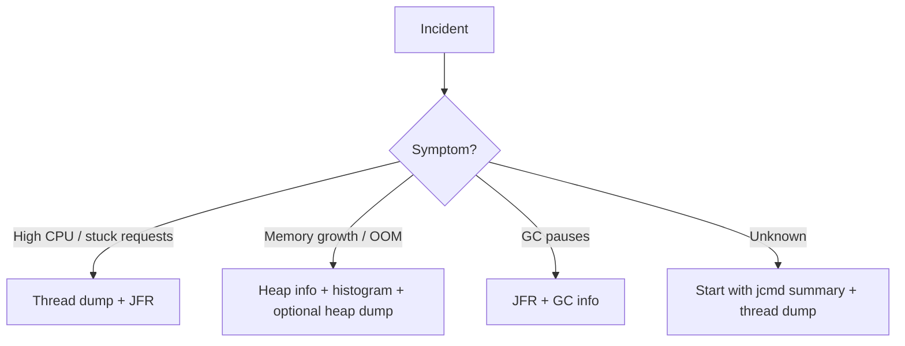

# JVM Tooling: JFR, `jstack`, `jmap`, `jcmd`

> [!summary] Goal
> Use the JVM's built-in diagnostic tools to collect evidence about threads, heap, CPU, allocations, and lock contention without guessing.

## Table of Contents

1. [Diagnostics Philosophy](#diagnostics-philosophy)
2. [When to Use Which Tool](#when-to-use-which-tool)
3. [Thread Dumps](#thread-dumps)
4. [Heap Info and Histograms](#heap-info-and-histograms)
5. [Heap Dumps](#heap-dumps)
6. [JFR](#jfr)
7. [A Practical Incident Workflow](#a-practical-incident-workflow)
8. [Pitfalls](#pitfalls)

---

> [!info] JFR (Java Flight Recorder)
> JFR is a built-in, low-overhead (typically < 1%) event-recording framework. It records fine-grained runtime events: thread allocations, GC pauses, lock contention, method profiling, IO operations, and more. Events can be recorded continuously and dumped on demand. Unlike external profilers, JFR can run in production at all times.

## Diagnostics Philosophy

The goal of tooling is not to produce files. The goal is to answer specific questions:
- Is the process CPU-bound or blocked?
- Which threads are stuck and why?
- Is memory pressure caused by allocation or retention?
- Is lock contention significant?
- Which methods or allocation sites dominate runtime cost?

---

## When to Use Which Tool

| Tool | Best for | Typical use |
|------|----------|-------------|
| `jcmd` | general entrypoint | preferred operational command wrapper |
| `jstack` / `Thread.print` | thread state | deadlocks, blocked requests, hot loops |
| heap histogram | quick memory shape | top classes, growth trends |
| heap dump | deep leak analysis | MAT / dominator analysis |
| JFR | low-overhead profiling | CPU, allocations, locks, GC |



---

## Thread Dumps

### Commands

```bash
jstack <pid> > /tmp/threads.txt
jcmd <pid> Thread.print > /tmp/threads.txt
```

`jcmd` is often a better operational default, especially in containerized environments.

### What to look for

- many threads blocked on the same monitor/lock
- repeated identical RUNNABLE stacks showing hot loops
- `WAITING` / `TIMED_WAITING` on queues or locks
- request threads stuck in socket/database reads
- deadlock sections explicitly printed by the JVM

### Example clues

- `BLOCKED` on one monitor -> lock contention
- `socketRead0` -> downstream/network wait
- many GC worker stacks active -> GC-related pressure may be relevant

---

## Heap Info and Histograms

### Commands

```bash
jcmd <pid> GC.heap_info
jcmd <pid> GC.class_histogram > /tmp/histo.txt
```

### Why histograms are useful

They quickly answer:
- what classes dominate by instance count or bytes
- whether large arrays / buffers are expected
- whether specific app objects are growing suspiciously

### Example interpretation

- many `byte[]` -> buffering, serialization, caches, network payload retention
- many `char[]` / strings -> text-heavy processing, logs, parsing, unbounded keys
- many request/domain objects -> queues, caches, retention leaks

Repeated histograms over time are more useful than one snapshot.

---

## Heap Dumps

### Command

```bash
jcmd <pid> GC.heap_dump /tmp/heap.hprof
```

### When to use

- suspected leak or long-term retention
- histogram is not enough
- you need dominator tree / retained size analysis

### Important warning

Heap dumps are intrusive:
- file can be very large
- dump can stall or heavily disturb the process
- disk space and data sensitivity matter

Analyze with:
- Eclipse MAT
- VisualVM

### What to inspect in MAT

- dominator tree
- retained sizes
- GC roots path to leaked structures
- unbounded collections, listener lists, caches, thread locals

---

## JFR

JFR (Java Flight Recorder) is one of the highest-value built-in tools for production diagnostics.

### Useful for

- CPU hotspots
- allocation hotspots
- lock contention
- thread states
- GC pauses and heap behavior

### Start a profile capture

```bash
jcmd <pid> JFR.start name=profile settings=profile duration=60s filename=/tmp/profile.jfr
```

### Why JFR is powerful

It correlates different runtime dimensions in one timeline:
- CPU
- allocations
- locks
- GC
- threads

This is far more useful than isolated commands when the problem is ambiguous.

---

## async-profiler

> [!info] async-profiler
> [async-profiler](https://github.com/async-profiler/async-profiler) is an open-source, low-overhead sampling profiler for Java. It uses `perf_event_open` (Linux) to collect CPU stack traces without safepoint bias (unlike JFR's allocation profiling, which only samples at safepoints). It also supports allocation profiling, lock profiling, and wall-clock profiling.

```bash
# CPU profile for 30 seconds — produce flame graph
./profiler.sh -d 30 -f /tmp/cpu-profile.html <pid>

# Allocation profile (top allocation sites)
./profiler.sh -d 30 -e alloc -f /tmp/alloc-profile.html <pid>

# Lock profile (threads blocked on locks)
./profiler.sh -d 30 -e lock -f /tmp/lock-profile.html <pid>

# Wall-clock profile (including blocked/sleeping time)
./profiler.sh -d 30 -e wall -f /tmp/wall-profile.html <pid>
```

```text
Common profiling scenarios:
  CPU:    -e cpu     → Which methods consume the most CPU?
  Alloc:  -e alloc   → Which code paths allocate the most memory?
  Lock:   -e lock    → Which locks have the most contention?
  Wall:   -e wall    → Where does time go (including I/O, sleep)?

Why async-profiler over JFR:
  - CPU profiling uses perf_events → no safepoint bias.
  - JFR's CPU profiling also samples at safepoints (which may miss hot methods
    that never reach a safepoint during sampling).
  - async-profiler uses async GetCallTrace (JDK 21+ built-in) or perf + perf-map-agent.
  - Produces interactive flame graphs (SVG/HTML) by default.

async-profiler + JFR:
  - Use JFR for continuous, always-on recording (low overhead).
  - Use async-profiler for focused, on-demand deep dives (higher detail).
```

### perf + perf-map-agent (for mixed Java + native stacks)

```bash
# perf can profile Java code if method addresses are mapped.
# perf-map-agent creates the mapping file /tmp/perf-<pid>.map.
# Install: https://github.com/jvm-profiling-tools/perf-map-agent

# Step 1: Attach perf-map-agent to the JVM
java -agentpath:/path/to/libperfmap.so ...

# Step 2: Profile with perf
perf record -F 99 -p <pid> -g -- sleep 30

# Step 3: Generate flame graph
perf script | ./stackcollapse-perf.pl | ./flamegraph.pl > flame.svg

# This shows mixed stacks: Java methods → JVM → native → kernel.
# Critical for diagnosing: JIT compilation, GC threads, syscall hotspots.
```

### Native Memory Tracking (NMT)

```bash
# NMT tracks JVM native memory usage (off-heap).
# Enable with -XX:NativeMemoryTracking=summary or =detail

# Print native memory summary:
jcmd <pid> VM.native_memory summary

# Output:
# Native Memory Tracking:
# Total: reserved=8192MB, committed=4096MB
# - Java Heap:  reserved=2048MB, committed=2048MB  (heap only)
# - Thread:     reserved=1024MB, committed=128MB    (thread stacks)
# - Code:       reserved=256MB,  committed=64MB     (JIT code cache)
# - GC:         reserved=512MB,  committed=256MB    (GC metadata)
# - Compiler:   reserved=32MB,   committed=32MB
# - Internal:   reserved=128MB,  committed=64MB
# - Symbol:     reserved=64MB,   committed=32MB     (string table, constant pool)
# - Native Memory Tracking: reserved=8MB, committed=8MB
# - Other:      reserved=512MB,  committed=128MB
# - Metaspace:  reserved=512MB,  committed=64MB
# - ...

# Baseline comparison (detect native memory growth over time):
jcmd <pid> VM.native_memory baseline
# ... wait ...
jcmd <pid> VM.native_memory summary.diff

# NMT overhead: ~5-10% with detail mode.
# Use summary mode in production (lower overhead), detail mode in staging.
```

```text
When to use NMT:
  - "RSS is 2× heap size and I don't know why"
  - Thread explosion: check "Thread" reserved vs committed
  - Code cache issues: check "Code" growth (JIT compilation storms)
  - Classloader leak: check Metaspace growth
  - Direct buffer leak: check "Internal" (or use -XX:MaxDirectMemorySize)
```

---

## A Practical Incident Workflow

### High CPU / latency

1. OS view first: `top`, `pidstat`, Linux playbooks
2. `jcmd <pid> Thread.print`
3. JFR 30-60s capture
4. correlate hot stacks with hot methods / lock waits

### OOM / leak suspicion

1. `GC.heap_info`
2. class histogram
3. thread count
4. heap dump if required

### Lock contention suspicion

1. thread dump
2. JFR lock events
3. inspect which locks and code paths dominate blocking

---

## Pitfalls

### Taking one dump and overconfidently concluding too much

Trends matter. Repeated evidence is stronger than one snapshot.

### Capturing heap dumps casually in production

This can worsen an incident if disk or pause budget is tight.

### Using only stack dumps for CPU problems

Stack dumps help, but JFR often gives the fuller picture.

### Ignoring OS-level evidence

Not every Java slowdown is a JVM-internal problem; disk, network, cgroup limits, and container CPU throttling can dominate.

---

> [!question]- Interview Questions
>
> **Q: When should you use `jcmd` over `jstack`?**
> A: `jcmd` is often the more flexible operational entrypoint and works well for thread, GC, and JFR commands from one tool.
>
> **Q: What does a class histogram tell you?**
> A: Which classes dominate by count/bytes, helping identify suspicious memory shape before taking a heap dump.
>
> **Q: Why is JFR so valuable?**
> A: It correlates CPU, allocations, GC, locks, and thread behavior in a low-overhead timeline.
>
> **Q: When is a heap dump appropriate?**
> A: When you need deep retained-object analysis for leak investigation and can tolerate the operational cost.

---

## Cross-Links

- [[Java/02_Core/02_JVM_Memory_and_GC_Basics]]
- [[Java/04_Playbooks/01_Diagnose_High_CPU_or_Latency]]
- [[Java/04_Playbooks/02_Diagnose_OOM_and_Memory_Leaks]]
- [[Linux/04_Playbooks/01_Investigate_High_CPU_or_Load]]

---

## References

- [jcmd](https://docs.oracle.com/en/java/javase/17/docs/specs/man/jcmd.html)
- [jstack](https://docs.oracle.com/en/java/javase/17/docs/specs/man/jstack.html)
- [JFR Runtime Guide](https://docs.oracle.com/en/java/)
