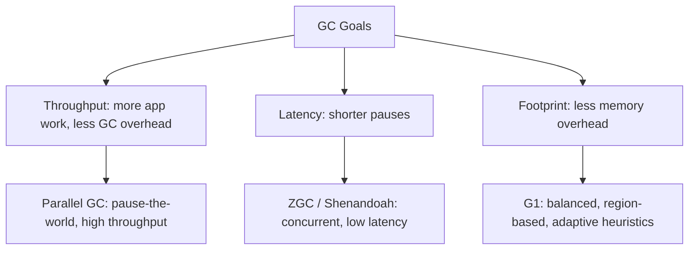

# Garbage Collectors: G1, ZGC, Shenandoah

> [!summary] Goal
> Choose a collector based on workload shape and latency goals, and understand what collector choice can improve versus what only code and allocation behavior can fix.

## Table of Contents

1. [What GC Choice Really Means](#what-gc-choice-really-means)
2. [Throughput vs Latency vs Footprint](#throughput-vs-latency-vs-footprint)
3. [G1](#g1)
4. [ZGC](#zgc)
5. [Shenandoah](#shenandoah)
6. [How to Choose](#how-to-choose)
7. [Common Misconceptions](#common-misconceptions)

---

## What GC Choice Really Means

Collector choice changes how the JVM schedules reclamation work, compaction, and pause behavior.

It does **not** fix:
- memory leaks
- unbounded queues/caches
- pathological allocation rate
- too many threads
- bad data structure choices

GC tuning is useful, but it is not a substitute for runtime evidence and code fixes.

---

## Throughput vs Latency vs Footprint



> [!info] GC throughput vs latency
> **Throughput** is the fraction of total CPU time spent on application work vs GC. A 99% throughput means 1% of CPU cycles go to GC. **Latency** (pause time) is the duration the application is paused for GC operations. Throughput-oriented collectors (Parallel GC) minimize total GC time at the cost of longer pauses. Latency-oriented collectors (ZGC, Shenandoah) minimize pause duration at the cost of higher CPU overhead and potentially reduced throughput.
    D --> G[Less memory overhead]
```

You rarely optimize all three at once.

### Practical interpretation

- **throughput-oriented**: maximize useful work, tolerate bigger pauses
- **latency-oriented**: minimize pause times, accept more overhead / concurrent work
- **footprint-oriented**: use less memory, which can increase pressure elsewhere

---

## G1

G1 is the general-purpose collector and a strong default for many workloads.

### Core idea

- heap divided into regions
- collector chooses sets of regions to reclaim
- tries to meet pause-time goals heuristically

### Good fit

- mixed workloads
- moderate to large heaps
- you want a stable default without ultra-low-latency requirements

### Tradeoffs

- good general behavior, not magic
- tail latency can still hurt with very large heaps or bad allocation patterns

### Symptoms where G1 struggles

- large object churn
- rapidly growing old-gen pressure
- stringent low-latency requirements under huge heaps

---

## ZGC

ZGC is designed for very low pause times, including on large heaps.

### Core idea

- most work is concurrent
- pause times are kept small by shifting more GC work out of stop-the-world windows

### Good fit

- services with strict latency goals
- large heaps where pause tail matters more than raw throughput

### Tradeoffs

- may use more CPU / runtime complexity to preserve latency behavior
- still does not fix bad retention or runaway allocation

---

## Shenandoah

Shenandoah also targets low pause times with mostly concurrent evacuation and compaction behavior.

### Good fit

- low-latency workloads where long pauses are unacceptable
- environments where Shenandoah support and operational familiarity are already in place

### Tradeoffs

- similar high-level story to other low-pause collectors: lower pause goals can mean extra overhead elsewhere

---

## How to Choose

### Choose G1 when

- you want the safest default
- latency is important but not extreme
- you need balanced behavior

### Choose ZGC when

- pause-time tail is the main pain point
- heaps are large
- extra runtime overhead is acceptable to preserve responsiveness

### Choose Shenandoah when

- low pause goals matter and your environment already supports/validates it well

### Better selection workflow

1. Measure allocation and GC behavior first
2. Fix leaks / retention / queue growth
3. Capture JFR and GC evidence
4. Change collector only when the workload's real bottleneck justifies it

---

## Common Misconceptions

### "Low-pause collector means no pauses"

False. It means the design aims to keep pauses small, not nonexistent.

### "Changing collector will fix our leak"

False. A leak is a reachability/retention problem.

### "Collector choice matters more than allocation rate"

Usually false. Allocation and retention shape dominate most real incidents.

### "One benchmark decides everything"

Collector behavior is workload-specific. Benchmark the actual shape of your application.

---

## GC Tuning Flags Reference

| Collector | Flag | Purpose | Typical value |
|:---------:|:----:|:-------:|:-------------:|
| **All** | `-Xms` / `-Xmx` | Initial / max heap size | Equal values (avoid resizing overhead) |
| **All** | `-XX:MaxMetaspaceSize` | Limit class metadata | 256m (set to avoid metaspace OOM) |
| **G1** | `-XX:MaxGCPauseMillis` | Pause time target | 50-200ms |
| **G1** | `-XX:G1HeapRegionSize` | Region size (1-32 MB) | Auto (based on heap size) |
| **G1** | `-XX:G1NewSizePercent` | Young gen min | 5% (default) |
| **G1** | `-XX:G1MaxNewSizePercent` | Young gen max | 60% (default) |
| **G1** | `-XX:InitiatingHeapOccupancyPercent` | IHOP — when to start marking | 45% (default) |
| **G1** | `-XX:G1MixedGCCountTarget` | Mixed GC phases per cycle | 8 (more phases = smoother) |
| **G1** | `-XX:G1HeapWastePercent` | Waste % to stop mixed GC | 5% |
| **ZGC** | `-XX:ZAllocationSpikeTolerance` | Allocation spike tolerance | 2.0 (higher = more GC overhead) |
| **ZGC** | `-XX:ZCollectionInterval` | Force GC cycle interval | 0 (auto) |
| **ZGC** | `-XX:ZUncommit` | Return unused heap to OS | true (JDK 13+) |
| **ZGC** | `-XX:ZUncommitDelay` | Wait before returning memory | 300s |
| **Shenandoah** | `-XX:ShenandoahGCHeuristics` | Heuristic mode | adaptive (default) |
| **Shenandoah** | `-XX:ShenandoahAllocationThreshold` | Trigger GC at allocation % | 10-100% |
| **Shenandoah** | `-XX:ShenandoahGuaranteedGCInterval` | Max time between GC cycles | 300000ms (5 min) |

### GC log analysis

```bash
# Enable GC logging (JDK 9+ unified logging)
-Xlog:gc*:file=/var/log/gc.log:time,uptime,level,tags:filesize=100M,filecount=10

# Key metrics from GC logs (use GCeasy, GCViewer, or JITWatch):
# 1. Average / max pause time per GC type (Young, Old, Mixed, Concurrent)
# 2. Allocation rate (MB/sec) = total young GC freed / total time between young GCs
# 3. Promotion rate (MB/sec) = objects moved from young to old per second
# 4. Old generation occupancy after each GC → are we trending up?
# 5. Concurrent cycle duration (G1: remark + cleanup; ZGC: concurrent mark/relocate)

# GCeasy analysis (online tool: gceasy.io) identifies:
#   - Throughput (% time not in GC)
#   - Max pause time and distribution
#   - Object stats (created/promoted/freed per second)
#   - GC cause analysis (allocation failure, G1 evacuation pause, etc.)
```

### Generational ZGC (JDK 21+)

```text
JDK 21 introduces generational ZGC (JEP 439), which splits the heap
into young and old generations — like G1 — but keeps ZGC's low-pause
concurrent approach.

Before generational ZGC:
  - ZGC is "single-generation" — every GC cycle marks and relocates
    the ENTIRE heap.
  - For large heaps (64+ GB), even concurrent marking takes time.
  - Objects that die young still trigger a full-heap concurrent cycle.

With generational ZGC:
  - Young generation: collected frequently (most objects die here).
  - Old generation: collected less frequently (surviving objects).
  - Most GC cycles are young-only → lower overhead.
  - Full-heap cycles still occur (when old generation fills up), but
    are much less frequent.

Enabling:
  - -XX:+UseZGC (enables ZGC)
  - -XX:+ZGenerational (enables generational mode, JDK 21+)
  - Default in future JDK releases (target: ZGC = generational by default)

Comparison (approximate, 64 GB heap):
                  │  ZGC (single-gen) │ ZGC Generational │ G1
 ─────────────────┼───────────────────┼──────────────────┼─────────────
 Max pause        │  < 1ms            │  < 1ms (young)   │  50-200ms
 Heap overhead    │  15% (colored ptr)│  15% + card tbl  │  5% (RSet)
 Throughput       │  -15% vs Parallel │  -10%            │  -5% vs Parallel
 Old gen marking  │  Every cycle      │  On-demand       │  Every marking cycle
```

---

## Pitfalls

### GC tuning before workload analysis

The most common mistake is tuning GC flags before analyzing allocation rate, object retention, and workload patterns. GC tuning is about making the collector work efficiently with your allocation behavior — if the allocation rate is unsustainable, no collector can save you.

### ZGC/Shenandoah on small heaps (< 2 GB)

ZGC and Shenandoah add overhead (colored pointers, forwarding pointers, barriers) that doesn't pay off on small heaps. For heaps under 4 GB, G1 or Parallel GC are typically faster. ZGC shines at 16-512 GB heaps where pause time matters.

### Thinking GC choice fixes a memory leak

No garbage collector can free objects that are still reachable. If you have a memory leak (unintentional object retention), GC tuning just delays the OOM. Fix the leak first, tune the GC second.

### Ignoring allocation rate

Allocation rate (MB/sec) is more important than heap size for GC performance. A service allocating 1 GB/sec of garbage will GC frequently regardless of collector. Profile allocation hotspots before blaming the GC.

---

> [!question]- Interview Questions
>
> **Q: What is G1 optimized for?**
> A: Balanced, general-purpose GC behavior with region-based collection and pause-time heuristics.
>
> **Q: Why would a team choose ZGC?**
> A: To prioritize very low pause times, especially on large heaps and latency-sensitive services.
>
> **Q: Can changing the collector fix a memory leak?**
> A: No. Collector choice changes reclamation strategy, not object reachability correctness.
>
> **Q: What is the biggest mistake in GC tuning?**
> A: Tuning flags before understanding allocation rate, retention, and workload shape.

---

## Cross-Links

- [[Java/02_Core/02_JVM_Memory_and_GC_Basics]]
- [[Java/03_Advanced/03_JVM_Tooling_JFR_JStack_JMap]]
- [[Java/04_Playbooks/02_Diagnose_OOM_and_Memory_Leaks]]

---

## References

- [Garbage Collection Tuning Guide](https://docs.oracle.com/en/java/)
- [OpenJDK ZGC](https://openjdk.org/projects/zgc/)
- [OpenJDK Shenandoah](https://openjdk.org/projects/shenandoah/)
